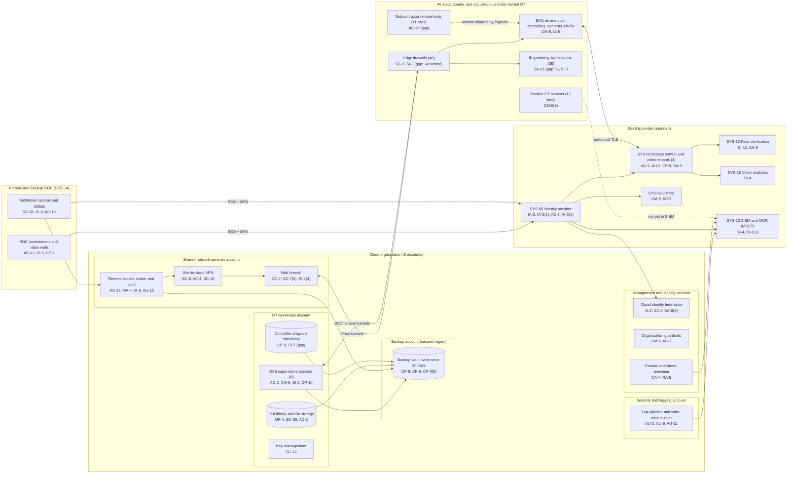

# Cloud Architecture and Control Placement: Cris Santos Company | Government Services and Facilities | Mid-Market

**Organization:** Cris Santos Company, Inc. (facilities support contractor operating government buildings) | **Tier:** Mid-Market | **Provider:** Vendor-agnostic public cloud (see section 4), plus SaaS and on-premises OT
**System:** Integrated Facility Operations Platform (IFOP), as defined in the SSP (P02) | **Prepared:** 2026-07-31 by the IT Director and the OT Security Engineer; updated 2026-09-15 with P07 results
**Control map:** `cloud-control-map.csv` (62 rows, 24 components)

## 1. Diagram

The 5 federal buildings are not in the diagram. Their BAS runs on GSA servers on the GSA Building Systems Network, reached only through GSA's virtual desktop with a PIV card. GSA provides that boundary, its logging, and its scanning (BTTRG v3.0, sections 1.1 and 1.2). The school district's BAS server is also outside; the broker reaches it through the district's VPN endpoint.

## 2. Landing zone design
The landing zone separates duties across 5 accounts (subscriptions or projects, depending on the provider) under one cloud organization. Each account limits the damage an attacker can do from any other.

| Account | Purpose | Who administers | Key design decisions |
|---|---|---|---|
| **Management and identity** | Organization root, identity federation to SYS-06, guardrails, posture and threat detection | IT Director and Security Manager (4 people) | No workloads. Root credentials sealed. Guardrails apply to every other account and cannot be disabled from them |
| **Security and logging** | Log pipeline and the write-once log bucket; SIEM connector to the MSSP | Security Manager (2 named people) | Logs from every account land here. Workload administrators cannot delete or alter them |
| **Shared network services** | Hub firewall, site-to-cloud VPN for 46 edge firewalls, DNS, the remote access broker and vault | IT Director's infrastructure team; OT Security Engineer for broker policy | All traffic between sites, workloads, and the internet passes the hub. The broker is the only management path to site OT that the design allows |
| **OT workloads** | 8 BAS supervisory clusters, CUI library and file storage, controller program repository, key management | Controls Engineering Manager (clusters); infrastructure team (platform) | One subnet per customer cluster. No internet ingress. Company-managed keys |
| **Backup** | Backup vault with 30-day write-once retention in a second region | 2 named backup administrators | Credentials not federated to everyday accounts. A cross-account role can write backups but not delete them |

## 3. Layers and shared responsibility per service
| Layer | Components | Key controls | Service model | Responsibility |
|---|---|---|---|---|
| Identity | Identity federation, broker and vault, break-glass accounts, SYS-06 | IA-2, IA-2(1), AC-2, AC-6(5), AC-17, IA-5, AC-7 | PaaS / IaaS / SaaS | Customer configures identities, roles, MFA, vault coverage, and reviews; providers run the identity services |
| Network | Hub firewall, VPN gateway, DNS, 46 site edge firewalls | SC-7, SC-7(5), SC-8, AC-4, SC-10, SC-20 | PaaS / On-premises | Customer designs routes, rules, and segmentation; provider runs the gateway and DNS services; the company owns the site edge firewalls outright |
| Compute | BAS clusters, broker hosts, engineering workstations, ROC workstations | CM-6, SI-2, SI-3, AU-12, CP-10, SA-22 | IaaS / On-premises | Customer (guest OS, applications, EDR, patching); provider for hosts and hypervisor |
| Data | CUI library, file storage, program repository, keys, backups | SC-28, SC-12, CP-9, CP-6, MP-4, SI-7 | PaaS | Shared: provider encrypts and operates storage; customer controls keys, access, retention, isolation, and restore testing |
| Logging and monitoring | Log pipeline, posture service, SIEM and MDR, OT sensors | AU-2, AU-9, AU-11, CA-7, RA-5, SI-4, CM-8(3) | PaaS / SaaS / On-premises | Shared: providers generate logs and detections; the company enables, retains, forwards, and acts on them; the MSSP monitors IT sources |
| SaaS applications | Access control and video tenants, face verification, video analytics, CMMS | AC-2, AU-2, CP-9, SA-9, SI-12, CM-3 | SaaS | Provider runs the application and infrastructure; the company keeps users, roles, door schedules, retention settings, and audit review |
| Physical | Provider data centers | PE-3, PE-13 | All | Provider (inherited, evidenced by SOC 2 reports) |

**Responsibility counts in `cloud-control-map.csv`:** 38 Customer, 18 Shared, 6 Provider. By service model: 28 PaaS, 14 SaaS, 13 IaaS, and 7 On-premises rows. As the three providers' shared responsibility models agree, identity, data protection, and logging stay with the customer.

## 4. Service categories and provider equivalents
The design is independent of the provider. This table gives each provider's name for the service category, for reading its shared responsibility documentation (SRC-AWS-SRM, SRC-AZURE-SRM, SRC-GCP-SRM in `00_universal-framework/sources/source-register.csv`).

| Service category | AWS | Microsoft Azure | Google Cloud |
|---|---|---|---|
| Multi-account organization and guardrails | AWS Organizations, service control policies | Management groups, Azure Policy | Resource Manager folders, organization policies |
| Account, subscription, or project | Account | Subscription | Project |
| Cloud identity federation | IAM Identity Center | Microsoft Entra ID with Azure RBAC | Cloud Identity with IAM |
| Hub firewall | AWS Network Firewall | Azure Firewall | Cloud NGFW |
| Site-to-cloud VPN | Site-to-Site VPN | VPN Gateway | Cloud VPN |
| Virtual machines (BAS clusters, broker) | EC2 | Virtual Machines | Compute Engine |
| Object storage with write-once retention | S3 with Object Lock | Blob Storage with immutability policies | Cloud Storage with bucket lock |
| Backup service | AWS Backup (vault lock) | Azure Backup (immutable vault) | Backup and DR Service |
| Key management | AWS KMS | Azure Key Vault | Cloud KMS |
| Audit logging | CloudTrail | Azure Monitor activity log | Cloud Audit Logs |
| Posture and threat detection | Security Hub, GuardDuty | Microsoft Defender for Cloud | Security Command Center |
| Authoritative DNS | Route 53 | Azure DNS | Cloud DNS |

**Service model split used here (all three providers agree):**
- **IaaS** (virtual machines): the provider owns facilities, hosts, and virtualization. The customer owns the guest OS, applications, network configuration, identities, and data.
- **PaaS** (storage, backup, key service, VPN gateway, hub firewall service): the provider also owns the platform software and its patching. The customer owns access, keys, data, rules, and configuration.
- **SaaS** (identity provider, access control and video, CMMS, SIEM): the provider also owns the application. The customer keeps identities, roles, configuration, audit review, and data.
- **On-premises** (site edge firewalls, engineering workstations, OT sensors, ROC): no cloud provider share. The company owns these devices; the customers own the field devices behind them.

## 5. Findings from the mapping
1. **The broker is the right design, but not the only path yet (AC-17, MA-4).** Company staff use it at all 46 sites. Subcontractors SUB-4 to SUB-7 reach 11 County B and City sites through their own tools and vendor cloud relays, and 14 legacy VPN profiles routed straight to site edges until P07 found them. Fix: edge firewalls accept management traffic only from the broker; remove the tools and profiles (P01 R-001, R-010; POA&M POAM-001).
2. **Segmentation stops at the cloud hub for 17 sites (SC-7).** The hub and the 29 segmented sites are deny-by-default; the 17 flat sites pass any customer network traffic to controllers (R-004; POAM-006).
3. **OT telemetry is generated but not watched (AU-2, SI-4).** BAS clusters, tenant audit trails, and OT sensors produce events that never reach the SIEM (R-009; POAM-011).
4. **Recovery is designed but not proven (CP-9, CP-10).** Backups are isolated, write-once, and in a second region, the strongest control in the environment. Only 1 of 8 clusters has been restored, and the program repository covers about 55% of controllers (R-006, R-007).
5. **SaaS controls depend on the vendor's report (SA-9).** Rows marked Provider or Shared for the access control platform rely on the vendor's SOC 2 Type 2 report and its complementary user entity controls. The face verification module is outside that report's scope (P09, P10).
6. **Boundary check.** Every component in the SSP inventory (P02 section 9) appears in the diagram or in this table. Every cloud account has controls from at least 2 of the AC, AU, CM, IA, SC, and SI families, or inherits them.
