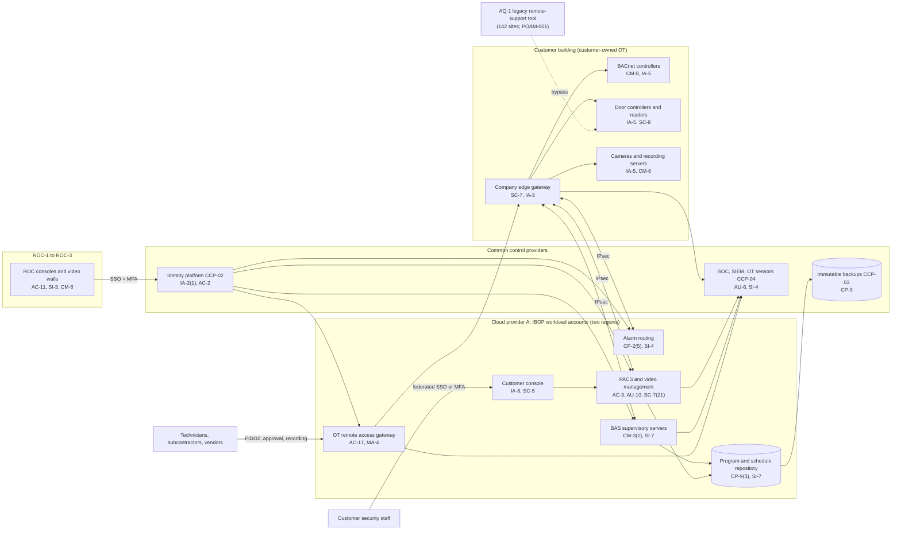

# System Security Plan: Integrated Building Operations Platform (IBOP)

**Organization:** Cris Santos Company, Inc. (publicly traded facilities support contractor operating government buildings) | **Tier:** Enterprise | **Vertical:** Government Services and Facilities
**Outline:** NIST SP 800-18 Rev. 2, System Security Plan Outline Example (June 2026) | **Version:** 2.0, 2026-09-14

## 1. System Name and Identifier
Integrated Building Operations Platform (**IBOP**), identifier CSC-SYS-IBOP-001. Tier-1 system in the enterprise application inventory. This is the registry's "physical access control and building automation system" at enterprise scale.

## 2. System Overview
The IBOP is how the company monitors and operates the building systems of its state, local, and education customers from three 24x7 Remote Operations Centers (ROC-1 Florida, ROC-2 Georgia, ROC-3 Virginia) and in the field. It supports:
- alarm monitoring and dispatch for 1,420 buildings (P05 BP-01);
- physical access control (PACS) administration for 910 buildings, about 10,800 door controllers, about 27,500 readers, and about 585,000 cardholder records (BP-02);
- building automation (BAS) supervision, trending, and remote operation for about 61,000 customer-owned BACnet controllers (BP-03);
- video management for 560 buildings (about 34,000 cameras and 1,750 recording servers) and evidence exports (BP-06);
- the controller program and door schedule repository (BP-07);
- face verification pilots at 3 customer sites (P10 AI-001).

**Why door and setpoint integrity matters most.** An unauthorized door unlock at a courthouse or public safety building, a revoked badge that still opens doors, or a tampered chiller program can harm people and property at once. Confidentiality matters too (cardholder records, face templates, security layouts), but the scenario the company plans for first is someone changing what the buildings do (P01 R-001).

**Major components:**
- Alarm routing service and ROC consoles (commercial alarm automation software on Cloud provider A)
- PACS and video management software (commercial, company-hosted, one partition per customer tenant) on Cloud provider A virtual machines with a managed relational database
- BAS supervisory servers (two commercial products) on Cloud provider A virtual machines
- IBOP customer console (web application behind the landing zone web application firewall) for about 4,800 customer users
- Controller program and door schedule repository (hashed, versioned)
- OT remote access gateway (PAM-brokered, with session recording) used by technicians, subcontractors, and vendors
- About 1,480 company-managed site edge gateways (firewalls with IPsec tunnels to Cloud provider A)
- About 500 ROC and engineering workstations, and the rugged tablets used by controls technicians
- Face verification module (a feature of the PACS software) at 3 customer sites

Users: about 1,360 company IBOP accounts (ROC operators, credentialing clerks, controls and security technicians, IBOP engineers), about 4,800 customer console users (customer security and facilities staff), about 120 subcontractor accounts, and 14 vendor support accounts.

**Not part of the IBOP:** building systems at the 64 federal buildings, which run on GSA servers on the GSA Building Systems Network under GSA's authorization (company staff reach them only through GSA's virtual desktop with PIV cards, SYS-08), and the 142 AQ-1 sites' legacy remote-support tool, which is being retired (it is described in section 8 because it still reaches IBOP-managed devices).

## 3. Laws, Regulations, and Policies Affecting the System
| ID | Requirement | Citation | How it affects the IBOP |
|---|---|---|---|
| Contract (state) | State cybersecurity exhibits: SP 800-53 Rev. 5 Moderate controls, 24-hour incident notice, annual independent assessment | 5 state contracts. Florida worked example: required by Fla. Stat. 282.318(4)(h) for state agency IT service contracts | Binding; sets the baseline |
| Contract (local) | County and city security addenda: customer cybersecurity standards, 24-hour notice, fingerprint-based checks | 38 local contracts. Florida worked example: standards adopted under Fla. Stat. 282.3185(4)(a) | Binding |
| C-GOVERNMENT-R03 | FBI CJIS Security Policy, as applied by public safety customers | CJISSECPOL v6.1 AT-3 (role-based training for all individuals with unescorted access to a physically secure location); PS-3 (screening, as the agency determines); PE-3 (physical access logs for the physically secure location) | Personnel and training for technicians at 27 public safety buildings; the IBOP keeps the PACS audit logs these customers use for PE-3. The IBOP holds no CJI |
| FERPA | School official designation | 34 CFR 99.31(a)(1)(i)(B); 99.33(a) | Student cardholder records in the 9 university tenants: use only for the contracted purpose, no redisclosure |
| State | Breach notice and reasonable security for personal information, including biometric data | Each state where affected individuals reside. Florida worked example: Fla. Stat. 501.171 (third-party agent notice under 501.171(6)); biometric data defined in 501.702 | Cardholder records and face templates (P08) |
| State | Contractor public records duties; exemption for security system plans | Florida worked example: Fla. Stat. 119.0701; 119.071(3)(a) | Records held for state and local customers |
| SEC | Cybersecurity disclosure | Form 8-K Item 1.05; 17 CFR 229.106 | A material IBOP incident goes through the P08 materiality step |
| C-GOVERNMENT-R06 | CIRCIA (proposed only) | Proposed 6 CFR Part 226 | Tracked; not a current obligation (P03 section 6) |
| Contract | SOC 2 readiness for SL-1 | P09 | Customer commitments on security, availability, confidentiality, processing integrity, and privacy |
| Internal | POL-01 to POL-05, standards, and procedures | P06 | Enterprise policy hierarchy |

Not applicable to the IBOP (see P03 section 1): C-GOVERNMENT-R01 FISMA (the IBOP is not operated on behalf of a federal agency; federal building systems are GSA's), FAR 52.204-21 (no federal contract information is stored in the IBOP; it applies to the FSP, email, and laptops), C-GOVERNMENT-R02 IRS Pub. 1075, C-GOVERNMENT-R04 VVSG 2.0, C-GOVERNMENT-R07 SLCGP, and C-GOVERNMENT-R08 GovRAMP (it applies to the Facility Services Portal, not the IBOP, under the two state procurement policies).

## 4. System Status
### 4.1 System Security Plan Approval
Prepared by the IBOP Platform Manager and the GRC team. Reviewed by the CISO, the Director of OT Security, and the Vice President, Building Technology Platforms. Approved by the Chief Operating Officer on 2026-09-14.
### 4.2 System Authorization Decision
The IBOP is a contractor system, not a federal system, so there is no federal authorization to operate. The equivalent internal decision:
- **Authorizing official equivalent:** Chief Operating Officer, with the CISO's recommendation.
- **Decision (2026-09-14):** continue operation with conditions, based on the Internal Audit assessment (P07) and the enterprise risk register (P01).
- **Conditions:** retire the AQ-1 legacy remote-support tool (POAM-001 by 2027-01-31); remove default credentials from field devices (POAM-003 by 2026-12-31); prove the 4-hour PACS administration RTO (POAM-007 by 2027-01-31); reach 95% OT monitoring coverage (POAM-005 by 2027-06-30).
- **Customer review:** this SSP, the decision, and the POA&M are provided to the 5 state customers under their exhibits by 2026-10-31.
- **Reauthorization:** annually, or after a major change (for example, completing the AQ-2 campus migrations).
### 4.3 System Operational Status
Operational. Planned major modifications: AQ-1 site migration to the OT remote access gateway, AQ-2 campus migration to the IBOP, automated PACS database failover, and automated integrity notifications (SI-7(2)).

## 5. Role Identification and Responsible Personnel
| Role | Title | Responsibility |
|---|---|---|
| System owner | Vice President, Building Technology Platforms (reports to the Chief Technology Officer) | Accountable for the IBOP; approves role templates |
| Authorizing official (equivalent) | Chief Operating Officer | Accepts residual risk to operate |
| Mission owner | Vice President, Remote Operations | ROC processes that run on the IBOP (BP-01, BP-02, BP-03, BP-06) |
| System administrator | IBOP Platform Manager | Day-to-day administration, releases, backups |
| OT security | Director of OT Security | OT remote access, OT monitoring, field device hardening |
| Information security | CISO; Director of Security Operations | Program oversight; SOC monitoring; incident response |
| Privacy | Chief Privacy Officer | Cardholder, student, and biometric data rules; breach determinations |
| Common control providers | See section 10.3 | Operate inherited controls |
| Independent assessor | Chief Audit Executive (Internal Audit) | Annual assessment (P07) |

## 6. System Information Types and System Categorization
Information types come from NIST SP 800-60 Vol. 2 Rev. 1. Impact levels follow FIPS 199.

| Information type | Confidentiality | Integrity | Availability | Rationale |
|---|---|---|---|---|
| Physical security (door schedules, access levels, alarms, video, security system layouts) | Moderate | **High (treated)** | Moderate | Unauthorized door changes at courthouses and public safety buildings can expose people at once, so integrity is treated at High. Door controllers cache credentials for 72 hours and customer guards can lock down locally, so availability stays Moderate (P05 BP-02: MTD 8 h, RTO 4 h) |
| Facility operations and maintenance (BAS setpoints, schedules, programs, trends) | Low | Moderate | Moderate | Wrong setpoints can damage equipment or make buildings unusable; controllers keep running locally (P05 BP-03: MTD 24 h) |
| Personal identity and authentication (cardholder records, badge photos, face templates) | Moderate | Moderate | Low | About 585,000 people, including university students; breach notice duties in each state |
| Information security (audit logs, credentials, keys) | Moderate | Moderate | Moderate | Protects the evidence for door and setpoint integrity |
| **IBOP category** | **Moderate** | **Moderate baseline, integrity supplemented** | **Moderate** | See the decision below |

**Categorization decision.** Under a strict FIPS 199 high-water mark, the High integrity rating would make the IBOP a High system. The company is not a federal agency, and its state customers require the Moderate baseline. The risk committee approved this tailoring on 2026-09-10:
- The IBOP uses the **SP 800-53B Moderate baseline** (177 base controls, with their Moderate enhancements addressed inside each base control row).
- It adds **12 High-baseline controls** that protect door and setpoint integrity: AC-2(12), AU-10, CM-3(1), CM-5(1), CM-8(2), CP-2(5), CP-9(3), IR-4(4), MA-4(3), SC-7(21), SI-4(22), SI-7(2).
- **OT tailoring** follows NIST SP 800-82 Rev. 3: passive discovery instead of active scanning of field controllers (RA-5), segmentation to compensate for unencrypted BACnet and legacy reader wiring (SC-8), and vendor hardening guides for PACS and BAS components (CM-6). No control was tailored out.
- The decision is reviewed annually. If POAM-001, POAM-003, and POAM-005 are not closed by 2027-06-30, the CISO will recommend full High categorization.

**Documented controls.** `control-implementation.csv` documents **189 controls**: all 177 Moderate base controls and the 12 High-baseline supplements. Moderate enhancements are described within their base control rows and are also listed in the enterprise common control catalog (section 10.3). Privacy-baseline controls are documented in the enterprise privacy program.

## 7. Authorization Boundary Description
**Inside the boundary:** the IBOP workloads in the IBOP workload accounts of Cloud provider A (alarm routing, PACS and video management, BAS supervisory servers, customer console, program repository), the OT remote access gateway, the company-managed site edge gateways, ROC and engineering workstations, the controls technicians' rugged tablets, and the face verification module configuration.

**Outside the boundary (common control providers and interconnected systems):**
- Landing zone services (network hub, key management, log archive, backup accounts, standby region): CCP-03
- Identity platform (SYS-02): CCP-02
- SOC, SIEM, EDR, OT network sensors, scanners: CCP-04
- Customer-owned field devices and site networks; customers' identity providers
- The Facility Services Portal (SYS-07), GSA systems (SYS-08), the AQ-1 legacy remote-support tool (being retired), and the 3 AQ-2 legacy BAS supervisory instances (being migrated)

The enterprise multi-cloud diagram is in P04 `cloud-architecture.md`.

## 8. Information Exchanges Summary
| Connected system / party | Direction | Data | Agreement |
|---|---|---|---|
| Customer site networks (1,420 buildings) | Bidirectional through edge gateways | BACnet, PACS, and video traffic | Customer interconnection exhibits; **21 of 64 customers lack a signed exhibit (CA-3)** |
| Customer identity providers (31 customers federate) | Inbound authentication | Customer user identities | Federation agreements in the tenant onboarding record |
| Facility Services Portal (SYS-07) | Bidirectional (API) | Work orders, change tickets, approvals | Internal interface specification |
| SOC and SIEM (CCP-04) | Outbound | Audit events | Internal |
| PACS and BAS software vendors (14 support accounts) | Remote support through the gateway | Troubleshooting sessions | Support agreements with 72-hour notification terms (SR-8) |
| Subcontractors (about 120 accounts) | Remote access through the gateway | Device configuration | Subcontracts; **security addendum missing for some (POAM-012)** |
| AQ-1 legacy remote-support tool vendor | Remote access at 142 sites | Device configuration | AQ-1 legacy contract; **always-on, no MFA or recording (POAM-001)** |
| Law enforcement and customer investigators | Outbound on request | Video exports | PRC-04.1 chain of custody |

## 9. System Component Inventory
| Component | Type | Location / provider | Owner |
|---|---|---|---|
| Alarm routing servers (6) | IaaS virtual machines | Cloud provider A, primary region; standby in second region | IBOP Platform Manager |
| PACS and video management servers (24) and database | IaaS virtual machines; managed relational database | Cloud provider A | IBOP Platform Manager |
| BAS supervisory servers (38) | IaaS virtual machines | Cloud provider A | IBOP Platform Manager |
| Customer console | Web application on managed containers | Cloud provider A | Vice President, Building Technology Platforms |
| Program and schedule repository | Object storage with versioning | Cloud provider A | IBOP Platform Manager |
| OT remote access gateway (4 nodes) | IaaS virtual machines with PAM integration | Cloud provider A, both regions | Director of OT Security |
| Site edge gateways (about 1,480) | Network appliances | Customer buildings (company-owned) | Director of OT Security |
| ROC and engineering workstations (about 500; 37 on an unsupported OS) | Endpoints | ROCs and customer sites | Director of Endpoint Engineering |
| Controls technician rugged tablets (about 1,150) | Endpoints | Field | Director of Endpoint Engineering |
| Face verification readers (11) | Customer-owned devices configured by the company | 3 customer sites | Vice President, Remote Operations |
| Customer field devices (reference only) | OT | Customer buildings (customer-owned) | Customers; maintained by the company |

## 10. Control Implementation Details
### 10.1 Control implementation status
See `control-implementation.csv` (189 controls).

| Status | Count |
|---|---|
| Implemented | 145 |
| Partially implemented | 41 |
| Planned | 3 |
| **Total** | **189** |

| Inheritance | Count |
|---|---|
| Common (fully inherited from a common control provider) | 102 |
| Hybrid (shared between a provider and the IBOP team) | 46 |
| System-specific | 41 |

The Planned controls are High-baseline supplements: MA-4(3), SI-4(22), SI-7(2). Partially implemented controls: AC-2, AC-4, AC-6, AC-17, AT-3, AU-2, AU-6, AU-12, CA-3, CA-7, CM-2, CM-6, CM-8, CP-2, CP-4, CP-8, CP-9, CP-10, IA-2, IA-5, IA-8, IR-4, IR-6, IR-8, MA-4, PS-4, PS-7, RA-5, SA-9, SA-22, SC-7, SC-8, SI-2, SI-4, SI-12, SR-3, SR-5, SR-6, SR-11, AU-10, CM-8(2).

### 10.2 Control assessment status
Internal Audit assessed 46 controls from 2026-07-13 to 2026-08-28 using SP 800-53A Rev. 5 procedures and statistical sampling (P07 `assessment-plan.md`, `assessment-results.csv`). Weaknesses are in P07 `poam.csv`.

### 10.3 Common control providers and inheritance
Common and hybrid controls are inherited from the enterprise platform. Each provider publishes its controls in the enterprise **common control catalog** (maintained by the GRC team in the GRC platform) and is assessed on its own cycle; the IBOP inherits the results.

| Provider | Name | Accountable role | Controls provided | Rows in this plan | Evidence of operation |
|---|---|---|---|---|---|
| CCP-01 | Enterprise GRC program | CISO (with the Chief Risk Officer and Chief Audit Executive for assessment) | Policies and standards (P06), risk methodology, assessment, POA&M, contingency program, continuous monitoring | 30 | Annual Internal Audit assessment (P07); GRC platform |
| CCP-02 | Identity platform (SYS-02) | Director of Identity and Access Management | SSO, MFA, PAM, identity governance, account lifecycle | 12 | SOX IT general control testing; P07 AC-2, IA-2, IA-5 results |
| CCP-03 | Cloud landing zone (Cloud provider A) | Director of Cloud Platform Engineering | Guardrails, network policies, key management, encryption, backups, log archive, standby region, DNS | 24 | Posture management reports; provider SOC 2 Type 2 (physical and hypervisor) |
| CCP-04 | Security operations (SOC and OT security) | Director of Security Operations, with the Director of OT Security | 24x7 SOC, SIEM, EDR, OT network sensors, vulnerability management, incident response, threat intelligence | 25 | SOC metrics; P07 SI-4, RA-5, IR results |
| CCP-05 | Enterprise network and ROC infrastructure | Director of Network Engineering | SD-WAN, ROC networks and carriers, wireless | 3 | Network configuration reviews |
| CCP-06 | Endpoint engineering | Director of Endpoint Engineering | Workstation and tablet baselines, device management, EDR agents, device control | 7 | Configuration compliance and patch reports |
| CCP-07 | Corporate security and facilities; colocation providers | Vice President, Corporate Security and Facilities | ROC physical security and environmental protection; media disposal; colocation physical controls | 18 | Badge reviews; colocation SOC 2 reports |
| CCP-08 | Human resources and workforce training | Chief Human Resources Officer | Screening (including customer-required checks), terminations, PIV return, sanctions, training | 13 | HR and learning system reports |
| CCP-09 | Third-party risk, procurement, and supply chain | Director of Third-Party Risk Management, with the Vice President, Procurement and the Vice President, Government Contracts Compliance | Vendor tiering, contract security terms, Section 889 and FASCSA screening, supplier assessments | 16 | Vendor register; screening logs; SOC report reviews |

**Inheritance rules:**
- A Common control is fully inherited; the IBOP team verifies only that the IBOP is onboarded (for example, SSO integration, log forwarding, backup policy).
- A Hybrid control names both parts in the implementation statement: the provider's part and the IBOP team's part.
- If a provider's assessment finds a weakness, the finding is linked to every inheriting system's POA&M. Example: POAM-002 (AQ-1 identity federation) is a CCP-02/CCP-08 weakness that affects the IBOP because AQ-1 technicians hold IBOP accounts.

## 11. Digital Identity Acceptance Statement
- **Company users:** SSO with MFA (number-matching push or a FIDO2 security key). ROC operators and technicians who can change doors, schedules, or programs, and all privileged and gateway users, use phishing-resistant FIDO2 keys through PAM. This is comparable to NIST SP 800-63 AAL2 for users and AAL3-like protection for privileged users. Federal-contract staff also hold GSA PIV cards, which the identity platform accepts.
- **Customer console users:** 31 customers federate from their own identity providers; the others use IBOP-local accounts with enforced MFA. Shared logins are prohibited; 2 tenants still share guard logins (POAM-017).
- **Cardholders** use badges, not passwords; they are not IBOP users. At the 3 face verification pilot sites, the face match is a second factor with the badge, never a replacement (P10).

## 12. Referenced Artifacts
Scenario facts (`../00_company-facts.md`), BIA (P05), multi-cloud architecture and control map (P04), enterprise risk register (P01), regulatory gap analysis (P03), policy hierarchy and policies (P06), Internal Audit assessment and POA&M (P07), intrusion runbook (P08), SOC 2 readiness for SL-1 (P09), AI portfolio including AI-001 face verification (P10), IBOP contingency plan v5, enterprise common control catalog, GSA BTTRG v3.0 (for the boundary with federal buildings).

## 13. Acronym List and Glossary
- **AO:** authorizing official
- **BACnet:** building automation and control network protocol
- **BAS:** building automation system
- **CCP:** common control provider
- **IBOP:** Integrated Building Operations Platform
- **OSDP:** Open Supervised Device Protocol (reader wiring protocol with an encrypted Secure Channel mode)
- **OT:** operational technology
- **PACS:** physical access control system
- **PAM:** privileged access management
- **POA&M:** plan of action and milestones
- **ROC:** Remote Operations Center

## 14. System Security Plan Review and Change Records
| Version | Date | Change | Author |
|---|---|---|---|
| 1.0 | 2025-09-12 | Initial plan (Moderate baseline) | IBOP Platform Manager |
| 1.1 | 2026-04-17 | Added AQ-1 sites and the AQ-2 migration plan | IBOP Platform Manager |
| 2.0 | 2026-09-14 | Integrity supplementation; common control provider mapping; 2026 assessment results | IBOP Platform Manager with GRC team |
