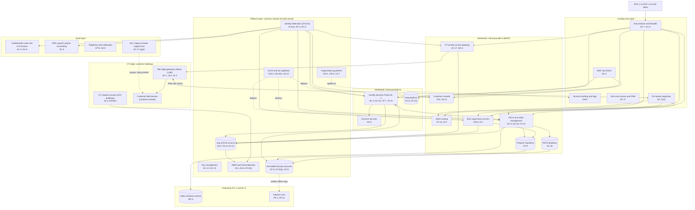

# Cloud Architecture and Control Placement: Cris Santos Company | Government Services and Facilities | Enterprise

**Organization:** Cris Santos Company, Inc. (publicly traded facilities support contractor operating government buildings) | **Tier:** Enterprise | **Provider:** Multi-cloud, vendor-agnostic: two public cloud providers (called Cloud provider A and Cloud provider B), two colocation data centers, SaaS, and an OT edge of company-owned gateways at customer buildings (see section 4)
**Owner:** Director of Cloud Platform Engineering, with the CISO and the Director of OT Security | **Date:** 2026-08-31 | **Related:** IBOP SSP (P02), enterprise BIA (P05)

## 1. Architecture in layers
The estate is organized in five layers. Each lower layer provides **common controls** that the layers above inherit, so a workload team configures only what is specific to its system. The OT edge is a layer of its own because it is where cloud-hosted services reach customer-owned building equipment.

| Layer | What it is | Examples | Who runs it |
|---|---|---|---|
| **Platform** | Organization-wide services in both clouds | Organization guardrails, identity federation, key management, log archive, SIEM feeds, posture management, immutable backup accounts, CI/CD pipelines | Cloud Platform Engineering; Security Operations; Identity team |
| **Landing zone** | The standard account pattern every workload lands in | Account vending with mandatory tags, hub-and-spoke network with cloud firewalls, private links to colocation and the ROCs, WAF and DDoS protection, private DNS, zero-trust and PAM access, per-tenant network segments | Cloud Platform Engineering; Network Engineering |
| **Workload** | Systems built or run by the company | Cloud A: the IBOP (alarm routing, PACS and video management, BAS supervisory servers, customer console, program repository, OT remote access gateway). Cloud B: the Facility Services Portal (SL-2), the data platform, cloud AI services | Application teams (for example, the IBOP Platform Manager) |
| **SaaS** | Vendor-operated applications | Identity platform, collaboration suite with the CUI enclave, ERP and payroll, contact center telephony, notification service, AQ-1's legacy remote-support tool (being retired) | Vendors, with the company's configuration and oversight |
| **OT edge** | Company-owned equipment inside customer buildings | About 1,480 site edge gateways and the OT network sensors at 870 buildings | OT security team; controls technicians |

Colocation DC-1 (Florida) and DC-2 (Virginia) host the network core, the video evidence archive, and the weekly offline copy of the immutable backups. The 64 federal buildings are not in this architecture: their building systems run on GSA's Building Systems Network under GSA's authorization, reached only through GSA's virtual desktop with PIV cards.

## 2. Diagram

## 3. Responsibility by service model
Sources: SRC-AWS-SRM, SRC-AZURE-SRM, and SRC-GCP-SRM in `00_universal-framework/sources/source-register.csv`. The three published models agree on the split used here, so the design does not depend on which two providers the company uses.

| Service model | Provider | Company (customer) | Shared |
|---|---|---|---|
| IaaS (IBOP servers, gateway) | Facilities, hosts, hypervisor, physical network | Guest OS, applications, identities, data, network policy | Encryption (provider service, company keys), logging |
| PaaS (databases, containers, FSP runtime, AI services) | Also the platform runtime and its patching | Data, access, configuration, keys, application code | Backups, availability configuration |
| SaaS (identity, collaboration, ERP, telephony) | Also the application | Users, roles, data, oversight of the vendor | Audit review (complementary user entity controls) |
| Colocation | Building, power, cooling, perimeter | Racks, equipment, cage access lists | None |
| OT edge (company equipment in customer buildings) | None (no cloud provider role) | Gateways, firmware, rules, sensors | The building owner controls the site network, power, and physical access to the equipment closet |

## 4. Service categories and provider equivalents
| Service category | AWS | Microsoft Azure | Google Cloud |
|---|---|---|---|
| Organization guardrails | AWS Organizations service control policies | Azure Policy with management groups | Organization Policy Service |
| Account vending | AWS Control Tower account factory | Azure landing zone subscription vending | Resource Manager project creation |
| Key management | AWS KMS | Azure Key Vault | Cloud KMS |
| Audit logging | AWS CloudTrail | Azure Monitor activity log | Cloud Audit Logs |
| Threat detection | Amazon GuardDuty | Microsoft Defender for Cloud | Security Command Center |
| Managed relational database | Amazon RDS | Azure SQL Database | Cloud SQL |
| Managed containers | Amazon EKS | Azure Kubernetes Service | Google Kubernetes Engine |
| Web application firewall | AWS WAF | Azure Web Application Firewall | Cloud Armor |
| Backup service | AWS Backup | Azure Backup | Backup and DR Service |

This table is for reading provider documentation only. The architecture, control map, and SSP describe service categories.

## 5. Common controls
`cloud-control-map.csv` has **64 rows** across 34 components: Platform 20, Landing zone 8, Workload 21, SaaS 7, OT edge 5, Colocation 3. Responsibility: Customer 48, Shared 13, Provider 3.

**34 rows are published as common controls** (`common_control` = Yes) in the enterprise common control catalog. They map to the common control providers in the IBOP SSP (P02 section 10.3): identity (CCP-02), landing zone (CCP-03), security operations (CCP-04), and colocation (CCP-07). A workload inherits them by being deployed through account vending, which applies the guardrails, logging, network, key, and backup policies automatically. The OT remote access gateway and OT sensors are also published as common controls, because the FSP, subcontractor access, and future platforms reach customer OT only through them.

**Rules for inheriting:**
1. A workload may claim a common control only if its account was created by account vending and passes the posture baseline.
2. Customer-side identity, data protection, and logging stay explicit at every layer: even a SaaS application has Customer rows for access (AC-3, AU-6) because those are always the company's responsibility.
3. SaaS rows cite the vendor's SOC 2 report, reviewed by the third-party risk team (P09 evidence map).
4. Nothing in the OT edge layer is inherited from a cloud provider. The building owner's controls (site network, closet access) are documented in each customer's interconnection exhibit.

## 6. Validation against the IBOP SSP (P02)
Every IBOP component in the SSP boundary appears here with controls from each required family, directly or inherited:
| IBOP component | AC | AU | CM | IA | SC | SI |
|---|---|---|---|---|---|---|
| Alarm routing servers | AC-4 (inherited) | AU-2 (inherited) | CM-2 (inherited) | IA-2(1) (inherited) | SC-7 (inherited) | SI-2 |
| PACS and video management | AC-3 | AU-10 | CM-3(1) (inherited) | IA-2(1) (inherited) | SC-7(21) | SI-4 (inherited) |
| PACS database | AC-6 (inherited) | AU-9 (inherited) | CM-6 (inherited) | IA-2(1) (inherited) | SC-28 | SI-2 (shared) |
| BAS supervisory servers | AC-4 (inherited) | AU-2 (inherited) | CM-6 | IA-2(1) (inherited) | SC-7 (inherited) | SI-7 |
| Customer console | AC-3 (PACS) | AU-2 (inherited) | CM-3 (inherited) | IA-8 | SC-5 (inherited) | SA-11 and SI-4 (inherited) |
| OT remote access gateway | AC-17 | AU-2 (inherited) | CM-2 (inherited) | IA-2(1) (inherited) | SC-7 (inherited) | SI-4 (inherited) |
| Site edge gateways | AC-4 (via SC-7) | AU-2 (inherited) | CM-6 (SSP) | IA-3 | SC-7 | SI-2 |

## 7. Findings from the mapping
1. **The AQ-1 legacy tool bypasses every layer.** Its always-on agents at 142 sites connect to the vendor's cloud relay, not to the landing zone, the gateway, or the SIEM. No architecture control can compensate, so the fix is removal (POAM-001). It is the entry point in the P08 scenario.
2. **The OT edge is the weakest layer.** OT sensors cover 870 of 1,420 buildings (POAM-005), 6 of 25 sampled edge firmware updates were late at AQ-1 sites (POAM-016), and 214 buildings have flat customer networks behind the gateway (POAM-018).
3. **Door and setpoint integrity is a workload responsibility.** No platform service can tell a legitimate door schedule from a malicious one; the pipeline gate (CM-3(1)), attribution (AU-10), and repository hashes (SI-7) live in the workload.
4. **PACS recovery is the one workload that missed its RTO.** Alarm routing met its 2-hour RTO, but PACS administration took 7.5 hours against 4 (POAM-007).
5. **Two clouds, one control set.** Guardrails, logging, and key policies are written once as code and applied to both clouds. Differences are limited to service names (section 4).
6. **CUI is in SaaS, not in the clouds.** The CUI enclave is a restricted library in the collaboration suite; CUI found in general project sites is a data handling failure, not an architecture gap (P03).
7. **AI services** run under provider terms with no training on company data. The AI governance committee reviews each new model deployment (P10).
