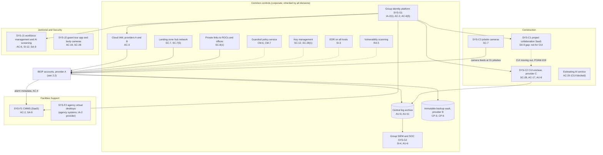
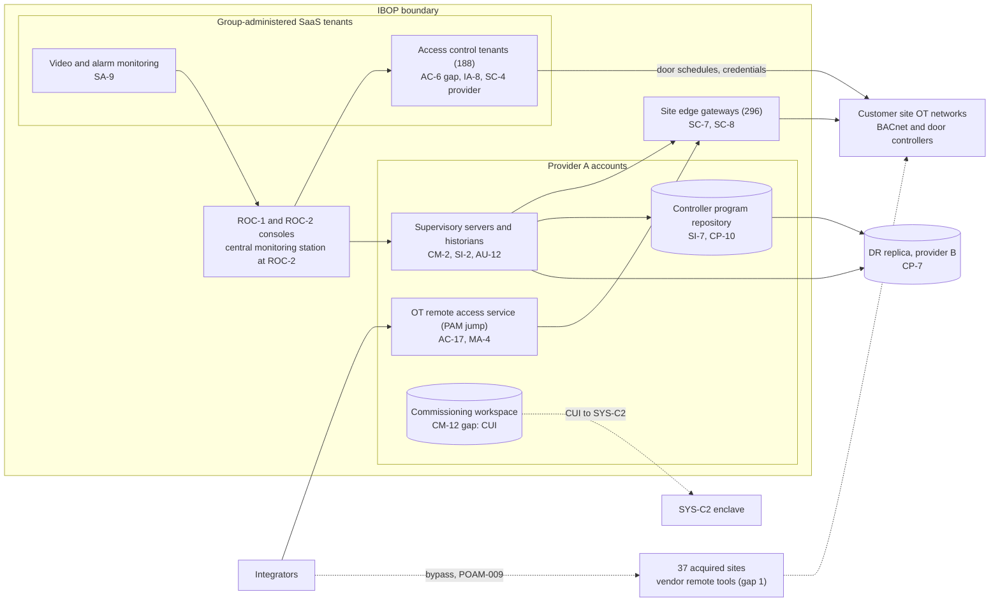

# Cloud Architecture and Control Placement: Cris Santos Company Holdings | Government Services and Facilities | Multi-Sector

**Organization:** Cris Santos Company Holdings, Inc. | **Tier:** Multi-Sector | **Providers:** two public cloud providers, called provider A and provider B, plus a government community cloud tenant (provider C) for Construction CUI (vendor-agnostic; see section 6)
**Scope:** the shared corporate cloud platform (SYS-G3 landing zones and the IBOP) plus the division workloads and SaaS services that connect to it. The SSP system (P02) is the Integrated Building Operations Platform (IBOP).

## 1. Design in one paragraph
Corporate runs one **landing zone** per provider: identity federation from SYS-G1, a hub network, guardrail policies, a central log archive, key management, EDR, and an immutable backup vault. The **IBOP** has its own accounts inside the provider A landing zone (supervisory services, OT remote access service, program repository, commissioning workspace) and its disaster recovery replica in provider B. Access control and video management run as **vendor SaaS tenants** that the group administers, one per customer. The IBOP reaches 296 customer sites through **company-managed edge gateways**; it never reaches federal building systems, which stay on agency networks. Divisions keep their own SaaS: the CMMS (Facilities Support), the project collaboration SaaS and the **CUI enclave in provider C** (Construction), and workforce management and guard apps (Janitorial and Security).

## 2. Diagrams
### 2.1 Group landing zone and division workloads

### 2.2 IBOP (SSP boundary)

**Target state (POAM-009 to POAM-013 and POAM-019, due 2026-12-15 to 2027-03-31):** every site, including the 37 acquired sites, is reached only through the jump service with MFA and recording; access control administration uses per-customer roles with just-in-time elevation instead of the standing global role; all 296 sites have segmented OT networks, a reconciled inventory, and logs in the SIEM; and the commissioning workspace holds no CUI.

## 3. Tenancy and identity decision
- **Decision.** All three divisions sign in through the group identity platform, SYS-G1. The IBOP has its own accounts inside the provider A landing zone, and divisions keep their own SaaS.
- **One separate tenant.** The Construction CUI enclave (SYS-C2) is a separate tenant in a government community cloud from a third provider (provider C). SYS-G1 still federates sign-in to it. Access control and video management run as vendor SaaS tenants, one per customer, administered by the group.
- **Why.** Covered defense information in an external cloud must meet FedRAMP Moderate equivalency (DFARS 252.204-7012(b)(2)(ii)(D)), which the commercial project SaaS (SYS-C1) does not. Tenant isolation between customers (SC-4) is the access control vendor's control.
- **What limits blast radius.** Phishing-resistant MFA for administrators and just-in-time PAM elevation with session recording for cloud and IBOP administrators. No local cloud users except sealed break-glass accounts. The enclave admits only managed devices with MFA under a conditional access policy and sends its logs to the group SIEM. The OT remote access service (PAM jump) approves and records each integrator session. The backup vault uses a separate backup identity.
- **Known gaps.** 41 group administrators hold a standing global administrator role across all 188 access control tenants, which defeats tenant isolation from the inside (GR-13, POAM-011). 22 integrator accounts have no MFA and sit outside identity governance (GR-07, POAM-001). CUI still sits outside the enclave (POAM-019).
- **Cross-division risks:** GR-01, GR-02, GR-07, GR-13 in [risk-register.csv](../step-04_P01_risk-register/risk-register.csv).

## 4. Common versus division-specific controls
`cloud-control-map.csv` has 55 rows across 34 components. The `control_scope` column shows who owns each placement:

| Scope | Rows | What it means |
|---|---|---|
| Common (group) | 21 | Provided once by corporate (SYS-G1, SYS-G2, SYS-G3) and inherited by every division account. Listed in the P02 common control catalog |
| Shared system (IBOP) | 15 | Controls of the shared corporate system documented in the P02 SSP |
| Division-specific (Facilities Support) | 6 | CMMS, agency desktops at federal buildings, tenant offboarding, the face verification module |
| Division-specific (Construction) | 7 | Project collaboration SaaS, CUI enclave, jobsite cameras, estimating AI |
| Division-specific (Janitorial and Security) | 6 | Workforce management and screening, guard apps, monitoring station NVRs, body cameras |

| Responsibility | Rows |
|---|---|
| Customer (the group or a division) | 37 |
| Shared (provider and group) | 14 |
| Provider | 4 |

**Rule of thumb.** Identity, network guardrails, logging, keys, backups, and EDR are **common**. A division cannot opt out of them, only request an exception through POL-01. What each division's customers and regulators decide (CUI handling for DoD, consumer report access for FCRA, cardholder data for state and local customers) is **division-specific**.

## 5. Layers
| Layer | Common components | Division and IBOP components | Key controls | Responsibility |
|---|---|---|---|---|
| Identity | SYS-G1, cloud IAM | Access control tenants, jump service, CMMS, enclave, workforce management | AC-2, AC-3, AC-6, AC-6(5), AC-17, IA-2(1), IA-8, MA-4 | Customer (configuration); vendor (service) |
| Network | Hub network, private links | Edge gateways, jobsite camera networks | SC-7, SC-7(5), SC-8, SC-8(1), AC-4 | Customer, with provider network security shared |
| Compute | EDR, guardrails, scanning | Supervisory servers, guard tour phones | SI-2, SI-3, CM-2, CM-6, CM-7, RA-5, AC-19 | Customer (guest OS and configuration) |
| Data | Keys, backup vault | Program repository, commissioning workspace, enclave, workforce data | SC-12, SC-28, SC-28(1), CP-6, CP-7, CP-9, CP-10, SI-7, CM-12, SI-12 | Shared: provider encrypts; the group owns keys, placement, and retention |
| Logging | Log archive, SIEM | Supervisory audit logs, enclave logs | AU-6, AU-9, AU-11, AU-12, SI-4 | Shared: providers generate platform logs; the group retains and reviews |
| SaaS dependencies | Identity, SIEM, EDR, scanning vendors | Access control, video, CMMS, project collaboration, workforce, guard app, body camera vendors | SA-9, SC-4, AC-20 | Provider for the service; customer for use and oversight |
| Physical | Provider data centers | ROC buildings (P02 PE controls) | PE-3, MP-6 | Provider (inherited) for data centers; group for the ROCs |

## 6. Service categories and provider equivalents
The design does not depend on a provider. This table gives each provider's name for each service category, for reading its shared responsibility documentation.

| Service category | AWS | Microsoft Azure | Google Cloud |
|---|---|---|---|
| Account structure and guardrails | AWS Organizations with service control policies | Management groups with Azure Policy | Resource hierarchy with Organization Policy |
| Virtual machines (supervisory servers) | Amazon EC2 | Azure Virtual Machines | Compute Engine |
| Object storage (repository, commissioning workspace) | Amazon S3 | Azure Blob Storage | Cloud Storage |
| Key management | AWS KMS | Azure Key Vault | Cloud KMS |
| Audit logging | AWS CloudTrail | Azure Monitor activity log | Cloud Audit Logs |
| Backup with immutability | AWS Backup (vault lock) | Azure Backup (immutable vault) | Backup and DR Service |
| Private connectivity | AWS Direct Connect / Site-to-Site VPN | Azure ExpressRoute / VPN Gateway | Cloud Interconnect / Cloud VPN |
| Government community cloud (CUI enclave) | AWS GovCloud (US) | Azure Government | Assured Workloads |

Shared responsibility sources: SRC-AWS-SRM, SRC-AZURE-SRM, SRC-GCP-SRM in `00_universal-framework/sources/source-register.csv`. All three agree on the split used here: for IaaS the provider owns facilities, hosts, and virtualization; for PaaS the provider also owns the runtime; for SaaS the provider owns the application. The customer always keeps identities, access decisions, data placement, and data. The provider C row is an equivalents example only; the group's enclave choice depends on the provider's FedRAMP Moderate authorization, which DFARS 252.204-7012(b)(2)(ii)(D) requires for any external cloud holding covered defense information.

## 7. Findings from the mapping
1. **The weak points are at the edges, not in the cloud core.** Landing zone guardrails, keys, backups, and EDR are sound (CM-6, SC-12, CP-9, SI-3). The gaps are where the platform meets customer sites and integrators: the 37 acquired sites (AC-17, MA-4), the 19 flat sites (SC-7), and OT logging (AU-12, SI-4).
2. **SaaS administration is a group responsibility even when the vendor runs the service.** Tenant isolation (SC-4) is the access control vendor's control, but the standing global administrator role (AC-6) is the group's choice, and it defeats that isolation from the inside (P01 GR-01; POAM-011).
3. **CUI landed in the wrong places.** The commissioning workspace (CM-12) and the commercial project collaboration SaaS (SA-9) are not approved for covered defense information. The fix is placement, not new controls: CUI goes only to SYS-C2, whose provider holds a FedRAMP Moderate authorization (POAM-019).
4. **Common controls are strong and reused.** One identity platform, one SIEM, one backup design. This is what lets group internal audit assess them once (P07). The weak link is documenting inheritance for Construction and Janitorial and Security (P02 section 10.2; POAM-028), not the controls themselves.
5. **Federal building systems stay outside.** Agency building systems are reached only through agency virtual desktops with PIV cards (SYS-F2). The IBOP has no path to them, which keeps the group out of FISMA system authorization and FedRAMP.
