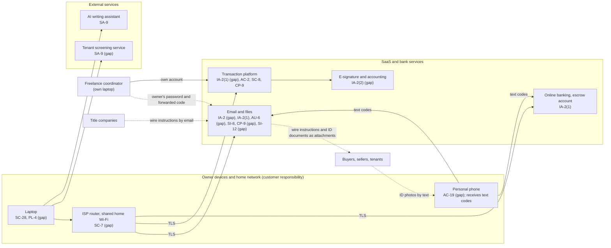

# SaaS Architecture and Control Placement: Cris Santos Company | Real Estate | Sole Proprietorship

**Organization:** Cris Santos Company (residential real estate brokerage) | **Tier:** Sole Proprietorship | **Provider:** SaaS and bank-hosted services only (no IaaS or PaaS)
**System:** Transaction Management and Closing Communications System (TMCC), as defined in the system profile (P02)

## 1. Diagram
Control IDs on each node are the ones in `cloud-control-map.csv`. Dashed lines are flows that carry money instructions or personal information without a verified or protected channel today.

## 2. Layers
| Layer | Components | Key controls | Responsibility |
|---|---|---|---|
| Identity | Email, platform, e-signature, accounting, and banking accounts | IA-2, IA-2(1), IA-2(2), AC-2 | Customer configures; vendors provide MFA options |
| Data | Mail and files, platform documents, escrow ledger spreadsheet, phone photos | SC-8, CP-9, SI-12 | Vendor protects data inside its service; customer decides where personal information and money instructions go, and for how long |
| Endpoints | Laptop, phone | SC-28, PL-4, AC-19 | Customer |
| Network | Home router and Wi-Fi | SC-7 | Customer (ISP supplies the equipment) |
| Logging | Email sign-in and rule history, platform access log | AU-2 (vendor), AU-6 (customer) | Shared: vendor records, customer reviews |
| SaaS applications and hosting | Every vendor platform and the bank | Inherited (SC-5, PE family, vendor CP-9, SI-8) | Provider |

## 3. Shared responsibility for SaaS
All three major cloud providers' shared responsibility models (SRC-AWS-SRM, SRC-AZURE-SRM, SRC-GCP-SRM) agree on the SaaS split: the provider runs the application, the platform, and the facilities; **the customer always keeps its identities and accounts, its data, and its devices.** That is why 12 of the 18 rows in the control map are the owner's, 4 are shared, and only 2 are the provider's alone. No vendor's SOC 2 report covers the three customer layers. No IaaS provider equivalents table is needed, because the brokerage runs no infrastructure.

**Business email compromise sits entirely on the customer side.** Every SaaS vendor in this stack can be working perfectly while a criminal reads the owner's mailbox and sends a buyer new wire instructions. The provider supplies the tools (MFA, alerts, DMARC, secure sharing); only the owner can turn them on and use them.

## 4. Findings from the mapping
1. **One identity, two people.** The coordinator signs in to the owner's mailbox with the owner's password and a forwarded text code. Nothing in the logs can show who did what, and the owner's MFA protects nothing if the coordinator's laptop is compromised. Tracked as P01 R-004.
2. **MFA is weak or off where it matters most.** Text codes on email and banking can be relayed by a fake sign-in page; the platform's broker administrator account has no MFA at all. Tracked with R-001.
3. **Money instructions travel the least protected path.** Escrow wire instructions leave as email attachments, title company instructions arrive by email, and the platform's secure document sharing is unused. The brokerage domain has no DMARC policy, so forged mail in the owner's name is not refused. Tracked as R-001, R-002, and R-003.
4. **The phone is part of the security boundary.** It receives every sign-in code, holds texted identity documents, and runs the lockbox app. Losing it is a disclosure risk (R-005) and a lockout risk (R-010).
5. **Inherited platform controls depend on the vendor's SOC 2 report** and on the owner operating the complementary user entity controls (account removal, MFA, log review) listed in P09.
