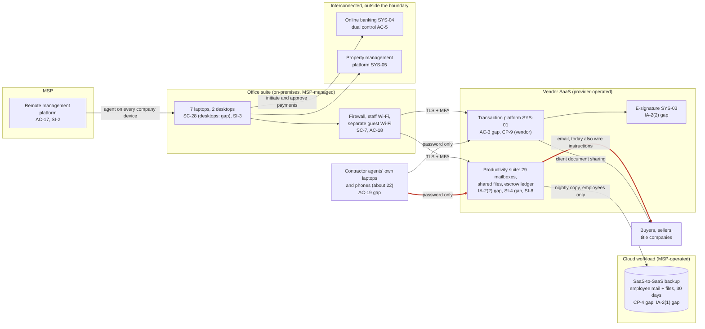

# Cloud Architecture and Control Placement: Cris Santos Company | Real Estate | Micro

**Organization:** Cris Santos Company, LLC (residential real estate brokerage with property management) | **Tier:** Micro | **Provider:** Vendor-agnostic SaaS (see section 3)
**System:** Transaction Management and Closing Communications System (TMCC), as defined in the SSP (P02) | **Prepared:** 2026-08-07 by the Office Manager with the MSP lead technician | **Approved:** Broker-owner, 2026-09-14

## 1. Diagram
The brokerage runs no servers and no IaaS tenant. Its cloud is a set of SaaS services plus one cloud workload the MSP operates for it: the SaaS-to-SaaS backup of employee mailboxes and files (SYS-09).

The thick red links are the path a business email compromise attacker uses: sign in to a contractor agent's mailbox with a stolen password, then send altered wire instructions to a buyer. Almost every control on that path belongs to the brokerage, not to a provider.

## 2. Layers and who is responsible
| Layer | Components | Key controls | Customer (brokerage) | MSP (on the brokerage's behalf) | Provider (SaaS vendor or bank) |
|---|---|---|---|---|---|
| Identity | Suite, platform, e-signature, backup, and banking accounts | AC-2, IA-2(1), IA-2(2), AC-6 | Decides who gets access and enforces MFA settings; removes departing agents | Holds the backup console login and, today, the shared suite administrator | Runs the sign-in and MFA services; the bank enforces dual control |
| Network | Firewall, Wi-Fi, internet line | SC-7, AC-18 | Approves changes | Configures, patches, and monitors | Not applicable |
| Endpoints | 9 company devices; agents' personal devices | SC-28, SI-2, SI-3, AC-19 | Sets rules for agents' devices; keeps the inventory | Encryption, antivirus, and patching on company devices | Not applicable |
| SaaS applications | Transaction platform, suite, e-signature | AC-3, SI-8, SC-8 | Visibility settings, forwarding rules, DMARC, message encryption | Suite administration on request | Application, platform, data centers, spam filtering |
| Data | Client files, escrow ledger spreadsheet, backup copies | CP-9, CP-4, SC-28 | Decides retention and backup scope; requires restore tests | Operates the backup and runs restore tests | Encrypts and backs up its own platform |
| Logging | Suite sign-in and mailbox logs; platform activity | AU-2, AU-6, AU-11, SI-4 | **Reviews logs and turns on alerts (gap today)** | Receives alert copies | Generates and stores logs |
| Vendor governance | Contracts, SOC 2 review, MSP review | SA-9 | Reviews SOC 2 reports and MSP evidence; adds contract terms | Holds the backup vendor subscription | Provides SOC 2 reports and documentation |

**The MSP is not a cloud provider in the shared responsibility sense.** It performs customer-side duties. Anything marked "Customer (performed by MSP)" in `cloud-control-map.csv` stays the brokerage's responsibility: under Fla. Stat. 501.171(2) the brokerage must take reasonable measures, and the MSP, as a third-party agent, has its own duty and must report a breach within 10 days (501.171(6)(a)). The brokerage must direct the work, receive evidence, and check it (SA-9).

## 3. Service categories and provider equivalents
The design is vendor-agnostic. For SaaS, the three large cloud providers describe the same split: the provider runs the application, platform, and infrastructure, and the customer keeps identities, access, data, and devices (SRC-AWS-SRM, SRC-AZURE-SRM, SRC-GCP-SRM in `00_universal-framework/sources/source-register.csv`). For the brokerage's vendors, a SOC 2 report or vendor security documentation is the evidence of the provider side.

| Service category used | What it is here | Equivalent category in the large cloud providers (for reading their documentation) |
|---|---|---|
| Line-of-business SaaS | Transaction platform, e-signature, property management platform | Industry SaaS built on any provider |
| Productivity suite | Email, calendar, file storage | Productivity and collaboration SaaS |
| SaaS-to-SaaS backup | Nightly copy of employee mailboxes and files | Backup service or third-party SaaS backup |
| Remote monitoring and management | MSP device management | Device management SaaS |
| Bank-hosted online banking | Escrow and operating accounts | Not a cloud service category; governed by the bank's treasury agreement |

## 4. Findings from the mapping
1. **The attack path runs through customer-side controls (IA-2(2), SI-4, SI-8).** The providers' side of the suite and the transaction platform is strong. The weak points are the brokerage's settings: agents without MFA, legacy protocols, no alerts on forwarding rules, external forwarding allowed, and a monitor-only DMARC policy. All are free settings in services the brokerage already pays for. Tracked as P01 R-001 and R-005 and P07 POAM-003, POAM-004, and POAM-012.
2. **One password controls the whole email tenant (IA-2(1), AC-6).** The shared global administrator account has no MFA and is known to two people. An attacker with it could read every mailbox, create forwarding rules, and turn off logging. Fix: two named administrator accounts with MFA, the shared one disabled, by 2026-09-30 (R-006, POAM-002).
3. **Backup covers the wrong mailboxes (CP-9, CP-4).** The 22 agent mailboxes carry most client communication and have no independent copy, while the employee copy has never been restored. Fix: extend SYS-09 to every mailbox and add a monthly export of active transaction files, then test quarterly (R-008, POAM-006 and POAM-007).
4. **The MSP's reach is total (AC-17).** Its remote management platform can run commands on every company device, and its backup login can delete the only copy. The brokerage has no evidence of how the MSP protects either. Fix: annual MSP security review and contract terms for MFA, incident notice within 24 hours, and a subcontractor list (R-013, POAM-009).
5. **Agents' devices are inside the risk but outside management (AC-19).** The brokerage will not manage personal devices. It will set minimum rules (POL-02 C.3), require MFA, and use the suite's app-level protection so company mail can be wiped from a lost phone (R-010).
6. **Card data stays out.** Rent card payments run on the property management platform's hosted page, so no system in this map stores card data. PCI DSS is noted, not assessed.
