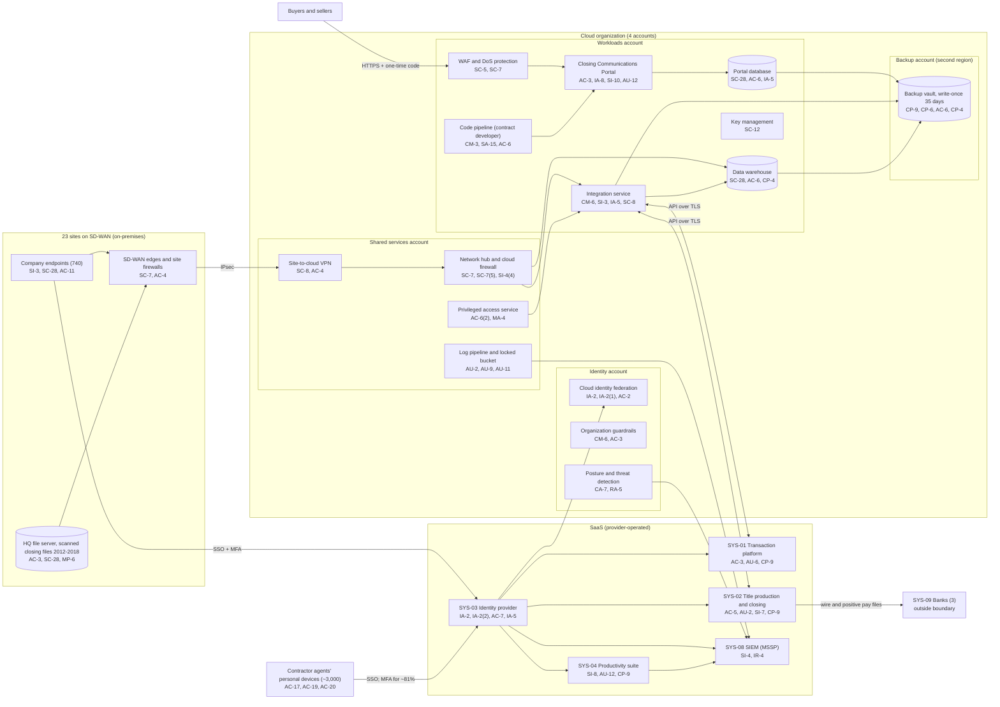

# Cloud Architecture and Control Placement: Cris Santos Company | Real Estate | Mid-Market

**Organization:** Cris Santos Company, Inc. and Cris Santos Title and Closing, LLC | **Tier:** Mid-Market | **Provider:** Vendor-agnostic public cloud (see section 4), plus SaaS
**System:** Transaction Management and Closing Communications System (TMCC), as defined in the SSP (P02) | **Prepared:** 2026-08-07 by the IT Director and the Security Manager; updated 2026-09-29 with P07 results
**Control map:** `cloud-control-map.csv` (64 rows, 24 components)

## 1. Diagram

The dotted gap in this picture is what is **not** drawn: no arrow runs from SYS-01 or SYS-02 to the SIEM, because their application logs are not collected (gap 3).

## 2. Landing zone design
The landing zone separates duties across 4 accounts (accounts, subscriptions, or projects, depending on the provider) under one cloud organization.

| Account | Purpose | Who administers | Key design decisions |
|---|---|---|---|
| **Identity** | Organization root, cloud identity federation to SYS-03, organization guardrails, posture management and threat detection | Security Manager and 1 security analyst | No workloads. Root credentials sealed. Guardrails apply to every other account and cannot be disabled from them |
| **Shared services** | Network hub, cloud firewall, site-to-cloud VPN, DNS, privileged access service, patch service, log pipeline and locked log bucket | IT Director's infrastructure team (3 engineers) | All traffic between sites, workloads, and the internet passes the hub. Logs from all accounts land in a write-once bucket here |
| **Workloads** | Closing Communications Portal, portal database, web application firewall, code pipeline, integration service, data warehouse, key management | Infrastructure team; the contract development firm deploys portal code | Separate subnets per workload. The only internet ingress is the portal through the WAF. Company-managed keys |
| **Backup** | Backup vault with 35-day write-once retention in a second region | 2 named backup administrators | Separate administrator credentials, not federated to everyday accounts. A cross-account role can write backups but cannot delete them |

## 3. Layers and shared responsibility per service
| Layer | Components | Key controls | Service model | Responsibility |
|---|---|---|---|---|
| Identity | Cloud federation, break-glass accounts, guardrails, privileged access service | IA-2, IA-2(1), AC-2, AC-6(2), AC-6(5), AC-3, MA-4 | IaaS / PaaS | Customer configures identities, roles, MFA, and reviews; provider runs the identity services |
| Network | Hub, cloud firewall, VPN, DNS, WAF and DoS protection | SC-7, SC-7(5), SC-8, AC-4, SC-20, SC-5, SI-4(4) | IaaS / PaaS | Customer designs routes, rules, and WAF policy; provider runs the gateways, DNS, and DoS absorption |
| Compute | Closing Communications Portal (managed web application service), code pipeline, integration service virtual machines | AC-3, IA-8, SI-10, SC-8, AU-12, SI-2, CM-3, SA-15, CM-6, SI-3, IA-5, CP-10 | PaaS / IaaS | Customer owns application code, release approval, secrets, and guest OS on virtual machines; provider owns the runtime platform and hosts |
| Data | Portal database, data warehouse, key management, backup vault | SC-28, SC-12, AC-6, CP-9, CP-6, CP-4 | PaaS | Shared: provider encrypts and operates storage and engines; customer controls keys, access, retention, isolation, and restore testing |
| Logging | Log pipeline, posture service | AU-2, AU-9, AU-11, CA-7, RA-5 | PaaS | Shared: provider generates logs and findings; customer enables, retains, forwards, and acts on them |
| SaaS applications | SYS-01, SYS-02, SYS-03, SYS-04, SYS-08 | AC-3, AC-5, AU-2, AU-6, AU-12, CP-9, SI-7, AC-7, IA-2(2), IA-5, SI-8, SI-4, IR-4 | SaaS | Provider runs the application and infrastructure; customer keeps users, roles, workflow settings (such as payee approval), log collection, and data recovery choices |
| Physical | Provider data centers | PE-3, PE-13 | IaaS | Provider (inherited, evidenced by SOC 2 reports) |

**Responsibility counts in `cloud-control-map.csv`:** 36 Customer, 20 Shared, 8 Provider. By service model: 32 PaaS, 17 IaaS, and 15 SaaS rows. As the three providers' shared responsibility models agree, identity, data access, and logging stay with the customer in every model.

## 4. Service categories and provider equivalents
The design is independent of the provider. This table gives each provider's name for the service category, for reading its shared responsibility documentation (SRC-AWS-SRM, SRC-AZURE-SRM, SRC-GCP-SRM in `00_universal-framework/sources/source-register.csv`).

| Service category | AWS | Microsoft Azure | Google Cloud |
|---|---|---|---|
| Multi-account organization and guardrails | AWS Organizations, service control policies | Management groups, Azure Policy | Resource Manager folders, organization policies |
| Account, subscription, or project | Account | Subscription | Project |
| Cloud identity federation | IAM Identity Center | Microsoft Entra ID with Azure RBAC | Cloud Identity with IAM |
| Network hub and cloud firewall | Transit Gateway, AWS Network Firewall | Virtual WAN hub, Azure Firewall | Network Connectivity Center, Cloud NGFW |
| Site-to-cloud VPN | Site-to-Site VPN | VPN Gateway | Cloud VPN |
| Managed web application service | AWS App Runner or Elastic Beanstalk | Azure App Service | Cloud Run |
| Web application firewall and DoS protection | AWS WAF, AWS Shield | Azure Web Application Firewall, Azure DDoS Protection | Cloud Armor |
| Managed database | Amazon RDS | Azure SQL Database | Cloud SQL |
| Data warehouse | Amazon Redshift | Azure Synapse Analytics | BigQuery |
| Build and deployment pipeline | AWS CodePipeline | Azure Pipelines | Cloud Build |
| Virtual machines | EC2 | Virtual Machines | Compute Engine |
| Backup service with write-once retention | AWS Backup (vault lock) | Azure Backup (immutable vault) | Backup and DR Service |
| Key management and secrets | AWS KMS, Secrets Manager | Azure Key Vault | Cloud KMS, Secret Manager |
| Audit logging | CloudTrail | Azure Monitor activity log | Cloud Audit Logs |
| Posture and threat detection | Security Hub, GuardDuty | Microsoft Defender for Cloud | Security Command Center |

**Service model split used here (all three providers agree):**
- **IaaS** (virtual machines, networks): the provider owns facilities, hosts, and virtualization. The customer owns the guest OS, applications, network configuration, identities, and data.
- **PaaS** (managed web application service, databases, backup, keys, pipeline): the provider also owns the platform software and its patching. The customer owns the code it deploys, access, keys, data, and configuration.
- **SaaS** (SYS-01 to SYS-04, the SIEM): the provider also owns the application. The customer keeps identities, roles, workflow settings, log collection, and data.

## 5. Findings from the mapping
1. **The portal is the company's own code, and nobody owns its security.** The managed web application service removes server patching, but release approval, library updates, and testing stay with the customer, and the contract development firm deploys with 3 shared credentials and email approvals (P07 CM-3 and AC-6 findings; P01 R-008). Fix: named developer identities, a company approver in the pipeline, code and dependency scanning, and secure development terms in the contract (POAM-010).
2. **SaaS settings are security controls.** The most important control in SYS-02, the two-person rule for payee bank details, is a tenant setting the company switched on only for new payees. Shared responsibility for SaaS means the company owns these workflow settings (POAM-002).
3. **Logging gaps sit in the SaaS layer, not the cloud.** Cloud and identity logs are complete and locked. SYS-01, SYS-02, and SYS-10 application logs are not collected, so a payee change or a bulk export would go unseen (POAM-005).
4. **Recovery is designed but unproven** outside the portal. Backups are isolated (separate account, second region, write-once, separate credentials), which is the strongest control here. The integration service and data warehouse have never been restored, and SaaS data has no independent copy (POAM-008).
5. **Secrets are the weak spot in the workloads account.** Non-expiring API secrets in the integration service and a 2023 database password give an attacker long-lived access if a server is compromised (POAM-012).
6. **Boundary check.** Every in-scope component in the SSP (P02 section 9) appears in the diagram except the endpoints' individual roles, which P02 covers. Every cloud component has at least one row in the control map, and each account has controls from at least 2 of the AC, AU, CM, IA, SC, and SI families or inherits them.
7. **Inherited controls rely on SOC 2 reports.** Controls marked Provider or Shared for the SaaS vendors, cloud provider, and MSSP depend on their SOC 2 Type 2 reports and complementary user entity controls, reviewed each year in P09 `vendor-soc2-review.csv`.
