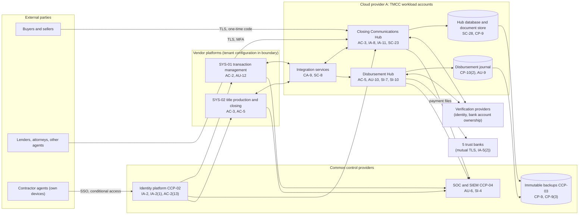

# System Security Plan: Transaction Management and Closing Communications System (TMCC)

**Organization:** Cris Santos Company, Inc. (publicly traded residential real estate brokerage with title and settlement, property management, and relocation lines; 9 states) | **Tier:** Enterprise | **Vertical:** Real Estate and Rental and Leasing
**Outline:** NIST SP 800-18 Rev. 2, System Security Plan Outline Example (June 2026) | **Version:** 2.0, 2026-09-14

## 1. System Name and Identifier
Transaction Management and Closing Communications System (**TMCC**), identifier CSC-SYS-TMCC-001. Tier-1 system in the enterprise application inventory and the system of record for Title and Escrow's Safeguards Rule program (16 CFR Part 314).

## 2. System Overview
The TMCC is the layer that carries a residential sale from signed contract to disbursed funds, across both of the company's regulated money paths:
- **Brokerage side:** the company's tenant configuration of the transaction management platform (SYS-01): contracts, compliance review, deadline tracking, and earnest money deposit tracking for about 210,000 closed transaction sides a year.
- **Settlement side:** the company's tenant configuration of the title production and closing platform (SYS-02), which produces settlement statements and the disbursement ledger for about 91% of Title and Escrow's 88,000 closings a year.
- **Company-built services on Cloud provider A:** the **Closing Communications Hub** (SYS-03), the only channel through which wire instructions, payoff letters, and closing documents reach buyers, sellers, lenders, and agents; and the **Disbursement Hub** (SYS-04), which takes approved disbursements from SYS-02, enforces dual approval and payee verification results, and sends payment files to the 5 trust banks (about 1,520 outgoing wires, about $136 million, per business day).

**Why integrity matters most.** The company's most likely serious loss is closing funds sent to a criminal's account after an email account is taken over or spoofed (P01 R-001 and R-002). Title and Escrow had 3 diverted-wire incidents in 2026 H1 ($1.2 million; $0.8 million recovered). Trust funds may move only under the closing instructions under which they were accepted (Fla. Stat. 626.8473(4), Florida worked example). Every component an attacker would have to touch to redirect a disbursement is inside this boundary or is a common control it inherits.

**Major components:**
- Closing Communications Hub: web application and API on managed containers, managed relational database, and document store (Cloud provider A, Hub workload account)
- Disbursement Hub: approval service, payee verification integration, bank connectors, and journal database (Cloud provider A, payments workload account with no inbound internet path)
- Integration services to SYS-01 and SYS-02 (vendor APIs), the e-signature service, the identity verification provider, the bank account ownership verification provider, and the payoff aggregation service
- SYS-01 and SYS-02 tenant configurations: roles, workflows, audit settings, data retention, and API credentials

Users: about 41,000 SYS-01 users (agents and staff); about 3,900 Title and Escrow and escrow accounting staff with SYS-02 or Hub staff roles; about 28,600 external professional Hub accounts (lenders, attorneys, other brokerages' agents); and about 210,000 consumer Hub accounts created a year (buyers and sellers).

## 3. Laws, Regulations, and Policies Affecting the System
| ID | Requirement | Citation | How it affects the TMCC |
|---|---|---|---|
| N53-R01 | FTC Safeguards Rule. Applies to Title and Escrow as a provider of real estate settlement services; the parent operates the program as affiliate and service provider (P03 section 1.1) | 16 CFR Part 314 | Every element of 314.4 applies; the TMCC holds most of Title and Escrow's customer information |
| N53-R02 | FTC Act Section 5 | 15 U.S.C. 45(a) | Reasonable security for brokerage client data in SYS-01 that is not customer information under the Safeguards Rule |
| N53-R05 | SEC cybersecurity disclosure | Form 8-K Item 1.05; 17 CFR 229.106 | A TMCC incident goes through the P08 materiality step; this plan supports the Item 106 description |
| N53-R03 | CCPA/CPRA and the CPPA regulations | Cal. Civ. Code 1798.100 et seq.; Cal. Code Regs. tit. 11, 7000 et seq. | Applies to brokerage client data of California consumers in SYS-01. Data subject to GLBA is exempt at the data level (Civ. Code 1798.145(e)) except the 1798.150 breach right of action |
| State | Broker escrow duties (Florida worked example) | Fla. Stat. 475.25(1)(d)1. and (1)(k); Fla. Admin. Code ch. 61J2-14 | Deposit tracking and deposit verification in SYS-01 |
| State | Title agency trust funds (Florida worked example) | Fla. Stat. 626.8473 | Disbursement only under closing instructions; separate records of receipts and disbursements |
| State | Breach notification | Each state where affected individuals reside (Florida worked example: Fla. Stat. 501.171) | Notification (P08) |
| Federal | RESPA affiliated business arrangements | 12 CFR 1024.15 | The affiliated business disclosure for referrals to Title and Escrow is generated and stored in SYS-01 |
| Contract | SOC 2 Type 2 for SL-1 title and settlement services | P09 | Client commitments on security, availability, processing integrity, and confidentiality |
| Internal | POL-01 to POL-05 with standards and procedures | P06 | Enterprise policy hierarchy |

Not applicable to this system (reasoning in P03 section 1):
- PCI DSS (N53-R04): no card data enters the TMCC. Rent and application fee card payments run on the property management platform's hosted payment page, outside this boundary.
- FinCEN residential real estate reporting (31 CFR 1031.320): vacated on 2026-03-19, appeal pending. If restored, Title and Escrow would prepare reports from SYS-02 data (P03 G-062).

## 4. System Status
### 4.1 System Security Plan Approval
Prepared by the Director of Closing Platform Engineering with the GRC team. Reviewed by the CISO (Qualified Individual), the President of Title and Escrow, and the Executive Vice President, Brokerage Operations. Approved by the Chief Operating Officer on 2026-09-14.
### 4.2 System Authorization Decision
The company is not a federal agency, so there is no formal authorization to operate. The equivalent internal decision:
- **Authorizing official equivalent:** Chief Operating Officer, on the CISO's recommendation, with the President of Title and Escrow concurring for the settlement components.
- **Decision (2026-09-14):** continue operation with conditions, based on the Internal Audit assessment (P07, report issued 2026-09-04) and the enterprise risk register (P01, approved 2026-09-08).
- **Conditions:**
  - rotate and vault the bank API client secrets found in pipeline variables (POAM-010) by 2026-10-31;
  - require a second approver on all AQ-09 trust account wires through the bank's own setting (POAM-005 interim milestone) by 2026-10-31;
  - automate recovery of the Disbursement Hub bank connectors and rerun the DR test (POAM-011) by 2027-01-31;
  - raise payee bank account verification coverage from 86% to at least 98% of disbursements and stop callbacks to numbers on payoff letters (POAM-006) by 2027-03-31;
  - phishing-resistant authentication for contractor agents in SYS-01 and the Hub agent view (POAM-001) by 2027-03-31.
- If POAM-006 or POAM-001 slips past its date, the President of Title and Escrow decides whether disbursements that rely on manual callback need a second escrow officer's sign-off until the item closes.
- **Reauthorization:** annually, or after a major change (for example, the AQ-09 migration into SYS-02 planned for 2027-02).
### 4.3 System Operational Status
Operational. Planned major modifications: automated enforcement of two approvals for changes to wire-instruction templates and approval rules (CM-3(1)); real-time payment anomaly alerts from the AI-009 model (SI-4(12)); phishing-resistant consumer sign-in for the Hub (IA-8); AQ-09 migration into SYS-02 and the Disbursement Hub.

## 5. Role Identification and Responsible Personnel
| Role | Title | Responsibility |
|---|---|---|
| System owner | President, Title and Escrow | Accountable for the TMCC and the settlement process; approves Hub and SYS-02 roles; owns disbursement and payoff verification procedures |
| Authorizing official (equivalent) | Chief Operating Officer | Accepts residual risk to operate |
| Business owner, brokerage components | Executive Vice President, Brokerage Operations | SYS-01 workflows, agent onboarding and offboarding, deposit tracking |
| Qualified Individual and information security | CISO | Safeguards Rule program (16 CFR 314.4(a)); security oversight of the TMCC |
| Senior overseer of the Qualified Individual | President, Title and Escrow | Directs and oversees the Qualified Individual for Title and Escrow (16 CFR 314.4(a)(2)) |
| System administrator and developer | Director of Closing Platform Engineering | Builds and runs the Hub and the Disbursement Hub; SYS-01 and SYS-02 tenant configuration |
| Funds process owners | Vice President, Escrow Accounting; regional escrow officers | Dual approval, reconciliations, positive pay, bank recall requests |
| Privacy | Chief Privacy Officer | Privacy, retention, breach determinations |
| Common control providers | See section 10.3 | Operate inherited controls |
| Independent assessor | Chief Audit Executive (Internal Audit) | Annual assessment (P07) |

## 6. System Information Types and System Categorization
Information types were selected from NIST SP 800-60 Vol. 2 Rev. 1 and rated for this company. Impact levels follow FIPS 199.

| Information type | Confidentiality | Integrity | Availability | Rationale |
|---|---|---|---|---|
| Payments and funds disbursement (wire instructions, payee bank details, disbursement ledger, approvals) | Moderate | **High** | Moderate | One altered instruction can send a seller's proceeds or a loan payoff to a criminal; recovery is uncertain and trust fund duties are breached. Bank portals carry urgent wires during an outage, so availability stays Moderate (P05 BP-05: MTD 4 h, RTO 2 h) |
| Customer personal and financial information (identity documents, Social Security numbers, bank and loan data in closing files) | Moderate | Moderate | Moderate | Disclosure triggers FTC and state notice duties and identity theft risk |
| Contract and transaction records | Moderate | Moderate | Moderate | Contract deadlines run in days (P05 BP-01: MTD 24 h) |
| Workforce, contractor, and external party identities | Moderate | Moderate | Moderate | Credentials are the entry point for BEC |
| Information security (audit logs, approval rules, keys, verification results) | Moderate | High | Moderate | Protects the evidence and rules that stop diversion |
| **TMCC category** | **Moderate** | **Moderate baseline, integrity supplemented** | **Moderate** | See the decision below |

**Categorization decision.** Under a strict FIPS 199 high-water mark the High integrity rating would make the whole system High. The company is not a federal agency and uses FIPS 199 and SP 800-53B as models. The executive risk committee approved this tailoring on 2026-09-08:
- The TMCC uses the **SP 800-53B Moderate baseline**.
- It adds **9 High-baseline controls** that protect funds integrity and the systems that change it: AU-10, CA-8, CA-8(1), CM-3(1), CM-4(1), CM-5(1), CP-9(3), SI-4(12), SI-7(15).
- The decision is reviewed annually. If the funds-integrity POA&M items (POAM-006, POAM-009, POAM-010) are not closed by 2027-06-30, the CISO will recommend full High categorization for the Disbursement Hub.

**Documented controls.** `control-implementation.csv` documents **187 controls**: 178 from the Moderate baseline and 9 High-baseline supplements. The remaining Moderate-baseline controls (mostly enhancements in the AC, AU, CM, CP, IA, SC, and SI families and the PM family) are fully inherited from the enterprise common control catalog (section 10.3) and are listed there rather than repeated here.

## 7. Authorization Boundary Description
**Inside the boundary:** the Hub and Disbursement Hub workload accounts on Cloud provider A (containers, databases, document store, bank connectors, journal); the integration services; the SYS-01 and SYS-02 tenant configurations, users, roles, workflows, and audit settings; Hub staff and external accounts.

**Outside the boundary (common control providers and interconnected systems):**
- Landing zone services (network hub, web application firewall, key management, log archive, backup accounts, standby region): CCP-03
- Identity platform (SYS-05): CCP-02
- SOC, SIEM, EDR, and scanners: CCP-04
- Productivity suite (SYS-06), including the three legacy tenants at AQ-06 to AQ-08: neighbors, not in the boundary, but their accounts reach SYS-01 (POAM-003, POAM-004)
- AQ-09 legacy closing software (SYS-02L) and its trust accounts: outside the boundary until migration (POAM-005)
- Trust banks, verification providers, e-signature service, payoff aggregation service, county recording portals

The enterprise multi-cloud diagram is in P04 `cloud-architecture.md`.

## 8. Information Exchanges Summary
| Connected system / party | Direction | Data | Agreement |
|---|---|---|---|
| SYS-01 transaction management platform | Bidirectional (vendor API over TLS) | Transaction status, parties, closing dates, deposit status | Enterprise SaaS agreement with security, breach notice, and audit terms; vendor SOC 2 Type 2 |
| SYS-02 title production platform | Bidirectional (vendor API over TLS) | Approved disbursements, settlement statements, payee records | Enterprise SaaS agreement; vendor SOC 2 Type 2 |
| 5 trust banks | Outbound payment files and API calls; inbound confirmations and positive pay exceptions | Payee, account, amount | Treasury services agreements with the banks' security procedures; mutual TLS; dual approval |
| Bank account ownership verification provider | Bidirectional (API) | Payee name, routing and account number, match result | Data processing agreement with Safeguards Rule terms |
| Identity verification provider | Bidirectional (API) | Identity documents, selfie match, result | Data processing agreement with Safeguards Rule terms |
| E-signature service | Bidirectional (API from SYS-01 and SYS-02) | Contracts, addenda, closing documents | Contract predates standard security terms; SOC 2 review expired 2026-03 (**gap**, POAM-012) |
| Payoff aggregation service | Inbound payoff statements | Loan payoff amounts and lender payee details | Contract with security terms; SOC 2 Type 2 |
| Lenders not on the payoff service | Inbound payoff letters through the Hub; callbacks | Payoff data | Lender closing instructions; callback only to a number from an independent source (procedure PRC-04.3; **gap**, POAM-006) |
| Enterprise data warehouse (Cloud provider B) | Outbound nightly | Payment metadata for the AI-009 anomaly model and reporting | Internal data sharing agreement; no bank account numbers leave the payments account in clear text (tokenized) |

## 9. System Component Inventory
| Component | Type | Location / provider | Owner |
|---|---|---|---|
| Hub web application and API | Managed containers (PaaS) | Cloud provider A, primary region; warm standby in a second region | Director of Closing Platform Engineering |
| Hub database and document store | Managed relational database and object storage | Cloud provider A | Director of Closing Platform Engineering |
| Disbursement Hub approval service and bank connectors | Managed containers in a separate payments account | Cloud provider A; warm standby | Director of Closing Platform Engineering |
| Disbursement journal | Managed relational database with point-in-time recovery | Cloud provider A | Director of Closing Platform Engineering |
| Integration services | Managed containers and message queue | Cloud provider A | Director of Closing Platform Engineering |
| SYS-01 tenant configuration | SaaS configuration | Transaction platform vendor | Executive Vice President, Brokerage Operations |
| SYS-02 tenant configuration | SaaS configuration | Title production platform vendor | President, Title and Escrow |
| Secrets vault entries and bank certificates | Platform service (inherited) | Cloud provider A key management and enterprise PKI | Director of Cloud Platform Engineering |
| Staff workstations used by closers and escrow accounting | Company endpoints (inherited) | Closing offices | Director of Endpoint Engineering |

## 10. Control Implementation Details
### 10.1 Control implementation status
See `control-implementation.csv` (187 controls).

| Status | Count |
|---|---|
| Implemented | 160 |
| Partially implemented | 24 |
| Planned | 3 |
| **Total** | **187** |

| Inheritance | Count |
|---|---|
| Common (fully inherited from a common control provider) | 104 |
| Hybrid (shared between a provider and the TMCC team) | 28 |
| System-specific | 55 |

The Planned controls: IA-12(5) (address confirmation for sellers of vacant land and non-owner-occupied property), and two High-baseline supplements, CM-3(1) and SI-4(12). Partially implemented controls: AC-2, AC-2(3), AC-20, AT-2, AU-6, CM-3, CP-2, CP-7, CP-10, IA-2(2), IA-5, IA-8, IA-12, IR-4, IR-8, PS-4, RA-5, SA-4, SA-9, SI-4, SI-7, SI-8, SI-12, SR-6.

### 10.2 Control assessment status
Internal Audit assessed 48 of these controls from 2026-07-13 to 2026-08-28 using SP 800-53A Rev. 5 procedures and statistical sampling (P07 `assessment-plan.md`, `assessment-results.csv`). Weaknesses are in P07 `poam.csv`.

### 10.3 Common control providers and inheritance
Common and hybrid controls are inherited from the enterprise platform. Each provider publishes its controls in the enterprise **common control catalog** (maintained by the GRC team in the GRC platform) and is assessed on its own cycle; the TMCC inherits the results.

| Provider | Name | Accountable role | Controls provided | Rows in this plan | Evidence of operation |
|---|---|---|---|---|---|
| CCP-01 | Enterprise GRC program | CISO (with the Chief Risk Officer and Chief Audit Executive) | Policies and standards (P06), risk method, assessment, POA&M, continuous monitoring | 22 | Annual Internal Audit assessment (P07); GRC platform |
| CCP-02 | Identity platform (SYS-05) | Director of Identity and Access Management | SSO, MFA, conditional access, PAM, identity governance, account lifecycle | 24 | SOX IT general control testing; P07 AC-2, IA-2, IA-5 results |
| CCP-03 | Cloud landing zone (Cloud provider A) | Director of Cloud Platform Engineering | Account guardrails, network policies, key management, encryption, backups, log archive, standby region | 29 | Posture management reports; provider SOC 2 Type 2 (physical and hypervisor) |
| CCP-04 | Security operations | Director of Security Operations | 24x7 SOC, SIEM, EDR, vulnerability management, incident response, threat intelligence | 29 | SOC metrics; P07 SI-4, RA-5, IR results |
| CCP-05 | Enterprise network (SYS-08) | Director of Network Engineering | SD-WAN, office segmentation, wireless, transport encryption | 3 | Network configuration reviews |
| CCP-06 | Endpoint engineering (SYS-09) | Director of Endpoint Engineering | Workstation baselines, EDR agents, device control, session lock | 4 | Configuration compliance reports |
| CCP-07 | Facilities and colocation providers | Vice President, Corporate Real Estate and Facilities | Office and closing office physical access; colocation physical controls; media destruction | 4 | Badge reviews; colocation SOC 2 reports |
| CCP-08 | Workforce and agent services | Chief Human Resources Officer (employees); Executive Vice President, Brokerage Operations (contractor agents) | Screening, terminations and agent departures, sanctions, training, acknowledgments | 11 | HR, agent services, and learning system reports |
| CCP-09 | Third-party risk management | Director of Third-Party Risk Management | Vendor tiering, contract terms, SOC report reviews, supply chain risk management | 6 | Vendor register; SOC report reviews |

**Inheritance rules:**
- A Common control is fully inherited; the TMCC team verifies only that the TMCC is onboarded (for example, SSO integration and log forwarding).
- A Hybrid control names both parts in the implementation statement: the provider's part and the TMCC team's part.
- If a provider's assessment finds a weakness, the finding is linked to every inheriting system's POA&M. Example: POAM-002 (contractor agent departures) is a CCP-08 weakness that affects the TMCC because departed agents keep SYS-01 and Hub agent access.

## 11. Digital Identity Acceptance Statement
- **Employees:** SSO with MFA (authenticator push with number matching). Title and Escrow staff who handle funds and all privileged users use phishing-resistant security keys (since 2025), and staff re-authenticate with the key before approving a payee change (IA-11). This is comparable to NIST SP 800-63B AAL2 for users and AAL3-like protection for funds approvers and administrators.
- **Contractor agents:** SSO with authenticator push and number matching, from their own devices under conditional access. Relay phishing kits defeated this in 2026 incidents, so it is **accepted only until 2027-03-31**: device-bound passkeys and session binding are due under POAM-001.
- **External professionals (lenders, attorneys, other agents):** Hub accounts with an authenticator app, created by client services after verification; inactive accounts are being cleaned up (POAM-017).
- **Buyers and sellers:** a one-time code sent by email, which goes to the mailbox a BEC attacker may control. Sellers and payees are identity-verified before bank details are accepted (IA-12(2), IA-12(3)); buyers are not yet (POAM-014). A passkey or verified phone option is due by 2027-03-31.
- **Banks:** mutual TLS with company certificates (IA-5(2)); bank portal fallback uses bank-issued hardware tokens and dual approval.

## 12. Referenced Artifacts
Scenario facts (`../00_company-facts.md`), BIA (P05), multi-cloud architecture and control map (P04), enterprise risk register (P01), regulatory gap analysis (P03), policy hierarchy and policies (P06), Internal Audit assessment and POA&M (P07), BEC runbook (P08), SOC 2 readiness for SL-1 and SL-2 (P09), AI portfolio including AI-009 payment anomaly detection (P10), TMCC contingency plan v3, payee verification procedure PRC-04.3, enterprise common control catalog.

## 13. Acronym List and Glossary
- **BEC:** business email compromise
- **CCP:** common control provider
- **Disbursement Hub:** the company-built service that releases trust account wires after dual approval and payee verification
- **Exchange accommodator:** a qualified intermediary that holds sale proceeds in a tax-deferred exchange
- **Hub:** the Closing Communications Hub
- **PAM:** privileged access management
- **Payoff letter:** a lender's statement of the amount needed to pay off a loan at closing, with wiring details
- **POA&M:** plan of action and milestones
- **Positive pay:** a bank service that matches presented checks against an issued-check file
- **Qualified Individual:** the person designated under 16 CFR 314.4(a) to oversee the information security program
- **TMCC:** Transaction Management and Closing Communications System
- **Title escrow trust account:** an account that holds closing funds under Fla. Stat. 626.8473 (Florida worked example)

## 14. System Security Plan Review and Change Records
| Version | Date | Change | Author |
|---|---|---|---|
| 1.0 | 2025-09-15 | Initial plan (Moderate baseline) | Director of Closing Platform Engineering |
| 1.1 | 2026-03-20 | Added the Disbursement Hub payments account and the 2026 bank connectors | Director of Closing Platform Engineering |
| 2.0 | 2026-09-14 | Integrity supplementation; common control provider mapping; 2026 assessment results | Director of Closing Platform Engineering with the GRC team |
