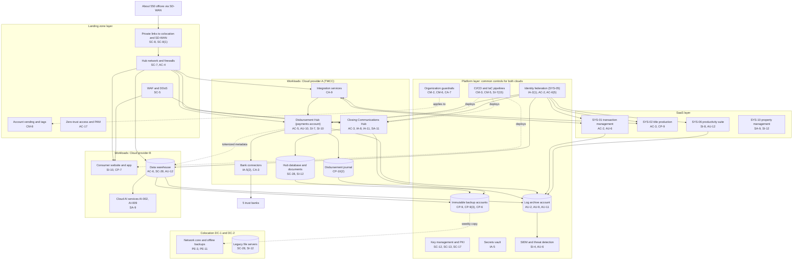

# Cloud Architecture and Control Placement: Cris Santos Company | Real Estate and Rental and Leasing | Enterprise

**Organization:** Cris Santos Company, Inc. (publicly traded residential real estate brokerage with title and settlement, property management, and relocation lines) | **Tier:** Enterprise | **Provider:** Multi-cloud, vendor-agnostic: two public cloud providers (called Cloud provider A and Cloud provider B), two colocation data centers, and SaaS (see section 4)
**Owner:** Director of Cloud Platform Engineering, with the CISO | **Date:** 2026-08-31 | **Related:** TMCC SSP (P02), enterprise BIA (P05)

## 1. Architecture in layers
The estate is organized in four layers plus colocation. Each lower layer provides **common controls** that the layers above inherit, so a workload team configures only what is specific to its system.

| Layer | What it is | Examples | Who runs it |
|---|---|---|---|
| **Platform** | Organization-wide services in both clouds | Cloud organization guardrails, identity federation, key management, secrets vault and enterprise PKI, log archive, SIEM feeds, vulnerability and posture management, immutable backup accounts, CI/CD pipelines | Cloud Platform Engineering; Security Operations; Identity team |
| **Landing zone** | The standard account (subscription or project) pattern every workload lands in | Account vending with mandatory tags, hub-and-spoke network with cloud firewalls, egress allow lists, private connectivity to colocation and SD-WAN, WAF and DDoS protection, private DNS, zero-trust and PAM access | Cloud Platform Engineering; Network Engineering |
| **Workload** | Systems the company builds or runs | Cloud A: Closing Communications Hub, Disbursement Hub (separate payments account), bank connectors, integration services. Cloud B: consumer website and app, CRM data and lead models, data warehouse, cloud AI services | Application teams (for example, the Director of Closing Platform Engineering) |
| **SaaS** | Vendor-operated applications | Transaction management platform (SYS-01), title production platform (SYS-02), productivity suite (SYS-06), property management (SYS-10), ERP and commission (SYS-12), relocation (SYS-13), e-signature | Vendors, with the company's configuration and oversight |
| **Colocation** | Company equipment in leased data center space | DC-1 (Florida) and DC-2 (Texas): network core, offline backup copies, legacy file servers with scanned closing files | Network Engineering; Infrastructure |

## 2. Diagram

## 3. Responsibility by service model
Sources: SRC-AWS-SRM, SRC-AZURE-SRM, and SRC-GCP-SRM in `00_universal-framework/sources/source-register.csv`. The three published models agree on the split used here, so the design does not depend on which two providers the company uses.

| Service model | Provider | Company (customer) | Shared |
|---|---|---|---|
| IaaS (network, private links) | Facilities, hosts, hypervisor, physical network | Network policy, tunnels, identities, data | Encryption (provider service, company keys), logging |
| PaaS (containers, databases, warehouse, AI services) | Also the platform runtime and its patching | Data, access, configuration, keys, application code | Backups, availability configuration |
| SaaS (SYS-01, SYS-02, SYS-06, SYS-10, SYS-12, SYS-13, e-signature) | Also the application | Users, roles, data, audit review, oversight of the vendor | Complementary user entity controls named in each SOC 2 report |
| Colocation | Building, power, cooling, perimeter | Racks, equipment, cage access lists, data on company servers | None |

## 4. Service categories and provider equivalents
| Service category | AWS | Microsoft Azure | Google Cloud |
|---|---|---|---|
| Organization guardrails | AWS Organizations service control policies | Azure Policy with management groups | Organization Policy Service |
| Account vending | AWS Control Tower account factory | Azure landing zone subscription vending | Resource Manager project creation |
| Key management | AWS KMS | Azure Key Vault | Cloud KMS |
| Secrets storage | AWS Secrets Manager | Azure Key Vault secrets | Secret Manager |
| Audit logging | AWS CloudTrail | Azure Monitor activity log | Cloud Audit Logs |
| Threat detection | Amazon GuardDuty | Microsoft Defender for Cloud | Security Command Center |
| Managed containers | Amazon EKS | Azure Kubernetes Service | Google Kubernetes Engine |
| Managed relational database | Amazon RDS | Azure SQL Database | Cloud SQL |
| Web application firewall | AWS WAF | Azure Web Application Firewall | Cloud Armor |
| Backup service | AWS Backup | Azure Backup | Backup and DR Service |

This table is for reading provider documentation only. The architecture, control map, and SSP describe service categories.

## 5. Common controls
`cloud-control-map.csv` has **68 rows** across 34 components: Platform 23, Landing zone 8, Workload 20, SaaS 13, Colocation 4. Responsibility: Customer 48, Shared 13, Provider 7.

**33 rows are published as common controls** (`common_control` = Yes) in the enterprise common control catalog. They map to the common control providers in the TMCC SSP (P02 section 10.3): identity (CCP-02), landing zone (CCP-03), security operations (CCP-04), and facilities and colocation (CCP-07). A workload inherits them by being deployed through account vending, which applies the guardrails, logging, network, key, and backup policies automatically.

**Rules for inheriting:**
1. A workload may claim a common control only if its account was created by account vending and passes the posture baseline.
2. Customer-side identity, data protection, and logging stay explicit at every layer: even a SaaS application has Customer rows for access (AC-2, AU-6) because those are always the company's responsibility.
3. SaaS rows cite the vendor's SOC 2 report and its complementary user entity controls, reviewed by the third-party risk team (P09 evidence map).
4. The payments account (Disbursement Hub and bank connectors) is a separate account with its own keys and no inbound internet path. It inherits the platform controls but not the shared Hub network rules.

## 6. Validation against the TMCC SSP (P02)
Every TMCC component in the SSP boundary appears here with controls from each required family, directly or inherited:

| TMCC component | AC | AU | CM | IA | SC | SI |
|---|---|---|---|---|---|---|
| Closing Communications Hub | AC-3 | AU-2, AU-9 (inherited) | CM-3, CM-5 (inherited) | IA-8, IA-11 | SC-5, SC-7 (inherited) | SI-4 (inherited) |
| Hub database and documents | AC-6 (inherited) | AU-2 (inherited) | CM-6 (inherited) | IA-2(1) (inherited) | SC-28 | SI-12 |
| Disbursement Hub | AC-5 | AU-10 | CM-3, SI-7(15) (inherited) | IA-2(1) (inherited) | SC-7 (inherited) | SI-7, SI-10 |
| Bank connectors | AC-4 (inherited) | AU-2 (inherited) | CM-5 (inherited) | IA-5(2), IA-5 (inherited) | SC-8(1) (inherited) | SI-4 (inherited) |
| Disbursement journal | AC-6(5) (inherited) | AU-9 (inherited) | CM-2 (inherited) | IA-2(1) (inherited) | SC-28 (inherited) | CP-10(2) |
| SYS-01 and SYS-02 tenants | AC-2, AC-3 | AU-6, AU-2 | Vendor (SOC 2) | IA-2(1) (inherited through SSO) | Vendor (SOC 2) | SI-4 (inherited) |

## 7. Findings from the mapping
1. **Secrets outside the vault.** Bank API client secrets for the Disbursement Hub sat in pipeline variables visible to 46 engineers (P07 IA-5). The vault is a platform common control, but nothing stopped a workload from bypassing it. Fix: rotate and vault the secrets, and add a pipeline guardrail that blocks secret-like values in variables (POAM-010).
2. **Funds integrity is a workload responsibility.** No platform service can verify a payee's bank account or enforce dual approval; the TMCC team owns AC-5, AU-10, and SI-7 (POAM-006).
3. **Two clouds, one control set.** Guardrails, logging, and key policies are written once as code and applied to both clouds. Differences are limited to service names (section 4).
4. **Email is the weakest SaaS layer.** The enterprise productivity tenant has full email security and SIEM feeds, but the three legacy tenants at AQ-06 to AQ-08 have neither, and their agents use SYS-01 (POAM-003; POAM-004).
5. **SaaS concentration cannot be fixed by architecture.** SYS-01 carries 100% of brokerage transactions with a contract RTO of 24 hours. The answer is a contract change and a tested procedural fallback (POAM-007), not a second platform.
6. **Legacy data in colocation.** About 610,000 scanned closing files sit unencrypted on company-operated file servers under compensating controls approved by the Qualified Individual (16 CFR 314.4(c)(3)). Retention review and migration to an encrypted archive are due under POAM-013.
7. **Payment card data stays out.** Rent and fee card payments use the property management vendor's hosted payment page; no company account stores, processes, or transmits cardholder data (P03 section 1.4).
