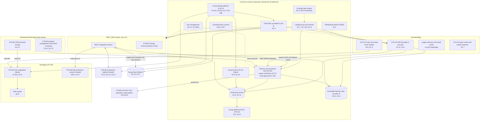
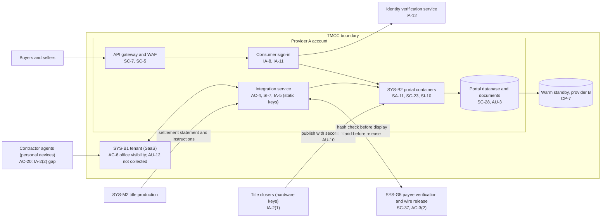

# Cloud Architecture and Control Placement: Cris Santos Company Holdings | Real Estate | Multi-Sector

**Organization:** Cris Santos Company Holdings, Inc. | **Tier:** Multi-Sector | **Providers:** two public cloud providers, called provider A and provider B (vendor-agnostic; see section 6), plus SaaS vendors
**Scope:** the shared corporate cloud platform (SYS-G3 landing zones), the shared services that run on it (the SYS-G5 payee verification service and the Group Data Platform), and the division workloads and SaaS tenants that depend on it. The SSP system (P02) is the Transaction Management and Closing Communications System (TMCC).

## 1. Design in one paragraph
Corporate runs one **landing zone** per provider: identity federation from SYS-G1, a hub network, guardrail policies, a central log archive, key management, EDR, and an immutable backup vault. Divisions get their own **accounts** inside the landing zone and inherit these guardrails. Provider A hosts the corporate hub, the TMCC components the group builds (SYS-B2 Closing Communications Portal and the TMCC integration service), the SYS-G5 payee verification service and bank connectivity gateway, the Group Data Platform, and the Homebuilding ERP (SYS-H1). Provider B hosts the backup vault, the TMCC warm standby, and a replica of the log archive. Most division applications are **SaaS**: the transaction platform (SYS-B1), CRM (SYS-B3), property management (SYS-B4), loan origination (SYS-M1), Homebuilding sales and smart-home platforms (SYS-H2), and group email (SYS-G4). Title production (SYS-M2) is hosted by its vendor. For SaaS, the group's controls are identity, configuration, data, and oversight; the vendor runs the rest.

## 2. Diagrams
### 2.1 Group landing zone, shared services, and division workloads

### 2.2 TMCC (SSP boundary)

**Target state (POAM-001, POAM-003, POAM-004, POAM-006, POAM-008, POAM-009):** every contractor agent signs in with MFA; SYS-B1 and SYS-M2 audit logs reach the SIEM with alerts on payee and bank account changes; every payment change in every division goes through SYS-G5 payee verification; the integration service uses workload identity; SYS-B1 visibility is limited to the transaction team; and the nightly feed to the Group Data Platform carries only approved fields for documented purposes.

## 3. Tenancy and identity decision
- **Decision.** All three divisions sign in through the group identity platform, SYS-G1, and get their own accounts inside the landing zone. Most division applications are SaaS tenants federated to SYS-G1. SYS-G1 has a separate contractor agent identity tier. No division has its own identity tenant by design.
- **The exception.** Homebuilding still runs a legacy directory and email tenant for about 3,800 users until it migrates to SYS-G1 and SYS-G4 (POAM-015, due 2027-03-31).
- **Why.** Identity, email security, and payee verification are common, so every division inherits them and group internal audit assesses them once.
- **What limits blast radius.** Hardware keys for administrators and for staff who publish wire instructions or release wires. Just-in-time PAM elevation with session recording. Division accounts are federated to SYS-G1 with no local users. No division administrator can reach the write-once log archive. The backup vault uses a separate backup identity.
- **Known gaps.** About 9,900 contractor agents still sign in with a password only (GR-01, POAM-001). The Homebuilding legacy tenant uses SMS-only MFA (GR-06, POAM-015). The TMCC integration service uses two static API keys (POAM-008).
- **Cross-division risks:** GR-01, GR-03, GR-06 in [risk-register.csv](../step-04_P01_risk-register/risk-register.csv).

## 4. Common versus division-specific controls
`cloud-control-map.csv` has 59 rows across 31 components. The `control_scope` column shows who owns each placement:

| Scope | Rows | What it means |
|---|---|---|
| Common (group) | 26 | Provided once by corporate (SYS-G1 to SYS-G5) and inherited by every division account and SaaS tenant. Listed in the P02 common control catalog |
| Shared system (TMCC) | 15 | Controls of the shared Brokerage and Title system documented in the P02 SSP |
| Group shared service (Group Data Platform) | 2 | Corporate analytics platform; its controls belong to corporate but the data belongs to the divisions |
| Division-specific (Residential Brokerage) | 4 | CRM, property management, and tenant screening tenants |
| Division-specific (Mortgage and Title) | 6 | Loan origination, AVM, title production, and the lead APIs |
| Division-specific (Homebuilding) | 6 | ERP, smart-home platform, legacy tenant, and jobsite networks |

| Responsibility | Rows |
|---|---|
| Customer (the group or a division) | 39 |
| Shared (provider and group) | 17 |
| Provider | 3 |

**Rule of thumb.** Identity, network guardrails, logging, keys, backups, EDR, email security, and **payee verification** are **common**. A division cannot opt out of them, only request an exception through POL-01. Application roles, data retention inside an application, and customer-facing identity are **division-specific**, because they depend on each division's regulators and customers. Putting payee verification in the common layer is a deliberate choice: the brokerage, Title, and Homebuilding all pay money out of SYS-G5, and an attacker will pick whichever division verifies least.

## 5. Layers
| Layer | Common components | Division and TMCC components | Key controls | Responsibility |
|---|---|---|---|---|
| Identity | SYS-G1, cloud IAM | SYS-B2 consumer sign-in, identity verification service, Homebuilding legacy directory | AC-2, AC-3, AC-6(5), IA-2(1), IA-2(2), IA-8, IA-11, IA-12 | Customer (configuration); vendor (service) |
| Network | Hub network, private links to banks | API gateway and WAF; jobsite networks | SC-5, SC-7, SC-7(5), SC-8 | Customer, with provider DDoS protection shared |
| Compute | EDR, guardrails | SYS-B2 containers, integration service, Homebuilding ERP | SI-3, CM-6, CM-7, SA-11 | Customer (images, code, configuration) |
| Data | Keys, backup vault | TMCC database, Group Data Platform, SaaS tenant data | SC-12, SC-28, SC-28(1), CP-9, CP-6, AC-4, AC-21, PT-3, SI-12 | Shared: provider encrypts; group owns keys, data flows, and retention |
| Logging and monitoring | Log archive, SIEM, mailbox audit | Portal instruction audit trail; SaaS audit APIs | AU-3, AU-6, AU-9, AU-11, AU-12, SI-4 | Shared: SaaS vendors generate logs; the group must collect and review them |
| Payments | SYS-G5 payee verification and wire release | Owner payouts (SYS-B4), trade partner payments (SYS-H1), title disbursements (SYS-M2) | SC-37, AC-3(2), SI-7 | Customer (no provider can do this for the group) |
| SaaS dependencies | Identity, SIEM, email, bank connectivity vendors | Transaction platform, LOS, AVM, title production, smart-home vendors | SA-9, MA-4, CP-2 | Provider for the service; customer for use and oversight |
| Physical | Provider data centers | Sales centers and jobsites (SYS-H3) | PE-3, MP-6 | Provider (inherited) for cloud; Homebuilding for sites |

## 6. Service categories and provider equivalents
The design does not depend on a provider. This table gives each provider's name for each service category, for reading its shared responsibility documentation.

| Service category | AWS | Microsoft Azure | Google Cloud |
|---|---|---|---|
| Account structure and guardrails | AWS Organizations with service control policies | Management groups with Azure Policy | Resource hierarchy with Organization Policy |
| Managed containers | Amazon EKS or ECS | Azure Kubernetes Service or Container Apps | Google Kubernetes Engine or Cloud Run |
| API gateway and web application firewall | Amazon API Gateway with AWS WAF | Azure API Management with Azure Web Application Firewall | Apigee or API Gateway with Cloud Armor |
| Managed relational database | Amazon RDS | Azure SQL Database or Azure Database for PostgreSQL | Cloud SQL |
| Key management | AWS KMS | Azure Key Vault | Cloud KMS |
| Audit logging | AWS CloudTrail | Azure Monitor activity log | Cloud Audit Logs |
| Backup with immutability | AWS Backup (vault lock) | Azure Backup (immutable vault) | Backup and DR Service |
| Private connectivity | AWS Direct Connect or PrivateLink | Azure ExpressRoute or Private Link | Cloud Interconnect or Private Service Connect |

Shared responsibility sources: SRC-AWS-SRM, SRC-AZURE-SRM, SRC-GCP-SRM in `00_universal-framework/sources/source-register.csv`. All three agree on the split used here: for IaaS the provider owns facilities, hosts, and virtualization; for PaaS the provider also owns the runtime; for SaaS the provider owns the application. The customer always keeps identities, access decisions, data classification, and data. For the SaaS rows, the vendor's SOC 2 report is the evidence for the provider side (P09 vendor reviews).

## 7. Findings from the mapping
1. **The weakest link is identity at the edge, not the cloud.** The landing zones, keys, and backups are sound. The exposure is about 9,900 contractor agents signing in to email and SYS-B1 with a password only from personal devices (IA-2(2), AC-20; POAM-001, POAM-018). Business email compromise needs only one of those accounts.
2. **SaaS audit logs are generated but not collected.** SYS-B1 and SYS-M2 produce audit records the SOC never sees (AU-12, AU-6). A changed payee in SYS-B1 or SYS-M2 is invisible until money is gone (POAM-004).
3. **Payee verification sits in a shared service but is enforced for one division.** SYS-G5 can verify every payee, yet brokerage owner payouts, escrow refunds, commission changes, and Homebuilding trade partner changes bypass it (SC-37; POAM-003).
4. **The TMCC leaks data sideways.** Its nightly feed to the Group Data Platform and the lead APIs to SYS-M1 move Title customer information and brokerage client data for purposes no one has documented (AC-4, AC-21, PT-3; POAM-006).
5. **Homebuilding sits half outside the landing zone.** Its ERP inherits group cloud controls, but its legacy directory and email tenant, smart-home platform, and jobsite networks do not, and none of its inheritance is documented (POAM-014 to POAM-016).
6. **Vendor-hosted title production is a recovery and access risk.** The vendor's RTO (12 hours) exceeds the BIA RTO (8 hours), and its support staff connect through their own remote tool rather than group PAM (CP-2, MA-4; POAM-011, POAM-017).
