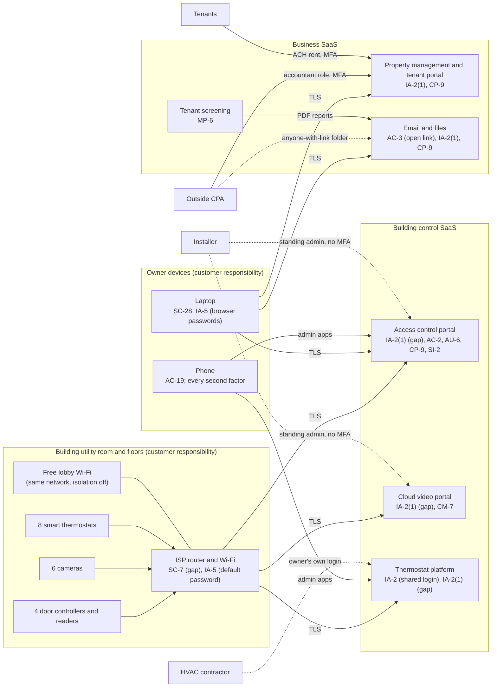

# SaaS Architecture and Control Placement: Cris Santos Company | Commercial Facilities | Sole Proprietorship

**Organization:** Cris Santos Company (owner-operator of one mixed-use commercial building) | **Tier:** Sole Proprietorship | **Provider:** SaaS only (no IaaS or PaaS)
**System:** Property Systems Profile (PSP), as defined in the system profile (P02)

## 1. Diagram
Control IDs on each node are the ones in `cloud-control-map.csv`. Dashed lines are access paths with no MFA, no named account, or no written terms.

## 2. Layers
| Layer | Components | Key controls | Responsibility |
|---|---|---|---|
| Identity | Administrator accounts in the access control, video, thermostat, property management, and email services; contractor access | IA-2, IA-2(1), AC-2, IA-5 | Customer configures; vendors provide MFA and roles |
| Data | Door schedules and credential lists, video, thermostat schedules, leases and ledgers, guarantor files, credit reports | AC-3, CP-9, MP-6 | Vendors protect data inside their services; the owner decides who can reach it, keeps copies, and deletes it on time |
| Endpoints | Laptop, phone | SC-28, IA-5, AC-19 | Customer |
| Network | ISP router, building devices, lobby Wi-Fi | SC-7, IA-5 | Customer (the ISP owns the hardware; the owner owns the settings) |
| Building devices (OT) | Door controllers, cameras, thermostats | SI-2 (vendor-pushed firmware), CM-7 (feature settings) | Shared: vendors patch; the owner controls the network they sit on and which features are on |
| Logging | Door events, admin changes, sign-in history | AU-2 (vendor), AU-6 (customer) | Shared: vendors record, owner reviews |
| SaaS applications and hosting | All vendor platforms | Inherited (platform security, availability, encryption at rest) | Provider |

## 3. Shared responsibility for SaaS, and what is different about cloud-managed building devices
All three major cloud providers' shared responsibility models (SRC-AWS-SRM, SRC-AZURE-SRM, SRC-GCP-SRM) agree on the SaaS split: the provider runs the application, the platform, and the facilities; **the customer always keeps its identities and accounts, its data, and its devices.** That is why 17 of the 20 rows in the control map are the owner's alone, 2 are shared, and 1 is the provider's.

Cloud-managed building devices add one twist. The door controllers, cameras, and thermostats are physical devices on the owner's network, but they take orders from the vendor cloud. Whoever controls the **cloud administrator account** controls the doors and the HVAC. The vendor's SOC 2 report (P09) covers the platform, not the owner's passwords. NIST SP 800-82 Rev. 3 treats these devices as operational technology: they belong on their own network segment, away from guest devices, and remote access to them should be limited and authenticated strongly. No IaaS provider equivalents table is needed, because the owner runs no infrastructure.

## 4. Findings from the mapping
1. **The building portals are the crown jewels, and they have the weakest sign-in.** Property management has enforced MFA; the access control, video, and thermostat portals have none, and their passwords are saved in the laptop browser. This is the path in the P08 scenario. Tracked as P01 R-001 and R-002.
2. **Two contractors hold more access than their jobs need.** The installer keeps permanent administrator accounts in two portals, and the HVAC contractor uses the owner's own thermostat login. Tracked as R-003 and R-007.
3. **Building devices share a network with the public.** The free lobby Wi-Fi, cameras, door controllers, and thermostats sit on one flat network behind a router with a factory-default password. Tracked as R-005.
4. **The owner's data has no copy the owner controls.** The vendors back up their platforms, but nobody has an export of the access control configuration or a backup of email and files. Tracked as R-011.
5. **Optional vendor features were on by default** (entrance audio and face recognition). Both were turned off on 2026-07-21. Tracked as R-010 and in P10.
