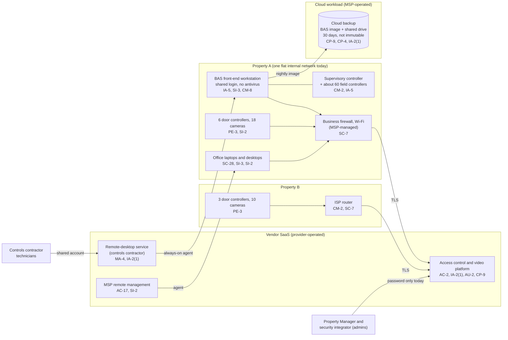

# Cloud Architecture and Control Placement: Cris Santos Company | Commercial Facilities | Micro

**Organization:** Cris Santos Company, LLC (commercial office and retail property owner-operator) | **Tier:** Micro | **Provider:** Vendor-agnostic SaaS (see section 3)
**System:** Building Automation and Access Control System (BAACS), as defined in the SSP (P02) | **Prepared:** 2026-07-31 by the Property Manager with the MSP lead technician and the Building Engineer | **Approved:** Managing Member, 2026-08-31

## 1. Diagram
The company runs no servers and no IaaS tenant. Its "cloud" is the access control and video platform, the remote-desktop service the controls contractor uses, the MSP's remote management platform, and one cloud workload the MSP operates for it: the cloud backup (SYS-08). Everything else in the building is on-premises OT that talks to those services.

## 2. Layers and who is responsible
| Layer | Components | Key controls | Customer (company) | MSP or contractor (on the company's behalf) | Provider (SaaS vendor) |
|---|---|---|---|---|---|
| Identity | Platform administrator and operator accounts; remote-desktop account; backup console; BAS workstation login | AC-2, IA-2(1), IA-5 | Decides who gets access; turns on MFA; removes the integrator's standing account | MSP holds the backup console login; contractor holds the shared remote-desktop account | Runs sign-in and MFA services |
| Network | Property A firewall and switches; Property B router | SC-7, CM-2 | Approves segmentation design; owns the Property B router | MSP configures the Property A firewall | Not applicable |
| OT devices | BAS workstation, supervisory controller, field controllers | IA-5, SI-2, SI-3, CM-8 | Inventory; approves patches with the contractor | Contractor maintains software and programs | Not applicable |
| Cloud-managed devices | Door controllers, readers, cameras | PE-2, PE-3, SI-2 | Credentials, schedules, feature choices | Integrator repairs hardware | Firmware, platform security, availability |
| SaaS applications | Access control and video platform | AC-3, AU-2, AU-6, CM-7 | Roles, log review, analytics settings | Not applicable | Application, platform, data centers |
| Data | Credential database, video, BAS image, controller programs | CP-9, CP-4, SC-28 | Decides retention and restore testing; gets controller program copies | MSP operates the backup; contractor holds programs | Encrypts and backs up its own platform |
| Vendor governance | SOC 2 review; contracts | SA-9, MA-4 | Reviews SOC 2; adds security terms | Not applicable | Provides SOC 2 report and incident notice |

**The MSP and the controls contractor are not cloud providers in the shared responsibility sense.** They do customer-side work for the company. Anything marked "Customer (performed by MSP)" in `cloud-control-map.csv` stays the company's responsibility: the company must direct the work, receive evidence, and check it (SA-9; CPG 1.E).

## 3. Service categories and provider equivalents
The design is vendor-agnostic. For SaaS, the split is the same in all three major cloud providers' published shared responsibility models: the provider runs the application, platform, and infrastructure; the customer keeps identities, access, data, and devices (SRC-AWS-SRM, SRC-AZURE-SRM, SRC-GCP-SRM in `00_universal-framework/sources/source-register.csv`). For the company's vendors, the SOC 2 report or vendor security documentation is the evidence for the provider side.

| Service category used | What it is here | Equivalent category in the large cloud providers (for reading their documentation) |
|---|---|---|
| Cloud physical security platform | Access control and video management with cloud-connected devices | Industry SaaS built on any provider (IoT device management plus video storage) |
| Remote access service | Brokered remote desktop to the BAS workstation | Remote access or privileged access SaaS |
| Remote monitoring and management | MSP device management | Device management SaaS |
| SaaS backup | Nightly image of the BAS workstation and copy of the shared drive | Backup service or third-party backup SaaS with object storage |

## 4. Findings from the mapping
1. **Every outside path into the building is single-factor.** The platform administrator accounts, the contractor's remote-desktop account, and the MSP backup console all accept a password alone (IA-2(1)). One stolen password unlocks doors, changes HVAC programs, or deletes the backups. Fix: MFA on all three by 2026-09-30 (POAM-002) and per-session approval for the contractor (POAM-003).
2. **The backup is not separate from what it protects (CP-9, CP-4).** The BAS image and the shared drive copy sit behind one MSP password, keep only 30 days, and have never been restored. Field controller programs are not backed up by the company at all. Fix: immutable 90-day retention, a copy of controller programs after every change, and a restore test by 2026-10-15 (POAM-007, POAM-008; P01 R-002).
3. **The flat network removes the cloud's protection (SC-7).** The platform and backup are well run by their vendors, but the BAS workstation, cameras, door controllers, and office computers share one network at Property A. Ransomware on a desktop can reach the BAS workstation directly. Fix: a building-device segment at each property (POAM-004; R-003).
4. **Vendor-side controls are evidenced; customer-side controls are the weak layer.** The platform vendor's SOC 2 report covers security and availability (P09). The gaps are all on the company's side: administrator MFA, credential removal, log review, and feature approval.
5. **New features arrive from the cloud without asking.** The face match trial was switched on in the platform in June 2026 by the integrator's request to the vendor, with no approval by the company (CM-7). P10 assesses it; POL-02 A.9 and POL-04 4.6 now require approval before any analytics feature is turned on.
