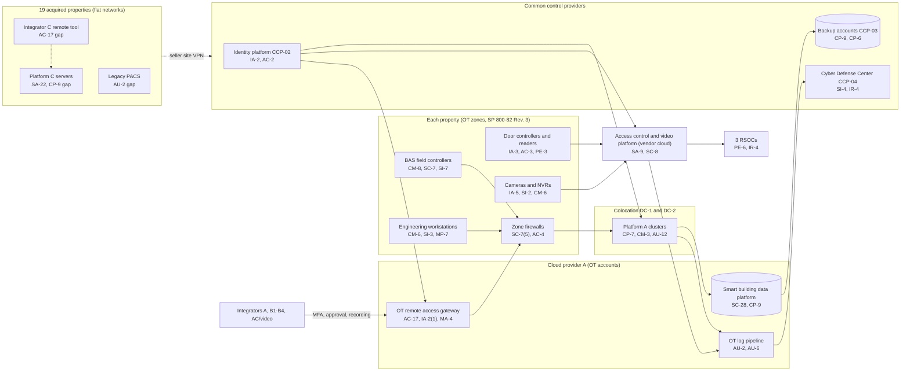

# System Security Plan: Building Automation and Access Control System (BAACS)

**Organization:** Cris Santos Company, Inc. (publicly traded office and retail REIT) | **Tier:** Enterprise | **Vertical:** Commercial Facilities
**Outline:** NIST SP 800-18 Rev. 2, System Security Plan Outline Example (June 2026) | **OT guidance:** NIST SP 800-82 Rev. 3 (September 2023) | **Version:** 3.0, 2026-09-10

## 1. System Name and Identifier
Building Automation and Access Control System (**BAACS**), identifier CSC-SYS-BAACS-001. Tier-1 system in the enterprise application inventory and the company's highest-value operational system. It comprises SYS-01 to SYS-03 and the OT portions of SYS-04, SYS-08, and SYS-09 in `../00_company-facts.md`.

## 2. System Overview
The BAACS runs the building functions tenants pay for at all 140 operated properties in 6 states: cooling, ventilation, lighting, and metering (the building automation system, BAS); doors, turnstiles, and credentials (the physical access control system, PACS); and video surveillance monitored around the clock from three Regional Security Operations Centers (RSOCs). It supports about 5,600 tenants, about 212,000 credential holders, the TRS service line SL-1 (50 managed properties), and the processes rated High in the BIA (P05): BP-01, BP-02, BP-04, BP-06, and (through the credential integration) BP-08.

Users: about 3,700 engineering and maintenance staff (BAS), about 4,900 security operations staff (PACS, video, RSOCs), the OT security team, 6 BAS integrators, 3 access control and video integrators, and guard contractor viewers. Tenant employees hold credentials but do not sign in to the system.

**Major components:**
| ID | Component | Hosting and service model |
|---|---|---|
| SYS-01 (Platform A) | 4 BAS supervisory server clusters (active-standby across DC-1 and DC-2), 110 engineering workstations, about 61,000 BACnet field controllers at 50 office towers and 14 mixed-use properties | Colocation and on-premises (OT) |
| SYS-01 (Platform B) | 57 site supervisory servers (virtual machines on site hosts), 64 engineering workstations, about 17,500 field controllers at 21 office parks and 36 retail centers | On-premises (OT) |
| SYS-01 (Platform C) | 19 site servers (physical PCs on an unsupported OS), 23 workstations, about 6,800 field controllers at the 19 acquired properties | On-premises (OT), seller platform |
| SYS-02 | Enterprise access control platform (cloud) with about 6,200 door controllers, 31,000 readers, and 540 turnstile lanes at 121 properties; legacy on-premises PACS (2 servers, about 640 door controllers) at the 19 acquired properties | Vendor SaaS plus on-premises (OT) |
| SYS-03 | About 41,000 cameras and 610 NVRs on the same vendor platform; 2,900 cameras and 48 NVRs on a legacy video system at the acquired properties; 3 RSOCs; video analytics AI-001 and AI-002 | On-premises plus vendor SaaS |
| SYS-04 (part) | OT zones and conduits, zone firewalls, SD-WAN edges at 140 properties | On-premises; SD-WAN managed service |
| SYS-08 (part) | Smart building data platform (BAS historian, energy analytics), OT remote access gateway, OT log pipeline, backup accounts (Cloud provider A); Platform A clusters (colocation) | Public cloud landing zone and colocation (P04) |
| SYS-09 (part) | 1,150 security console PCs; engineering workstations and about 2,600 engineering and security tablets | Company-managed |

SP 800-82 Rev. 3 names building automation systems and physical access control systems as operational technology (OT). This plan treats the BAACS as an OT system and uses SP 800-82 Rev. 3 guidance where IT practices do not fit. For example, field controllers are not actively scanned, and OT zones compensate for unencrypted BACnet traffic.

## 3. Laws, Regulations, and Policies Affecting the System
| ID | Requirement | Citation | How it affects the BAACS |
|---|---|---|---|
| C-COMMERCIAL-FACILITIES-R05 | CISA Cross-Sector Cybersecurity Performance Goals 2.0 (**voluntary**) | CISA CPG 2.0 (December 2025) | Adopted as the IT and OT baseline (2026-02); goal IDs cited in `control-implementation.csv` (P03) |
| C-COMMERCIAL-FACILITIES-R04 | SEC cybersecurity disclosure | Form 8-K Item 1.05; 17 CFR 229.106 | A portfolio-wide BAACS incident goes through the P08 materiality step; the BAACS program is described in the Item 106 disclosure |
| C-COMMERCIAL-FACILITIES-R03 | CCPA and the 2026 CPPA regulations | Cal. Civ. Code 1798.100(e), 1798.150; Cal. Code Regs. tit. 11, 7120-7124 (cybersecurity audit), 7150-7157 (risk assessments) | Credential records, access history, and video of California tenant employees and visitors are personal information; face templates (AI-002) would be sensitive personal information if used in California. The BAACS is in scope of the first cybersecurity audit (period 2027) |
| C-COMMERCIAL-FACILITIES-R02 | FTC Act Section 5 | 15 U.S.C. 45(a) | Statements to tenants and visitors about credential, video, and analytics data must be accurate, and security must be reasonable |
| State | State breach and data security laws | Each state where affected individuals reside (Florida worked example: Fla. Stat. 501.171(2), (3)-(6), (8)) | PACS and visitor data include personal information; face templates are treated as biometric data (P10) |
| C-COMMERCIAL-FACILITIES-R06 | CIRCIA (**proposed rule only**) | 6 U.S.C. 681b; proposed 6 CFR Part 226 | Not in effect. The company would be covered under the NPRM size criterion (proposed 226.2(a)), so logging and incident records are designed to support a 72-hour report (P03, P08) |
| Contract | Management agreements (SL-1); lease security and notice clauses | Amended 2026; 2023 lease template | SOC 2 Type 2 report on SL-1 services, including this system, by 2027-12-31 (P09); tenant notice after unauthorized access to tenant employee data (P08) |
| Guidance | NIST SP 800-82 Rev. 3 | Final, September 2023 | OT architecture (zones and conduits) and the OT overlay used to tailor this plan |
| Internal | POL-01 to POL-05, standards, and procedures | P06 | Policy basis for every control |

Not applicable to this system: **PCI DSS v4.0.1 (C-COMMERCIAL-FACILITIES-R01)**, because no account data enters the BAACS. Card payments use stand-alone P2PE terminals (SYS-10), outside this boundary (P03).

## 4. System Status
### 4.1 System Security Plan Approval
Prepared by the Director of OT Security and the GRC team. Reviewed by the CISO, the Senior Vice President, Engineering, and the Vice President, Corporate Security. Approved by the Chief Operating Officer on 2026-09-10, after the control assessment (P07) and the risk committee meeting the same day.
### 4.2 System Authorization Decision
The company is not a federal agency, so there is no formal authorization to operate. The equivalent internal decision:
- **Authorizing official equivalent:** Chief Operating Officer, on the CISO's recommendation. The Executive Vice President, Property Operations is the system owner.
- **Decision (2026-09-10):** continued operation with conditions, based on the Internal Audit assessment (P07) and the enterprise risk register (P01). The CEO and CFO approved the treatment plan for the Very High risk R-001 on 2026-09-08 (P01 section 7).
- **Conditions:**
  1. Integrator C's always-on remote-support tool is removed and its access moved to the OT gateway by 2026-11-30 (POAM-003).
  2. Interim access lists between the acquired properties and the shared services hub by 2026-10-31; full OT zones at the acquired properties by 2027-03-31 (POAM-004).
  3. Platform C backups and program escrow by 2026-12-31, and a Platform B restore within 12 hours by 2027-03-31 (POAM-008).
  4. The risk committee receives POA&M status each quarter; re-decision by 2027-09-30 or after a major change (for example, the Platform C migration or a new acquisition).
- **Reauthorization:** annually, or after a major change.
### 4.3 System Operational Status
Operational. Major modifications planned:
- Integrator C moved to the OT gateway (POAM-003), due 2026-11-30
- OT zones and SD-WAN at the acquired properties (POAM-004), due 2027-03-31
- Legacy PACS migration to the enterprise platform, due 2027-03-31
- OT log onboarding for Platform B, Platform C, and the legacy PACS, and passive OT monitoring at all properties (POAM-005), due 2027-06-30
- Platform C replaced by Platform B (acquired office parks and retail) and Platform A (acquired towers) (POAM-007), due 2027-06-30

## 5. Role Identification and Responsible Personnel
| Role | Title | Responsibility |
|---|---|---|
| System owner | Executive Vice President, Property Operations | Accountable for the BAACS; approves access roles and contingency plans |
| Authorizing official (equivalent) | Chief Operating Officer | Accepts residual risk to operate (Moderate and below; High and above go to the executive risk committee or the CEO and CFO, P01) |
| BAS owner | Senior Vice President, Engineering, with 3 Building Technology Directors | BAS configuration, integrator oversight, degraded-mode procedures |
| PACS, video, and RSOC owner | Vice President, Corporate Security | Credential administration, video, visitor management interface, RSOCs, guard contractors |
| Integration of acquired properties | Vice President, Integration Management Office | Platform C and legacy PACS migration |
| Information security | CISO; Director of OT Security; Director of Security Operations | Program oversight; OT security; 24x7 monitoring and incident response |
| Privacy | Chief Privacy Officer | CCPA and state privacy duties for credential, visitor, and video data |
| Common control providers | See section 10.3 | Operate inherited controls |
| Independent assessor | Chief Audit Executive (Internal Audit), with a co-sourced OT assessment firm | Annual assessment (P07) |
| BAS operators | Chief engineers (one per property) | Daily operation and hand control of plant equipment |

## 6. System Information Types and System Categorization
Information types were adapted from NIST SP 800-60 Vol. 2 Rev. 1 for a private company. Impact levels follow FIPS 199.

| Information type | Confidentiality | Integrity | Availability | Rationale |
|---|---|---|---|---|
| Facilities and equipment management (BAS setpoints, schedules, programs, building drawings) | Low | Moderate | Moderate | Tampering can stop cooling or damage equipment across a property or a region. Field controllers keep running and engineers can run plant equipment by hand, so loss is serious but not catastrophic (P05 BP-04 MTD 12 h, BP-05 MTD 24 h). Life-safety systems are separate |
| Physical security management (door schedules, credentials, access events, video, RSOC alarms) | Moderate | Moderate | Moderate | Credential or video disclosure harms tenant employees; a wrong door schedule leaves entrances unsecured. Cached credentials and officer posts limit availability impact (P05 BP-01 MTD 4 h, BP-02 MTD 8 h) |
| Personal identity and authentication (credential records and badge photos; visitor passes at the SYS-11 interface; mobile credential data from SYS-14; face templates for AI-002) | Moderate | Moderate | Low | Personal information under state breach laws and the CCPA; face templates and visitor ID numbers are treated as sensitive. Outage handled by paper logs and temporary cards |
| System and network monitoring (security logs, gateway recordings) | Moderate | Moderate | Low | Needed to investigate incidents, support notice and SEC decisions, and evidence the CPPA cybersecurity audit |
| **BAACS category (high-water mark)** | **Moderate** | **Moderate** | **Moderate** | |

**Integrity was considered for High.** A malicious BAS program change could damage chillers or overheat occupied floors across many properties at once, and a door schedule change could unlock entrances. The risk committee kept integrity at Moderate on 2026-09-10 because field controllers enforce equipment safety limits locally, life-safety systems are separate with hardwired egress release, chief engineers can take local hand control, and the energy optimization write path (AI-004) has a kill switch and controller-enforced limits. To compensate, the plan adds integrity tailoring (section 10.1). If the Platform B change-control weakness (POAM-010) is not closed by 2027-06-30, the CISO will recommend reconsidering High integrity for Platform B.

## 7. Authorization Boundary Description
**Inside the boundary:**
- BAS Platforms A, B, and C (supervisory servers and clusters, engineering workstations, about 85,300 field controllers);
- the enterprise access control platform tenant configuration, about 6,840 door controllers (enterprise and legacy), about 31,000 readers, and 540 turnstile lanes; the 2 legacy PACS servers;
- about 43,900 cameras and 658 NVRs, the company's video platform configuration, and the 3 RSOCs' console PCs;
- the OT zones and the zone firewalls and SD-WAN edges that enforce them;
- in Cloud provider A: the smart building data platform, the OT remote access gateway, the OT log pipeline, and their backup accounts;
- engineering workstations and the engineering and security tablets.

**Outside the boundary (common control providers and interconnected systems):**
- landing zone services (network hub, key management, log archive, backup accounts, standby region): CCP-03;
- the identity platform (SYS-05): CCP-02;
- the Cyber Defense Center, SIEM, EDR, and scanners: CCP-04;
- the access control and video platform vendor's cloud infrastructure (inherited through its SOC 2 Type 2 report);
- visitor management (SYS-11), the tenant experience platform (SYS-14), the energy optimization service (AI-004), the parking operators' systems (AI-003), the integrators' own networks, and the MSSP platform;
- the life-safety systems (SYS-13).

**Outside (not connected):** the P2PE card terminals (SYS-10) and corporate SaaS other than those listed.

**Life-safety design rule.** Fire alarm panels, elevator controls, and emergency voice communication stay on separate vendor-maintained networks. The BAS reads fire alarm status only through hardwired, read-only relay points, and door releases for egress are hardwired to the fire alarm. No change may create a network path from the BAACS to a life-safety system (PL-8). P01 R-043 tracks the risk that an integrator breaks this rule during a project.

The enterprise multi-cloud diagram is in P04 `cloud-architecture.md`.

## 8. Information Exchanges Summary
| Connected system / party | Direction | Data | Agreement |
|---|---|---|---|
| Access control and video platform (vendor cloud) | Bidirectional (door controllers and NVRs to cloud over TLS) | Credentials, door events, schedules, video clips, analytics alerts | SaaS agreement; vendor SOC 2 Type 2 (P09); **recovery commitment 8 h against a 2 h BIA need (POAM-011)** |
| Identity platform (SYS-05) | Inbound authentication | Administrator sign-in to Platform A, the platform console, the OT gateway, and cloud workloads | Internal (CCP-02) |
| Visitor management (SYS-11) | Outbound visitor passes to turnstiles | Visitor name, host, pass validity | SaaS agreement with retention terms (enterprise tenant) |
| Tenant experience platform (SYS-14) | Bidirectional (mobile credential issuance and revocation) | Credential identifiers, user names | Internal interface specification; platform vendor integration agreement |
| Energy optimization service (AI-004) | Inbound setpoint writes to Platform A at 40 towers; outbound trend data | Setpoints, temperatures, run status | Service agreement; **no written interconnection terms for the write path (POAM-011)** |
| Smart building data platform (SYS-08) | Outbound trend data from the BAS | Temperatures, run status, energy meters | Internal |
| BAS Integrators A and B1 to B4; access control and video integrators | Inbound remote support through the OT gateway | Device and program configuration | Service agreements with the security addendum; named accounts, MFA, recording |
| BAS Integrator C | Inbound remote support through its own always-on tool | Full control of the 19 Platform C servers | Inherited seller contract; **no security terms, shared account, no MFA (POAM-003, POAM-011)** |
| Guard contractors | Inbound video viewing through the vendor cloud console | Live and recorded video | Guard services agreements; named viewing accounts |
| Parking operators (AI-003) | Inbound LPR event exports on request | Plate reads, times, locations | Garage management agreements; **data use and retention terms missing in 1 of 3 (POAM-011)** |
| MSSP | Outbound logs; inbound response actions on console PCs | Security logs | MSSP contract; SOC 2 Type 2 |
| Life-safety systems (SYS-13) | Inbound only, hardwired relay points | Fire alarm status | Design rule (section 7) |

## 9. System Component Inventory
| Component | Type | Location / provider | Owner |
|---|---|---|---|
| Platform A supervisory clusters (4) | Virtual machine clusters | DC-1 (Florida) and DC-2 (Texas) | Senior Vice President, Engineering |
| Platform A engineering workstations (110) | Endpoint | 64 properties | Building Technology Directors |
| Platform B site servers (57) and workstations (64; 31 on an unsupported OS) | Virtual machines and endpoints | 57 properties | Building Technology Directors |
| Platform C site servers (19) and workstations (23) | Physical PCs (unsupported OS) | 19 acquired properties | Vice President, Integration Management Office |
| BACnet field controllers (about 85,300) | OT device | All properties | Senior Vice President, Engineering |
| Access control platform tenant | SaaS | Platform vendor | Vice President, Corporate Security |
| Door controllers (about 6,840), readers (about 31,000), turnstile lanes (540) | OT device | All properties | Vice President, Corporate Security |
| Legacy PACS servers (2) | On-premises servers | 2 acquired properties (Texas) | Vice President, Integration Management Office |
| Cameras (about 43,900) and NVRs (658) | OT device | All properties | Vice President, Corporate Security |
| Security console PCs (1,150) | Endpoint | 3 RSOCs and 70 lobby desks | Vice President, Corporate Security |
| Engineering and security tablets (about 2,600) | Mobile device | All properties | Senior Vice President, Engineering; Vice President, Corporate Security |
| Zone firewalls, SD-WAN edges, OT switches | Network | All properties | Director of Network Engineering |
| OT remote access gateway, OT log pipeline | Cloud services | Cloud provider A (shared services accounts) | Director of OT Security |
| Smart building data platform | Virtual machines and managed database | Cloud provider A (workload account) | Senior Vice President, Engineering |
| Backup accounts | Backup service, write-once | Cloud provider A (second region); offline copy in DC-2 | Director of Cloud Platform Engineering |

The device-level OT inventory is about 82% complete. Completing it is POAM-006 (CM-8), due 2027-03-31.

## 10. Control Implementation Details
### 10.1 Control implementation status
**Baseline and tailoring.** The BAACS uses the NIST SP 800-53B **Moderate** baseline (287 controls and enhancements), tailored with the SP 800-82 Rev. 3 OT overlay.
- **Documented here: 155 controls** in `control-implementation.csv`: 152 from the Moderate baseline and 3 program controls (PM-1, PM-2, PM-9) selected by tailoring because the CPG 2.0 governance goals (1.A, 1.B) and the Item 106 disclosure depend on them. The documented set covers every control the CPG 2.0 goals reference for this system, every control behind a Moderate-or-higher risk in P01, the controls the SL-1 SOC 2 commitment relies on (P09), and the components of a cybersecurity program listed in 11 CCR 7123(c).
- **Integrity tailoring:** CM-3, CM-3(2), CM-4, CM-5, SI-7, and SI-7(1) statements cover BAS program and door schedule changes; PL-8 records the life-safety design rule.
- **Compensating controls for OT limits:** BACnet traffic is not encrypted, so OT zones (AC-4, SC-7) compensate for SC-8 inside zones (accepted risk R-048). Platform C hosts cannot run EDR, so isolation and replacement (SA-22) compensate for SI-3 until 2027-06-30.
- **Inherited without separate statements:** the other Moderate-baseline controls, mostly control enhancements and the physical and environmental controls of the colocation, cloud, and SaaS data centers (for example PE-9 to PE-17), are fully inherited from the common control catalog (section 10.3) or from the platform vendor, cloud providers, and colocation providers, evidenced by their SOC 2 Type 2 reports (P09 evidence map). Developer controls such as SA-11 apply to the tenant experience platform (SL-2), not to the BAACS, because the company does not develop BAS or PACS software.
- **CSF 2.0 mapping:** taken from `00_universal-framework/crosswalks/csf2_to_sp800-53r5.csv` (the base control's row for enhancements). For 17 controls with no row in that file (for example AC-8, MA-4, PS-4), the CSF subcategories are an author mapping.

**Status of the 155 documented controls:**
| Status | Count |
|---|---|
| Implemented | 99 |
| Partially implemented | 55 |
| Planned | 1 |
| **Total** | **155** |

**Inheritance of the 155 documented controls:**
| Inheritance | Count |
|---|---|
| Common/Inherited (fully inherited from a common control provider or the platform vendor) | 78 |
| Hybrid (shared between a provider and the BAACS team) | 51 |
| System-specific | 26 |

The Planned control is SR-11 (firmware hash verification before installation). The Partially implemented statements trace to the 9 targeted gaps in `../00_company-facts.md` section 4 and to the P07 findings. The pattern is consistent: controls operate at Platform A and the enterprise PACS, and are missing or partial at the acquired properties, for Platform B logging and recovery, and for third-party commitments.

### 10.2 Control assessment status
Internal Audit, with a co-sourced OT assessment firm for the OT standard areas, assessed 44 of these controls from 2026-07-13 to 2026-08-28 using SP 800-53A Rev. 5 procedures and statistical sampling (P07 `assessment-plan.md`, `assessment-results.csv`). Testing found weaknesses that were not known before, including default passwords on 7 of 60 sampled OT devices (P01 R-014). Weaknesses are tracked in P07 `poam.csv` and reported quarterly to the risk committee.

### 10.3 Common control providers and inheritance
Common and hybrid controls are inherited from the enterprise platform. Each provider publishes its controls in the enterprise **common control catalog** (maintained by the GRC team in the GRC platform) and is assessed on its own cycle; the BAACS inherits the results.

| Provider | Name | Accountable role | Controls provided | Rows in this plan | Evidence of operation |
|---|---|---|---|---|---|
| CCP-01 | Enterprise GRC program | CISO (with the Chief Risk Officer and Chief Audit Executive for assessment) | Policies and standards (P06), risk methodology, assessment, POA&M, continuous monitoring | 18 | Annual Internal Audit assessment (P07); GRC platform |
| CCP-02 | Identity platform (SYS-05) | Director of Identity and Access Management | Single sign-on, MFA, PAM, identity governance, account lifecycle | 17 | SOX IT general control testing; P07 AC-2, IA-2 results |
| CCP-03 | Cloud landing zones and colocation (SYS-08) | Director of Cloud Platform Engineering | Account guardrails, key management, encryption, backups, log archive, standby region, colocation | 11 | Posture reports; provider and colocation SOC 2 Type 2 reports |
| CCP-04 | Cyber Defense Center | Director of Security Operations | 24x7 monitoring, SIEM, EDR, incident response, threat intelligence | 18 | Monitoring metrics; P07 SI-4, IR results |
| CCP-05 | Enterprise and property networks (SYS-04) | Director of Network Engineering | SD-WAN, zone firewalls, wireless, transport encryption | 9 | Firewall rule reviews; P07 SC-7 results |
| CCP-06 | Endpoint engineering (SYS-09) | Director of Endpoint Engineering | Workstation and console PC baselines, EDR agents, device control, MDM | 6 | Configuration compliance reports |
| CCP-07 | Corporate security and facilities | Vice President, Corporate Security | Physical access to engineering rooms, data rooms, RSOCs, OT closets; media destruction | 6 | Access reviews; walkthroughs |
| CCP-08 | Human resources and training | Chief Human Resources Officer | Screening, terminations, training, rules of behavior, sanctions | 12 | HR and learning system reports |
| CCP-09 | Third-party risk management | Director of Third-Party Risk Management | Vendor tiering, contract security terms, SOC report reviews, supply chain risk management | 10 | Vendor register; SOC report reviews |
| CCP-10 | OT security program | Director of OT Security | OT remote access gateway, OT monitoring, OT vulnerability management, OT inventory, OT standards | 17 | Gateway records; OT metrics; P07 AC-17, CM-8, RA-5 results |
| Vendor | Access control and video platform vendor | Vice President, Corporate Security (vendor owner) | Cloud service controls for AC-3, AC-12, SC-5, SC-8, SC-28 | 5 | Vendor SOC 2 Type 2 (reviewed under P09) |

**Inheritance rules:**
- A Common/Inherited control is fully inherited; the BAACS team verifies only that the system is onboarded (for example, gateway enrollment and log forwarding).
- A Hybrid control names both parts in the implementation statement: the provider's part and the BAACS team's part.
- If a provider's assessment finds a weakness, the finding is linked to every inheriting system's POA&M. Example: POAM-001 (local OT accounts outside identity governance) is a CCP-02 and CCP-08 weakness that affects the BAACS at Platform B and C properties.

## 11. Digital Identity Acceptance Statement
- **Workforce users and administrators.** Sign-in through the identity platform with push MFA with number matching; privileged users use phishing-resistant security keys through PAM. This is comparable to NIST SP 800-63 AAL2 for users and AAL3-like protection for privileged users.
- **BAS local accounts.** Platform B and C software does not fully support the identity platform. Until the migration (POAM-007), Platform B access uses named local accounts reachable only through the OT gateway, which enforces MFA; Platform C still uses shared local accounts (POAM-001, POAM-003).
- **Integrators.** Named accounts with MFA through the OT gateway, with per-session approval by the chief engineer on duty, except Integrator C (POAM-003).
- **Tenant employees.** They hold physical cards or mobile credentials only and do not sign in to the system. Each tenant's designated administrator authorizes issuance (PE-2). Mobile credential users authenticate to the tenant experience platform, outside this boundary.

## 12. Referenced Artifacts
Scenario facts (`../00_company-facts.md`); BIA and dependency map (P05); multi-cloud architecture and control map (P04); enterprise risk register (P01); regulatory gap analysis (P03); policy hierarchy and policies (P06); Internal Audit assessment and POA&M (P07); ransomware runbook and notification matrix (P08); SOC 2 readiness for SL-1 and SL-2 (P09); AI portfolio including AI-001, AI-002, and AI-004 (P10); BAACS contingency plan v3; OT architecture document; enterprise common control catalog.

## 13. Acronym List and Glossary
- **BAACS:** Building Automation and Access Control System
- **BACnet:** a standard communication protocol for building automation devices
- **BAS:** building automation system
- **CCP:** common control provider
- **CPG:** CISA Cross-Sector Cybersecurity Performance Goals
- **NVR:** network video recorder
- **OT:** operational technology
- **PACS:** physical access control system
- **PAM:** privileged access management
- **POA&M:** plan of action and milestones
- **RSOC:** Regional Security Operations Center
- **TRS:** taxable REIT subsidiary (Cris Santos Building Services)

## 14. System Security Plan Review and Change Records
| Version | Date | Change | Author |
|---|---|---|---|
| 1.0 | 2024-09-20 | Initial plan for Platform A and the enterprise PACS | Director of OT Security |
| 2.0 | 2025-12-15 | Added the acquired properties (Platform C, legacy PACS) after the November 2025 acquisition | Director of OT Security |
| 3.0 | 2026-09-10 | Common control provider mapping; 2026 assessment results; CPPA audit scope | Director of OT Security with the GRC team |

Next review: 2027-09-10, or sooner after the Platform C migration, the legacy PACS migration, or an acquisition.
