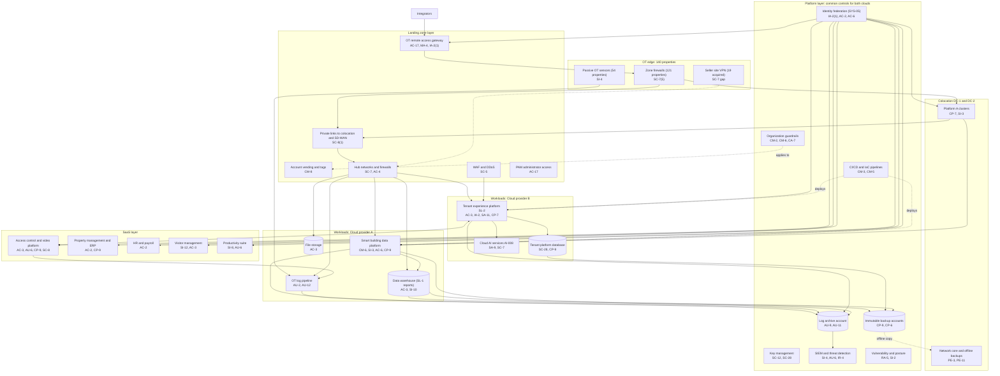

# Cloud Architecture and Control Placement: Cris Santos Company | Commercial Facilities | Enterprise

**Organization:** Cris Santos Company, Inc. (publicly traded office and retail REIT) | **Tier:** Enterprise | **Provider:** Multi-cloud, vendor-agnostic: two public cloud providers (called Cloud provider A and Cloud provider B), two colocation data centers (DC-1 Florida, DC-2 Texas), SaaS, and the OT edge at 140 properties (see section 4)
**Owner:** Director of Cloud Platform Engineering, with the CISO and the Director of OT Security | **Date:** 2026-08-31 | **Related:** BAACS SSP (P02), enterprise BIA (P05)

## 1. Architecture in layers
The estate is organized in layers. Each lower layer provides **common controls** that the layers above inherit, so a workload team configures only what is specific to its system. The OT edge is shown as its own layer because the building systems connect to the clouds and colocation through it.

| Layer | What it is | Examples | Who runs it |
|---|---|---|---|
| **Platform** | Organization-wide services in both clouds | Organization guardrails, identity federation, key management, log archive, SIEM and threat detection, vulnerability and posture management, immutable backup accounts, CI/CD pipelines | Cloud Platform Engineering; Cyber Defense Center; Identity team |
| **Landing zone** | The standard account (subscription or project) pattern every workload lands in | Account vending with mandatory tags, hub-and-spoke networks with cloud firewalls, separate OT spokes, private links to colocation and the SD-WAN, WAF and DDoS protection, PAM, and the OT remote access gateway in a shared services account | Cloud Platform Engineering; Network Engineering; OT security team |
| **Workload** | Systems built or run by the company | Cloud A: smart building data platform (BAS historian and energy analytics), OT log pipeline, data warehouse, file storage. Cloud B: tenant experience platform (SL-2) and its database, cloud AI services for the virtual assistant (AI-008) | Application teams (for example, the Vice President, Digital Products) |
| **SaaS** | Vendor-operated applications | Access control and video platform, property management and ERP, HR and payroll, visitor management, productivity suite | Vendors, with the company's configuration and oversight |
| **Colocation** | Company equipment in two colocation data centers | Platform A supervisory clusters, network core, offline backup copies | Colocation providers (facility); company (equipment) |
| **OT edge** | Property networks | SD-WAN edges and zone firewalls at 140 properties, passive OT sensors at 54, and the seller site VPN at the 19 acquired properties | Network Engineering; OT security team |

## 2. Diagram

## 3. Responsibility by service model
Sources: SRC-AWS-SRM, SRC-AZURE-SRM, and SRC-GCP-SRM in `00_universal-framework/sources/source-register.csv`. The three published models agree on the split used here, so the design does not depend on which two providers the company uses.

| Service model | Provider | Company (customer) | Shared |
|---|---|---|---|
| IaaS (historian and analytics virtual machines, OT gateway, hub firewalls) | Facilities, hosts, hypervisor, physical network | Guest OS, applications, identities, data, network policy | Encryption (provider service, customer keys), logging |
| PaaS (managed databases, containers, AI services, backup service) | Also the platform runtime and its patching | Data, access, configuration, keys, application code | Backups, availability configuration |
| SaaS (access control and video platform, ERP, payroll, visitor management) | Also the application | Users, roles, data, retention settings, oversight of the vendor | Audit review (complementary user entity controls) |
| Colocation | Building, power, cooling, perimeter | Racks, equipment, cage access lists | None |
| OT edge (company-operated) | None | Everything, under the SD-WAN managed service contract for transport | None |

## 4. Service categories and provider equivalents
| Service category | AWS | Microsoft Azure | Google Cloud |
|---|---|---|---|
| Organization guardrails | AWS Organizations service control policies | Azure Policy with management groups | Organization Policy Service |
| Account vending | AWS Control Tower account factory | Azure landing zone subscription vending | Resource Manager project creation |
| Key management | AWS KMS | Azure Key Vault | Cloud KMS |
| Audit logging | AWS CloudTrail | Azure Monitor activity log | Cloud Audit Logs |
| Threat detection | Amazon GuardDuty | Microsoft Defender for Cloud | Security Command Center |
| Managed relational database | Amazon RDS | Azure SQL Database | Cloud SQL |
| Managed containers | Amazon EKS | Azure Kubernetes Service | Google Kubernetes Engine |
| Web application firewall | AWS WAF | Azure Web Application Firewall | Cloud Armor |
| Backup service | AWS Backup | Azure Backup | Backup and DR Service |

This table is for reading provider documentation only. The architecture, control map, and SSP describe service categories.

## 5. Common controls
`cloud-control-map.csv` has **65 rows** across 33 components: Platform 21, Landing zone 9, Workload 17, SaaS 11, Colocation 4, OT edge 3. Responsibility: Customer 45, Shared 14, Provider 6.

**32 rows are published as common controls** (`common_control` = Yes) in the enterprise common control catalog. They map to the common control providers in the BAACS SSP (P02 section 10.3): identity (CCP-02), cloud landing zones and colocation (CCP-03), the Cyber Defense Center (CCP-04), networks (CCP-05), and the OT security program (CCP-10, for the OT remote access gateway and passive sensors). A workload inherits them by being deployed through account vending, which applies the guardrails, logging, network, key, and backup policies automatically.

**Rules for inheriting:**
1. A workload may claim a common control only if its account was created by account vending and passes the posture baseline.
2. Customer-side identity, data protection, and logging stay explicit at every layer: even a SaaS application has Customer rows for access (AC-2, AC-3, AU-6), because those are always the company's responsibility.
3. SaaS rows cite the vendor's SOC 2 report, reviewed by the third-party risk team (P09 evidence map). Where the report lists complementary user entity controls, the company's part is a Customer row.
4. An OT zone inherits the OT gateway and passive monitoring only after the property is cut over to the zone and conduit design; the 19 acquired properties inherit neither today.

## 6. Validation against the BAACS SSP (P02)
Every BAACS component in the SSP boundary that sits in the cloud, colocation, or the OT edge appears here with controls from each required family, directly or inherited:
| BAACS component | AC | AU | CM | IA | SC | SI |
|---|---|---|---|---|---|---|
| OT remote access gateway | AC-17 | AU-9 (inherited) | CM-2 (inherited) | IA-2(1) | SC-7 (inherited) | SI-4 (inherited) |
| Smart building data platform | AC-6 | AU-11 (inherited) | CM-6 | IA-2(1) (inherited) | SC-28 (inherited) | SI-3 |
| OT log pipeline | AC-2 (inherited) | AU-2, AU-12 | CM-3 (inherited) | IA-2(1) (inherited) | SC-8(1) (inherited) | SI-4 (inherited) |
| Platform A clusters (colocation) | AC-6 (inherited) | AU-6 (inherited) | CM-2 (P02) | IA-2(1) (inherited) | SC-8(1) (inherited) | SI-3 |
| Access control and video platform (SaaS) | AC-3 | AU-6 | CM-6 (P02) | IA-2(1) (inherited) | SC-8 | SI-4 (inherited) |
| Property OT edge | AC-4 (inherited) | AU-2 (P02) | CM-7 (P02) | IA-3 (P02) | SC-7(5) | SI-4 |

## 7. Findings from the mapping
1. **The acquired properties bypass the landing zone.** The 19 acquired properties connect over the seller site VPN straight to the shared services hub, bypassing the SD-WAN, the zone firewalls, and the OT gateway. P07 reached a Platform C server from a corporate VLAN at an acquired property (SC-7). Fix: interim access lists by 2026-10-31, then OT zones and SD-WAN (POAM-004).
2. **OT logging coverage stops at Platform A.** The platform logs every cloud account, but the OT log pipeline has no sources yet for Platform B, Platform C, or the legacy PACS, and passive sensors cover 54 of 140 properties (POAM-005).
3. **Two clouds, one control set.** Guardrails, logging, and key policies are written once as code and applied to both clouds. Differences are limited to service names (section 4).
4. **The platform vendor is SaaS with no architectural fallback.** Its recovery commitment (8 hours) does not meet the BIA need (2 hours) for credential administration; concentration has to be handled by contract, procedure, and an exit plan, not architecture (POAM-011).
5. **Processing integrity for SL-1 is a workload responsibility.** No platform service can confirm that owner reports and submeter bills are complete and accurate; the data warehouse checks (SI-10) are the company's (P09 PI1.3).
6. **AI services** run under the cloud provider's terms with no training on customer data and private endpoints only. The AI governance committee reviews each new model deployment (P10).
