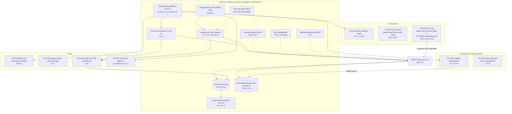
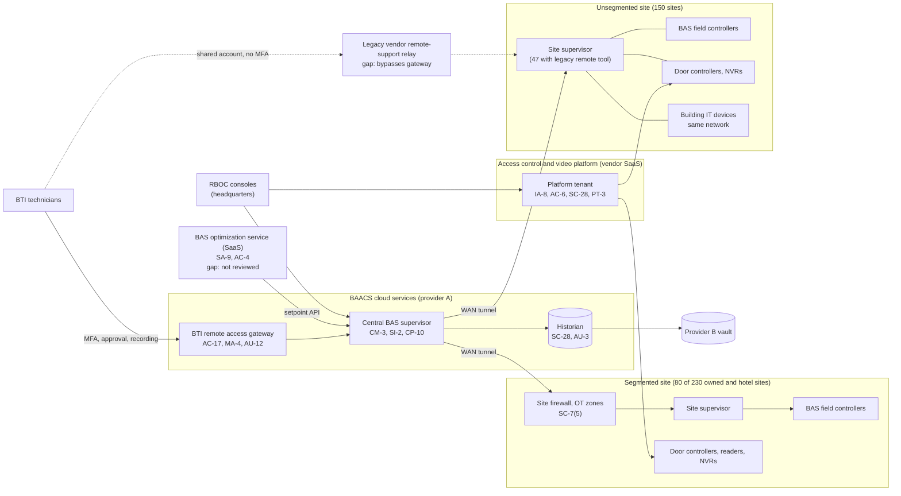

# Cloud Architecture and Control Placement: Cris Santos Company Holdings | Commercial Facilities | Multi-Sector

**Organization:** Cris Santos Company Holdings, Inc. | **Tier:** Multi-Sector | **Providers:** two public cloud providers, called provider A and provider B (vendor-agnostic; see section 6), plus a government-community cloud offering for the Construction CUI enclave
**Scope:** the shared corporate cloud platform (SYS-G3 landing zone), the cloud-hosted parts of the BAACS (the SSP system, P02), the on-premises OT those cloud services supervise, and the division workloads and SaaS services that connect to them.

## 1. Design in one paragraph
Corporate runs one **landing zone** per provider: identity federation from SYS-G1, a hub network, guardrail policies, a central log archive, key management, EDR, and an immutable backup vault in provider B. Divisions get their own **accounts** inside the landing zone and inherit these guardrails. Provider A hosts the hub, the **BAACS central BAS supervisor and historian**, the **BTI remote access gateway**, and the Hotels loyalty and guest CRM. The WAN connects every property, hotel, and managed building to the hub, so site supervisors reach the central supervisor over encrypted tunnels. Three things sit outside the landing zone: the **access control and video platform** (vendor SaaS), the **Construction CUI enclave** (a FedRAMP Moderate authorized government-community cloud offering, deliberately separate), and the **BTI tools** (a legacy Construction account in provider A created in 2020, which is not deliberate and is the main finding of this mapping).

## 2. Diagrams
### 2.1 Group landing zone and division workloads

The CUI enclave has no connection to SYS-G1 or the hub on purpose: it uses its own identity domain, and CUI may leave it only through its transfer gateway.

### 2.2 BAACS (SSP boundary) and the building sites

**Target state (POAM-006, POAM-007, POAM-009, POAM-018):** every legacy remote tool removed and all integrator access through the gateway; OT zones with deny-by-default rules at every owned property and hotel; every site's configuration and controller programs backed up to the provider B vault after each change; the BTI tools moved into a landing-zone account with guardrails, with OT credentials held in the group vault; a standby central supervisor in provider B.

## 3. Tenancy and identity decision
- **Decision.** All three divisions sign in through the group identity platform, SYS-G1, and get their own accounts inside the landing zone.
- **One deliberate separate tenant.** The Construction CUI enclave (SYS-D4) is a FedRAMP Moderate authorized government-community offering with its own identity domain. It has no connection to SYS-G1 or the hub, and CUI leaves it only through its transfer gateway.
- **Why.** Covered defense information in an external cloud must meet FedRAMP Moderate equivalency (DFARS 252.204-7012(b)(2)(ii)(D)). Everything else shares SYS-G1 so group internal audit can assess it once.
- **What limits blast radius.** Phishing-resistant MFA for BAACS administrators and just-in-time PAM elevation with session recording. Federated roles per division account, with no long-lived cloud keys in the landing zone. Access control platform roles are set by region and property.
- **Known gaps.** The BTI tools (SYS-D5) sit in a 2020 Construction account outside the landing zone, with local administrator accounts (GR-02, POAM-018). BTI technician accounts are synchronized from the Construction directory without end dates (POAM-001). The access control platform still has 40 enterprise-wide administrators (GR-06).
- **Cross-division risks:** GR-01, GR-02, GR-07, GR-17 in [risk-register.csv](../step-04_P01_risk-register/risk-register.csv).

## 4. Common versus division-specific controls
`cloud-control-map.csv` has 50 rows across 25 components. The `control_scope` column shows who owns each placement:

| Scope | Rows | What it means |
|---|---|---|
| Common (group) | 22 | Provided once by corporate (SYS-G1, SYS-G2, SYS-G3) and inherited by every division account. Listed in the P02 common control catalog |
| Shared system (BAACS) | 14 | Controls of the shared corporate system documented in the P02 SSP, including the vendor platform tenant and the optimization service |
| Division-specific (Commercial Property) | 3 | Property management and visitor management SaaS |
| Division-specific (Construction) | 7 | Project delivery SaaS, the CUI enclave, and the BTI tools |
| Division-specific (Hotels) | 4 | PMS, booking engine, loyalty, and the hotel CDE |

| Responsibility | Rows |
|---|---|
| Customer (the group or a division) | 39 |
| Shared (provider and group) | 7 |
| Provider | 4 |

**Rule of thumb.** Identity, network guardrails, logging, keys, backups, and EDR are **common**. A division cannot opt out of them, only request an exception through POL-01. Application behavior and customer-facing identity are **division-specific**, because they depend on each division's regulators and customers. The BTI tools are the exception that proves the rule: they serve the whole group but were built as a division asset, so none of the common controls reach them.

## 5. Layers
| Layer | Common components | Division and BAACS components | Key controls | Responsibility |
|---|---|---|---|---|
| Identity | SYS-G1, cloud IAM | Platform tenant administrators, PMS staff, loyalty members, enclave identity | AC-2, AC-3, AC-6(5), IA-2(1), IA-8 | Customer (configuration); vendor (service) |
| Network | Hub, WAN tunnels | BTI gateway, site OT zones, hotel CDE segments | SC-7, SC-7(5), SC-8(1), AC-17, AC-4 | Customer; provider DDoS protection shared |
| Compute | EDR, guardrails | Central supervisor, BTI tools | CM-3, CM-6, SI-2, SI-3, CP-10 | Customer (guest OS, BAS software) |
| Data | Keys, backup vault | Historian, platform data, BTI repository | SC-12, SC-28, CP-9, CP-6, SI-12, PT-3 | Shared: provider encrypts; group owns keys, retention, and purpose |
| Logging and monitoring | Log archive, SIEM | Gateway recordings, historian change records | AU-3, AU-6, AU-9, AU-11, AU-12, SI-4 | Shared: services generate logs; group retains and reviews |
| SaaS dependencies | Identity and SIEM vendors | Access control platform, optimization service, PMS, project platform, enclave | SA-9, IA-8, SI-7 | Provider for the service; customer for use and oversight |
| Physical | Provider data centers | Building sites (P02 PE controls) | PE-3, MP-6 | Provider for data centers; group for buildings |

**On-premises OT is not "cloud," but it is placed here on purpose.** The cloud supervisor is only as safe as the sites it connects to, and the sites are only as safe as the remote path into them. Showing both in one map is what makes the legacy remote tool visible as a bypass of every common control.

## 6. Service categories and provider equivalents
The design does not depend on a provider. This table gives each provider's name for each service category, for reading its shared responsibility documentation.

| Service category | AWS | Microsoft Azure | Google Cloud |
|---|---|---|---|
| Account structure and guardrails | AWS Organizations with service control policies | Management groups with Azure Policy | Resource hierarchy with Organization Policy |
| Virtual machines (central supervisor, gateway) | Amazon EC2 | Azure Virtual Machines | Compute Engine |
| Managed database (historian) | Amazon RDS | Azure SQL Database | Cloud SQL |
| Key management | AWS KMS | Azure Key Vault | Cloud KMS |
| Audit logging | AWS CloudTrail | Azure Monitor activity log | Cloud Audit Logs |
| Backup with immutability | AWS Backup (vault lock) | Azure Backup (immutable vault) | Backup and DR Service |
| Site-to-cloud connectivity | AWS Site-to-Site VPN / Direct Connect | Azure VPN Gateway / ExpressRoute | Cloud VPN / Cloud Interconnect |
| Government-community cloud (enclave) | AWS GovCloud (US) | Azure Government | Assured Workloads |

Shared responsibility sources: SRC-AWS-SRM, SRC-AZURE-SRM, SRC-GCP-SRM in `00_universal-framework/sources/source-register.csv`. All three agree on the split used here: for IaaS the provider owns facilities, hosts, and virtualization; for PaaS the provider also owns the runtime; for SaaS the provider owns the application. The customer always keeps identities, access decisions, data classification, and data. The enclave row is listed only so readers can find the equivalent category; which offering the Construction division uses is not material to this sample.

## 7. Findings from the mapping
1. **The BTI tools are a hole in the landing zone.** SYS-D5 holds programs and credentials for every group building, yet it sits in a 2020 Construction account with no guardrails, local administrator accounts, and snapshots in the same account. Its management endpoint was public until 2026-08. Any common control the group relies on (guardrails, EDR coverage, immutable backup, SIEM) does not reach it (P01 GR-02; POAM-018).
2. **The legacy remote tools bypass the gateway.** At 47 sites, integrator sessions reach site supervisors through vendor relay services, outside the hub, the gateway, MFA, and recording (AC-17; POAM-006). This is the entry path used in the P08 scenario.
3. **Segmentation decides blast radius.** Where OT zones exist (80 of 230 owned and hotel sites), a compromise of building IT cannot reach controllers. Where they do not, malware on any building PC can reach site supervisors and door controllers (SC-7; POAM-007).
4. **A SaaS service writes setpoints.** The BAS optimization service has an API path into the central supervisor and was enabled without vendor review. The API is limited to RBOC-defined setpoint ranges, which is a good compensating control, but the provider has given no security assurance (SA-9; P10; POAM-023).
5. **The enclave separation is deliberate and sound.** CUI belongs in SYS-D4 only. The P07 finding that CUI drawings reached the BTI repository is a process failure at the boundary, not a design flaw of the enclave (AC-20; POAM-017).
6. **Common controls are strong and reused.** One identity platform, one SIEM, one backup design. This is what lets group internal audit assess them once (P07).
