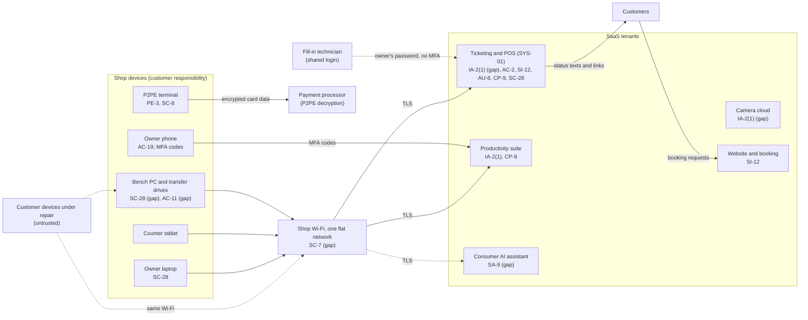

# SaaS Architecture and Control Placement: Cris Santos Company | Other Services | Sole Proprietorship

**Organization:** Cris Santos Company (electronics and device repair service) | **Tier:** Sole Proprietorship | **Provider:** SaaS only (no IaaS or PaaS)
**System:** Service Ticketing and Point-of-Sale System (STPS), as defined in the system profile (P02) | **Prepared:** 2026-07-20 with the independent security consultant; adopted 2026-08-31

## 1. Diagram
Control IDs on each node are the ones in `cloud-control-map.csv`. Dashed lines are flows with a gap (no agreement, no MFA, or no separation).

## 2. Layers
| Layer | Components | Key controls | Responsibility |
|---|---|---|---|
| Identity | SYS-01, suite, accounting, bank, processor, camera, website, and AI accounts | IA-2(1), AC-2, IA-5 | Customer configures; vendors provide MFA |
| Data | Tickets and notes, files, booking entries, AI chats, transfer and recovery copies | SI-12, SC-28, CP-9, SA-9 | Vendors protect data inside their services; the owner decides what is typed, kept, and deleted |
| Endpoints | Laptop, bench PC and drives, tablet, phone, terminal (physical) | SC-28, AC-11, AC-19, PE-3 | Customer |
| Network | Provider router and Wi-Fi | SC-7 | Customer (provider supplies the equipment) |
| Logging | SYS-01 activity log, suite and processor sign-in histories | AU-2 (vendor), AU-6 (customer) | Shared: vendors record, the owner reviews |
| SaaS applications and hosting | All SaaS platforms; P2PE decryption environment | Inherited (AC-3, AU-2, CP-9, SC-28 inside the services) | Provider |

## 3. Shared responsibility for SaaS
All three major cloud providers' shared responsibility models (SRC-AWS-SRM, SRC-AZURE-SRM, SRC-GCP-SRM) agree on the SaaS split: the provider runs the application, the platform, and the facilities; **the customer always keeps its identities and accounts, its data, and its devices.** That is why 14 of the 18 rows in the control map are the owner's alone. No IaaS provider equivalents table is needed, because the shop runs no infrastructure.

**P2PE is the strongest inherited control in the system.** Card data is encrypted inside the terminal and decrypted only by the solution provider, so the shop never holds readable card data electronically. That benefit is lost the moment a card number is typed into a ticket note or written on paper with its security code (P03, PCI DSS rows).

## 4. Findings from the mapping
1. **The most sensitive data in SYS-01 is put there by the owner.** The vendor encrypts and backs up the tenant, but passcodes and account passwords in free-text notes are a customer-side data decision. No vendor control fixes it. Tracked as P01 R-001.
2. **MFA is off on the one account that holds 5,600 customer records**, because the login is shared. Fixing the sharing (a named fill-in account) is what makes MFA possible. Tracked as R-001 and R-004.
3. **Customer devices are untrusted endpoints on the shop network.** Infected phones and laptops under repair join the same Wi-Fi as the bench PC and the card terminal. The provider router already supports a separate guest network (found during this mapping); a third network for the bench is planned. Tracked as R-003.
4. **The bench PC is outside every vendor's protection.** It holds the largest store of customer content in the business (about 1.6 TB) with no password and no encryption. Tracked as R-002.
5. **The camera vendor and the AI vendor hold customer data on consumer terms.** The bench camera can record device screens, and AI chats have included ticket notes. Tracked as R-013 and R-009.
