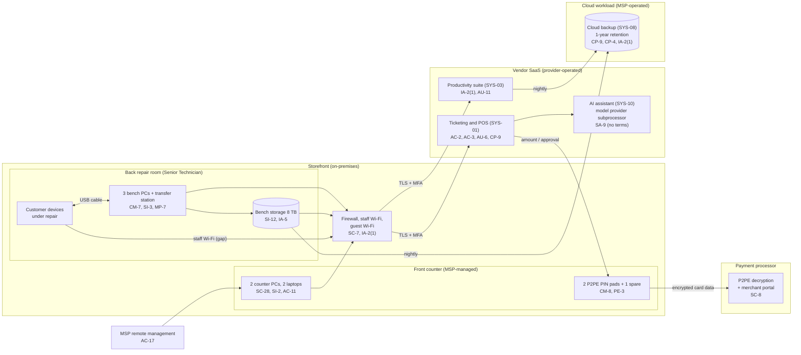

# Cloud Architecture and Control Placement: Cris Santos Company | Other Services | Micro

**Organization:** Cris Santos Company, LLC (independent electronics and device repair shop) | **Tier:** Micro | **Provider:** Vendor-agnostic SaaS (see section 3)
**System:** Service Ticketing and Point-of-Sale System (STPS), as defined in the SSP (P02) | **Prepared:** 2026-07-31 by the Shop Manager with the MSP lead technician | **Approved:** Owner, 2026-08-31

## 1. Diagram
The shop runs no servers and no IaaS tenant. Its "cloud" is a set of SaaS services, the payment processor's P2PE service, and one cloud workload that the MSP operates for it: the cloud backup (SYS-08). Control IDs in the boxes are the main controls placed at each point; `cloud-control-map.csv` has all 32 rows.

## 2. Layers and who is responsible
| Layer | Components | Key controls | Customer (the shop) | MSP (on the shop's behalf) | Provider (SaaS vendor or processor) |
|---|---|---|---|---|---|
| Identity | SYS-01, suite, merchant portal, backup console, firewall, bench storage | AC-2, IA-2(1), IA-5 | Decides who gets access; replaces the shared Counter login; removes leavers | Creates and disables suite accounts; holds the backup and firewall admin logins | Runs sign-in and MFA |
| Network | Firewall, Wi-Fi, internet line | SC-7, AC-18 | Approves changes; decides where customer devices connect | Configures, patches, and monitors | Not applicable |
| Endpoints | 2 counter PCs, 2 laptops | SC-28, SI-2, SI-3, AC-11 | Approves exceptions; keeps the inventory | Encryption, antivirus, patching, screen lock | Not applicable |
| Bench | 4 bench workstations, bench storage, customer devices | CM-7, MP-7, SI-3, SI-12 | **Everything today (Senior Technician), with no standard** | Nothing today; to take over patching, EDR, and images (P01 R-020) | Not applicable |
| SaaS applications | SYS-01, AI assistant, suite | AC-3, AC-6, AU-2 | Users, roles, which fields hold what, AI assistant settings | Suite administration on request | Application, platform, data centers |
| Payments | P2PE terminals and processor | SC-8, CM-8, PE-3 | Terminal custody, list, inspections, training; no card data anywhere else | None | Encryption, decryption, keys, terminal supply |
| Data | Ticket notes, bench storage, backup copies | CP-9, CP-4, SI-12 | Decides retention, purges, and restore testing | Operates the backup and runs restore tests | Backs up its own platform |
| Logging | SYS-01 audit log, suite logs, firewall logs | AU-2, AU-6, AU-11 | **Reviews logs monthly (gap today)** | Keeps firewall logs | Generates and stores logs |
| Vendor governance | Contracts, SOC 2 review, PCI status of the processor | SA-9 | Keeps the vendor list; signs terms; reviews reports yearly | Discloses its own subcontractors | Provides SOC 2 report, PCI attestation, P2PE listing |

**The MSP is not a cloud provider in the shared responsibility sense.** It performs customer-side duties for the shop. Anything marked "Customer (performed by MSP)" in `cloud-control-map.csv` remains the shop's responsibility under Fla. Stat. 501.171(2) and the merchant agreement. The shop must direct the work, receive evidence, and check it (SA-9).

**The processor is a provider for card data only.** The P2PE solution takes card data out of the shop's systems, which is why the shop can use SAQ P2PE. The shop keeps the duties in the P2PE Instruction Manual: a terminal list, inspections, training, and keeping card numbers out of every other place.

## 3. Service categories and provider equivalents
The design is vendor-agnostic. The shared responsibility split for SaaS is the same in all three major cloud providers' models: the provider runs the application, platform, and infrastructure; the customer keeps identities, access, data, and devices (SRC-AWS-SRM, SRC-AZURE-SRM, SRC-GCP-SRM in `00_universal-framework/sources/source-register.csv`). For the shop's vendors, the SOC 2 report, PCI attestation, or vendor security documentation is the evidence of the provider side.

| Service category used | What it is here | Equivalent category in the large cloud providers (for reading their documentation) |
|---|---|---|
| Line-of-business SaaS | Repair-shop ticketing and POS with a built-in AI assistant | Industry SaaS built on any provider; the AI assistant resembles a managed generative AI service |
| Payment service | P2PE terminals and processing | Not offered by cloud providers; payment processors only |
| Productivity suite | Email, calendar, file storage | Productivity and collaboration SaaS |
| SaaS backup | Nightly backup of the suite and the bench storage | Backup service or third-party SaaS backup |
| Remote monitoring and management | MSP endpoint management | Device management SaaS |

## 4. Findings from the mapping
1. **Customer data's riskiest home is not in the cloud.** The SaaS layers are evidenced and strong. The bench storage, the bench PCs, and the ticket note field are all on the customer side, and none has an owner with a written standard. Fixes: retention and purge (SI-12; P01 R-004), MSP management of bench equipment (R-020), and the restricted passcode field (R-002).
2. **The backup keeps customer data longer than the shop does (SI-12, CP-9).** The bench storage is backed up nightly with 1-year retention, so deleting a finished job's files on the bench storage does not delete them for a year. Fix: exclude the bench storage from the backup except for open jobs, or cut its retention to 30 days, by 2026-11-30. Tracked as P01 R-004 and P07 POAM-011.
3. **MSP-held administrator logins have no MFA (IA-2(1)).** The backup console and the firewall management login use passwords only. An attacker with one MSP password could delete the backups. Fix: MFA on both by 2026-09-30 (POAM-003).
4. **Customer devices share the staff network (SC-7).** An infected customer phone or laptop on the staff Wi-Fi can reach the counter PCs and the bench storage. Fix: a separate network for customer devices and bench equipment by 2026-12-31 (R-006).
5. **The AI assistant sends customer messages and ticket notes to a model provider the shop has no contract with (SA-9).** It is mapped here only to show the gap. P10 sets its conditions.
6. **The processor's controls protect the shop only if the shop keeps its PIM duties (CM-8, PE-3).** No terminal list, no inspections, and card numbers in ticket notes put SAQ P2PE eligibility at risk (R-008, R-009).
