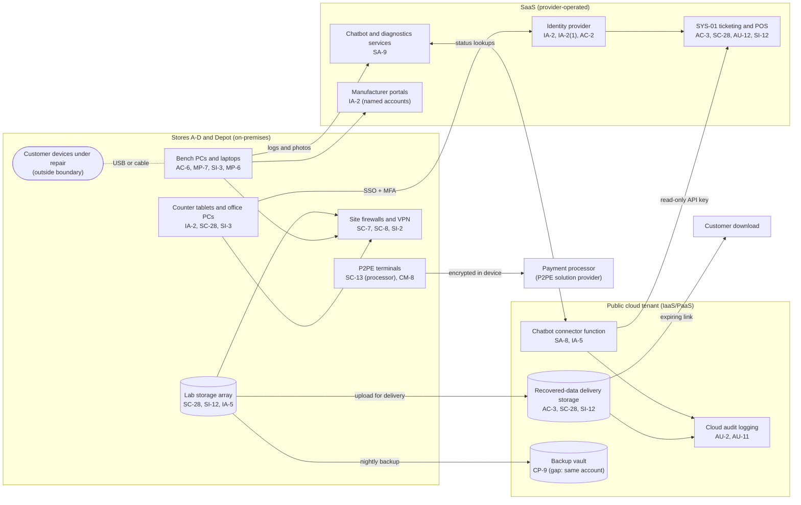

# Cloud Architecture and Control Placement: Cris Santos Company | Other Services | Small

**Organization:** Cris Santos Company, LLC (electronics and device repair service) | **Tier:** Small | **Provider:** Vendor-agnostic (see section 3)
**System:** Service Ticketing and Point-of-Sale Platform (STPP), as defined in the SSP (P02) | **Prepared:** IT Manager, 2026-08-21 | **Approved:** General Manager, 2026-09-04

## 1. Diagram

**The flat network problem.** In the diagram, counter tablets, bench PCs, and customer devices all reach the firewall on one network per store. That is today's state (P01 R-008). The planned state puts bench PCs and customer devices on their own VLAN with no route to counter tablets, office PCs, or the lab.

## 2. Layers
| Layer | Components | Key controls | Responsibility |
|---|---|---|---|
| Identity | Identity provider, cloud IAM roles, SYS-01 roles, manufacturer portal accounts | AC-2, AC-6, IA-2, IA-2(1), IA-5 | Customer (accounts, roles, MFA); provider (service) |
| Network / edge | Site firewalls, site-to-site VPN, guest Wi-Fi | SC-7, SC-8, SI-2 | Customer |
| Compute | Bench PCs, office PCs, counter tablets, connector function | AC-6, MP-7, SI-3, SA-8 | Customer (endpoints; function code and secrets); provider (function runtime) |
| Data | SYS-01 database, delivery storage, lab storage, backup vault | SC-28, SI-12, CP-9, CP-4, AC-3 | Shared: providers encrypt their storage; the company decides what is stored, for how long, and who can reach it |
| Logging / monitoring | SYS-01 audit log, identity provider sign-ins, cloud audit logs | AU-2, AU-6, AU-11, AU-12 | Shared: providers generate; the company retains and reviews |
| SaaS applications | SYS-01, chatbot, diagnostics, manufacturer portals | AC-3, SA-9 | Provider (application and infrastructure); customer (users, roles, data, contract terms) |
| Payment | P2PE terminals and processor | SC-13, CM-8 | Provider (encryption and keys); customer (terminal custody, inspection, PIM controls) |
| Physical / hypervisor | Provider data centers | PE family | Provider (inherited) |

## 3. Service categories and provider equivalents
The design is independent of the provider. This table gives each provider's name for each service category, to use when reading its shared responsibility documentation.

| Service category | AWS | Microsoft Azure | Google Cloud |
|---|---|---|---|
| Object storage (delivery) | Amazon S3 | Azure Blob Storage | Cloud Storage |
| Serverless function (connector) | AWS Lambda | Azure Functions | Cloud Run functions |
| Backup service | AWS Backup | Azure Backup | Backup and DR Service |
| Identity and access management | AWS IAM | Azure role-based access control with Microsoft Entra ID | Cloud IAM |
| Key and secret management | AWS KMS and Secrets Manager | Azure Key Vault | Cloud KMS and Secret Manager |
| Audit logging | AWS CloudTrail | Azure Monitor activity log | Cloud Audit Logs |

Shared responsibility sources: SRC-AWS-SRM, SRC-AZURE-SRM, SRC-GCP-SRM in `00_universal-framework/sources/source-register.csv`. All three models agree on the split used here:
- **IaaS:** the provider owns facilities, hosts, and virtualization; the customer owns configuration, identities, network rules, and data.
- **PaaS (the connector function):** the provider also owns the runtime; the customer owns the code, its permissions, and its secrets.
- **SaaS:** the provider owns the application; the customer keeps identities, access, data, and retention choices.

## 4. Findings from the mapping
1. **The SaaS provider encrypts data the company should not hold at all (SC-28, SI-12).** SYS-01 encrypts its database, so a stolen disk at the vendor would not expose passcodes. But every SYS-01 user can read them, and a phished counter login can export them. Encryption at rest is the vendor's job; **deciding not to keep account passwords, and purging passcodes at release, is the company's.** Tracked as P01 R-002 and POAM-001.
2. **Backup isolation (CP-9).** The backup vault shares the account and administrator roles with the delivery storage. An attacker with those roles could delete both the lab's backups and the delivered data. Fix: separate backup account with immutable retention. Tracked as P01 R-014 and POAM-004.
3. **Retention belongs in the storage configuration (SI-12).** The delivery storage and the lab storage have no lifecycle rules. A 30-day deletion rule after delivery (POL-04 4.6) should be enforced by object lifecycle policy, not by memory.
4. **The connector function is small but privileged (SA-8, IA-5).** Its API key can read ticket status for all customers. It was scoped to status fields only (confirmed), but the key sits in function settings and has never been rotated. Move it to secret management and rotate quarterly.
5. **Inherited controls rely on vendor reports.** Controls marked Provider or Shared for SYS-01 depend on the vendor's SOC 2 Type 2 report, reviewed in P09. That report lists controls the company must run itself (for example, reviewing exports), which are open gaps today.
6. **Every component has a control row.** All components in the diagram appear in `cloud-control-map.csv` (37 rows), except customer devices and customer downloads, which are outside the boundary.
