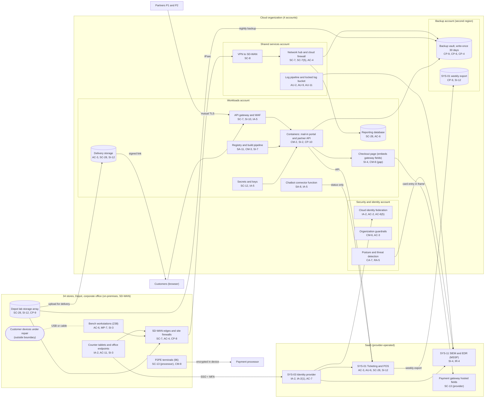

# Cloud Architecture and Control Placement: Cris Santos Company | Other Services | Mid-Market

**Organization:** Cris Santos Company, Inc. (regional electronics and device repair chain) | **Tier:** Mid-Market | **Provider:** Vendor-agnostic public cloud (see section 4), plus SaaS
**System:** Service Ticketing and Point-of-Sale Platform (STPP), as defined in the SSP (P02) | **Prepared:** 2026-07-31 by the Security Manager with the Digital Engineering Manager; updated 2026-09-17 with P07 results
**Control map:** `cloud-control-map.csv` (56 rows, 21 components)

## 1. Diagram

**Two things the diagram shows that matter most.** First, the checkout page sits in the company's own container platform, so although card data is typed only into the gateway's frame, the page around the frame is the company's responsibility, and today nothing watches it for injected scripts (finding 1). Second, at the 12 older stores, counter tablets, bench PCs, and customer devices all reach the SD-WAN edge on one network (P01 R-007). At the other 22 stores and the Depot, bench PCs and customer devices sit on their own VLAN with no route to counter, office, or lab networks.

## 2. Landing zone design
The landing zone separates duties across 4 accounts (subscriptions or projects, depending on the provider) under one cloud organization.

| Account | Purpose | Who administers | Key design decisions |
|---|---|---|---|
| **Security and identity** | Organization root, cloud identity federation to SYS-03, organization guardrails, posture and threat detection | Security Manager and one security analyst | No workloads. Root credentials sealed. Guardrails apply to every other account and cannot be disabled from them |
| **Shared services** | Network hub, cloud firewall, VPN to the SD-WAN, DNS, log pipeline and locked log bucket | IT Director's infrastructure team | All traffic between sites, workloads, and the internet passes the hub. Logs from all accounts land in a write-once bucket here |
| **Workloads** | Mail-in portal and checkout page, partner integration API, API gateway and WAF, delivery storage, chatbot connector, reporting database, secrets and keys, registry and build pipeline | Digital engineering team (applications); infrastructure team (network and platform) | Separate subnets per workload; partner traffic only through the gateway with mutual TLS; company-managed keys |
| **Backup** | Backup vault with 30-day write-once retention in a second region; SYS-01 weekly export | 2 named backup administrators | Separate administrator credentials, not federated to everyday accounts. Backups are written by a cross-account role that can write but not delete |

## 3. Layers and shared responsibility per service
| Layer | Components | Key controls | Service model | Responsibility |
|---|---|---|---|---|
| Identity | Cloud federation, guardrails, secrets, partner certificates, SYS-03 | IA-2, IA-2(1), AC-2, AC-6(5), IA-5, AC-7 | PaaS / SaaS | Company configures identities, roles, MFA, keys, and reviews; providers run the services |
| Network | Hub, cloud firewall, VPN, API gateway and WAF | SC-7, SC-7(5), AC-4, SC-8, SI-10 | IaaS / PaaS | Company designs routes, rules, and allowlists; providers run the gateways |
| Compute | Container platform, checkout page, connector function, build pipeline | CM-2, CM-3, SI-2, SI-4, SA-8, SA-11, SI-7, CP-10 | PaaS | Company owns code, images, and page content; provider patches the managed platform |
| Data | Delivery storage, reporting database, backup vault, SYS-01 export | SC-28, SC-12, AC-3, SI-12, CP-9, CP-6, CP-4 | IaaS / PaaS | Shared: providers encrypt and operate storage; the company controls keys, access, retention, isolation, and restore testing |
| Logging and monitoring | Log pipeline, posture service, SIEM | AU-2, AU-9, AU-11, CA-7, RA-5, SI-4, IR-4 | PaaS / SaaS | Shared: providers generate logs and detections; the company enables, retains, forwards, and acts on them; the MSSP monitors |
| SaaS applications | SYS-01, SYS-03, SIEM, payment gateway and P2PE | AC-3, AU-6, CP-9, SI-12, SC-13, CM-8 | SaaS | Providers run the application; the company keeps users, roles, audit review, data choices, and terminal custody |
| Physical | Provider data centers | PE-3 | All | Provider (inherited, evidenced by SOC 2 reports) |

**Responsibility counts in `cloud-control-map.csv`:** 34 Customer, 16 Shared, 6 Provider. By service model: 33 PaaS, 13 SaaS, 10 IaaS rows. On-premises components (lab storage array, bench workstations, store networks, terminals) are covered in the SSP control statements (P02); they appear in the diagram to show the data flows into the cloud.

## 4. Service categories and provider equivalents
The design is independent of the provider. This table gives each provider's name for the service category, for reading its shared responsibility documentation (SRC-AWS-SRM, SRC-AZURE-SRM, SRC-GCP-SRM in `00_universal-framework/sources/source-register.csv`).

| Service category | AWS | Microsoft Azure | Google Cloud |
|---|---|---|---|
| Multi-account organization and guardrails | AWS Organizations, service control policies | Management groups, Azure Policy | Resource Manager folders, organization policies |
| Account, subscription, or project | Account | Subscription | Project |
| Cloud identity federation | IAM Identity Center | Microsoft Entra ID with Azure RBAC | Cloud Identity with IAM |
| Network hub and cloud firewall | Transit Gateway, AWS Network Firewall | Virtual WAN hub, Azure Firewall | Network Connectivity Center, Cloud NGFW |
| Site-to-cloud VPN | Site-to-Site VPN | VPN Gateway | Cloud VPN |
| Managed containers | Amazon EKS or ECS | Azure Kubernetes Service or Container Apps | Google Kubernetes Engine or Cloud Run |
| API gateway and web application firewall | Amazon API Gateway, AWS WAF | Azure API Management, Azure Web Application Firewall | Apigee or API Gateway, Cloud Armor |
| Object storage with write-once retention | S3 with Object Lock | Blob Storage with immutability policies | Cloud Storage with bucket lock |
| Serverless function | AWS Lambda | Azure Functions | Cloud Run functions |
| Managed database | Amazon RDS | Azure SQL Database | Cloud SQL |
| Backup service | AWS Backup (vault lock) | Azure Backup (immutable vault) | Backup and DR Service |
| Key and secret management | AWS KMS, Secrets Manager | Azure Key Vault | Cloud KMS, Secret Manager |
| Container registry and build pipeline | Amazon ECR, AWS CodePipeline | Azure Container Registry, Azure Pipelines | Artifact Registry, Cloud Build |
| Audit logging | CloudTrail | Azure Monitor activity log | Cloud Audit Logs |
| Posture and threat detection | Security Hub, GuardDuty | Microsoft Defender for Cloud | Security Command Center |

**Service model split used here (all three providers agree):**
- **IaaS** (networks, object storage): the provider owns facilities, hosts, and virtualization. The company owns configuration, identities, network rules, and data.
- **PaaS** (containers, gateway, database, functions, backup, key service): the provider also owns the platform software and its patching. The company owns code, access, keys, data, and configuration.
- **SaaS** (SYS-01, identity provider, SIEM, payment gateway): the provider also owns the application. The company keeps identities, roles, audit review, data choices, and, for payments, everything outside the provider's frame or terminal.

## 5. Findings from the mapping
1. **The checkout page is the company's PCI exposure, not the gateway's.** The gateway encrypts card data inside its frame (Provider, SC-13). The page around the frame is built and hosted by the company. P07 captured 14 third-party scripts on it, 3 of them unexplained, with no inventory or change detection (CM-8, SI-4). An injected script could overlay a fake payment form. Until the company can show the page is protected, it cannot confirm the SAQ A eligibility criterion that its site is not susceptible to script attacks, and PCI DSS v4.0.1 6.4.3 and 11.6.1 still apply to the page under the standard itself. Fix: script inventory and authorization, a content security policy, and change detection by 2026-11-30 (P01 R-004; POAM-012).
2. **The partner API is well designed but not recoverable on demand.** Mutual TLS, per-partner keys, schema validation, and object-level authorization (added after the 2026-05 penetration test) are strong. The service can be rebuilt from images and infrastructure code, but nobody has done it, and the partners expect acknowledgement within 4 business hours (P05 BP-05). Fix: recovery test in an isolated account by 2027-01-31 (POAM-007).
3. **Backups are isolated, but they keep data that should be gone.** The backup account is the strongest design element: separate credentials, second region, write-once. It also holds about 27 TB of recovered data past retention and the legacy passcode notes inside the weekly SYS-01 export. Fix: purge at the source first, and let 30-day write-once retention age the copies out (POAM-004, POAM-015).
4. **Build secrets and security testing sit outside the controls the landing zone gives.** Application secrets are in the secrets service, but pipeline secrets are in pipeline variables, and the pipeline runs no static, dependency, or secret scanning (SA-11, IA-5). Fix: move pipeline secrets to the secrets service with short-lived credentials, and add scanning gates by 2027-03-31 (POAM-008).
5. **Logging gaps sit in the workloads account and SaaS.** Cloud control-plane logs are complete and locked. Application logs from the portal and API, and SYS-01 export events, are not in the SIEM (gap 8). Fix: forward them and alert on bulk exports by 2027-01-31 (POAM-003).
6. **Boundary check.** Every in-scope cloud and SaaS component in the SSP (P02 section 9) appears in the diagram and has at least one row in the control map. Each account has controls from at least 2 of the AC, AU, CM, IA, SC, and SI families or inherits them. Controls marked Provider or Shared for SYS-01, the identity provider, the cloud provider, the MSSP, and the payment providers depend on their SOC 2 Type 2 reports or PCI DSS AOCs, reviewed each year in P09 `vendor-soc2-review.csv`.
