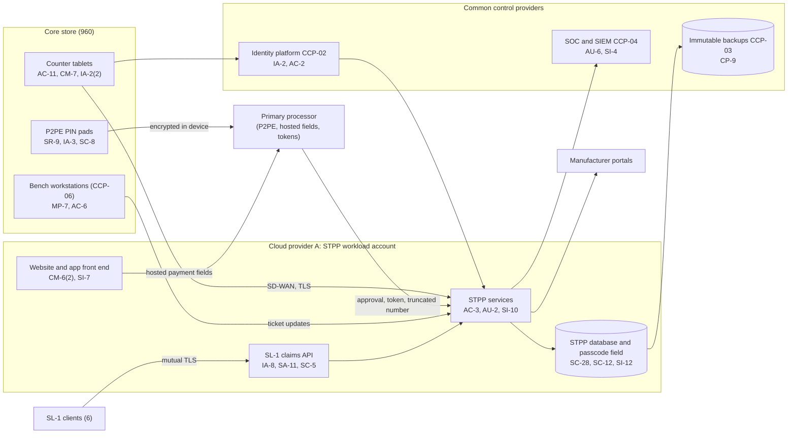

# System Security Plan: Service Ticketing and Point-of-Sale Platform (STPP)

**Organization:** Cris Santos Company, Inc. (publicly traded national electronics and device repair chain) | **Tier:** Enterprise | **Vertical:** Other Services (except Public Administration)
**Outline:** NIST SP 800-18 Rev. 2, System Security Plan Outline Example (June 2026) | **Version:** 2.0, 2026-09-14

## 1. System Name and Identifier
Service Ticketing and Point-of-Sale Platform (**STPP**), identifier CSC-SYS-STPP-001. Tier-1 system in the enterprise application inventory.

## 2. System Overview
The STPP runs every step of a repair for the 960 core stores, the three depots, the website and app, and the SL-1 claims service line: intake and consent, the ticket and its restricted passcode field, parts, repair status, payment, device release, customer notifications, and the claims API used by 4 protection plan administrators and 2 wireless carriers. It holds about 31 million customer records and handles about 37,000 tickets a day.

**Why confidentiality matters most.** The STPP is where the company learns what it needs to open a customer's device: the passcode, and sometimes account details for activation lock. A bulk export of tickets, or a technician reading passcodes for devices not assigned to them, exposes customers' accounts and everything on their phones. The STPP does not store full card numbers by design: card data is encrypted inside P2PE PIN pads and the hosted payment fields, and the STPP receives tokens and truncated numbers only.

**Major components:**
- STPP application services (company-built) on managed containers in a dedicated workload account of Cloud provider A
- STPP database on the provider's managed relational database service, with a field-level encrypted passcode field
- Website and mobile app front end, with the processor's hosted payment fields and mobile SDK for deposits and mail-in payments
- SL-1 claims API behind the landing zone API gateway and web application firewall
- Store POS clients: about 4,300 counter tablets in a locked kiosk profile at 960 core stores
- About 3,100 P2PE PIN pads from the primary processor's PCI-listed P2PE solution (processor-owned solution, company-held devices)

**Users:** about 9,800 workforce accounts (store staff, depot staff, contact center, claims operations, support), about 6.4 million customer app accounts, and 6 SL-1 client API integrations.

**Not in this plan:** the 160 AC stores. They run the AC legacy stack (SYS-13) until conversion (wave 1 by 2026-12-15, wave 2 by 2027-03-31) and are covered by the enterprise risk register (P01), the gap analysis (P03), and POA&M items POAM-001, POAM-002, and POAM-004. Each AC store joins this boundary when it converts.

## 3. Laws, Regulations, and Policies Affecting the System
| ID | Requirement | Citation | How it affects the STPP |
|---|---|---|---|
| N81-R01 | FTC Act Section 5 | 15 U.S.C. 45(a), 45(n) | Privacy and security statements at intake must be true; unreasonable handling of passcodes and device data can be unfair |
| N81-R02 | State breach notification and data security laws | Each state where affected individuals reside (Florida worked example: Fla. Stat. 501.171(2)-(6), (8)) | Reasonable security; breach notice for email and password pairs and other personal information; disposal of customer records |
| N81-R03 | PCI DSS v4.0.1 (contractual) | Merchant agreement; annual ROC by a QSA | The STPP integrates with the P2PE solution and the hosted payment fields; its servers are connected to the payment flow and the payment pages are in scope (6.4.3, 11.6.1) |
| N81-R04 | FTC Disposal Rule | 16 CFR 682.3 | Background check reports on STPP users (via HR, not stored in the STPP) |
| SEC | Cybersecurity disclosure | Form 8-K Item 1.05; 17 CFR 229.106 | A material STPP incident goes through the P08 materiality step |
| CCPA | California Consumer Privacy Act and CPPA regulations | Cal. Civ. Code 1798.100 and following; 11 CCR 7120-7124 | About 3.6 million California customer records; the STPP is in scope for the first cybersecurity audit (period starting 2027-01-01) |
| FACTA | Receipt truncation | 15 U.S.C. 1681c(g) | Printed and emailed receipts show no more than the last 5 digits and no expiration date |
| Contract | SL-1 client agreements; SOC 2 Type 2 | P09 | API availability, confidentiality, and processing integrity commitments |
| Contract | Manufacturer A, B, and C program agreements | Fictional terms | Named accounts, customer data access limits, 24-hour incident notice |
| N81-BM | NIST CSF 2.0; NIST SP 800-88 Rev. 2 | NIST CSWP 29; SP 800-88r2 | Voluntary benchmark; sanitization of retired STPP media |
| Internal | POL-01 to POL-05 and standards | P06 | Enterprise policy hierarchy |

Not applicable to the STPP: N81-R05 (COPPA: not directed to children; accounts require age 18) and N81-R06 (HIPAA: the STPP does not hold ePHI; the business associate duties apply to SL-2 devices handled at the depots, P03).

## 4. System Status
### 4.1 System Security Plan Approval
Prepared by the STPP Engineering Manager and the GRC team. Reviewed by the CISO, the Vice President, Payments, and the Chief Privacy Officer. Approved by the Chief Operating Officer on 2026-09-14.
### 4.2 System Authorization Decision
The company is not a federal agency, so there is no formal ATO. The equivalent internal decision:
- **Authorizing official equivalent:** Chief Operating Officer, with the CISO's recommendation.
- **Decision (2026-09-14):** continue operation with conditions, based on the Internal Audit assessment (P07) and the risk register (P01).
- **Conditions:** fix the SL-1 claims API authorization flaw (POAM-010 by 2026-11-15); purge passcode and card-number strings from notes before QSA fieldwork closes (POAM-003 by 2026-11-30); extend payment page script controls to the mobile web deposit page (POAM-007 by 2026-11-15); deliver atypical-use alerts for passcode views (POAM-005 by 2027-01-31).
- **Reauthorization:** annually, or after a major change (for example, the AC store conversions, which add about 410 PIN pad locations and 1,450 users).
### 4.3 System Operational Status
Operational. Planned major modifications: AC store onboarding in two waves; atypical-use analytics for passcode views (AC-2(12)); notes purge and pattern blocking (SI-12, SI-10).

## 5. Role Identification and Responsible Personnel
| Role | Title | Responsibility |
|---|---|---|
| System owner | Chief Digital Officer | Accountable for the STPP; approves role templates and major changes |
| Authorizing official (equivalent) | Chief Operating Officer | Accepts residual risk to operate |
| Business process owners | Senior Vice President, Store Operations; Vice President, Claims Fulfillment | Intake, release, and SL-1 processes; technician access rules |
| System administrator | STPP Engineering Manager | Day-to-day administration, releases, and access configuration |
| Payments | Vice President, Payments; PCI Program Manager | P2PE solution, hosted payment fields, PCI DSS scope and ROC |
| Information security | CISO; Director of Security Operations | Program oversight; SOC monitoring; incident response |
| Privacy | Chief Privacy Officer | Privacy notices, state privacy laws, breach determinations |
| Common control providers | See section 10.3 | Operate inherited controls |
| Independent assessor | Chief Audit Executive (Internal Audit); QSA for PCI DSS | Annual assessments (P07; ROC) |

## 6. System Information Types and System Categorization
Information types were chosen as the closest matches in NIST SP 800-60 Vol. 2 Rev. 1 (customer services, collections and receivables, and personal identity and authentication), adapted to a private business. Impact levels follow FIPS 199.

| Information type | Confidentiality | Integrity | Availability | Rationale |
|---|---|---|---|---|
| Customer records and repair tickets (names, contact details, device identifiers, passcodes while the ticket is open) | Moderate | Moderate | Moderate | Disclosure of passcodes or email and password pairs enables account takeover and is a reportable breach in many states; a wrong record can release a device to the wrong person; intake and release stop within one business day (P05 MTD 8 h) |
| SL-1 claim data (client customer identifiers, claim status, repair outcome) | Moderate | Moderate | Moderate | Client contracts and SOC 2 commitments; wrong outcomes cause client payout errors (P05 BP-07 MTD 12 h) |
| Payment data (tokens, truncated numbers, settlement status) | Moderate | Moderate | Moderate | No full card numbers by design; payment and release share BP-03 |
| Information security (audit logs, keys, credentials) | Moderate | Moderate | Moderate | Protects the evidence for access to passcodes and exports |
| **STPP category (high-water mark)** | **Moderate** | **Moderate** | **Moderate** | |

**Why not High confidentiality.** A bulk exposure of customer records would cause serious harm to many individuals and a reportable breach in many states, but FIPS 199 High (severe or catastrophic effect) is reserved for harms such as loss of life or major financial loss to individuals. The company handles this risk with the Moderate baseline plus supplements, and the risk committee reviews the decision annually.

**Tailoring decision (approved by the risk and technology committee, 2026-09-10):**
- The STPP uses the **SP 800-53B Moderate baseline**.
- It adds **8 High-baseline controls** that address its specific threats: AC-2(12) (atypical use of passcode views), AU-6(5) (integrated analysis), CA-8 and CA-8(1) (independent penetration testing, also required by PCI DSS 11.4), CM-6(2) (response to unauthorized payment page changes), SI-4(12) (automated alerts for bulk exports and scraping), SR-9 (PIN pad tamper detection), and MP-6(1) (verified sanitization records).

**Documented controls.** `control-implementation.csv` documents **149 controls**: 141 from the Moderate baseline and 8 High-baseline supplements. The remaining Moderate-baseline controls (mostly enhancements in AC, CM, CP, IA, PE, SA, and SC that the platform provides automatically) are fully inherited from the enterprise common control catalog (section 10.3) and are listed there rather than repeated here. Privacy-baseline controls are documented in the enterprise privacy program.

## 7. Authorization Boundary Description
**Inside the boundary:** the STPP workload account in Cloud provider A (application services, database, website and app front end, SL-1 claims API configuration on the API gateway), the counter tablets at the 960 core stores, and the P2PE PIN pads as company-held devices (the P2PE solution itself belongs to the processor).

**Outside the boundary (common control providers and interconnected systems):**
- Landing zone services (network hub, key management, log archive, backup accounts, standby region): CCP-03
- Identity platform (SYS-03): CCP-02
- SOC, SIEM, EDR, scanners: CCP-04
- Store and enterprise network (SYS-05), including the store VLANs and NAC: CCP-05
- Bench workstations and data transfer stations (SYS-06): CCP-06. They are clients of the STPP; the rules for technician access to customer devices are inherited from CCP-06 and POL-04
- Primary processor (P2PE decryption, hosted payment fields, tokens), manufacturer portals (SYS-09), the notification provider and contact center (SYS-11), depot and lab systems (SYS-07), SL-1 client claim systems, and the AC legacy stack (SYS-13)

The enterprise multi-cloud diagram is in P04 `cloud-architecture.md`.

## 8. Information Exchanges Summary
| Connected system / party | Direction | Data | Agreement |
|---|---|---|---|
| Primary processor (P2PE solution, hosted payment fields, mobile SDK) | PIN pad and browser to processor; processor to STPP | Card data is encrypted in the device or entered in the processor's fields; the STPP receives approval, token, and truncated number | Merchant agreement; P2PE instruction manual; processor TPSP agreement |
| SL-1 clients (4 administrators, 2 carriers) | Bidirectional API (mutual TLS) | Claim IDs, client customer name and contact, device identifiers, status, repair outcome | Client master agreements with security exhibits and SOC 2 commitments |
| Manufacturer A, B, and C portals (SYS-09) | Bidirectional | Device serials, repair details, customer name for warranty claims | Program agreements |
| Notification provider | Outbound | Phone, email, first name, ticket status | Vendor agreement with breach notice terms |
| Contact center platform (SYS-11) | Bidirectional | Ticket lookups and status | Internal |
| Depot and lab systems (SYS-07) | Bidirectional | Ticket IDs, device identifiers, sanitization and recovery status | Internal |
| Chatbot service (AI-002) | Bidirectional through a status connector | Ticket status and first name only | Vendor agreement; **masking of passcodes and card numbers due 2026-11-30 (POAM-017)** |
| Data platform (Cloud provider B) | Outbound nightly | Tickets without passcodes, notes, or payment fields | Internal data sharing standard |
| Development partner | Code contributions only (no production data) | Source code | Contract with secure development terms |

## 9. System Component Inventory
| Component | Type | Location / provider | Owner |
|---|---|---|---|
| STPP application services (about 60 containers) | Managed containers (PaaS) | Cloud provider A, primary region; standby in a second region | STPP Engineering Manager |
| STPP database | Managed relational database (PaaS) | Cloud provider A | STPP Engineering Manager |
| Website and app front end | Managed containers and content delivery | Cloud provider A | Chief Digital Officer |
| SL-1 claims API configuration | API gateway configuration (shared service) | Cloud provider A (shared services account) | Vice President, Claims Fulfillment |
| Counter tablets (about 4,300) | Managed endpoints in kiosk profile | 960 core stores | Director of Store Technology |
| P2PE PIN pads (about 3,100, including spares) | Payment devices from the processor's P2PE solution | 960 core stores and 3 depot counters | Senior Vice President, Store Operations (custody); Vice President, Payments (solution) |

## 10. Control Implementation Details
### 10.1 Control implementation status
See `control-implementation.csv` (149 controls).

| Status | Count |
|---|---|
| Implemented | 131 |
| Partially implemented | 16 |
| Planned | 2 |
| **Total** | **149** |

| Inheritance | Count |
|---|---|
| Common (fully inherited from a common control provider) | 105 |
| Hybrid (shared between a provider and the STPP team) | 11 |
| System-specific | 33 |

The Planned controls are High-baseline supplements: AC-2(12) and MP-6(1). Partially implemented controls: AC-2, AC-3, AU-6, CM-8, IA-5, IR-8, MP-6, PS-4, PS-6, SA-9, SA-11, SI-2, SI-7, SI-12, CM-6(2), SR-9. Each names its gap and POA&M item in the CSV.

### 10.2 Control assessment status
Internal Audit assessed 44 of these controls from 2026-07-13 to 2026-08-28 using SP 800-53A Rev. 5 procedures and statistical sampling (P07 `assessment-plan.md`, `assessment-results.csv`). The QSA assesses the PCI DSS scope in the 2026 ROC (fieldwork 2026-10-19 to 2026-11-20). Weaknesses are in P07 `poam.csv`.

### 10.3 Common control providers and inheritance
Common and hybrid controls are inherited from the enterprise platform. Each provider publishes its controls in the enterprise **common control catalog** (maintained by the GRC team in the GRC platform) and is assessed on its own cycle; the STPP inherits the results.

| Provider | Name | Accountable role | Controls provided | Rows in this plan | Evidence of operation |
|---|---|---|---|---|---|
| CCP-01 | Enterprise GRC program | CISO (with the Chief Risk Officer and Chief Audit Executive for assessment) | Policies and standards (P06), risk methodology, assessment, POA&M, continuous monitoring | 19 | Annual Internal Audit assessment (P07); GRC platform |
| CCP-02 | Identity platform (SYS-03) | Director of Identity and Access Management | SSO, MFA, PAM, identity governance, account lifecycle | 17 | SOX IT general control testing; P07 AC-2, IA-2, IA-5 results |
| CCP-03 | Cloud landing zone (Cloud provider A) | Director of Cloud Platform Engineering | Guardrails, network policies, key management, encryption, backups, log archive, standby region | 24 | Posture management reports; provider SOC 2 Type 2 (physical and hypervisor) |
| CCP-04 | Security operations | Director of Security Operations | 24x7 SOC, SIEM, vulnerability management, penetration testing, incident response, threat intelligence | 20 | SOC metrics; P07 SI-4, RA-5, IR results |
| CCP-05 | Enterprise and store network (SYS-05) | Director of Network Engineering | SD-WAN, store VLANs, NAC, wireless, rogue access point scans | 2 | Network configuration reviews; segmentation tests |
| CCP-06 | Endpoint and store technology engineering (SYS-06) | Director of Endpoint Engineering; Director of Store Technology | Counter tablet kiosk profile, EDR, patching, device control, bench workstation images | 7 | Device management and patch reports |
| CCP-07 | Facilities, asset protection, and colocation | Vice President, Asset Protection (with the Director of Sanitization and Asset Recovery for media) | Store, depot, and lab physical access; CCTV; media handling and sanitization | 7 | Badge reviews; CCTV checks; sanitization records |
| CCP-08 | Human resources and workforce training | Chief Human Resources Officer | Screening, terminations, sanctions, training, acknowledgments, confidentiality agreements | 10 | HR and learning system reports |
| CCP-09 | Third-party risk management | Director of Third-Party Risk Management | Vendor tiering, TPSP list and AOC tracking, SOC report reviews, supply chain | 6 | Vendor register; AOC tracker |
| CCP-10 | Payments program (SYS-02) | Vice President, Payments (with the PCI Program Manager) | P2PE solution management, PIN pad inventory and inspections, processor maintenance | 4 | P2PE listing; inventory reconciliations; inspection logs |

**Inheritance rules:**
- A Common control is fully inherited; the STPP team verifies only that the STPP is onboarded (for example, SSO integration, log forwarding, and account vending tags).
- A Hybrid control names both parts in the implementation statement: the provider's part and the STPP team's part.
- If a provider's assessment finds a weakness, the finding is linked to every inheriting system's POA&M. Example: POAM-006 (sanitization station default passwords and missing records at Depot West) is a CCP-07 weakness that affects the STPP because retired counter tablets are sanitized there.

## 11. Digital Identity Acceptance Statement
- **Workforce users:** SSO with MFA (authenticator app with number matching), or badge plus PIN on enrolled counter tablets bound to a named SSO session. Privileged users use phishing-resistant security keys through PAM. This is comparable to NIST SP 800-63 AAL2 for users and AAL3-like protection for privileged users.
- **SL-1 clients:** system-to-system authentication with mutual TLS certificates and client credentials, issued per client under the client agreement. Object-level authorization is being fixed (POAM-010).
- **Customers:** app sign-in with email and a one-time code or a passkey. At device release, photo ID or a one-time code sent to the phone on file. Customers never receive access to the STPP itself.

## 12. Referenced Artifacts
Scenario facts (`../00_company-facts.md`), BIA and dependency map (P05), multi-cloud architecture and control map (P04), enterprise risk register (P01), regulatory gap analysis (P03), policy hierarchy and policies (P06), Internal Audit assessment and POA&M (P07), incident response runbook (P08), SOC 2 readiness for SL-1 and SL-2 (P09), AI portfolio (P10), STPP contingency plan v3, P2PE instruction manual, enterprise common control catalog, 2025 ROC and AOC.

## 13. Acronym List and Glossary
- **AOC:** attestation of compliance (PCI DSS)
- **CCP:** common control provider
- **DTMF:** dual-tone multi-frequency (keypad tones used for phone payments)
- **P2PE:** point-to-point encryption (a PCI-listed solution)
- **PAM:** privileged access management
- **POA&M:** plan of action and milestones
- **QSA:** Qualified Security Assessor
- **ROC:** Report on Compliance
- **SL-1:** claims repair fulfillment service line
- **STPP:** Service Ticketing and Point-of-Sale Platform
- **TPSP:** third-party service provider

## 14. System Security Plan Review and Change Records
| Version | Date | Change | Author |
|---|---|---|---|
| 1.0 | 2025-04-18 | Initial plan (Moderate baseline) with the restricted passcode field release | STPP Engineering Manager |
| 1.1 | 2026-01-23 | AC stores recorded as outside the boundary until conversion | STPP Engineering Manager |
| 2.0 | 2026-09-14 | High-baseline supplements; common control provider mapping; 2026 assessment results | STPP Engineering Manager with GRC team |
