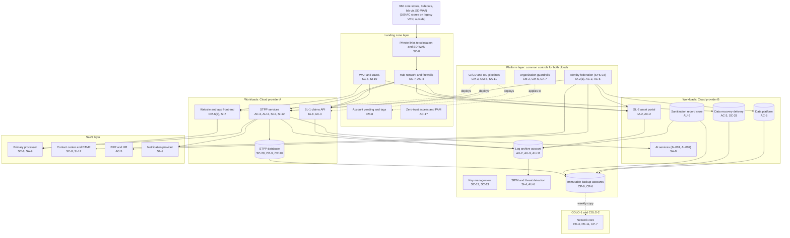

# Cloud Architecture and Control Placement: Cris Santos Company | Other Services | Enterprise

**Organization:** Cris Santos Company, Inc. (publicly traded national electronics and device repair chain) | **Tier:** Enterprise | **Provider:** Multi-cloud, vendor-agnostic: two public cloud providers (called Cloud provider A and Cloud provider B), two colocation sites, and SaaS (see section 4)
**Owner:** Director of Cloud Platform Engineering, with the CISO | **Date:** 2026-08-31 | **Related:** STPP SSP (P02), enterprise BIA (P05)

## 1. Architecture in layers
The estate is organized in four layers. Each lower layer provides **common controls** that the layers above inherit, so a workload team configures only what is specific to its system.

| Layer | What it is | Examples | Who runs it |
|---|---|---|---|
| **Platform** | Organization-wide services in both clouds | Cloud organization guardrails, identity federation, key management, log archive, SIEM feeds, vulnerability and posture management, immutable backup accounts, CI/CD pipelines | Cloud Platform Engineering; Security Operations; Identity team |
| **Landing zone** | The standard account (subscription or project) pattern every workload lands in | Account vending with mandatory tags (owner, data class, PCI scope), hub-and-spoke networks with cloud firewalls, private connectivity to colocation and SD-WAN, WAF and DDoS protection, zero-trust and PAM access | Cloud Platform Engineering; Network Engineering |
| **Workload** | Systems built or run by the company | Cloud A: the STPP (application services, database, website and app front end) and the SL-1 claims API. Cloud B: SL-2 asset tracking portal, sanitization record store, data recovery delivery storage, data platform, AI services | Application teams (for example, the STPP Engineering Manager) |
| **SaaS** | Vendor-operated applications and services | Primary processor (P2PE, hosted payment fields, tokens), contact center platform with DTMF masking, ERP and HR, notification provider, productivity suite | Vendors, with the company's configuration and oversight |

COLO-1 (Florida) and COLO-2 (Texas) host the network core and an offline copy of the immutable backups. Stores, depots, and the lab connect through SD-WAN. The 160 AC stores still connect over legacy site VPNs to a legacy processor and are not on the landing zone (section 7, finding 1).

## 2. Diagram

## 3. Responsibility by service model
Sources: SRC-AWS-SRM, SRC-AZURE-SRM, and SRC-GCP-SRM in `00_universal-framework/sources/source-register.csv`. The three published models agree on the split used here, so the design does not depend on which two providers the company uses.

| Service model | Provider | Company (customer) | Shared |
|---|---|---|---|
| IaaS (hub networks, any virtual machines) | Facilities, hosts, hypervisor, physical network | Guest OS, applications, identities, data, network policy | Encryption (provider service, customer keys), logging |
| PaaS (managed containers, managed database, object storage, AI services) | Also the platform runtime and its patching | Data, access, configuration, keys, application code | Backups, availability configuration |
| SaaS (processor, contact center, ERP, notifications) | Also the application | Users, roles, data, oversight of the vendor | Audit review (complementary user entity controls) |
| Colocation | Building, power, cooling, perimeter | Racks, equipment, cage access lists | None |

**PCI DSS responsibility.** For the payment services, the processor's AOC and a written responsibility matrix (PCI DSS 12.8.5) say which requirements the processor meets (decryption, key management for the P2PE solution, hosted payment fields) and which the company meets (PIN pad custody and inspection, payment page scripts, the STPP's connected systems). The cloud providers' own PCI DSS AOCs cover the physical and hypervisor layers.

## 4. Service categories and provider equivalents
| Service category | AWS | Microsoft Azure | Google Cloud |
|---|---|---|---|
| Organization guardrails | AWS Organizations service control policies | Azure Policy with management groups | Organization Policy Service |
| Account vending | AWS Control Tower account factory | Azure landing zone subscription vending | Resource Manager project creation |
| Key management | AWS KMS | Azure Key Vault | Cloud KMS |
| Audit logging | AWS CloudTrail | Azure Monitor activity log | Cloud Audit Logs |
| Threat detection | Amazon GuardDuty | Microsoft Defender for Cloud | Security Command Center |
| Managed relational database | Amazon RDS | Azure SQL Database | Cloud SQL |
| Managed containers | Amazon EKS | Azure Kubernetes Service | Google Kubernetes Engine |
| Object storage | Amazon S3 | Azure Blob Storage | Cloud Storage |
| Web application firewall | AWS WAF | Azure Web Application Firewall | Cloud Armor |
| API gateway | Amazon API Gateway | Azure API Management | Apigee API Management |
| Backup service | AWS Backup | Azure Backup | Backup and DR Service |

This table is for reading provider documentation only. The architecture, control map, and SSP describe service categories.

## 5. Common controls
`cloud-control-map.csv` has **57 rows** across 29 components: Platform 20, Landing zone 7, Workload 18, SaaS 9, Colocation 3. Responsibility: Customer 37, Shared 16, Provider 4.

**32 rows are published as common controls** (`common_control` = Yes) in the enterprise common control catalog. They map to the common control providers in the STPP SSP (P02 section 10.3): GRC program (CCP-01), identity (CCP-02), landing zone (CCP-03), security operations (CCP-04), network (CCP-05), facilities and colocation (CCP-07), and payments (CCP-10). A workload inherits them by being deployed through account vending, which applies the guardrails, logging, network, key, and backup policies automatically.

**Rules for inheriting:**
1. A workload may claim a common control only if its account was created by account vending and passes the posture baseline.
2. Customer-side identity, data protection, and logging stay explicit at every layer: even a SaaS application has Customer rows for access (AC-2, AC-3) because those are always the company's responsibility.
3. SaaS rows cite the vendor's SOC 2 report or PCI DSS AOC, reviewed by the third-party risk team (P09 evidence map).
4. Accounts tagged PCI scope get two extra guardrails: no internet egress except to the processor and approved services, and segmentation tests every 6 months (PCI DSS 11.4.5).

## 6. Validation against the STPP SSP (P02)
Every STPP component in the SSP boundary appears here with controls from each required family, directly or inherited:
| STPP component | AC | AU | CM | IA | SC | SI |
|---|---|---|---|---|---|---|
| STPP application services | AC-3 | AU-2; AU-9 (inherited) | CM-3, CM-5 (inherited) | IA-2(1) (inherited) | SC-7 (inherited) | SI-2, SI-12 |
| STPP database | AC-6 (inherited) | AU-2 (inherited) | CM-6 (inherited) | IA-2(1) (inherited) | SC-28 | CP-9 and CP-10 (recovery) |
| Website and app front end | AC-3 (application) | AU-2 (inherited) | CM-6(2) | IA-8 (customers, SSP) | SC-5 (inherited) | SI-7, SI-10 (inherited) |
| SL-1 claims API | AC-3 | AU-2 (inherited) | CM-3 (inherited) | IA-8 | SC-8 (inherited) | SA-11 (inherited), SI-10 |

Counter tablets and PIN pads are store endpoints, not cloud components; they are covered in the SSP (CCP-06 and CCP-10).

## 7. Findings from the mapping
1. **AC stores bypass the landing zone.** The 160 AC stores connect over legacy site VPNs to a legacy processor, and the AC legacy ticketing service is a separate SaaS the company did not configure. Nothing in the landing zone protects them. Fix: interim access lists and monitoring now, conversion to SD-WAN and the STPP in two waves (POAM-001, POAM-002).
2. **Payment page integrity is a workload responsibility.** No platform service watches the scripts on the company's payment pages. The front end team owns PCI DSS 6.4.3 and 11.6.1, and the mobile web deposit page is not yet covered (POAM-007).
3. **Object-level authorization is a code problem.** The WAF can block the known SL-1 claim ID pattern, but only the STPP code can check that a claim belongs to the calling client (POAM-010).
4. **Sanitization records depend on a nightly sync at Depot West.** The record store is write-once, but records are created on local stations and lost if a station fails before the sync (POAM-006).
5. **Phone payments widen the scope.** Where DTMF masking is not used, agent PCs and the virtual terminal are in PCI DSS scope, and call recordings can capture spoken card numbers (POAM-013).
6. **Two clouds, one control set.** Guardrails, logging, and key policies are written once as code and applied to both clouds. Differences are limited to service names (section 4).
7. **AI services** run under contract terms with no training on company data. The AI governance committee reviews each new model deployment (P10).
