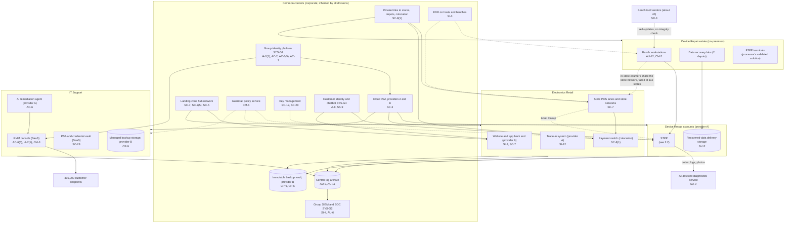
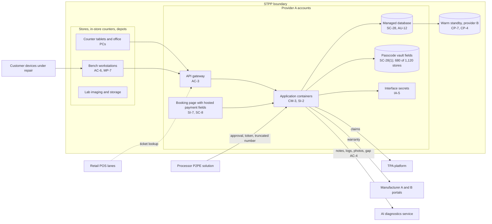

# Cloud Architecture and Control Placement: Cris Santos Company Holdings | Other Services | Multi-Sector

**Organization:** Cris Santos Company Holdings, Inc. | **Tier:** Multi-Sector | **Providers:** two public cloud providers, called provider A and provider B (vendor-agnostic; see section 5), two group colocation data centers, and division SaaS tools
**Scope:** the shared corporate cloud platform (SYS-G3 landing zones, SYS-G4 customer engagement platform) plus the division workloads that run on it or connect to it. The SSP system (P02) is the Service Ticketing and Point-of-Sale Platform (STPP).

## 1. Design in one paragraph
Corporate runs one **landing zone** per provider: identity federation from SYS-G1, a hub network, guardrail policies, a central log archive, key management, EDR, and an immutable backup vault. Divisions get their own **accounts** inside the landing zone and inherit these guardrails. Provider A hosts the corporate hub, the STPP and its booking page, SYS-G4 customer accounts, the retail website and app back end, the trade-in system, recovered-data delivery storage, and IT Support's AI remediation agent pilot. Provider B hosts the STPP warm standby, the group immutable backup vault, and IT Support's managed backup storage for customers. The two colocation data centers run the retail payment switch and the ERP. Three groups of division systems sit outside the cloud platform: the **store estates** (repair store networks, about 6,900 bench workstations, P2PE terminals, retail POS lanes and store networks), the **data recovery labs** at 2 depots, and IT Support's **SaaS tools** (RMM, PSA, remote support, credential vault).

## 2. Diagrams
### 2.1 Group landing zone and division workloads

### 2.2 STPP (SSP boundary)

**Target state (POAM-001, POAM-002, POAM-007, POAM-009, POAM-018; due 2026-11-15 to 2027-03-31):** every store uses the passcode vault and notes are purged; benches at in-store counters use named accounts and sit on their own network, reachable from nothing in the retail CDE; bench tools run from an allow list and update only through the group software channel after integrity checks; the diagnostics payload drops free-text notes.

## 3. Common versus division-specific controls
`cloud-control-map.csv` has 53 rows across 35 components. The `control_scope` column shows who owns each placement:

| Scope | Rows | What it means |
|---|---|---|
| Common (group) | 23 | Provided once by corporate (SYS-G1 to SYS-G4) and inherited by every division account. Listed in the P02 common control catalog |
| Shared system (STPP) | 12 | Controls of the STPP documented in the P02 SSP; the STPP is used by all three divisions |
| Division-specific (Device Repair) | 6 | Bench estate, tool update channels, recovered-data delivery, AI diagnostics, manufacturer portals |
| Division-specific (Electronics Retail) | 6 | Website checkout, payment switch, store networks, order data, trade-in records |
| Division-specific (IT Support) | 6 | RMM, PSA and credential vault, managed backup, AI agent |

| Responsibility | Rows |
|---|---|
| Customer (the group or a division) | 44 |
| Shared (provider and group) | 7 |
| Provider | 2 |

**Rule of thumb.** Identity, network guardrails, logging, keys, backups, and EDR are **common**. A division cannot opt out of them, only request an exception through POL-01. Application behavior, data access within the application, store and bench networks, and customer-facing tools are **division-specific**, because they depend on each division's card brands, manufacturers, and customers.

## 4. Layers
| Layer | Common components | Division components | Key controls | Responsibility |
|---|---|---|---|---|
| Identity | SYS-G1, cloud IAM, SYS-G4 customer identity | STPP gateway and interface secrets, manufacturer portals, RMM console | AC-2, AC-3, AC-6(5), IA-2, IA-2(1), IA-5, IA-8 | Customer (configuration); vendor (service) |
| Network | Hub network, private links | Store and in-store counter networks, payment switch links, website WAF | SC-7, SC-7(5), SC-8, SC-8(1), SC-5 | Customer, with provider DDoS protection shared |
| Compute | EDR, guardrails | STPP containers, bench workstations, AI agent | SI-2, SI-3, CM-3, CM-6, CM-7, AC-6 | Customer (guest OS, containers, benches, code) |
| Data | Keys, backup vault | STPP database and passcode vault, delivery storage, trade-in records, managed backup | SC-12, SC-28, SC-28(1), CP-9, CP-6, SI-12 | Shared: provider encrypts; group owns keys, retention, and purges |
| Logging and monitoring | Log archive, SIEM | STPP database audit, bench telemetry, RMM logs | AU-6, AU-9, AU-11, AU-12, SI-4 | Shared: providers generate platform logs; group retains and reviews |
| SaaS and vendor dependencies | Identity, SIEM, EDR, chatbot vendors | Bench tool vendors, AI diagnostics provider, RMM and PSA vendors | SA-9, SR-3, SI-7 | Provider for the service; customer for use, update integrity, and oversight |
| Physical | Provider and colocation data centers | Stores, depots, labs (not cloud) | PE-3 | Provider (inherited) for data centers; group for its own sites (P02) |

## 5. Service categories and provider equivalents
The design does not depend on a provider. This table gives each provider's name for each service category, for reading its shared responsibility documentation.

| Service category | AWS | Microsoft Azure | Google Cloud |
|---|---|---|---|
| Account structure and guardrails | AWS Organizations with service control policies | Management groups with Azure Policy | Resource hierarchy with Organization Policy |
| Managed containers | Amazon EKS | Azure Kubernetes Service | Google Kubernetes Engine |
| Managed relational database | Amazon RDS / Aurora | Azure SQL Database / Azure Database for PostgreSQL | Cloud SQL |
| Object storage | Amazon S3 | Azure Blob Storage | Cloud Storage |
| Key management | AWS KMS | Azure Key Vault | Cloud KMS |
| Audit logging | AWS CloudTrail | Azure Monitor activity log | Cloud Audit Logs |
| Backup with immutability | AWS Backup (vault lock) | Azure Backup (immutable vault) | Backup and DR Service |
| Private connectivity | AWS Direct Connect / PrivateLink | Azure ExpressRoute / Private Link | Cloud Interconnect / Private Service Connect |

Shared responsibility sources: SRC-AWS-SRM, SRC-AZURE-SRM, SRC-GCP-SRM in `00_universal-framework/sources/source-register.csv`. All three agree on the split used here: for IaaS the provider owns facilities, hosts, and virtualization; for PaaS the provider also owns the runtime; for SaaS the provider owns the application. The customer always keeps identities, access decisions, data classification, and data.

## 6. Findings from the mapping
1. **The weak points are at the edge, not in the cloud.** The STPP's cloud controls are sound (SC-28, SC-12, CP-9, AU-9). The gaps are in the store estates the cloud mapping does not reach: shared bench logins, self-updating bench tools, and in-store counter benches on retail store networks (AC-2, CM-7, SR-3, SC-7; P01 GR-01, GR-02, GR-04).
2. **One store network, two merchants.** The in-store counters are a Device Repair system inside a Retail network. The retail segmentation test, not the repair program, found that 112 counters could reach POS lanes. Ownership of that boundary is now explicit: Retail owns the store network and its segmentation (SC-7, division-specific row); Device Repair owns the bench workstations on it (POAM-009 has both owners).
3. **Two passcode stores remain outside the vault.** Free-text notes in the STPP and transcripts in the group chatbot (SYS-G4) both hold passcodes. The vault solves only the first, and only at 680 stores (SC-28(1); POAM-002, POAM-018).
4. **The RMM is the group's biggest single blast radius.** One SaaS console, reached through SYS-G1 sign-in, can run scripts on 310,000 customer endpoints. Its controls are division-specific (AC-6(5), IA-2(1), CM-3), but its failure would be a group event with customer, HIPAA, and SEC consequences (P01 GR-03; P08).
5. **Common controls are strong and reused.** One identity platform, one SIEM, one backup design. This is what lets group internal audit assess them once (P07). The weak link is documentation of inheritance for the depots and labs (P02 section 10.2; POAM-013), not the controls themselves.
