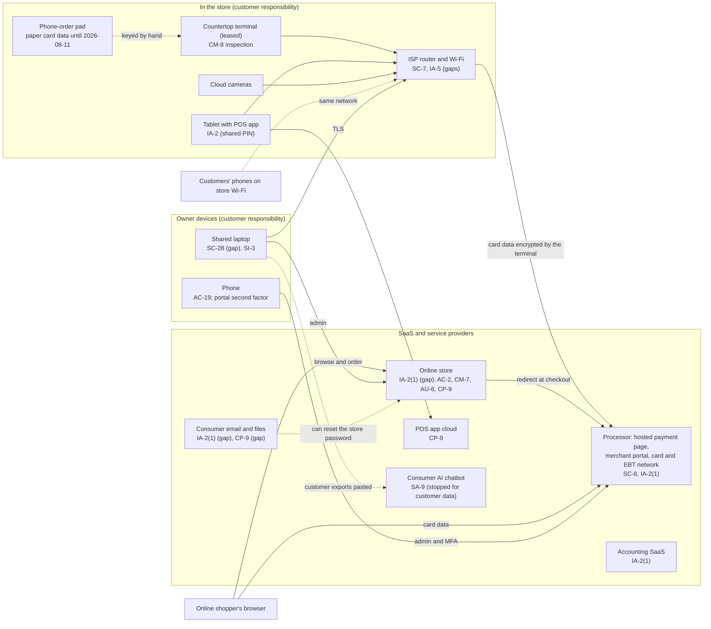

# SaaS Architecture and Control Placement: Cris Santos Company | Retail Trade | Sole Proprietorship

**Organization:** Cris Santos Company (corner grocery with online and phone ordering) | **Tier:** Sole Proprietorship | **Provider:** SaaS only (no IaaS or PaaS)
**System:** Store Sales Platform, as defined in the system profile (P02) | **Prepared:** Owner with the outside IT helper, 2026-08-12 | **Adopted:** 2026-09-04

## 1. Diagram
Control IDs on each node are the ones in `cloud-control-map.csv`. Dashed lines are flows the owner does not control well today.

## 2. Layers
| Layer | Components | Key controls | Responsibility |
|---|---|---|---|
| Identity | Online store admin, merchant portal, POS app, email, accounting | IA-2(1), IA-2, AC-2, IA-5 | Customer configures; vendors provide MFA |
| Data | Customer accounts, order notices, exports, paper pad | SC-28, CP-9, SA-9, MP-4 | Vendors protect data inside their services; the owner decides where customer data goes |
| Endpoints | Laptop, phone, tablet | SC-28, SI-3, AC-19, AC-11 | Customer |
| Network | ISP router and Wi-Fi | SC-7, IA-5, AC-18 | Customer (the ISP leases the device) |
| Physical | Countertop terminal | CM-8 and inspection | Shared: the processor supplies and updates it; the owner inspects it |
| Logging | Online store activity log, email sign-in history, refunds report | AU-6 | Shared: vendors record, the owner reviews |
| Payment processing and hosting | Hosted payment page, terminal processing, SaaS platforms | Inherited (SC-8, vendor backups, platform patching) | Provider |

## 3. Shared responsibility for SaaS
The three major cloud providers' shared responsibility models (SRC-AWS-SRM, SRC-AZURE-SRM, SRC-GCP-SRM) agree on the SaaS split: the provider runs the application, the platform, and the facilities; **the customer always keeps its identities and accounts, its data, and its devices.** That is why 13 of the 19 rows in the control map are the owner's. A processor's PCI DSS attestation or a vendor's SOC 2 report never covers these layers. PCI DSS makes the same split for a merchant: the processor's AOC covers the hosted payment page, but the merchant still answers for the website that sends customers to it and for the terminal on its counter. No IaaS provider equivalents table is needed, because the store runs no infrastructure.

## 4. Findings from the mapping
1. **The online store decides where shoppers pay.** The redirect keeps card data off the store, but whoever controls the store administrator account can add a script or change the checkout so shoppers see a fake card form first. The account has no MFA and reuses the email password (P01 R-001, the P08 scenario). The promotional pop-up add-on, which could add scripts to the checkout pages, was removed during this mapping.
2. **The email account is the master key.** It can reset the online store password and it holds customer exports, yet it has no MFA (R-004).
3. **The terminal shares a network with customers' phones.** The SaaS model cannot fix this; only router settings can (R-003). It also affects whether the store still fits the SAQ the portal assigned (P03).
4. **Paper is part of the system.** The phone-order pad held full card data with security codes. No vendor control applies to it (R-002).
5. **Inherited controls depend on the owner's side.** The processor's MFA protects the portal only while the owner's phone is protected; vendor backups do not cover files on the laptop.
