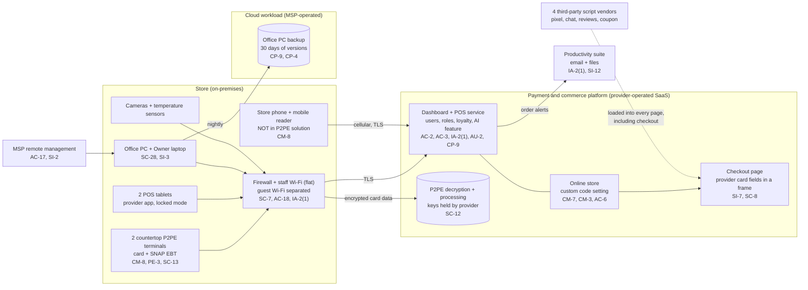

# Cloud Architecture and Control Placement: Cris Santos Company | Retail Trade | Micro

**Organization:** Cris Santos Company, LLC (neighborhood grocery store with online ordering) | **Tier:** Micro | **Provider:** Vendor-agnostic SaaS (see section 3)
**System:** Store Commerce Platform (SCP), as defined in the SSP (P02) | **Prepared:** 2026-07-31 by the Store Manager with the MSP technician | **Approved:** Owner, 2026-08-31

## 1. Diagram
The store runs no servers and no IaaS account. Its "cloud" is one commerce platform, a productivity suite, and a few smaller SaaS services, plus one cloud workload that the MSP operates for it: the nightly backup of the office PC (SYS-11). Control IDs on each box are the ones mapped in `cloud-control-map.csv`.

## 2. Layers and who is responsible
| Layer | Components | Key controls | Customer (store) | MSP (on the store's behalf) | Provider (SaaS vendor) |
|---|---|---|---|---|---|
| Identity | Dashboard, online store, mailboxes, firewall, backup console | AC-2, IA-2(1), AC-6 | Decides who gets access; turns on MFA; removes leavers | Mailboxes, firewall and backup logins | Runs the sign-in and MFA service |
| Payment devices | Countertop terminals, mobile reader | CM-8, PE-3, SC-13 | Keeps the device list; inspects terminals; follows the P2PE Instruction Manual; uses only P2PE devices | None | P2PE encryption, key management, device supply |
| Online store pages | Theme, custom code, scripts, checkout page | CM-7, CM-3, SI-7 | **Every script it adds, and changes to them** | None | Platform code, card fields, hosting |
| Network | Firewall, Wi-Fi, internet line | SC-7, AC-18 | Approves changes | Configures, patches, and monitors | Not applicable |
| Endpoints | Office PC, laptop, tablets, store phone | SC-28, SI-3, SI-2 | Store phone and tablets (unmanaged today) | Office PC and laptop | POS app on the tablets |
| Data | Platform data, loyalty export, office PC files, backups | CP-9, CP-4, SI-12 | Decides retention; deletes the loyalty export; asks for restore tests | Runs the office PC backup and restore tests | Backs up the platform |
| Logging | Platform activity log, suite sign-ins, firewall logs | AU-2, AU-6 | **Reviews logs weekly (gap today)** | Keeps firewall logs | Generates and stores logs |
| Vendor governance | Merchant agreement, AOC, SOC 2, freelancer agreement | SA-9 | Reads the AOC and SOC 2 report yearly; signs a freelancer agreement | Holds the backup vendor relationship | Provides the AOC and SOC 2 report |

**The MSP is not a cloud provider in the shared responsibility sense.** It performs customer-side duties for the store. Anything marked "Customer (performed by MSP)" in `cloud-control-map.csv` stays the store's responsibility; the store must direct the work, receive evidence, and check it (SA-9).

**The provider's AOC draws the line clearly.** The provider is responsible for its platform, its card fields, and P2PE. The merchant is responsible for the code it adds to its own pages, for its users, and for its devices in the store. The store's largest gap sits on the merchant side of that line.

## 3. Service categories and provider equivalents
The design is vendor-agnostic. The shared responsibility split for SaaS is the same in all three major cloud providers' models: the provider runs the application, platform, and infrastructure; the customer keeps identities, access, data, and devices (SRC-AWS-SRM, SRC-AZURE-SRM, SRC-GCP-SRM in `00_universal-framework/sources/source-register.csv`). For the store's vendors, the PCI DSS AOC and the SOC 2 report are the evidence for the provider side.

| Service category used | What it is here | Equivalent category in the large cloud providers (for reading their documentation) |
|---|---|---|
| Commerce and payments SaaS | POS, card processing, online store, loyalty | Industry SaaS built on any provider; payment service providers |
| Productivity suite | Email, calendar, files | Productivity and collaboration SaaS |
| SaaS backup | Office PC backup | Backup service or third-party SaaS backup |
| Remote monitoring and management | MSP device management | Device management SaaS |
| IoT monitoring SaaS | Temperature sensors and alerts | IoT device management and alerting services |

## 4. Findings from the mapping
1. **The store's own scripts are the open door (CM-7, SI-7).** The provider serves the card fields inside a frame, but the 4 scripts added through the custom code setting load on the checkout page too. A compromised script can draw a fake card form over the real one. Fix: remove all scripts from checkout, keep a short approved list for other pages, and turn on payment page change detection. Tracked as P01 R-001 and P07 POAM-001 and POAM-002.
2. **Administrator logins without MFA control the payment page (IA-2(1), AC-6).** The freelancer's login can edit custom code and the Store Manager's login can change the payout bank account. Fix: MFA on every administrator login and a content-only role for the freelancer by 2026-10-15 (POAM-005).
3. **The mobile reader sits outside the P2PE solution (CM-8).** It is a payment device the provider supplies, but not one listed in its validated solution, so the store cannot claim SAQ P2PE for the card payments it takes. Fix: retire it or replace it with a device in the P2PE solution before the 2026 SAQ (R-003).
4. **The flat staff Wi-Fi joins everything (SC-7).** Under P2PE the network carries only encrypted card data, so this is not a PCI scope problem. It is still an FTC reasonable-security problem: a compromised camera or office PC can reach the tablets and the store phone. Fix: separate Wi-Fi networks for payment devices, office devices, and cameras and sensors (POAM-007).
5. **Customer-side controls are the weak layer.** The provider side is strong and evidenced (AOC and SOC 2). The gaps are on the store's side: scripts, MFA, shared codes, terminal checks, and log review.
