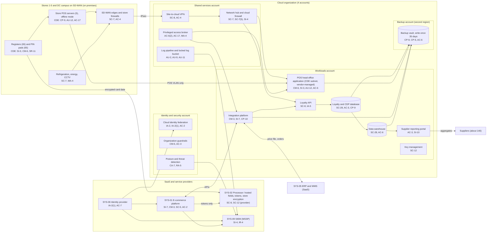

# Cloud Architecture and Control Placement: Cris Santos Company | Retail Trade | Mid-Market

**Organization:** Cris Santos Company, Inc. | **Tier:** Mid-Market | **Provider:** Vendor-agnostic public cloud (see section 4), plus SaaS
**System:** E-commerce and Point-of-Sale Platform (EPP), as defined in the SSP (P02) | **Prepared:** 2026-07-31 by the Security Manager; updated 2026-09-15 with P07 results
**Control map:** `cloud-control-map.csv` (52 rows, 23 components)

## 1. Diagram

## 2. Landing zone design
The landing zone separates duties across 4 accounts (subscriptions or projects, depending on the provider) under one cloud organization. Each account limits the damage an attacker can do from any other.

| Account | Purpose | Who administers | Key design decisions |
|---|---|---|---|
| **Identity and security** | Organization root, cloud identity federation to SYS-06, organization guardrails, posture management and threat detection | Security Manager (2 people) | No workloads. Root credentials sealed. Guardrails apply to every other account and cannot be disabled from them |
| **Shared services** | Network hub, cloud firewall, site-to-cloud VPN, DNS, privileged access broker, patch service, log pipeline and locked log bucket | IT Director's infrastructure team | All traffic between sites, workloads, and the internet passes the hub. Logs from all accounts land in a write-once bucket here |
| **Workloads** | POS head-office application (its own CDE subnet), loyalty and CDP database, loyalty API, integration platform, data warehouse, supplier reporting portal, file services, key management | Infrastructure team; POS vendor for the head-office application | Separate subnets per workload. The CDE subnet accepts traffic only from store POS VLANs and the access broker. Company-managed keys |
| **Backup** | Backup vault with 35-day write-once retention in a second region | 2 named backup administrators | Separate administrator credentials, not federated to everyday accounts. Backups are pulled by a cross-account role that can write but not delete |

**PCI DSS scope in the cloud.** The POS head-office application moved into the workloads account in December 2025. Its subnet, the hub firewall rules that protect it, the access broker, the identity federation, and the log pipeline are therefore in PCI DSS scope as CDE or connected-to components. The 2025 scope document predates the move (gap 1). This document is the input to the updated scope document due 2026-10-15 (P03 G-060).

## 3. Layers and shared responsibility per service
| Layer | Components | Key controls | Service model | Responsibility |
|---|---|---|---|---|
| Identity | Cloud federation, break-glass accounts, privileged access broker, SYS-06 | IA-2, IA-2(1), AC-2, AC-6(2), AC-6(5), AC-7 | PaaS / SaaS | Customer configures identities, roles, MFA, and reviews; provider runs the identity services |
| Network | Hub, cloud firewall, VPN, DNS, SD-WAN edges | SC-7, SC-7(5), SC-8, AC-4, SC-20 | IaaS / PaaS | Customer designs routes, rules, and the CDE subnet; provider runs the gateway and DNS services |
| Compute | POS head-office application, loyalty API, integration platform, reporting portal | CM-6, CM-3, SI-3, AU-12, CP-10, SI-10 | IaaS / PaaS | Customer (guest OS, applications, EDR); POS vendor for the head-office application under contract; provider for hosts and hypervisor |
| Data | Managed databases, warehouse, file shares, keys, backups | SC-28, SC-12, CP-9, CP-6, AC-3, AC-6 | PaaS | Shared: provider encrypts and operates storage and engines; customer controls keys, access, retention, isolation, and restore testing |
| Logging and monitoring | Log pipeline, posture service, SIEM | AU-2, AU-9, AU-11, CA-7, RA-5, SI-4, IR-4 | PaaS / SaaS | Shared: provider generates logs and detections; customer enables, retains, forwards, and acts on them; MSSP monitors |
| SaaS and service providers | E-commerce platform, processor services, identity provider, SIEM | SI-7, CM-3, SC-5, AC-2, SC-8, SC-12, AC-7 | SaaS | Provider runs the application; customer keeps users, roles, the checkout theme and scripts, and data |
| Physical | Provider data centers | PE-3 | All | Provider (inherited, evidenced by SOC 2 reports) |

**Responsibility counts in `cloud-control-map.csv`:** 33 Customer, 12 Shared, 7 Provider. By service model: 16 IaaS, 26 PaaS, 10 SaaS rows. The customer side is always identity, data protection, logging, and, for the e-commerce platform, the content of the checkout page.

## 4. Service categories and provider equivalents
The design is independent of the provider. This table gives each provider's name for the service category, for reading its shared responsibility documentation (SRC-AWS-SRM, SRC-AZURE-SRM, SRC-GCP-SRM in `00_universal-framework/sources/source-register.csv`).

| Service category | AWS | Microsoft Azure | Google Cloud |
|---|---|---|---|
| Multi-account organization and guardrails | AWS Organizations, service control policies | Management groups, Azure Policy | Resource Manager folders, organization policies |
| Account, subscription, or project | Account | Subscription | Project |
| Cloud identity federation | IAM Identity Center | Microsoft Entra ID with Azure RBAC | Cloud Identity with IAM |
| Network hub | Transit Gateway | Virtual WAN hub or hub virtual network | Network Connectivity Center or shared VPC |
| Cloud firewall | AWS Network Firewall | Azure Firewall | Cloud NGFW |
| Site-to-cloud VPN | Site-to-Site VPN | VPN Gateway | Cloud VPN |
| Virtual machines | EC2 | Virtual Machines | Compute Engine |
| Managed application service and API gateway | Elastic Beanstalk, API Gateway | App Service, API Management | App Engine or Cloud Run, Apigee or API Gateway |
| Managed relational database | Amazon RDS | Azure SQL Database | Cloud SQL |
| Data warehouse | Amazon Redshift | Azure Synapse | BigQuery |
| Integration service | AWS Step Functions, Amazon AppFlow | Azure Logic Apps | Application Integration |
| Object storage with write-once retention | S3 with Object Lock | Blob Storage with immutability policies | Cloud Storage with bucket lock |
| Backup service | AWS Backup (vault lock) | Azure Backup (immutable vault) | Backup and DR Service |
| Key management and secrets | AWS KMS, Secrets Manager | Azure Key Vault | Cloud KMS, Secret Manager |
| Audit logging | CloudTrail | Azure Monitor activity log | Cloud Audit Logs |
| Posture and threat detection | Security Hub, GuardDuty | Microsoft Defender for Cloud | Security Command Center |

**Service model split used here (all three providers agree):**
- **IaaS** (virtual machines, networks): the provider owns facilities, hosts, and virtualization. The customer owns the guest OS, applications, network configuration, identities, and data.
- **PaaS** (managed database, application service, integration, backup, key service): the provider also owns the platform software and its patching. The customer owns access, keys, data, and configuration.
- **SaaS** (e-commerce platform, identity provider, SIEM, processor services): the provider also owns the application. The customer keeps identities, roles, its own content (including checkout scripts), audit review, and data.

## 5. Findings from the mapping
1. **The POS head-office application is a vendor island inside the CDE.** The POS vendor manages the application inside the company's workloads account. The company owns the network, backups, and access, but 2 vendor accounts hold directory domain administrator rights, its logs do not reach the SIEM, and the vendor asked to exclude it from vulnerability scans (P01 R-006, R-012). Fix: vendor access through the broker, log forwarding, and scanning written into the service agreement (POAM-002, POAM-005, POAM-011).
2. **Checkout integrity is a customer responsibility on a SaaS platform.** The e-commerce vendor's AOC covers the platform, but the checkout theme, the tag manager, and 23 scripts belong to the company (P01 R-002, R-010). Fix: script inventory with integrity values, removal of the tag manager from checkout pages, and tamper detection extended to the in-app web checkout (POAM-013).
3. **Recovery is designed but unproven.** Backups are isolated (separate account, second region, write-once, separate credentials). No restore has been tested for the loyalty and CDP database, the integration platform, or the POS head-office application (gap 7). Fix: quarterly restore tests into an isolated recovery network, starting with the integration platform on 2026-10-27 (POAM-008).
4. **Loyalty data leaves the cloud by email.** The weekly agency export is produced in the workloads account under a shared analyst account and emailed as a spreadsheet (gap 9). Fix: replace email with a governed, expiring transfer, a named service identity, and a data use agreement (POAM-018).
5. **The supplier reporting portal is the one company-built application.** Row-level separation between suppliers was tested only at launch. A flaw would expose one supplier's sales data to another, which matters for the SOC 2 Confidentiality criteria (P01 R-032; P09).
6. **Boundary check.** Every in-scope cloud and SaaS component in the SSP (P02 section 9) appears in the diagram. Every cloud component has at least one row in the control map, and each account has controls from at least 2 of the AC, AU, CM, IA, SC, and SI families or inherits them. On-premises store components appear in the diagram for context and are mapped in the SSP, not in this cloud map.
