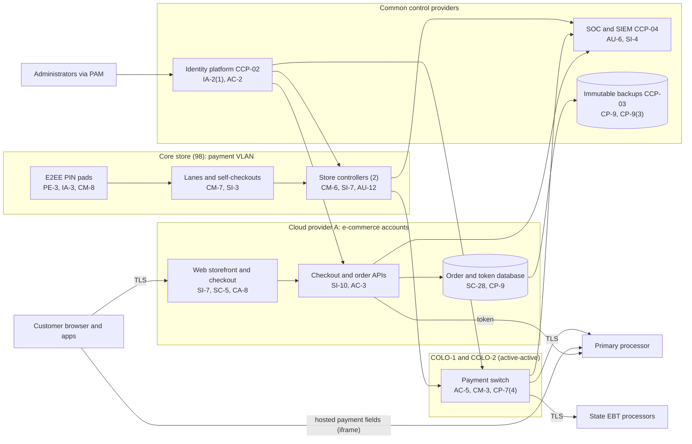

# System Security Plan: Omnichannel Commerce and Payments Platform (OCPP)

**Organization:** Cris Santos Company, Inc. (publicly traded regional supermarket chain) | **Tier:** Enterprise | **Vertical:** Retail Trade
**Outline:** NIST SP 800-18 Rev. 2, System Security Plan Outline Example (June 2026) | **Version:** 3.0, 2026-09-14

## 1. System Name and Identifier
Omnichannel Commerce and Payments Platform (**OCPP**), identifier CSC-SYS-OCPP-001. Tier-1 system in the enterprise application inventory. The OCPP is also the core of the company's PCI DSS cardholder data environment (CDE) and the scope of the annual Report on Compliance (ROC).

## 2. System Overview
The OCPP is how customers pay the company, in the store and online. It combines three systems from the scenario facts:
- **POS platform (SYS-01)** at the 98 core stores: about 2,650 lanes (including about 610 self-checkouts), 196 store controllers, and about 2,780 PCI-approved PIN pads that encrypt card data at the point of interaction with the processor's end-to-end encryption.
- **Payment switch and tokenization interface (SYS-02):** commercial switch software run by the company, active-active in colocation sites COLO-1 (Florida) and COLO-2 (Georgia). It routes card authorizations to the primary processor and SNAP EBT transactions to each state's EBT processor, and receives tokens and truncated card numbers back.
- **E-commerce platform (SYS-03):** the company-built web storefront, iOS and Android apps, order management, and pickup and delivery scheduling on Cloud provider A managed containers. The web checkout embeds the processor's hosted payment fields (inline frames); the apps use the processor's mobile SDK; saved cards are processor tokens.

Volumes: about 84 million card transactions a year (about 3.4 million online), about 7.2 million SNAP EBT transactions, and about 9,900 online orders a day.

**Why availability and payment page integrity matter most.** A checkout outage costs about $7.4 million a day at the core stores and about $950,000 a day online (P05 BP-01, BP-03). The company stores no full card numbers after authorization, so the main confidentiality exposure is card data **in transit through the customer's browser**: a malicious script on the checkout page can capture card data before it reaches the processor's fields. That is why PCI DSS v4.0.1 Requirements 6.4.3 and 11.6.1 are central to this plan.

**Users:** about 5,200 workforce accounts (store leads and managers with POS back office roles, pickers, customer care, e-commerce engineers, store technology staff, and switch administrators), about 9,400 POS operator IDs (cashiers and leads at the core stores), and about 1.4 million customer accounts on the storefront and apps.

## 3. Laws, Regulations, and Policies Affecting the System
| ID | Requirement | Citation | How it affects the OCPP |
|---|---|---|---|
| N44-45-R01 | PCI DSS v4.0.1 (contractual standard, not law) | PCI SSC, June 2024; merchant agreement | All 12 requirements apply to the CDE; annual ROC by a QSA (Level 1 per the acquirer) |
| N44-45-R02 | FTC Act Section 5 | 15 U.S.C. 45(a), (n) | Reasonable security for customer data; accuracy of security and privacy statements on the storefront |
| N44-45-R05 | FACTA receipt truncation | 15 U.S.C. 1681c(g) | Electronically printed receipts show no more than the last 5 digits and no expiration date |
| Card brands | Visa Core Rules and Visa Product and Service Rules (April 2026 edition), applied through the acquirer | ID# 0002228 (1.9.4.1); ID# 0007999 (10.3.1.2) | No storage of full magnetic stripe, card verification codes, or PIN blocks after authorization; report suspected compromises immediately (P08) |
| SNAP EBT | Retailer agreements and third party processor rules | 7 CFR 274.3(c)-(d); 7 CFR 274.8(b)(6)-(7); 7 CFR 278.1 | The switch is a third party processor in each state's EBT system; PIN encryption from the point of entry; downtime and manual voucher procedures |
| SEC | Cybersecurity disclosure | Form 8-K Item 1.05; 17 CFR 229.106 | A material OCPP incident goes through the P08 materiality step |
| Tennessee | Tennessee Information Protection Act | 2023 Tenn. Pub. Acts ch. 408 | Reasonable data security for Tennessee customers' personal information; precise geolocation in the app is sensitive data |
| State | State breach notification and data security laws | Each state where affected individuals reside (Florida worked example: Fla. Stat. 501.171) | Notification (P08); reasonable measures (501.171(2)) |
| Internal | POL-01 to POL-05 and standards | P06 | Enterprise policy hierarchy |

Not applicable: N44-45-R03 and N44-45-R04 (no company-issued credit or covered accounts; the co-brand card is issued by a partner bank), N44-45-R06 (no California business), N44-45-R07 (not directed to children; accounts require age 18), N44-45-R08 (no third-party marketplace sellers).

## 4. System Status
### 4.1 System Security Plan Approval
Prepared by the Director of E-commerce Engineering, the Director of Store Technology, the Payment Switch Manager, and the PCI Program Manager. Reviewed by the CISO and the Vice President, Payments. Approved by the Chief Financial Officer on 2026-09-14.
### 4.2 System Authorization Decision
The company is not a federal agency, so there is no formal ATO. The equivalent internal decision:
- **Authorizing official equivalent:** Chief Financial Officer (owner of the merchant relationship and signer of the AOC), with the CISO's recommendation.
- **Decision (2026-09-14):** continue operation with conditions, based on the Internal Audit assessment (P07) and the risk register (P01).
- **Conditions:** extend script controls to the express checkout and cart pages before the QSA fieldwork (POAM-002 by 2026-10-16); close the TPSP AOC gaps (POAM-003 by 2026-11-30); test SNAP EBT routing in failover (POAM-011 by 2027-01-31); write and test the extended processor outage procedure (POAM-016 by 2027-03-31).
- **Reauthorization:** annually, or after a major change (for example, conversion of the acquired banner into the OCPP boundary in 2026-12 and 2027-03).
### 4.3 System Operational Status
Operational. Planned major modifications: conversion of the 14 AB stores (wave 1 by 2026-12-15, wave 2 by 2027-03-31), which will add about 210 lanes and 236 encrypting PIN pads to the boundary; extension of payment page controls to all pages that host or redirect to payment fields.

## 5. Role Identification and Responsible Personnel
| Role | Title | Responsibility |
|---|---|---|
| System owner | Chief Digital Officer | Accountable for the OCPP; approves access roles |
| Authorizing official (equivalent) | Chief Financial Officer | Accepts residual risk to operate; signs the AOC |
| Payments business owner | Vice President, Payments | Merchant agreements, processor and EBT relationships, ROC sponsor |
| System administrators | Director of Store Technology (POS); Payment Switch Manager (switch); Director of E-commerce Engineering (e-commerce) | Day-to-day administration, change control |
| PCI DSS program | PCI Program Manager (GRC team) | Scope, evidence, targeted risk analyses, QSA coordination |
| Information security | CISO; Director of Security Operations | Program oversight; SOC monitoring; incident response |
| Privacy | Chief Privacy Officer | Customer data, Tennessee Act, breach determinations |
| Common control providers | See section 10.3 | Operate inherited controls |
| Independent assessors | Chief Audit Executive (Internal Audit); external QSA | Annual assessment (P07); annual ROC |

## 6. System Information Types and System Categorization
Information types come from NIST SP 800-60 Vol. 2 Rev. 1 (the company uses them as a model). Impact levels follow FIPS 199.

| Information type | Confidentiality | Integrity | Availability | Rationale |
|---|---|---|---|---|
| Customer payment transactions (encrypted card data in transit, tokens, truncated card numbers, EBT transactions) | Moderate | Moderate | Moderate | Exposure of card data in transit causes fraud, brand assessments, and notification duties; no full card numbers are stored. Checkout outages are severe for the business but stores keep trading with store-and-forward and cash (P05 BP-01: MTD 4 h, RTO 1 h) |
| Customer accounts and orders (names, addresses, phone numbers, order history) | Moderate | Moderate | Moderate | Personal information under state law; orders feed fulfillment (P05 BP-03, BP-04) |
| Information security (audit logs, keys, routing tables, credentials) | Moderate | Moderate | Moderate | Protects the evidence and the routing integrity of the switch |
| **OCPP category** | **Moderate** | **Moderate** | **Moderate, availability supplemented** | See the decision below |

**Categorization decision.** The OCPP is Moderate. Availability came close to High because a chain-wide checkout outage is a severe business event, but store-and-forward, cash, and manual EBT vouchers keep essential functions running, so the impact is not catastrophic. The risk and technology committee approved this tailoring on 2026-09-10:
- The OCPP uses the **SP 800-53B Moderate baseline** (134 controls documented).
- It adds **8 High-baseline controls** for availability and testing: CA-8, CP-2(2), CP-2(5), CP-6(2), CP-7(4), CP-8(4), CP-9(3), CP-10(4). CA-8 is added because PCI DSS 11.4 requires penetration testing of the CDE.
- The decision is reviewed annually and when the AB stores join the boundary.

**Documented controls.** `control-implementation.csv` documents **142 controls**: 134 from the Moderate baseline and 8 High-baseline supplements. Remaining Moderate-baseline enhancements are fully inherited from the common control catalog (section 10.3) and are listed there rather than repeated here. Privacy-baseline controls are documented in the enterprise privacy program. Each row's `regulatory_driver` cites the PCI DSS v4.0.1 requirement it supports (author mapping).

## 7. Authorization Boundary Description
**Inside the boundary:** lanes, self-checkouts, PIN pads, and store controllers at the 98 core stores, and the store payment VLANs; the payment switch servers and their colocation segment in COLO-1 and COLO-2; the e-commerce workload accounts in Cloud provider A (storefront, checkout and payment services, order management, customer identity); the mobile apps; and the administrator endpoints and PAM paths used to manage them.

**Outside the boundary (common control providers and interconnected systems):**
- Landing zone services (network hub, key management, log archive, backup accounts, standby region): CCP-03
- Identity platform (SYS-05): CCP-02
- SOC, SIEM, EDR, scanners: CCP-04
- Store and enterprise network beyond the payment VLANs, SD-WAN, NAC: CCP-05
- Loyalty and CDP (SYS-04), ERP and price file (SYS-09), pricing engine (SYS-12), retail media (SYS-13)
- The primary processor (hosted payment fields, SDK, tokenization, authorization), state EBT processors, delivery providers
- The 14 AB stores (SYS-14) until conversion

The enterprise multi-cloud diagram is in P04 `cloud-architecture.md`.

## 8. Information Exchanges Summary
| Connected system / party | Direction | Data | Agreement |
|---|---|---|---|
| Primary processor | Bidirectional (TLS) | Encrypted card data, authorizations, tokens, settlement | Merchant and processing agreements; processor AOC as a TPSP |
| Customer browsers (hosted payment fields) | Customer to processor directly | Card data typed by customers | Processor's hosted field terms; the page around the fields is a company duty (6.4.3, 11.6.1) |
| State EBT processors (5 states) | Bidirectional (TLS through the EBT gateway) | EBT authorizations (PIN encrypted from the point of entry) | State retailer agreements; third party processor certification (7 CFR 274.3(d)) |
| Loyalty and CDP (SYS-04) | Bidirectional (APIs) | Member IDs, offers, basket items (no card data) | Internal data sharing standard |
| ERP (SYS-09) | Inbound nightly | Item and price file | Internal interface specification |
| Pricing engine (SYS-12) | Inbound | Online prices and markdowns | Internal; reviewed by the AI governance committee (P10) |
| Delivery providers A, B, C | Outbound | Name, address, phone, order items (no card data) | Delivery agreements with security terms |
| POS software vendor | Remote support through PAM | Troubleshooting | Support agreement; vendor AOC as a TPSP |
| Third-party scripts on payment pages (47) | Loaded in customers' browsers | Page content; potential access to the page | Script inventory with justification (**incomplete for express checkout and cart pages, POAM-002**) |

## 9. System Component Inventory
| Component | Type | Location / provider | Owner |
|---|---|---|---|
| Lanes and self-checkouts (about 2,650) | POS terminals | 98 core stores | Director of Store Technology |
| PIN pads (about 2,780) | PCI-approved PTS devices with processor E2EE | 98 core stores; spare pool of 140 at DIST-1 | Director of Store Technology |
| Store controllers (196) | On-premises servers | 98 core stores, locked back-office cabinets | Director of Store Technology |
| Payment switch servers (4 per site) | On-premises servers | COLO-1 and COLO-2 | Payment Switch Manager |
| Web storefront and checkout services | Managed containers | Cloud provider A, primary region; warm standby in second region | Director of E-commerce Engineering |
| Order and token database | Managed relational database (PaaS) | Cloud provider A | Director of E-commerce Engineering |
| Mobile apps (iOS, Android) | Customer devices | App stores | Director of E-commerce Engineering |
| Administrator endpoints (about 240) | Managed laptops with PAM access | Headquarters and remote | Director of Endpoint Engineering |

## 10. Control Implementation Details
### 10.1 Control implementation status
See `control-implementation.csv` (142 controls).

| Status | Count |
|---|---|
| Implemented | 113 |
| Partially implemented | 25 |
| Planned | 4 |
| **Total** | **142** |

| Inheritance | Count |
|---|---|
| Common (fully inherited from a common control provider) | 82 |
| Hybrid (shared between a provider and the OCPP teams) | 29 |
| System-specific | 31 |

The Planned controls are High-baseline availability supplements: CP-2(2), CP-2(5), CP-8(4), CP-10(4). Partially implemented controls: AC-2, AC-2(3), AC-17, AU-6, CM-3, CM-6, CM-8, CP-2, CP-4, CP-10, IA-5, IR-3, IR-4, IR-8, MA-4, PS-4, RA-5, SA-9, SC-7, SI-2, SI-4, SI-7, SI-7(1), SR-6, CA-8.

### 10.2 Control assessment status
Internal Audit assessed 44 of these controls from 2026-07-13 to 2026-08-28 using SP 800-53A Rev. 5 procedures and statistical sampling (P07 `assessment-plan.md`, `assessment-results.csv`). Weaknesses are in P07 `poam.csv`. The QSA's ROC fieldwork follows on 2026-10-19 and reuses the same evidence where the PCI DSS testing procedures allow.

### 10.3 Common control providers and inheritance
Common and hybrid controls are inherited from the enterprise platform. Each provider publishes its controls in the enterprise **common control catalog** (maintained by the GRC team in the GRC platform) and is assessed on its own cycle; the OCPP inherits the results.

| Provider | Name | Accountable role | Controls provided | Rows in this plan | Evidence of operation |
|---|---|---|---|---|---|
| CCP-01 | Enterprise GRC program | CISO (with the Chief Risk Officer and Chief Audit Executive for assessment) | Policies and standards (P06), risk methodology, assessment, POA&M, continuous monitoring | 25 | Annual Internal Audit assessment (P07); GRC platform |
| CCP-02 | Identity platform (SYS-05) | Director of Identity and Access Management | SSO, MFA, PAM, identity governance, account lifecycle | 18 | SOX IT general control testing; P07 AC-2, IA-2 results |
| CCP-03 | Cloud landing zones (Cloud A and B) | Director of Cloud Platform Engineering | Guardrails, network policies, key management, encryption, backups, log archive, standby region | 19 | Posture management reports; provider SOC 2 Type 2 and service provider AOCs |
| CCP-04 | Security operations | Director of Security Operations | 24x7 SOC, SIEM, EDR operations, vulnerability management, penetration testing, incident response | 18 | SOC metrics; P07 SI-4, RA-5, IR results |
| CCP-05 | Enterprise and store network (SYS-07) | Director of Network Engineering | SD-WAN, store firewalls and segmentation, NAC, wireless, time sources, carriers | 8 | Segmentation tests; network configuration reviews |
| CCP-06 | Endpoint engineering | Director of Endpoint Engineering | PC and server baselines, EDR agents, patching | 5 | Configuration compliance and patch reports |
| CCP-07 | Physical security (stores, colocation) | Vice President, Asset Protection | Store back-office security, colocation cages, media destruction | 5 | Store audits; colocation SOC 2 reports |
| CCP-08 | Human resources and training | Chief Human Resources Officer | Screening, terminations, sanctions, training, acknowledgments | 8 | HR and learning system reports |
| CCP-09 | Third-party risk management | Director of Third-Party Risk Management | Vendor tiering, TPSP list, AOC tracking, contract terms | 5 | TPSP list; AOC tracker |

**Inheritance rules:**
- A Common control is fully inherited; the OCPP teams verify only that the system is onboarded (for example, SSO integration and log forwarding).
- A Hybrid control names both parts in the implementation statement.
- If a provider's assessment finds a weakness, the finding is linked to every inheriting system's POA&M. Example: POAM-005 (NAC coverage and OT on shared VLANs) is a CCP-05 weakness that affects the OCPP because store payment VLANs sit on the same store network.
- For PCI DSS, each TPSP's responsibilities are recorded in the responsibility matrix required by Requirement 12.8.5; inherited controls from TPSPs are only valid while their AOC is current (POAM-003).

## 11. Digital Identity Acceptance Statement
- **Workforce users:** SSO with MFA (authenticator app with number matching, or a FIDO2 security key). Privileged users use phishing-resistant FIDO2 keys through PAM. This is comparable to NIST SP 800-63 AAL2 for users and AAL3-like protection for privileged users, and meets PCI DSS 8.4.
- **Cashiers:** unique POS operator IDs with PINs on the lane, used only inside the store payment VLAN. They do not reach card data in clear text, because card data is encrypted at the PIN pad.
- **Customers:** email and password with breached-password checks, optional MFA, bot detection, and a one-time code for adding or changing saved cards. Customers never see full card numbers; saved cards show the last 4 digits.

## 12. Referenced Artifacts
Scenario facts (`../00_company-facts.md`), BIA (P05), multi-cloud architecture and control map (P04), enterprise risk register (P01), regulatory gap analysis (P03), policy hierarchy and policies (P06), Internal Audit assessment and POA&M (P07), e-commerce skimming runbook (P08), SOC 2 readiness (P09), AI portfolio (P10), 2025 ROC and AOC, PCI DSS scope document and data flow diagrams, targeted risk analyses register, OCPP contingency plan v6, enterprise common control catalog.

## 13. Acronym List and Glossary
- **AB:** acquired banner (14 stores acquired 2025-10-01)
- **AOC:** Attestation of Compliance
- **CDE:** cardholder data environment
- **E2EE:** end-to-end encryption (here, the processor's solution; not a PCI-listed P2PE solution)
- **EBT:** electronic benefit transfer (SNAP)
- **Hosted payment fields:** processor-served inline frames that collect card data in the customer's browser
- **PTS:** PCI PIN Transaction Security device approval
- **QSA:** Qualified Security Assessor
- **ROC:** Report on Compliance
- **Store-and-forward:** offline authorization at the store within floor limits, replayed to the processor later
- **TPSP:** third-party service provider (PCI DSS term)

## 14. System Security Plan Review and Change Records
| Version | Date | Change | Author |
|---|---|---|---|
| 1.0 | 2024-09-20 | Initial plan for the payment switch and POS | Director of Store Technology |
| 2.0 | 2025-08-29 | E-commerce platform added to the boundary; hosted payment fields | Director of E-commerce Engineering |
| 3.0 | 2026-09-14 | Express checkout; availability supplementation; common control provider mapping; 2026 assessment results | PCI Program Manager with the system teams |
