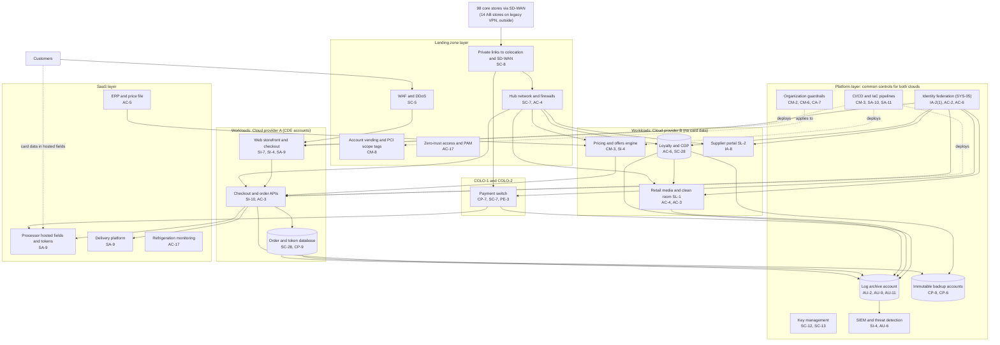

# Cloud Architecture and Control Placement: Cris Santos Company | Retail Trade | Enterprise

**Organization:** Cris Santos Company, Inc. (publicly traded regional supermarket chain) | **Tier:** Enterprise | **Provider:** Multi-cloud, vendor-agnostic: two public cloud providers (called Cloud provider A and Cloud provider B), two colocation sites, and SaaS (see section 4)
**Owner:** Director of Cloud Platform Engineering, with the CISO and the PCI Program Manager | **Date:** 2026-08-31 | **Related:** OCPP SSP (P02), enterprise BIA (P05)

## 1. Architecture in layers
The estate is organized in four layers plus colocation. Each lower layer provides **common controls** that the layers above inherit, so a workload team configures only what is specific to its system.

| Layer | What it is | Examples | Who runs it |
|---|---|---|---|
| **Platform** | Organization-wide services in both clouds | Guardrails, identity federation, key management, log archive, SIEM feeds, vulnerability and posture management, immutable backup accounts, CI/CD pipelines | Cloud Platform Engineering; Security Operations; Identity team |
| **Landing zone** | The standard account pattern every workload lands in | Account vending with mandatory tags (including PCI scope), hub-and-spoke networks with cloud firewalls, WAF and DDoS protection, zero-trust and PAM access, private links to colocation and SD-WAN | Cloud Platform Engineering; Network Engineering |
| **Workload** | Systems the company builds or runs | Cloud A: web storefront and checkout, checkout and order APIs, order and token database (all in the OCPP CDE). Cloud B: loyalty and CDP, pricing and offers engine, retail media and clean room (SL-1), supplier portal (SL-2), data warehouse, cloud AI services | Application teams |
| **SaaS** | Vendor-operated applications | ERP and price file, payroll and HR, productivity suite, ad server and clean room software, refrigeration monitoring, delivery platform, the primary processor's hosted fields and tokens | Vendors, with the company's configuration and oversight |
| **Colocation** | Company equipment in two third-party sites | Payment switch (active-active), network core, weekly backup copies | Store Technology; Network Engineering; providers run the buildings |

**Why the payment switch is not in the cloud.** The switch connects to the store controllers over SD-WAN and to the processor and EBT gateway over dedicated circuits. Keeping it in two colocation sites lets the company run it active-active with fixed network paths and keeps the CDE footprint in the clouds limited to the e-commerce accounts in Cloud A. Cloud B holds no card data; its accounts are tagged out of PCI DSS scope and the annual scope confirmation checks that no card data flows there (PCI DSS 12.5.2).

## 2. Diagram

## 3. Responsibility by service model
Sources: SRC-AWS-SRM, SRC-AZURE-SRM, and SRC-GCP-SRM in `00_universal-framework/sources/source-register.csv`. The three published models agree on the split used here, so the design does not depend on which two providers the company uses.

| Service model | Provider | Company (customer) | Shared |
|---|---|---|---|
| IaaS (network spokes, any virtual machines) | Facilities, hosts, hypervisor, physical network | Guest OS, applications, identities, data, network policy | Encryption (provider service, customer keys), logging |
| PaaS (managed containers, databases, AI services) | Also the platform runtime and its patching | Data, access, configuration, keys, application code, container images | Backups, availability configuration |
| SaaS (ERP, processor services, delivery, refrigeration monitoring) | Also the application | Users, roles, data, oversight of the vendor | Audit review (complementary user entity controls) |
| Colocation | Building, power, cooling, perimeter | Racks, equipment, cage access lists | None |

**PCI DSS overlay.** A cloud provider or SaaS vendor that can affect the security of the CDE is a TPSP. For each one the company keeps the provider's current AOC and a written split of responsibilities (PCI DSS 12.8.4 and 12.8.5). Cloud provider A's service provider AOC covers the services used by the CDE accounts. The processor is responsible for card data entered in its hosted fields and SDK; **the company remains responsible for the checkout page that hosts those fields** (6.4.3, 11.6.1).

## 4. Service categories and provider equivalents
| Service category | AWS | Microsoft Azure | Google Cloud |
|---|---|---|---|
| Organization guardrails | AWS Organizations service control policies | Azure Policy with management groups | Organization Policy Service |
| Account vending | AWS Control Tower account factory | Azure landing zone subscription vending | Resource Manager project creation |
| Key management | AWS KMS | Azure Key Vault | Cloud KMS |
| Audit logging | AWS CloudTrail | Azure Monitor activity log | Cloud Audit Logs |
| Threat detection | Amazon GuardDuty | Microsoft Defender for Cloud | Security Command Center |
| Managed relational database | Amazon RDS | Azure SQL Database | Cloud SQL |
| Managed containers | Amazon EKS | Azure Kubernetes Service | Google Kubernetes Engine |
| Web application firewall | AWS WAF | Azure Web Application Firewall | Cloud Armor |
| Backup service | AWS Backup | Azure Backup | Backup and DR Service |

This table is for reading provider documentation only. The architecture, control map, and SSP describe service categories.

## 5. Common controls
`cloud-control-map.csv` has **61 rows** across 34 components: Platform 19, Landing zone 7, Workload 21, SaaS 9, Colocation 5. Responsibility: Customer 39, Shared 18, Provider 4.

**29 rows are published as common controls** (`common_control` = Yes) in the enterprise common control catalog. They map to the common control providers in the OCPP SSP (P02 section 10.3): identity (CCP-02), landing zones (CCP-03), security operations (CCP-04), network (CCP-05), and physical security of the colocation sites (CCP-07). A workload inherits them by being deployed through account vending, which applies the guardrails, logging, network, key, and backup policies automatically.

**Rules for inheriting:**
1. A workload may claim a common control only if its account was created by account vending and passes the posture baseline.
2. An account tagged in PCI DSS scope must also pass the CDE guardrail set (no public endpoints except through the WAF, egress allow-lists, PAM-only administration).
3. Customer-side identity, data protection, and logging stay explicit at every layer: even a SaaS application has Customer rows for access (AC-2, AC-3, AU-6), because those are always the company's responsibility.
4. SaaS rows cite the vendor's SOC 2 report or AOC, reviewed by the third-party risk team (P09 evidence map).

## 6. Validation against the OCPP SSP (P02)
Every cloud and colocation component in the SSP boundary appears here with controls from each required family, directly or inherited:
| OCPP component | AC | AU | CM | IA | SC | SI |
|---|---|---|---|---|---|---|
| Web storefront and checkout | AC-3 (APIs) | AU-2, AU-9 (inherited) | CM-3 (inherited), CM-7 | IA-2(1) (inherited) | SC-5 (inherited) | SI-7, SI-4 |
| Checkout and order APIs | AC-3, AC-4 (inherited) | AU-2 (inherited) | CM-3 (inherited) | IA-2(1) (inherited) | SC-7, SC-8 (inherited) | SI-10 |
| Order and token database | AC-6 (inherited) | AU-12 | CM-6 (inherited) | IA-2(1) (inherited) | SC-28, SC-12 (inherited) | SI-2 (shared) |
| Payment switch (colocation) | AC-6 (inherited) | AU-6 (inherited) | CM-2 (SSP) | IA-2(1) (inherited) | SC-7 | SI-4 (inherited) |

Store components (lanes, PIN pads, store controllers) are on premises and are covered in the SSP control file, not here.

## 7. Findings from the mapping
1. **Payment pages are a workload responsibility.** No platform service can decide which scripts belong on a checkout page. The script inventory, integrity values, and tamper detection are owned by the e-commerce team; coverage stops at the main web checkout today (POAM-002).
2. **Cloud B must stay out of scope.** The CDP, pricing engine, and retail media receive basket and member data but no card data. One clean room ingest job was found carrying a processor token field in 2026-07; it was removed, and a data discovery scan now runs weekly on Cloud B storage (P03 Visa disclosure row).
3. **Two clouds, one control set.** Guardrails, logging, and key policies are written once as code and applied to both clouds. Differences are limited to service names (section 4).
4. **Colocation is still the payments core.** Switch failover between COLO-1 and COLO-2 works for cards, but SNAP EBT routing has not been tested in failover (POAM-011).
5. **SaaS with store reach.** Refrigeration vendors' remote tools reach store controllers outside PAM (POAM-004); this is the one SaaS dependency that touches the store network directly.
6. **Acquired banner.** The 14 AB stores connect over legacy VPNs to a legacy processor and do not touch the clouds except for order management APIs used by AB pickers over the internet; they join the landing zone pattern at conversion (POAM-001).
