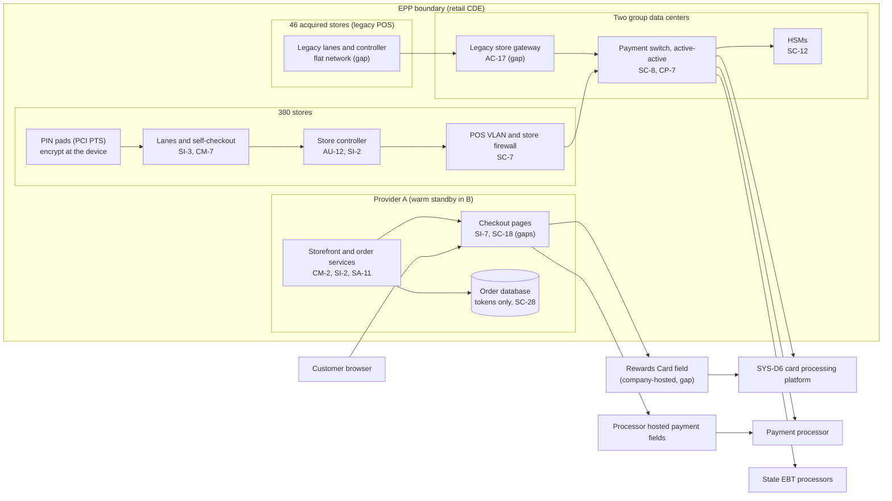

# Cloud Architecture and Control Placement: Cris Santos Company Holdings | Retail Trade | Multi-Sector

**Organization:** Cris Santos Company Holdings, Inc. | **Tier:** Multi-Sector | **Providers:** two public cloud providers, called provider A and provider B (vendor-agnostic; see section 6), plus two group colocation data centers
**Scope:** the shared corporate platform (SYS-G3 landing zones and data centers, SYS-G4 digital front door) plus the division workloads that run on it. The SSP system (P02) is the E-commerce and Point-of-Sale Platform (EPP).

## 1. Design in one paragraph
Corporate runs one **landing zone** per cloud provider: identity federation from SYS-G1, a hub network, guardrail policies, a central log archive, key management, EDR, and an immutable backup vault in provider B. Divisions get their own **accounts** inside the landing zone and inherit these guardrails. The retail CDE accounts (storefront and order services) are separate from every other account. In front of all customer-facing sites sits the **digital front door** (SYS-G4): content delivery and a web application firewall, the **tag management service**, and customer identity. Two parts of the estate are not in the cloud: the **payment switch** and the ERP run in the two group colocation data centers, and the stores and distribution centers run local systems (lanes, store controllers, WMS servers, and OT). Financial Services uses a vendor-hosted card processing platform for accounts and statements.

## 2. Diagrams
### 2.1 Group platform and division workloads

```mermaid
flowchart TB
  subgraph Common["Common controls (corporate; inherited by all divisions)"]
    IDP["Group identity platform SYS-G1<br/>IA-2(1), AC-2, AC-6(5), AC-7"]
    IAM["Cloud IAM, providers A and B<br/>AC-3"]
    HUB["Landing-zone hub network<br/>SC-7, SC-7(5)"]
    PRIV["Private links to data centers, stores, DCs<br/>SC-8(1)"]
    GRD["Guardrail policy service<br/>CM-6"]
    LOG[("Central log archive<br/>AU-9, AU-11")]
    SOC["Group SIEM and SOC SYS-G2<br/>SI-4, AU-6"]
    EDR["Workload protection (EDR)<br/>SI-3"]
    KMS["Key management<br/>SC-12, SC-28(1)"]
    BK[("Immutable backup vault, provider B<br/>CP-9, CP-6")]
    subgraph FD["Digital front door SYS-G4"]
      CDN["CDN and WAF<br/>SC-5, SC-7"]
      TAG["Tag management service<br/>CM-3, SC-18, SA-9 (gaps)"]
      CID["Customer identity<br/>IA-8"]
    end
  end
  subgraph RET["Grocery Retail accounts (provider A)"]
    EPP["EPP storefront and order services<br/>(SSP boundary, see 2.2)"]
    CDP["CDP and loyalty<br/>AC-21 (gap), SC-28"]
    PRC["Pricing and offers engine (vendor SaaS)<br/>SA-9, AU-3"]
  end
  subgraph WHL["Grocery Wholesale"]
    RSP["Retailer Services Portal (provider A)<br/>IA-8 (gap), SC-28"]
    RPP["Portal invoice payment page<br/>SI-7 (gap)"]
    WMS["WMS central instance (data center)<br/>CP-9"]
    OT["DC OT networks (on premises)<br/>SC-7, AC-17 (gaps)"]
    EDI["EDI network provider<br/>SA-9"]
  end
  subgraph FIN["Financial Services"]
    CPP["Card processing platform (vendor SaaS)<br/>SA-9, CP-9, AU-6"]
    CDE2["Credit decision engine (provider A)<br/>CM-3, AU-12"]
    CHP["Cardholder portal and app<br/>IA-8; bill pay page SI-7 (gap)"]
    FDS[("Financial Services data store<br/>SC-28")]
  end
  SW["Payment switch and HSMs<br/>(group data centers)"]
  PROC["Payment processor<br/>(hosted fields, tokens)"]
  IDP --> IAM
  IAM --> RET
  IAM --> WHL
  IAM --> FIN
  CDN --> EPP
  CDN --> RSP
  CDN --> CHP
  TAG -.->|scripts on pages| EPP
  TAG -.->|scripts on pages| RPP
  CID --> EPP
  CID --> RSP
  CID --> CHP
  HUB --> RET
  HUB --> WHL
  HUB --> FIN
  PRIV --> SW
  PRIV --> WMS
  PRIV --> OT
  EPP -->|Rewards Card authorization| CPP
  SW -->|Rewards Card authorization| CPP
  SW --> PROC
  EPP --> PROC
  CPP -->|transaction data, intercompany agreement| CDP
  CDP --> PRC
  WMS --> OT
  RSP --> WMS
  RET --> LOG
  WHL --> LOG
  FIN --> LOG
  LOG --> SOC
  RET --> BK
  WHL --> BK
  FIN --> BK
  GRD -.-> RET
  GRD -.-> WHL
  GRD -.-> FIN
  KMS -.-> FDS
  EDR -.-> EPP
```

### 2.2 E-commerce and Point-of-Sale Platform (SSP boundary)

**Target state (POAM-001, POAM-002, POAM-004, due 2026-11-30 to 2027-03-31):** payment pages load only scripts on an approved list per page, from a payment-pages-only tag container with no "all pages" inheritance; payment page monitoring covers the web checkout, the app web view, the wholesale portal payment page, and the cardholder portal payment page, with alerts to the SOC; the Rewards Card number is entered in an isolated payment frame served by Financial Services, so the retail page never handles it.

## 3. Tenancy and identity decision
- **Decision.** All three divisions sign in through the group identity platform, SYS-G1, and get their own accounts inside the landing zone. No division has its own identity tenant. The retail CDE accounts (storefront and order services) are separate from every other account.
- **Why.** One identity platform and one front door let group internal audit assess them once. Account separation, not tenant separation, is what keeps the CDE apart.
- **What limits blast radius.** Phishing-resistant MFA for administrators and just-in-time PAM elevation with session recording. Roles are federated from SYS-G1, with no local cloud users except sealed break-glass accounts. The hub inspects traffic between division accounts, and CDE accounts accept traffic only from the CDN. Only the pipeline deploys to production. The backup vault uses a separate backup identity.
- **Known gaps.** The POS vendor reaches the 46 acquired stores through its own remote support tool outside PAM (POAM-007). Payment switch application accounts are still managed by hand (POAM-010). Part of the remote workforce still uses number-matching MFA (GR-07).
- **Cross-division risks:** GR-01, GR-02, GR-07, GR-15 in [risk-register.csv](../step-04_P01_risk-register/risk-register.csv).

## 4. Common versus division-specific controls
`cloud-control-map.csv` has 58 rows across 36 components. The `control_scope` column shows who owns each placement:

| Scope | Rows | What it means |
|---|---|---|
| Common (group) | 26 | Provided once by corporate (SYS-G1 to SYS-G4) and inherited by every division account. Listed in the P02 common control catalog |
| Shared system (EPP) | 13 | Controls of the SSP system, including on-premises store and data center components |
| Division-specific (Grocery Retail) | 4 | CDP, loyalty, and the pricing and offers engine |
| Division-specific (Grocery Wholesale) | 7 | Retailer Services Portal, WMS, distribution center OT, EDI |
| Division-specific (Financial Services) | 8 | Card processing platform, credit decision engine, cardholder portal, data store |

| Responsibility | Rows |
|---|---|
| Customer (the group or a division) | 40 |
| Shared (provider and group) | 15 |
| Provider | 3 |

**Rule of thumb.** Identity, network guardrails, logging, keys, backups, EDR, and the digital front door are **common**. A division cannot opt out of them, only request an exception through POL-01. What runs on a page, who may see a customer's data inside an application, and how a division's regulators are served are **division-specific**. The tag management service shows why the line matters: it is a common service, but what it loads onto a payment page is a division's PCI DSS 6.4.3 duty. Today nobody owns that seam (P01 GR-01).

## 5. Layers
| Layer | Common components | Division components | Key controls | Responsibility |
|---|---|---|---|---|
| Identity | SYS-G1, cloud IAM, customer identity | Storefront admin console, portal and cardholder accounts | AC-2, AC-3, AC-6(5), IA-2(1), IA-8 | Customer (configuration); vendor (service) |
| Network | Hub network, private links, CDN and WAF | Store POS VLANs, legacy store gateway, DC OT networks | SC-7, SC-7(5), SC-8, SC-8(1), SC-5, AC-17 | Customer, with provider DDoS protection shared |
| Compute | EDR, guardrails | Storefront containers, credit decision engine, WMS | SI-2, SI-3, CM-2, CM-3, CM-5, SA-11 | Customer (images, code, configuration) |
| Data | Keys, backup vault | Order database, CDP, portal database, Financial Services data store, payment switch HSMs | SC-12, SC-28, SC-28(1), CP-9, CP-6, AC-4, AC-21 | Shared: provider encrypts; group owns keys, data flows, and retention |
| Logging and monitoring | Log archive, SIEM | Payment page monitoring, decision logs | AU-3, AU-6, AU-9, AU-11, AU-12, SI-4, SI-7 | Shared: providers generate platform logs; group retains and reviews |
| SaaS dependencies | Identity, SIEM, tag management, CDN vendors | Processor hosted fields, card processing platform, pricing engine, EDI | SA-9, CP-9, AU-6, SC-18 | Provider for the service; customer for use and oversight |
| Physical | Provider and colocation data centers | Stores and distribution centers (outside this map's cloud scope) | PE-3 | Provider (inherited) or shared |

## 6. Service categories and provider equivalents
The design does not depend on a provider. This table gives each provider's name for each service category, for reading its shared responsibility documentation.

| Service category | AWS | Microsoft Azure | Google Cloud |
|---|---|---|---|
| Account structure and guardrails | AWS Organizations with service control policies | Management groups with Azure Policy | Resource hierarchy with Organization Policy |
| Managed containers | Amazon EKS | Azure Kubernetes Service | Google Kubernetes Engine |
| Managed relational database | Amazon RDS | Azure SQL Database | Cloud SQL |
| Key management | AWS KMS | Azure Key Vault | Cloud KMS |
| Audit logging | AWS CloudTrail | Azure Monitor activity log | Cloud Audit Logs |
| Backup with immutability | AWS Backup (vault lock) | Azure Backup (immutable vault) | Backup and DR Service |
| Private connectivity | AWS Direct Connect | Azure ExpressRoute | Cloud Interconnect |
| Content delivery and web application firewall | Amazon CloudFront with AWS WAF | Azure Front Door with Azure WAF | Cloud CDN with Cloud Armor |

Shared responsibility sources: SRC-AWS-SRM, SRC-AZURE-SRM, SRC-GCP-SRM in `00_universal-framework/sources/source-register.csv`. All three agree on the split used here: for IaaS the provider owns facilities, hosts, and virtualization; for PaaS the provider also owns the runtime; for SaaS the provider owns the application. The customer always keeps identities, access decisions, data classification, and data. For the payment processor's hosted fields, the split is set by the processor's AOC and the PCI responsibility matrix, not by a cloud provider document.

## 7. Findings from the mapping
1. **The weakest point is a common service, not a cloud setting.** Encryption, keys, guardrails, and network separation are sound. The tag management service can put any approved marketing script on any page of any division, including payment pages (CM-3, SC-18; P01 GR-01; POAM-001).
2. **Hosted payment fields protect the fields, not the page.** The processor's fields keep card data out of the EPP, but a script on the surrounding page can draw a fake form. Change and tamper detection (SI-7, PCI DSS 11.6.1) runs only on the retail web checkout, and two other payment pages in the group have none (POAM-002).
3. **The Rewards Card field sits between two programs.** PCI DSS does not cover a private-label card, and the Financial Services Safeguards program did not look at a retail page. The fix is architectural: an isolated payment frame for the Rewards Card, run by Financial Services (AC-4; POAM-004).
4. **Common controls are strong and reused.** One identity platform, one SIEM, one backup design, and one front door let group internal audit assess them once (P07). The weak link is documentation of inheritance for the wholesale portal and the card platform (P02; POAM-018).
5. **Not everything is cloud.** The payment switch, the WMS central instance, stores, and distribution center OT are on premises. They appear here as rows with no cloud shared responsibility reference, so the map shows the whole path of a card transaction and of a store order.
