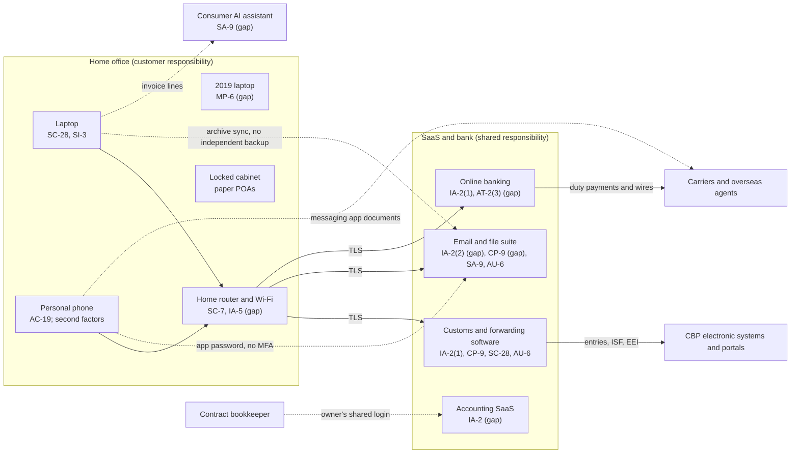

# SaaS Architecture and Control Placement: Cris Santos Company | Transportation and Warehousing | Sole Proprietorship

**Organization:** Cris Santos Company (freight forwarder and customs broker) | **Tier:** Sole Proprietorship | **Provider:** SaaS only (no IaaS or PaaS)
**System:** Core Brokerage SaaS Stack (CBSS), as defined in the system profile (P02) | **Mapped:** 2026-08-19 with the on-call IT consultant | **Adopted:** 2026-09-14

## 1. Diagram
Control IDs on each node are the ones in `cloud-control-map.csv`. Dashed lines are flows with a known gap.

## 2. Layers
| Layer | Components | Key controls | Responsibility |
|---|---|---|---|
| Identity | Customs software, email, accounting, and bank accounts; router admin | IA-2, IA-2(1), IA-2(2), IA-5 | Customer configures; vendors provide MFA |
| Data | Customs records, records archive, ledgers, payee lists, AI chats | CP-9, SC-28, SA-9, AT-2(3) | Vendor protects data inside its service; the owner decides where client records go, whether they are backed up, and who gets paid |
| Endpoints | Laptop, 2019 laptop, phone | SC-28, SI-3, MP-6, AC-19 | Customer |
| Network | Home router and Wi-Fi | SC-7, IA-5 | Customer (the internet provider supplies the router) |
| Logging | Sign-in histories, mailbox rules | AU-2 (vendor), AU-6 (customer) | Shared: vendor records, customer reviews |
| SaaS applications and hosting | Customs software, file suite, accounting, bank platforms | Inherited (AC-3, AU-2, SI-8, PE family) | Provider |

## 3. Shared responsibility for SaaS
All three major cloud providers' shared responsibility models (SRC-AWS-SRM, SRC-AZURE-SRM, SRC-GCP-SRM) agree on the SaaS split: the provider runs the application, the platform, and the facilities; **the customer always keeps its identities and accounts, its data, and its devices.** That is why 14 of the 18 rows in the control map are the owner's alone, 2 are shared, and 2 are the provider's. A vendor's SOC 2 report never covers these customer layers. No IaaS provider equivalents table is needed, because the business runs no infrastructure.

Two customs rules shape the data layer:
- **Location.** Originals of broker records, including electronic records, must be kept within the customs territory of the United States (19 CFR 111.23(a)). The customs software contract states U.S. hosting. The email and file suite's data region has not been confirmed, so the owner must check and record it.
- **Backup copy.** Scanned records are an alternative storage method, which calls for one working copy and one back-up copy in a secure location (19 CFR 163.5(b)(2)(vi)). A synced folder is one copy in two places: deleting or encrypting it on the laptop changes the cloud copy too.

## 4. Findings from the mapping
1. **Email has an MFA bypass.** The 2023 app password for the phone's mail app signs in without a second factor. Email takeover is the first step of the payment fraud in P01 R-001 and R-002.
2. **Payee changes have no technical brake.** The bank's MFA proves the owner is signed in; it does not prove that new wire instructions came from the real carrier. Only the owner's call-back can (AT-2(3)).
3. **The records archive has no independent backup** and its storage region is unconfirmed (R-003, R-009).
4. **The phone is part of the security boundary.** It holds both second factors, the messaging app chats with overseas agents, and photos of client documents (R-005, R-010).
5. **The home router admin password was the default.** Found during P07 testing on 2026-08-20 and added to this map (R-008).
6. **Inherited customs software controls depend on the vendor's SOC 2 report** and on the owner operating the complementary user entity controls listed in P09.
