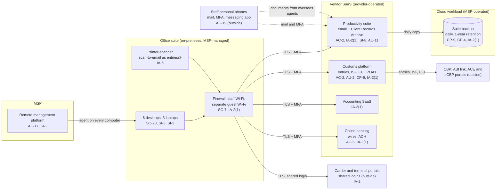

# Cloud Architecture and Control Placement: Cris Santos Company | Transportation and Warehousing | Micro

**Organization:** Cris Santos Company, LLC (freight forwarding and customs brokerage office) | **Tier:** Micro | **Provider:** Vendor-agnostic SaaS (see section 3)
**System:** Core Brokerage SaaS Stack (CBSS), as defined in the SSP (P02) | **Prepared:** 2026-07-31 by the Office and Compliance Manager with the MSP lead technician | **Approved:** owner, 2026-08-31

## 1. Diagram
The company runs no servers and no IaaS tenant. Its "cloud" is a set of SaaS services plus one cloud workload that the MSP operates for it: the SaaS-to-SaaS backup of the productivity suite (SYS-08).

## 2. Layers and who is responsible
| Layer | Components | Key controls | Customer (company) | MSP (on the company's behalf) | Provider (SaaS vendor or bank) |
|---|---|---|---|---|---|
| Identity | Platform, suite, accounting, bank, backup, and firewall logins; shared entries@ and carrier logins | AC-2, IA-2, IA-2(1), IA-5 | Decides who gets access; removes it; enforces MFA settings; owns shared-account clean-up | Creates and disables suite and device accounts; holds backup and firewall admin logins | Runs the sign-in and MFA service |
| Payments | Bank portal users and limits | AC-5 | Sets dual approval and call-back rules | None | Enforces limits and MFA |
| Network | Firewall, Wi-Fi, internet line | SC-7, SI-2, AC-18 | Approves changes | Configures, patches, and monitors | Not applicable |
| Endpoints | 9 computers, printer | SC-28, SI-3, SI-2, IA-5 | Approves patch exceptions; keeps the inventory | Encryption, antivirus, patching, screen lock | Not applicable |
| SaaS applications | Customs platform, suite, accounting | AC-3, AC-12, AU-2, SC-8, SI-8 | Users, roles, sharing, mail filtering and encryption settings, AI feature settings | Suite administration on request | Application, platform, data centers |
| Data | Client Records Archive, platform shipment files, backup copies | CP-9, CP-4, SC-28, SI-12 | Decides retention, storage region, and restore testing | Operates the backup and runs restore tests | Encrypts and backs up its own platform |
| Logging | Platform audit trail, suite logs, firewall logs | AU-2, AU-6, AU-11, SI-4 | **Reviews logs and alerts monthly (gap today)** | Keeps firewall logs; forwards alerts | Generates and stores logs |
| Vendor governance | Contracts, SOC 2 review, MSP review | SA-9 | Reviews SOC 2 and MSP evidence; confirms U.S. storage | Discloses subcontractors (backup service) | Provides SOC 2 reports and contract terms |

**The MSP is not a cloud provider in the shared responsibility sense.** It performs customer-side duties for the company. Anything marked "Customer (performed by MSP)" in `cloud-control-map.csv` remains the company's responsibility under 19 CFR Part 111: the broker must keep its records within the United States (111.23(a)), keep them confidential (111.24), and keep a working copy and a backup copy (163.5(b)(2)(vi)), whoever runs the systems. The company must direct the work, receive evidence, and check it (SA-9).

## 3. Service categories and provider equivalents
The design is vendor-agnostic. The shared responsibility split for SaaS is the same in all three major cloud providers' models: the provider runs the application, platform, and infrastructure; the customer keeps identities, access, data, and devices (SRC-AWS-SRM, SRC-AZURE-SRM, SRC-GCP-SRM in `00_universal-framework/sources/source-register.csv`). For the company's vendors, a SOC 2 report or vendor security documentation is the evidence of the provider side.

| Service category used | What it is here | Equivalent category in the large cloud providers (for reading their documentation) |
|---|---|---|
| Line-of-business SaaS | Customs brokerage and forwarding platform | Industry SaaS built on any provider |
| Productivity suite | Email, calendar, chat, file storage | Productivity and collaboration SaaS |
| SaaS-to-SaaS backup | Daily backup of mail and files | Backup service or third-party SaaS backup |
| Accounting SaaS and bank portal | Ledger, payables, wires | Finance SaaS |
| Remote monitoring and management | MSP device management | Device management SaaS |

## 4. Findings from the mapping
1. **Identity is the weak layer, and it is all on the customer side.** The shared entries@ account (no MFA, password in the printer), shared carrier portal logins, the shared backup administrator login, and the firewall login without MFA are all customer or MSP duties. Tracked as P01 R-003, R-009, and P07 POAM-003 and POAM-004.
2. **Payments have no second check (AC-5).** A compromised mailbox plus one person who can release a wire is the BEC path in P01 R-001. The bank provides dual approval; the company has not turned it on for wires under $25,000.
3. **Data location is not confirmed (SC-28, SA-9).** The customs platform contract states U.S. hosting. The suite and backup data regions have not been checked, so the company cannot yet show that originals and the backup copy of records are kept within the customs territory, as 111.23(a) requires. Fix: confirm the regions and set them where the plan allows, by 2026-10-31 (G-013 in P03).
4. **The backup is the only independent copy, and it is untested.** Ransomware or a malicious deletion through a compromised account would reach the suite; only SYS-08 protects the archive, and nobody has tried a restore. Fix: first restore test by 2026-09-30, quarterly after that, and MFA with named MSP accounts on the console (POAM-007, POAM-008).
5. **The SaaS vendors' side is strong and evidenced** (the customs platform's SOC 2 report). The gaps are on the company's side: account removal, log review, shared accounts, payment checks, and mail filtering settings.
6. **Phones and messaging apps sit outside the boundary but carry records.** They are mapped to show the AC-19 gap. Suite app protection rules bring business mail and files on phones under control without managing personal devices.
