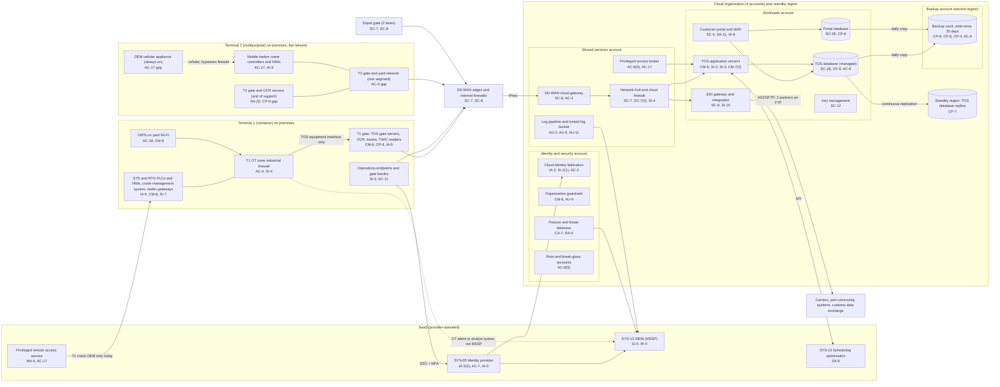

# Cloud Architecture and Control Placement: Cris Santos Company | Transportation and Warehousing | Mid-Market

**Organization:** Cris Santos Company, Inc. (marine cargo terminal operator, two Florida terminals and an off-dock depot) | **Tier:** Mid-Market | **Provider:** Vendor-agnostic public cloud (see section 4), plus SaaS and on-premises terminal systems
**System:** Terminal Operations and Gate Platform (TOGP, CSC-TOGP-01), as defined in the SSP (P02) | **Prepared:** 2026-07-31 by the Security Manager (alternate CySO); updated 2026-09-15 with P07 results
**Control map:** `cloud-control-map.csv` (56 rows, 26 components)
**Handling:** Network and security measure details. Handle as sensitive security information (SSI) under 49 CFR part 1520 (33 CFR 101.630(b); POL-04 4.2).

## 1. Diagram

Dashed lines mark connections that are gaps today: the T2 OEM cellular appliance (P01 R-003) and T1 OT alerts that do not reach the MSSP workflow (P01 R-026).

## 2. Landing zone design
The landing zone separates duties across 4 accounts (subscriptions or projects, depending on the provider) under one cloud organization, plus a standby region for the TOS database. Each account limits what an attacker can do from any other.

| Account | Purpose | Who administers | Key design decisions |
|---|---|---|---|
| **Identity and security** | Organization root, cloud identity federation to the identity provider (SYS-05), organization guardrails, posture management and threat detection | Security Manager and one security analyst | No workloads. Root credentials sealed in the T1 FSO safe. Guardrails apply to every other account and cannot be disabled from them |
| **Shared services** | Network hub and cloud firewall, SD-WAN cloud gateway for T1, T2 and the depot, DNS, privileged access broker, log pipeline and locked log bucket | Director of IT and Cybersecurity's infrastructure team | All traffic between sites, workloads and the internet passes the hub. OT networks are not routed to the cloud. Logs from all accounts land in a write-once bucket here |
| **Workloads** | TOS application and database, EDI gateway and integration services, customer portal and its database, key management | Infrastructure team; TOS Application Manager for the TOS and EDI; the portal team for the portal | Separate subnets per workload. No internet ingress except the portal through the web application firewall. Company-managed keys |
| **Backup** | Backup vault with 35-day write-once retention in a second region | 2 named backup administrators | Separate administrator credentials, not federated to everyday accounts. Backups are written by a cross-account role that can write but not delete |
| **Standby region** (in the workloads account) | Warm standby replica of the TOS database | Infrastructure team | Continuous replication. Because replication copies corruption too, the write-once backup remains the last line of recovery (P05 finding 1) |

**On-premises and OT outside the cloud.** Gate servers, OCR, kiosks and TWIC readers sit at each gate. Crane and yard equipment controllers (SYS-03) never connect to the cloud directly; they reach the TOS only through the T1 OT zone firewall (T1) or the flat network (T2, gap 1). The SD-WAN routes only TOS, EDI and portal subnets to the cloud.

## 3. Layers and shared responsibility per service
| Layer | Components | Key controls | Service model | Responsibility |
|---|---|---|---|---|
| Identity | Cloud federation, root and break-glass accounts, privileged access broker, identity provider tenant | IA-2, IA-2(1), IA-2(2), AC-2, AC-6(5), AC-7, IA-5 | PaaS / SaaS | Customer configures identities, roles, MFA and reviews; provider runs the identity services |
| Network | Hub, cloud firewall, SD-WAN cloud gateway, site firewalls, T1 OT zone firewall, T2 flat network, OEM appliance | SC-7, SC-7(5), SC-8, AC-4, AC-17 | IaaS / on-premises | Customer designs routes, rules and segmentation; provider runs the gateway service. All on-premises network controls are the company's |
| Compute | TOS application servers, EDI gateway, portal containers, T2 gate and OCR servers | CM-6, CM-7(2), SI-2, SI-3, SA-11, SA-22, SC-5 | IaaS / PaaS / on-premises | Customer owns the guest OS, applications and EDR; TOS vendor supports the TOS under contract; provider owns hosts and hypervisor |
| Data | TOS and portal databases, keys, backup vault, standby replica | SC-28, SC-12, CP-9, CP-6, CP-4, CP-7, AC-6, SI-10 | PaaS | Shared: provider encrypts and operates storage and database engines; customer controls keys, access, retention, isolation, failover and restore testing |
| Logging and monitoring | Log pipeline, guardrails, posture service, SIEM, T1 OT sensors | AU-2, AU-9, AU-11, CA-7, RA-5, SI-4, IR-4 | PaaS / SaaS / on-premises | Shared: provider generates logs and detections; customer enables, retains, forwards and acts on them; MSSP monitors IT sources only |
| SaaS applications | Identity provider, SIEM, privileged remote access service, scheduling optimization service | IA-2(2), AC-7, IA-5, SI-4, IR-4, MA-4, AC-17, SA-9 | SaaS | Provider runs the application; customer keeps users, roles, approvals, session review and data |
| Physical | Provider data centers | PE-3, PE-13 | All cloud | Provider (inherited, evidenced by its SOC 2 report). Terminal server rooms and crane electrical houses are the company's (P02 PE-3) |

**Responsibility counts in `cloud-control-map.csv`:** 31 Customer, 21 Shared, 4 Provider. By service model: 27 PaaS, 14 IaaS, 8 SaaS and 7 On-premises rows. The on-premises rows are included because the TOGP boundary crosses into the terminals, and the most important gaps sit there. As the three providers' shared responsibility models agree, identity, data protection and logging always stay with the customer.

## 4. Service categories and provider equivalents
The design is independent of the provider. This table gives each provider's name for the service category, for reading its shared responsibility documentation (SRC-AWS-SRM, SRC-AZURE-SRM, SRC-GCP-SRM in `00_universal-framework/sources/source-register.csv`).

| Service category | AWS | Microsoft Azure | Google Cloud |
|---|---|---|---|
| Multi-account organization and guardrails | AWS Organizations, service control policies | Management groups, Azure Policy | Resource Manager folders, organization policies |
| Account, subscription or project | Account | Subscription | Project |
| Cloud identity federation | IAM Identity Center | Microsoft Entra ID with Azure RBAC | Cloud Identity with IAM |
| Network hub | Transit Gateway | Virtual WAN hub or hub virtual network | Network Connectivity Center or shared VPC |
| Cloud firewall | AWS Network Firewall | Azure Firewall | Cloud NGFW |
| SD-WAN or site-to-cloud gateway | Site-to-Site VPN or Cloud WAN | VPN Gateway or Virtual WAN | Cloud VPN or Network Connectivity Center |
| Virtual machines | EC2 | Virtual Machines | Compute Engine |
| Containers for the portal | ECS or EKS | Container Apps or AKS | Cloud Run or GKE |
| Web application firewall and denial-of-service protection | AWS WAF, Shield | Azure WAF, DDoS Protection | Cloud Armor |
| Managed relational database with cross-region replica | RDS or Aurora with cross-region replica | Azure SQL or Database for PostgreSQL with geo-replication | Cloud SQL with cross-region replica |
| Backup service with write-once retention | AWS Backup (vault lock) | Azure Backup (immutable vault) | Backup and DR Service (backup vault) |
| Key management | AWS KMS | Azure Key Vault | Cloud KMS |
| Audit logging | CloudTrail | Azure Monitor activity log | Cloud Audit Logs |
| Posture and threat detection | Security Hub, GuardDuty | Microsoft Defender for Cloud | Security Command Center |

**Service model split used here (all three providers agree):**
- **IaaS** (virtual machines, networks): the provider owns facilities, hosts and virtualization. The customer owns the guest OS, applications, network configuration, identities and data.
- **PaaS** (managed database, containers, backup, key service, guardrails): the provider also owns the platform software and its patching. The customer owns access, keys, data and configuration.
- **SaaS** (identity provider, SIEM, remote access service, scheduling optimization): the provider also owns the application. The customer keeps identities, roles, approvals, audit review and data.

## 5. Findings from the mapping
1. **The cloud is the strongest part of the TOGP; the terminals are the weakest.** The landing zone has guardrails, a deny-by-default hub, write-once backups in a second region and just-in-time administration. The serious gaps are on premises: the T2 flat network (P01 R-002), the OEM cellular appliance that bypasses every firewall (R-003), end-of-support T2 servers without backup images (R-010, R-017), and default passwords on reefer gateways and OCR camera controllers found in P07 (R-008). Fix: T2 OT zone by 2027-03-31; appliance off by default with access moved to the privileged remote access service by 2026-12-31.
2. **Recovery is designed but unproven.** The standby replica and write-once backups exist, but the failover runbook has never been run and the 2026-04-22 restore took 6.5 hours against a 4-hour RTO (R-004). Fix: failover test on 2026-11-07 and hourly isolated database snapshots, so a corrupted replica does not force a 24-hour data loss.
3. **Third-party sessions are only partly brokered.** The privileged remote access service records T1 crane OEM sessions, but 26 other vendors with access are not onboarded (R-003, R-018). Subpart F requires all third-party remote connections to be monitored and documented (101.650(f)(3)).
4. **Monitoring stops at the OT boundary.** Cloud, identity and firewall logs reach the MSSP. T1 OT sensor alerts go to an analyst queue reviewed on business days, and T2 gate servers send nothing (R-021, R-026). Fix: logging standard STD-03 and MSSP onboarding by 2027-01-31.
5. **EDI integrity depends on partners.** Two carrier services still use plain FTP, and release and hold messages get only syntax checks (R-019, R-033). Fix: SFTP or AS2 for all partners by 2026-12-31 and business-rule checks on release changes.
6. **Boundary check.** Every in-scope component in the SSP (P02 section 9) appears in the diagram. Every cloud account has at least one row in the control map, and each has controls from at least 2 of the AC, AU, CM, IA, SC and SI families or inherits them.
7. **Inherited controls rely on SOC 2 reports.** Controls marked Provider or Shared for the cloud provider, identity provider, MSSP and TOS vendor depend on their SOC 2 Type 2 reports and the complementary user entity controls, reviewed each year in P09 `vendor-soc2-review.csv`. The scheduling optimization vendor and the privileged remote access service vendor have not yet supplied reports (P10; P09).
