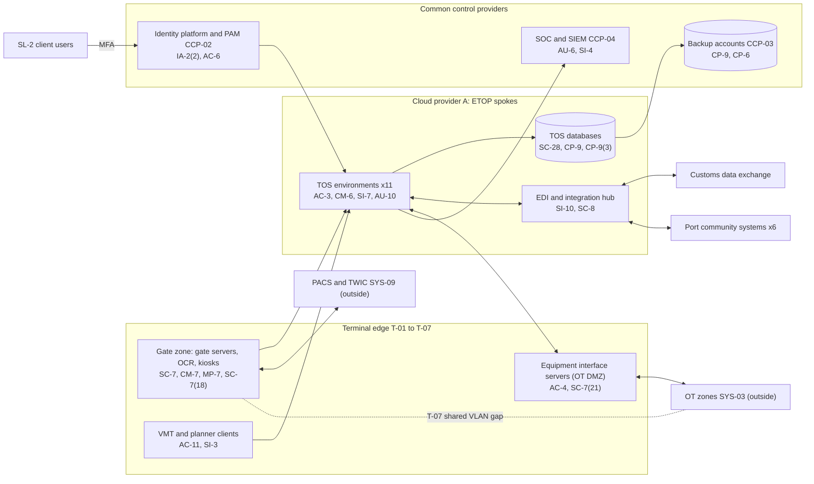

# System Security Plan: Enterprise Terminal Operating and Gate Platform (ETOP)

**Organization:** Cris Santos Company, Inc. (publicly traded multi-port marine cargo terminal operator) | **Tier:** Enterprise | **Vertical:** Transportation and Warehousing
**Outline:** NIST SP 800-18 Rev. 2, System Security Plan Outline Example (June 2026) | **Version:** 2.0, 2026-09-14
**Handling:** Contains network and security measure details that will be used in the Cybersecurity Plans. Handle as sensitive security information (SSI) under 49 CFR part 1520 (33 CFR 101.630(b); POL-04).

## 1. System Name and Identifier
Enterprise Terminal Operating and Gate Platform (**ETOP**), identifier CSC-SYS-ETOP-001. Tier-1 system in the enterprise application inventory and a critical IT system under 33 CFR 101.615 at T-01 to T-07 and at the 4 SL-2 client terminals.

## 2. System Overview
ETOP runs the cargo processes of 7 company terminals and 4 client terminals: vessel, berth and yard planning; equipment dispatch to cranes, straddle carriers and yard tractors; the truck gate; customs release and hold status; EDI with carriers, port community systems and rail partners; and billing feeds. It is the system of record for every container, its location, its holds and its hazardous cargo class. Volume across the company terminals is about 8.2 million container moves a year (T-08 runs a legacy system until 2027) and about 20,000 truck gate transactions a day at T-01 to T-07.

**Why integrity and availability matter most.** A wrong hold status can release a container that U.S. Customs and Border Protection has held, or stop all import deliveries. A wrong location or hazardous class can put a heavy or dangerous box in the wrong stack and leave emergency responders without accurate information. Because one platform serves 11 terminals, a platform outage stops vessel and gate work at several ports at once (P05 BP-01, BP-02, BP-11).

**Major components:**
- **SYS-01 TOS platform:** commercial TOS software, customer-managed, on IaaS virtual machines and managed databases in Cloud provider A; one production environment per terminal (T-01 to T-07) and per SL-2 client (C-01 to C-04), each in its own landing zone spoke
- **SYS-04 (TOS channels):** the EDI and integration hub (B2B gateway for AS2 and SFTP, API gateway) for carriers, the customs data exchange service, the 6 port community systems, rail partners and SL-1
- **SYS-02 gate automation at T-01 to T-07:** gate transaction servers, OCR portals and servers, driver kiosks and gate booth workstations in a gate zone at each terminal
- **Equipment interface servers** in the OT DMZ at the 5 container terminals, which pass job instructions and completions between ETOP and the equipment control systems
- **The ETOP clients:** planner, superintendent, billing and gate workstations, and the VMT application on about 1,900 vehicle-mounted terminals

Users: about 3,600 workforce accounts; about 1,150 SL-2 client user accounts; longshore equipment operators sign in to VMTs with a personal PIN tied to their hiring hall registration, issued daily from the labor ordering system.

## 3. Laws, Regulations, and Policies Affecting the System
| ID | Requirement | Citation | How it affects ETOP |
|---|---|---|---|
| N48-49-R01 | USCG Cybersecurity in the Marine Transportation System | 33 CFR Part 101, Subpart F (101.600-101.670); 90 FR 6298 | ETOP is a critical IT system at every facility it serves; its controls implement the 101.650 measures that the Cybersecurity Plans must document |
| MTSA | Facility security plans, TWIC access control, records | 33 CFR Part 105 (for example 105.225 records; 105.305 FSA) | The gate module enforces TWIC checks through the PACS; the dangerous cargo location list comes from ETOP |
| Reporting | Cyber incident reporting to the FBI, CISA and the COTP; MTSA reporting | 33 CFR 6.16-1; 33 CFR 101.305 | An ETOP incident is reported in every COTP zone it affects (P08) |
| SSI | Protection of sensitive security information | 49 CFR part 1520 (Plans are SSI per 101.630(b)) | This plan and the network details are handled as SSI |
| N48-49-R05 | CTPAT (voluntary partner since 2019) | CBP minimum security criteria | Cargo release integrity and cybersecurity criteria |
| N48-49-R08 | SEC cybersecurity disclosure | Form 8-K Item 1.05; 17 CFR 229.106 | A material ETOP incident goes through the P08 materiality step |
| State | State breach notification laws | Each state where affected individuals reside (Florida worked example: Fla. Stat. 501.171) | Driver profiles with driver license numbers |
| Safety | OSHA marine terminal standards | 29 CFR part 1917 | Safe cargo handling; relevant to equipment dispatch and AI-001 |
| Contract | SL-2 client agreements; SL-1 terms; terminal services agreements | P09 | Availability, confidentiality and processing integrity commitments |
| Internal | POL-01 to POL-05 and standards | P06 | Enterprise policy hierarchy |

Not applicable: TSA rail, pipeline and aviation Security Directives (N48-49-R02 to R04; not that kind of operator); DOT airline authority (N48-49-R06); CMMC and FAR clauses (N48-49-R07; no federal or DoD contracts).

## 4. System Status
### 4.1 System Security Plan Approval
Prepared by the TOS Platform Manager and the GRC team. Reviewed by the CISO, the Director of Maritime Cybersecurity (CySO) and the Vice President, Terminal Technology. Approved by the Chief Operating Officer on 2026-09-14.
### 4.2 System Authorization Decision
The company is not a federal agency, so there is no formal ATO. The equivalent internal decision:
- **Authorizing official equivalent:** Chief Operating Officer, with the CISO's and the CySO's recommendation.
- **Decision (2026-09-14):** continue operation with conditions, based on the Internal Audit assessment (P07) and the risk register (P01).
- **Conditions:** prove the 4-hour RTO for all 11 environments (POAM-005 by 2027-02-28); move both OEMs onto the vendor access gateway (POAM-002 by 2026-12-15); isolate the T-07 gate servers from OT (POAM-003, T-07 milestone 2027-02-28); bring T-07 gate logs into the SIEM (POAM-008, T-07 milestone 2026-12-15).
- **Coast Guard approval** that matters for ETOP is approval of the Cybersecurity Plans (101.630(d)), which will reuse sections 7 to 11 of this plan. Target submission: 2027-04-30.
- **Reauthorization:** annually, or after a major change (for example, onboarding T-08 to ETOP in 2027).
### 4.3 System Operational Status
Operational. Planned major modifications: parallel restore automation (CP-10(4)); T-08 migration onto ETOP (due 2027-06-30); OCR server replacement (2026-12); automated integrity alerts for hold and hazardous cargo tables (SI-7(2)).

## 5. Role Identification and Responsible Personnel
| Role | Title | Responsibility |
|---|---|---|
| System owner | Vice President, Terminal Technology | Accountable for ETOP and SL-2; approves access roles |
| Authorizing official (equivalent) | Chief Operating Officer | Accepts residual risk to operate |
| Cybersecurity Officer | Director of Maritime Cybersecurity | CySO for all 8 facilities (101.625); ensures ETOP measures are in the Plans and KEVs are handled |
| Terminal business owners | Terminal General Managers (T-01 to T-07) | Approve terminal roles; run manual procedures in outages |
| System administrator | TOS Platform Manager | Day-to-day administration, configuration and change control |
| Information security | CISO; Director of Security Operations | Program oversight; SOC monitoring; incident command |
| Maritime security | Vice President, Maritime Security; FSOs | TWIC and PACS integration; hazardous cargo list; MTSA reporting |
| Common control providers | See section 10.3 | Operate inherited controls |
| Independent assessor | Chief Audit Executive (Internal Audit) | Annual assessment (P07) and future Plan audits |

## 6. System Information Types and System Categorization
Information types come from NIST SP 800-60 Vol. 2 Rev. 1. Impact levels follow FIPS 199.

| Information type | Confidentiality | Integrity | Availability | Rationale |
|---|---|---|---|---|
| Water transportation (vessel, yard and gate operations; container location and status; holds; hazardous cargo class and location) | Moderate | **High (treated)** | **High (treated)** | A wrong hold or hazardous class can release held cargo or endanger workers and responders. Loss stops vessel and gate work at up to 11 terminals at once (P05: MTD 8 h, RTO 4 h for BP-01, BP-02, BP-11) |
| Logistics management (EDI with carriers, customs data exchange, port community systems) | Moderate | Moderate | Moderate | Bills of lading and release status are commercially sensitive; partners can resend 24 hours of messages (P05 BP-05) |
| Personal identity and authentication (driver profiles, license numbers, TWIC status) | Moderate | Moderate | Low | State breach law personal information; TWIC records must be protected under 105.225(c) |
| Revenue collection (billing feeds) | Low | Moderate | Low | Invoices can be rebuilt from move history (P05 BP-13) |
| Information security (audit logs, configurations, credentials) | Moderate | Moderate | Moderate | Evidence for incident response and the Plans |
| **ETOP category** | **Moderate** | **Moderate baseline, integrity supplemented** | **Moderate baseline, availability supplemented** | See the decision below |

**Categorization decision.** Under a strict FIPS 199 high-water mark, the High integrity and availability ratings would make the whole system High. The company is not a federal agency and uses FIPS 199 as a model. The risk committee of the board approved this tailoring on 2026-09-10:
- ETOP uses the **SP 800-53B Moderate baseline**.
- It adds **12 High-baseline controls** for integrity and availability: CP-2(2), CP-2(5), CP-4(2), CP-6(2), CP-7(4), CP-9(3), CP-10(4), AU-10, CM-3(1), SI-7(2), SC-7(18), SC-7(21).
- The decision is reviewed annually. If the recovery and integrity POA&M items (POAM-005, POAM-014, POAM-017) are not closed by 2027-06-30, the CISO will recommend full High categorization.

**Documented controls.** `control-implementation.csv` documents **147 controls**: 135 from the Moderate baseline and 12 High-baseline supplements. The remaining Moderate-baseline controls and enhancements are fully inherited from the common control catalog (section 10.3) and are listed there rather than repeated here. CSF 2.0 subcategories in the CSV come from the NIST CSF 2.0 to SP 800-53 crosswalk (`00_universal-framework/crosswalks/csf2_to_sp800-53r5.csv`); the column is blank where the crosswalk lists none.

## 7. Authorization Boundary Description
**Inside the boundary:** the 11 TOS environments (application servers and databases) in their Cloud provider A spokes; the TOS channels of the EDI and integration hub; gate servers, OCR servers, kiosks and gate booth workstations at T-01 to T-07; the equipment interface servers in the OT DMZ at the 5 container terminals; ETOP client software on planner workstations and VMTs.

**Outside the boundary (common control providers and interconnected systems):**
- Landing zone services (hub network, key management, log archive, backup accounts, standby region): CCP-03
- Identity platform (SYS-05) and PAM: CCP-02
- SOC, SIEM, EDR, scanners: CCP-04
- OT (SYS-03): cranes, the T-01 automated yard, RTGs, reefer monitoring; OT zones and the vendor access gateway: CCP-10 and CCP-05
- PACS and TWIC readers (SYS-09): CCP-07
- SL-1 platform (SYS-11), customs data exchange service, port community systems, carriers, rail partners, SL-2 client networks, the T-08 legacy estate (SYS-13) over a restricted site link

**Boundary weakness.** At T-07 the gate servers share a VLAN with RTG controllers and reefer monitoring, so the boundary between ETOP and OT is not enforced there (POAM-003).

The enterprise multi-cloud diagram is in P04 `cloud-architecture.md`.

## 8. Information Exchanges Summary
| Connected system / party | Direction | Data | Protection | Agreement |
|---|---|---|---|---|
| Ocean carriers (about 25) | Bidirectional EDI | Bay plans, load and discharge lists, container status | AS2 with signing (23 carriers) or SFTP (2) | Terminal services agreements |
| Customs data exchange service | Inbound | Release and hold status from CBP | SFTP and API over TLS | Service agreement; **no security or notice terms (POAM-022)** |
| Port community systems (6 ports) | Bidirectional API | Vessel schedules, gate status | TLS with per-partner keys | Data exchange terms; **no security or notice terms (POAM-022)** |
| Rail partners | Bidirectional EDI | Rail lists, interchange | AS2 | Rail agreements |
| SL-1 platform (SYS-11) | Bidirectional API | Availability, holds, appointments | TLS, mutual authentication | Internal |
| SL-2 client terminals (C-01 to C-04) | Users and client integrations | Each client's terminal data | TLS; MFA; tenant isolation | Client agreements; **24-hour incident notice term (POAM-011)** |
| OT equipment control systems (SYS-03) | Bidirectional through the OT DMZ | Job instructions, completions, positions | Allow-listed protocol through OT firewalls (T-01 to T-06); **shared VLAN at T-07 (POAM-003)** | Internal |
| PACS (SYS-09) | Inbound to gate | TWIC validation results | Gate zone to PACS servers in DC-1 | Internal |
| AI-001 scheduling service (Cloud provider B) | Bidirectional API | Move history, schedules; recommendations to a staging area | TLS; scoped service identity | Internal; AI governance committee (P10) |
| TOS software vendor | Remote support | Troubleshooting access | Vendor access gateway; **2 environments outside PAM (POAM-015)** | Support agreement |
| T-08 legacy estate (SYS-13) | Restricted site link | Migration test data | IPsec; named services only | Internal (until migration) |

## 9. System Component Inventory
| Component | Type | Location / provider | Owner |
|---|---|---|---|
| TOS application servers (44 across 11 environments) | IaaS virtual machines | Cloud provider A, primary region; warm standby in a second region | TOS Platform Manager |
| TOS databases (11) | Managed relational database (PaaS) | Cloud provider A | TOS Platform Manager |
| EDI and integration hub (B2B gateway, API gateway) | PaaS | Cloud provider A | Vice President, Terminal Technology |
| Gate transaction servers (14), OCR servers (22), OCR portals, driver kiosks (about 90) | On-premises servers and devices | Gate zones at T-01 to T-07 | Vice President, Terminal Technology |
| Equipment interface servers (10) | On-premises servers | OT DMZ at T-01, T-03, T-04, T-06, T-07 | TOS Platform Manager |
| Gate booth and planner workstations (about 1,400) | Endpoints | Terminals and the enterprise planning center | Director of Endpoint Engineering |
| VMTs (about 1,900) | Rugged vehicle-mounted terminals | Yard tractors and straddle carriers | Director of Endpoint Engineering |

## 10. Control Implementation Details
### 10.1 Control implementation status
See `control-implementation.csv` (147 controls).

| Status | Count |
|---|---|
| Implemented | 108 |
| Partially implemented | 36 |
| Planned | 3 |
| **Total** | **147** |

| Inheritance | Count |
|---|---|
| Common (fully inherited from a common control provider) | 90 |
| Hybrid (shared between a provider and the ETOP team) | 24 |
| System-specific | 33 |

The Planned controls are High-baseline supplements: CP-10(4), CM-3(1), SI-7(2). Partially implemented controls: AC-2, AC-2(3), AC-5, AC-6, AC-17, AT-2, AT-3, AU-6, AU-10, AU-11, CM-2, CM-3, CM-7, CM-8, CP-2, CP-4, CP-4(2), CP-7(4), CP-10, IA-5, IR-4, IR-6, IR-8, MA-4, MP-7, PS-4, RA-5, RA-5(11), SA-9, SA-22, SC-7, SC-7(21), SI-2, SI-3, SI-4, SR-8.

### 10.2 Control assessment status
Internal Audit assessed 45 of these controls from 2026-07-13 to 2026-08-28 using SP 800-53A Rev. 5 procedures and statistical sampling (P07 `assessment-plan.md`, `assessment-results.csv`). Weaknesses are in P07 `poam.csv`.

### 10.3 Common control providers and inheritance
Common and hybrid controls are inherited from the enterprise platform. Each provider publishes its controls in the enterprise **common control catalog** (maintained by the GRC team in the GRC platform) and is assessed on its own cycle; ETOP inherits the results.

| Provider | Name | Accountable role | Controls provided | Rows in this plan | Evidence of operation |
|---|---|---|---|---|---|
| CCP-01 | Enterprise GRC program | CISO (with the Chief Risk Officer and the Chief Audit Executive for assessment) | Policies and standards (P06), risk methodology, assessment, POA&M, continuous monitoring | 25 | Annual Internal Audit assessment (P07); GRC platform |
| CCP-02 | Identity platform (SYS-05) | Director of Identity and Access Management | SSO, MFA, PAM, identity governance, account lifecycle | 14 | SOX IT general control testing; P07 AC-2, IA-2 results |
| CCP-03 | Cloud landing zone (Cloud provider A) | Director of Cloud Platform Engineering | Guardrails, network policies, key management, encryption, backups, log archive, standby region | 15 | Posture reports; provider SOC 2 Type 2 (physical and hypervisor) |
| CCP-04 | Security operations | Director of Security Operations | 24x7 SOC, SIEM, vulnerability management, incident response, threat intelligence | 17 | SOC metrics; P07 SI-4, RA-5, IR results |
| CCP-05 | Enterprise and terminal networks (SYS-07) | Director of Network Engineering | SD-WAN, terminal LANs, gate zones, firewalls, wireless, transport encryption | 10 | Network configuration reviews; P07 SC-7 results |
| CCP-06 | Endpoint engineering (SYS-08) | Director of Endpoint Engineering | Workstation and VMT baselines, EDR, device control | 6 | Configuration and EDR coverage reports |
| CCP-07 | Maritime and physical security; colocation providers | Vice President, Maritime Security | Physical access to gate server rooms; PACS; colocation physical controls | 4 | FSO access reviews; colocation SOC 2 reports |
| CCP-08 | Human resources and workforce training | Chief People Officer | Screening, terminations, sanctions, training, acknowledgments | 8 | HR and learning system reports |
| CCP-09 | Third-party risk management | Director of Third-Party Risk Management | Vendor tiering, contract clauses, SOC report reviews, supply chain risk management | 9 | Vendor register; SOC report reviews |
| CCP-10 | OT engineering | Director of OT Engineering | OT zones with Network Engineering, OEM access, OT inventory and configuration records, controller program vault | 6 | OT inventory; gateway records; P07 IA-5, MA-4, CM-8 results |

**Inheritance rules:**
- A Common control is fully inherited; the ETOP team verifies only that ETOP is onboarded (for example, SSO integration and log forwarding).
- A Hybrid control names both parts in the implementation statement: the provider's part and the ETOP team's part.
- If a provider's assessment finds a weakness, the finding is linked to every inheriting system's POA&M. Example: POAM-012 (T-08 endpoints without EDR) is a CCP-06 weakness that affects ETOP because T-08 reaches ETOP over the site link.

## 11. Digital Identity Acceptance Statement
- **Workforce users:** SSO with MFA (authenticator app with number matching). Privileged users use phishing-resistant FIDO2 keys through PAM. This is comparable to NIST SP 800-63 AAL2 for users and AAL3-like protection for privileged users, and meets the Subpart F requirement for MFA on password-protected IT systems (101.650(a)(4)).
- **Gate booths:** named accounts with badge tap plus PIN, because gate throughput cannot absorb a phone prompt at every lane change. The badge and PIN are two factors bound to the person.
- **VMTs:** longshore operators sign in with a personal PIN tied to their hiring hall registration on a certificate-authenticated device; the PIN expires at the end of the shift. This gives separate credentials per operator (101.650(a)(6)).
- **SL-2 client users:** identity is vouched for by the client administrator under the client agreement; MFA is enforced by the platform. Inactive-account disablement is due with POAM-018.
- **Truck drivers** do not sign in to ETOP. They are identified at the gate by TWIC and appointment under the FSPs, and use SL-1 for appointments (P09).

## 12. Referenced Artifacts
Scenario facts (`../00_company-facts.md`), BIA (P05), multi-cloud architecture and control map (P04), enterprise risk register (P01), regulatory gap analysis (P03), policy hierarchy and policies (P06), Internal Audit assessment and POA&M (P07), ransomware runbook (P08), SOC 2 readiness for SL-1 and SL-2 (P09), AI portfolio including AI-001 (P10), ETOP contingency plan v3, Facility Security Plans and Facility Security Assessments (SSI, held by the FSOs), enterprise common control catalog.

## 13. Acronym List and Glossary
- **CCP:** common control provider
- **COTP:** Captain of the Port
- **CySO:** Cybersecurity Officer (33 CFR 101.615)
- **EDI:** electronic data interchange
- **ETOP:** Enterprise Terminal Operating and Gate Platform
- **FSO / FSP / FSA:** Facility Security Officer / Plan / Assessment (33 CFR Part 105)
- **KEV:** Known Exploited Vulnerability
- **OCR:** optical character recognition
- **OT DMZ:** network zone between IT and OT that hosts the equipment interface servers
- **TOS:** terminal operating system
- **VMT:** vehicle-mounted terminal

## 14. System Security Plan Review and Change Records
| Version | Date | Change | Author |
|---|---|---|---|
| 1.0 | 2025-09-12 | Initial plan (Moderate baseline) for T-01 to T-07 and SL-2 | TOS Platform Manager |
| 1.1 | 2026-02-20 | Added the T-08 site link and the restricted migration interconnection | TOS Platform Manager |
| 2.0 | 2026-09-14 | Integrity and availability supplementation; common control provider mapping; 2026 assessment results; Subpart F drivers | TOS Platform Manager with the GRC team |
