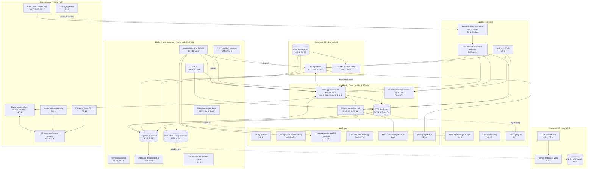

# Cloud Architecture and Control Placement: Cris Santos Company | Transportation and Warehousing | Enterprise

**Organization:** Cris Santos Company, Inc. (publicly traded multi-port marine cargo terminal operator) | **Tier:** Enterprise | **Provider:** Multi-cloud, vendor-agnostic: two public cloud providers (called Cloud provider A and Cloud provider B), two colocation data centers, SaaS, and an OT edge at each terminal (see section 4)
**Owner:** Director of Cloud Platform Engineering, with the CISO and the Director of OT Engineering | **Date:** 2026-08-31 | **Related:** ETOP SSP (P02), enterprise BIA (P05)
**Handling:** The network detail here will feed Sections 7 and 8 of the Cybersecurity Plans, which are sensitive security information (33 CFR 101.630(b)). This summary uses service categories and no addresses.

## 1. Architecture in layers
The estate is organized in six layers. Each lower layer provides **common controls** that the layers above inherit, so a workload team configures only what is specific to its system.

| Layer | What it is | Examples | Who runs it |
|---|---|---|---|
| **Platform** | Organization-wide services in both clouds | Cloud organization guardrails, identity federation, PAM, key management, log archive, SIEM feeds, vulnerability and posture management, immutable backup accounts, CI/CD pipelines | Cloud Platform Engineering; Security Operations; Identity team |
| **Landing zone** | The standard account pattern every workload lands in | Account vending with mandatory tags (including a critical-IT tag for 101.650(b)(3)), hub-and-spoke networks with cloud firewalls, WAF and DDoS protection, zero-trust access, private links to colocation and the SD-WAN, a standby region | Cloud Platform Engineering; Network Engineering |
| **Workload** | Systems the company builds or runs | Cloud A: ETOP (11 TOS environments, including the 4 SL-2 client environments), TOS databases, EDI and integration hub. Cloud B: SL-1 platform, data and analytics platform, AI and machine-learning platform (AI-001) | Terminal Technology; Digital Services; Data and Analytics |
| **SaaS** | Vendor-operated applications | Identity platform, ERP, payroll and labor ordering, productivity suite, customs data exchange service, messaging service; port community systems run by the port authorities | Vendors and port authorities, with company configuration and oversight |
| **Colocation** | Two colocation data centers | DC-1 (Florida): network core, central PACS and video servers. DC-2 (Georgia): PACS standby and the offline backup vault | Network Engineering; Maritime Security; colocation providers |
| **Terminal edge** | On-premises zones at each terminal | Gate zones (gate servers, OCR, kiosks), the OT DMZ with equipment interface servers, OT zones behind internal firewalls, private LTE and Wi-Fi for equipment, the vendor access gateway, the T-08 legacy estate | Network Engineering; OT Engineering; Terminal Technology |

## 2. Diagram

## 3. Responsibility by service model
Sources: SRC-AWS-SRM, SRC-AZURE-SRM and SRC-GCP-SRM in `00_universal-framework/sources/source-register.csv`. The three published models agree on the split used here, so the design does not depend on which two providers the company uses.

| Service model | Provider | Company (customer) | Shared |
|---|---|---|---|
| IaaS (TOS application servers, PAM) | Facilities, hosts, hypervisor, physical network | Guest OS, TOS software, identities, data, network policy | Encryption (provider service, company keys), logging |
| PaaS (TOS databases, EDI hub, SL-1 containers, analytics, ML platform) | Also the platform runtime and its patching | Data, access, configuration, keys, application code and models | Backups, availability configuration |
| SaaS (identity, ERP, customs data exchange, messaging) | Also the application | Users, roles, data, oversight of the vendor | Audit review (complementary user entity controls) |
| Colocation | Building, power, cooling, perimeter | Racks, equipment, cage access lists | None |
| Terminal edge (on premises) | Not applicable | Everything: gate zones, OT zones, equipment interface, wireless, vendor gateway | OEMs maintain controllers under service contracts |

Port community systems are run by the port authorities. There is no published shared responsibility model, so the split is set by each data exchange agreement, and none of the 6 agreements has security or notification terms yet (POAM-022).

## 4. Service categories and provider equivalents
| Service category | AWS | Microsoft Azure | Google Cloud |
|---|---|---|---|
| Organization guardrails | AWS Organizations service control policies | Azure Policy with management groups | Organization Policy Service |
| Account vending | AWS Control Tower account factory | Azure landing zone subscription vending | Resource Manager project creation |
| Key management | AWS KMS | Azure Key Vault | Cloud KMS |
| Audit logging | AWS CloudTrail | Azure Monitor activity log | Cloud Audit Logs |
| Threat detection | Amazon GuardDuty | Microsoft Defender for Cloud | Security Command Center |
| Managed relational database | Amazon RDS | Azure SQL Database | Cloud SQL |
| Managed containers | Amazon EKS | Azure Kubernetes Service | Google Kubernetes Engine |
| Web application firewall | AWS WAF | Azure Web Application Firewall | Cloud Armor |
| Backup service | AWS Backup | Azure Backup | Backup and DR Service |
| Managed machine learning | Amazon SageMaker | Azure Machine Learning | Vertex AI |

This table is for reading provider documentation only. The architecture, control map and SSP describe service categories.

## 5. Common controls
`cloud-control-map.csv` has **69 rows** across 37 components: Platform 18, Landing zone 8, Workload 20, SaaS 9, Colocation 5, Terminal edge 9. Responsibility: Customer 52, Shared 14, Provider 3.

**32 rows are published as common controls** (`common_control` = Yes) in the enterprise common control catalog. They map to the common control providers in the ETOP SSP (P02 section 10.3): identity (CCP-02), landing zone (CCP-03), security operations (CCP-04), networks (CCP-05), maritime and physical security with the colocation providers (CCP-07) and OT engineering (CCP-10). A cloud workload inherits them by being deployed through account vending, which applies the guardrails, logging, network, key and backup policies automatically. A terminal inherits the edge common controls (OT zones, OT monitoring, vendor gateway, wireless) when its zone build is signed off by Network Engineering and OT Engineering.

**Rules for inheriting:**
1. A workload may claim a common control only if its account was created by account vending and passes the posture baseline. A terminal may claim the edge controls only for zones that are complete: T-01 to T-06 for OT zones, T-01 to T-05 for OT monitoring.
2. Customer-side identity, data protection and logging stay explicit at every layer: even a SaaS application has Customer rows for access and audit review (for example AC-3 and AU-6 on the SSI repository), because those are always the company's responsibility.
3. SaaS rows cite the vendor's SOC 2 report, reviewed by the third-party risk team (P09 evidence map). The customs data exchange service and the port community systems cannot be covered this way today, so their rows are oversight rows tied to POAM-022.

## 6. Validation against the ETOP SSP (P02)
Every ETOP component in the SSP boundary appears here with controls from each required family, directly or inherited:

| ETOP component | AC | AU | CM | IA | SC | SI |
|---|---|---|---|---|---|---|
| TOS application servers (11 environments) | AC-3 | AU-9, AU-6 (inherited) | CM-6; CM-3, CM-5 (inherited) | IA-2(1) (inherited) | SC-7 (inherited) | SI-2, SI-3, SI-7 |
| TOS databases | AC-6 | AU-9 (inherited) | CM-2 (inherited) | IA-2(1) (inherited) | SC-28 | RA-5 and SI-4 (inherited) |
| SL-2 client environments | AC-3 | AU-6 (inherited) | CM-2 (inherited) | IA-8 | AC-4 and SC-7 (inherited) | SI-4 (inherited) |
| EDI and integration hub | AC-4 (inherited) | AU-12 | CM-3 (inherited) | IA-2(1) (inherited) | SC-8 | SI-10 |
| Gate zones T-01 to T-07 | AC-17 (inherited) | AU-9 (inherited) | CM-7 | IA-2(1) (inherited) | SC-7 | SI-4 (inherited) |
| Equipment interface servers | AC-4 | AU-9 (inherited) | CM-2 (inherited) | IA-2(1) (inherited) | SC-7 (inherited) | SI-4 (inherited) |

## 7. Findings from the mapping
1. **The terminal edge is where the gaps are.** Cloud layers are uniform across both clouds, but the edge depends on each terminal's build: T-07 gate servers share a VLAN with RTG controllers and reefer monitoring (POAM-003), OT monitoring stops at T-05 (POAM-009), and two OEMs bypass the vendor access gateway (POAM-002).
2. **One spoke per terminal environment helps, but recovery is still sequential.** The landing zone isolates the 11 TOS environments well (P07 SC-7 tenant test Satisfied), but the restore runbook brings them back one at a time, which is why the 2026-05-16 test missed the RTO (POAM-005).
3. **Two clouds, one control set.** Guardrails, logging and key policies are written once as code and applied to both clouds. Differences are limited to service names (section 4).
4. **Log coverage.** Platform logging covers every cloud account. The gaps are on premises: T-07 gate servers and OT, and all of T-08 (POAM-008).
5. **Port partners are outside any shared responsibility model.** The customs data exchange service and the port community systems are critical to the gate but are covered only by commercial terms. Concentration and notice risk must be handled by contract and fallback procedures (POAM-022).
6. **AI services** run on the Cloud B managed ML service with no training on company data. AI-001 writes recommendations to a staging area in the TOS, never to equipment; the AI governance committee reviews material model changes (P10).
