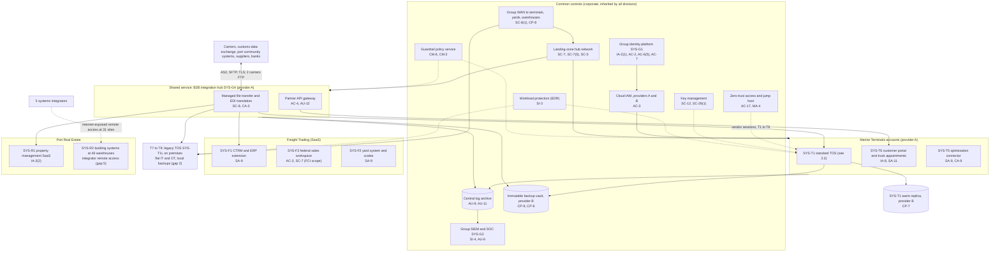

# Cloud Architecture and Control Placement: Cris Santos Company Holdings | Transportation and Warehousing | Multi-Sector

**Organization:** Cris Santos Company Holdings, Inc. | **Tier:** Multi-Sector | **Providers:** two public cloud providers, called provider A and provider B (vendor-agnostic; see section 6)
**Scope:** the shared corporate cloud platform (SYS-G3 landing zones, the WAN and the backup vault, plus the SYS-G4 integration hub) and the division workloads that run on it or connect to it. The SSP system (P02) is the Terminal Operations Platform (TOP).
**Handling:** Terminal network and OT zone details are SSI (49 CFR part 1520); this document shows the design pattern only.

## 1. Design in one paragraph
Corporate runs one **landing zone** per provider: identity federation from SYS-G1, a hub network, guardrail policies, a central log archive, key management, EDR, a zero trust access service with a group jump host for staff and vendors, and an immutable backup vault in provider B. Divisions get their own **accounts** inside the landing zone and inherit these guardrails. Provider A hosts the corporate hub, the **B2B integration hub** (SYS-G4) that serves all three divisions, the standard **TOS** (SYS-T1) and the **customer portal** (SYS-T6). Provider B hosts the TOS warm replica and the backup vault. Many division systems are SaaS (CTRM, yard system, property management, ERP, productivity) or on premises: gate automation and OT at every terminal, the Gulf terminals' **legacy TOS** (SYS-T1L) and Port Real Estate's **building systems** (SYS-R2), which integrators reach over the internet today.

## 2. Diagrams
### 2.1 Group landing zone, shared services and division workloads



### 2.2 Terminal Operations Platform (SSP boundary)

```mermaid
flowchart LR
  subgraph TOPB["TOP boundary"]
    subgraph Cloud["Provider A, TOS account"]
      APP["TOS application servers<br/>CM-2, SI-2"]
      DB[("TOS database<br/>SC-28, AC-3")]
      EDI["EDI adapters<br/>SI-10, IA-5"]
      EQI["Equipment interface servers (DMZ)<br/>AC-4"]
    end
    subgraph Site["Each of T1 to T6"]
      GATE["Gate servers, OCR, kiosks, TWIC readers<br/>CM-7(2), IA-3"]
      EP["Operations workstations, tablets, VMTs<br/>AC-18, IA-2(2)"]
    end
  end
  HUBX["SYS-G4 integration hub"]
  PACS["Terminal PACS (FSO)"]
  subgraph OTZ["OT zone per terminal (SYS-T3, interconnected)"]
    PLC["Crane, RTG and ASC controllers<br/>SC-7(21)"]
    ECS["T5 equipment control system"]
  end
  T5S["SYS-T5 optimization service"]
  T6P["SYS-T6 customer portal"]
  FTU["Freight Trading users<br/>group logistics role (gap 1)"]
  HUBX <--> EDI
  EDI --> APP
  APP --> DB
  APP --> EQI
  EQI -->|job instructions, logged, AC-4| PLC
  EQI --> ECS
  T5S -->|automatic ASC sequences since 2026-03 (gap 8)| ECS
  T5S <--> APP
  APP <--> T6P
  GATE <--> APP
  GATE <--> PACS
  EP --> APP
  FTU -.->|all customers' cargo data| APP
```

**Target state (POAM-008, POAM-010 and POAM-011):** the group logistics role is replaced by a cargo-owner view of Freight Trading's own shipments through SYS-T6, like any other customer; SYS-T5 returns to advisory mode at T5 until the AI council approves a safety case; T7 to T9 move onto SYS-T1 and the standard OT zone design by 2027-06-30.

## 3. Tenancy and identity decision
- **Decision.** All three divisions federate to the group identity platform, SYS-G1, and get their own accounts inside the landing zone. No division has its own identity tenant. Staff and vendor sessions to TOS servers and terminal OT go through one group zero trust access service and jump host.
- **Why.** One identity platform and one jump host let group internal audit assess them once.
- **What limits blast radius.** Phishing-resistant MFA for administrators and just-in-time PAM elevation with session recording. Jump host sessions need per-session approval and are recorded. Logs are written to a separate account readable only by privileged SOC roles. The integration hub is meant to route each partner flow only to the division account it serves.
- **Known gaps.** Today one hub service account can write to three divisions' inbound folders, and 11 partner credentials are shared across divisions (GR-01, POAM-014). 212 Freight Trading users hold the group logistics TOS role (GR-02, POAM-008). Gulf terminals still use always-on vendor modems (MT-003). One identity platform serves 45,000 users plus partner accounts (GR-10).
- **Cross-division risks:** GR-01, GR-02, GR-06, GR-10, GR-15 in [risk-register.csv](../step-04_P01_risk-register/risk-register.csv).

## 4. Common versus division-specific controls
`cloud-control-map.csv` has **54 rows across 29 components**. The `control_scope` column shows who owns each placement:

| Scope | Rows | What it means |
|---|---|---|
| Common (group) | 27 | Provided once by corporate (SYS-G1, SYS-G2, SYS-G3, SYS-G5, SYS-G6) and inherited by every division account. Listed in the P02 common control catalog |
| Shared service (SYS-G4) | 5 | The integration hub serves all three divisions; one service, one owner, three divisions' partners |
| SSP system (TOP) | 8 | Controls of the SSP system documented in P02 |
| Division-specific (Marine Terminals) | 6 | Customer portal, optimization service, Gulf legacy TOS |
| Division-specific (Freight Trading) | 5 | CTRM, federal sales workspace, yard system |
| Division-specific (Port Real Estate) | 3 | Property management SaaS and integrator access to building systems |

| Responsibility | Rows |
|---|---|
| Customer (the group or a division) | 46 |
| Shared (provider and group) | 4 |
| Provider | 4 |

**Rule of thumb.** Identity, network guardrails, remote access, logging, keys, backups and EDR are **common**. A division cannot opt out of them, only request an exception through POL-01. Application behavior, data access inside the application, OT zones and customer-facing identity are **division-specific**, because they depend on each division's regulators and customers. The integration hub is a deliberate exception: it is shared, so its controls must separate the divisions' partner flows (AC-4), which they do not fully do today.

## 5. Layers
| Layer | Common components | Division components | Key controls | Responsibility |
|---|---|---|---|---|
| Identity | SYS-G1, cloud IAM, zero trust access and jump host | TOS roles, SYS-T6 customer identity, SaaS application roles | AC-2, AC-3, AC-6(5), AC-17, IA-2(1), IA-8 | Customer (configuration); vendor (service) |
| Network | Hub network, WAN, WAF | Terminal IT, gate and OT zones; building system networks | SC-7, SC-7(5), SC-7(21), SC-8(1), AC-4 | Customer, with provider DDoS protection shared |
| Integration | SYS-G4 hub | Partner registrations per division | SC-8, CA-3, AC-4, AU-12 | Customer |
| Compute | EDR on all IT hosts | TOS servers, gate servers, legacy TOS servers | SI-2, SI-3, CM-2, CM-7(2) | Customer (guest OS and applications) |
| Data | Keys, backup vault | TOS database and replica, hub message stores | SC-12, SC-28, SC-28(1), CP-9, CP-6, CP-7 | Shared: provider encrypts; group owns keys and retention |
| Logging and monitoring | Log archive, SIEM | TOS, gate and OT sensor logs | AU-6, AU-9, AU-11, AU-12, SI-4 | Shared: providers generate platform logs; group retains and reviews |
| SaaS dependencies | Identity, SIEM, ERP and productivity vendors | CTRM, yard, property management, optimization service | SA-9 | Provider for the service; customer for use and oversight |
| Physical | Provider data centers | Terminals, gate complexes, warehouses (outside the cloud model) | PE-3, MP-6 | Provider for data centers (inherited); FSOs and building teams for sites |

## 6. Service categories and provider equivalents
The design does not depend on a provider. This table gives each provider's name for each service category, for reading its shared responsibility documentation.

| Service category | AWS | Microsoft Azure | Google Cloud |
|---|---|---|---|
| Account structure and guardrails | AWS Organizations with service control policies | Management groups with Azure Policy | Resource hierarchy with Organization Policy |
| Virtual machines (TOS servers) | Amazon EC2 | Azure Virtual Machines | Compute Engine |
| Managed relational database (TOS database) | Amazon RDS | Azure SQL Database | Cloud SQL |
| Managed file transfer (integration hub) | AWS Transfer Family | Azure Blob Storage SFTP or Logic Apps | Partner solutions on Compute Engine |
| API gateway | Amazon API Gateway | Azure API Management | Apigee |
| Key management | AWS KMS | Azure Key Vault | Cloud KMS |
| Audit logging | AWS CloudTrail | Azure Monitor activity log | Cloud Audit Logs |
| Backup with immutability | AWS Backup (vault lock) | Azure Backup (immutable vault) | Backup and DR Service |

Shared responsibility sources: SRC-AWS-SRM, SRC-AZURE-SRM, SRC-GCP-SRM in `00_universal-framework/sources/source-register.csv`. All three agree on the split used here: for IaaS the provider owns facilities, hosts and virtualization; for PaaS the provider also owns the runtime; for SaaS the provider owns the application. The customer always keeps identities, access decisions, data classification and data. None of the providers' models covers on-premises OT or building systems, which stay entirely with the group.

## 7. Findings from the mapping
1. **The integration hub is the group's widest shared path.** One service account can write to the TOS, trading and property inbound folders, 11 partner credentials are shared across divisions, and 2 carriers still use plain FTP (AC-4, CA-3, SC-8; POAM-014). This is how the P08 incident spreads from one division's partner to all three.
2. **The TOP's cloud controls are sound; its weak points are inside the application and at the edge.** Encryption, keys, backups and the replica are in place (SC-28, CP-9, CP-7). The gaps are the group logistics role (AC-3; scenario gap 1) and the unreviewed path from SYS-T5 to the T5 equipment control system (CA-9; gap 8).
3. **The Gulf terminals and the building systems are outside the platform's protection.** SYS-T1L has local backups only and flat networks (CP-9, SC-7; P01 MT-002, MT-004). Building systems are reached by integrators over the internet and are not monitored (AC-17, SI-4; P01 RE-001, RE-002). Neither is covered by a cloud provider's shared responsibility model, so every control is the group's own.
4. **Freight Trading's federal scope lives in SaaS.** FCI sits in restricted areas of the productivity suite and CTRM (SYS-F3), which is acceptable for FAR 52.204-21 and CMMC Level 1. CUI has no compliant home: DFARS 252.204-7012 requires NIST SP 800-171 on covered contractor systems and FedRAMP Moderate equivalent cloud services for CUI, which the group has not set up (POAM-016; P03).
5. **Common controls are strong and reused.** One identity platform, one SIEM, one backup design and one jump host. This is what lets group internal audit assess them once (P07). The weak link is documentation of inheritance for Port Real Estate (P02, POAM-019), not the controls themselves.
