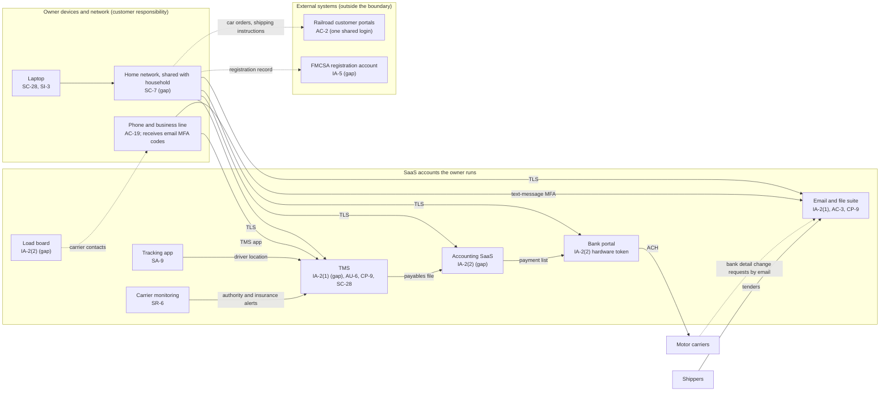

# SaaS Architecture and Control Placement: Cris Santos Company | Transportation Systems | Sole Proprietorship

**Organization:** Cris Santos Company (freight broker arranging truck and rail shipments) | **Tier:** Sole Proprietorship | **Provider:** SaaS only (no IaaS or PaaS)
**System:** Freight Brokerage SaaS Stack (FBSS), as defined in the system security plan (P02) | **Mapped:** 2026-08-12 by the owner with the on-call IT consultant

## 1. Diagram
Control IDs on each node are the ones in `cloud-control-map.csv`. Dashed lines are flows that leave the owner's control or carry a known gap.

## 2. Layers
| Layer | Components | Key controls | Responsibility |
|---|---|---|---|
| Identity | TMS, email, accounting, bank, load board accounts; railroad portal and FMCSA credentials | IA-2(1), IA-2(2), AC-2, IA-5 | Customer configures; providers offer MFA |
| Data | TMS records, cloud files, carrier packets, payment details | AC-3, CP-9, SC-28, SA-9 | Providers protect data inside their services; the owner decides who it is shared with and keeps independent copies |
| Endpoints | Laptop, phone | SC-28, SI-3, AC-19 | Customer |
| Network | Home network | SC-7 | Customer (ISP supplies the router) |
| Logging | TMS audit log, email sign-in and admin logs, bank payee history | AU-2 (provider), AU-6 (customer) | Shared: providers record, the owner reviews |
| SaaS applications and hosting | TMS, email suite, accounting, bank, load board, monitoring, tracking platforms | Inherited (AU-2, SC-5, PE family, provider patching) | Provider |

## 3. Shared responsibility for SaaS
The three major cloud providers' shared responsibility models (SRC-AWS-SRM, SRC-AZURE-SRM, SRC-GCP-SRM) agree on the SaaS split: the provider runs the application, the platform, and the facilities; **the customer always keeps its identities and accounts, its data, and its devices.** That is why 15 of the 18 rows in the control map are the owner's alone and 2 more are shared. A provider's SOC 2 report covers none of these three layers. No IaaS equivalents table is needed, because the business runs no infrastructure.

Two systems the owner depends on are not SaaS the owner buys at all: the railroads' customer portals and the FMCSA registration system. The owner cannot configure them, but the credentials and recovery settings are still the owner's responsibility, and both are on the map for that reason.

## 4. Findings from the mapping
1. **Open sharing links (new finding).** 14 files and folders were shared by "anyone with the link"; 9 were carrier packet folders with W-9s and some driver license copies. Fixed on 2026-08-12; the tenant default still needs changing. Tracked as P01 R-008.
2. **MFA is off where it is free to turn on** (TMS, accounting, load board), and the email MFA rides on a phone number with no port-out PIN. Tracked as R-003 and R-005.
3. **The money path has no human check.** Carrier bank detail changes arrive by email, are typed into the TMS, flow to accounting, and become an ACH payment. Every hop is technically secure; the weak point is the request itself. Tracked as R-002.
4. **Identity outside the SaaS stack matters as much as inside it.** A shared railroad portal login (R-007) and an FMCSA account that recovers to a personal email (R-006) are the owner's to fix even though the systems belong to others.
5. **Inherited TMS controls depend on the vendor's SOC 2 report** and on the owner operating the complementary user entity controls (MFA, user review, log review) listed in P09.
