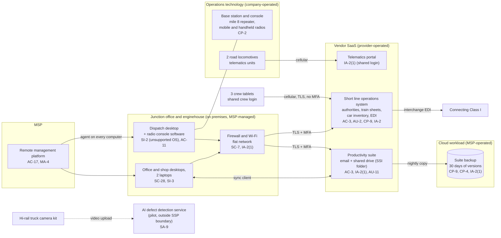

# Cloud Architecture and Control Placement: Cris Santos Company | Transportation Systems | Micro

**Organization:** Cris Santos Company, LLC (short line freight railroad) | **Tier:** Micro | **Provider:** Vendor-agnostic SaaS (see section 3)
**System:** Train Dispatch and Operations Back Office (TDOB), as defined in the SSP (P02) | **Prepared:** 2026-07-24 by the Office Manager (Security Lead) with the MSP lead technician | **Approved:** Owner and General Manager, 2026-08-31

## 1. Diagram
The railroad runs no servers and no IaaS tenant. Its "cloud" is a set of SaaS services plus one cloud workload that the MSP operates for it: the SaaS backup of the productivity suite (SYS-05). The radio system and the locomotives are operations technology on company property; they are shown because the dispatch desktop links the two worlds.

## 2. Layers and who is responsible
| Layer | Components | Key controls | Customer (railroad) | MSP (on the railroad's behalf) | Provider (SaaS vendor) |
|---|---|---|---|---|---|
| Identity | SYS-01, suite, telematics, backup accounts; firewall login | AC-2, IA-2, IA-2(1) | Decides who gets access; requests removal; enforces MFA; ends the shared crew login | Creates and disables suite and device accounts; holds backup and firewall admin logins | Runs the sign-in and MFA service |
| Network | Firewall, Wi-Fi, internet line | SC-7, CP-8 | Approves changes; decides on a separate dispatch segment | Configures, patches, and monitors | Not applicable |
| Endpoints | Dispatch desktop, 2 other desktops, 2 laptops, 3 tablets | SI-2, SI-3, SC-28, CM-8 | Approves patch exceptions; keeps the inventory | Encryption, antivirus, patching, screen lock | Not applicable |
| SaaS applications | Operations system, suite, telematics portal | AC-3, AU-2, SC-8 | Users, roles, sharing settings, SSI folder | Suite administration on request | Application, platform, data centers |
| Data | Operations data, shared drive, backup copies | CP-9, CP-4, SC-28 | Decides retention and restore testing; exports operations data weekly | Operates the backup and runs restore tests | Encrypts and backs up its own platform |
| Logging | SYS-01 audit trail, suite logs, firewall logs | AU-2, AU-6, AU-11, SI-4 | **Reviews logs monthly (gap today)** | Keeps firewall logs; forwards alerts | Generates and stores logs |
| Vendor governance | SOC 2 review, MSP review, AI pilot terms | SA-9, MA-4 | Reviews SOC 2 and MSP evidence; signs terms | Discloses technicians and subcontractors | Provides SOC 2 reports |

Responsibility counts in `cloud-control-map.csv` (33 rows): Customer 13, Customer (performed by MSP) 11, Provider 6, Shared 3.

**The MSP is not a cloud provider in the shared responsibility sense.** It performs customer-side duties for the railroad. Anything marked "Customer (performed by MSP)" remains the railroad's responsibility: the railroad must direct the work, receive evidence, and check it (SA-9).

## 3. Service categories and provider equivalents
The design is vendor-agnostic. The shared responsibility split for SaaS is the same in all three major cloud providers' models: the provider runs the application, platform, and infrastructure; the customer keeps identities, access, data, and devices (SRC-AWS-SRM, SRC-AZURE-SRM, SRC-GCP-SRM in `00_universal-framework/sources/source-register.csv`). For the railroad's vendors, the SOC 2 report or vendor security documentation is the evidence of the provider side.

| Service category used | What it is here | Equivalent category in the large cloud providers (for reading their documentation) |
|---|---|---|
| Line-of-business SaaS | Short line operations system | Industry SaaS built on any provider |
| Productivity suite | Email, calendar, file storage, sync client | Productivity and collaboration SaaS |
| SaaS-to-SaaS backup | Backup of the shared drive and mailboxes | Backup service or third-party SaaS backup |
| Telematics SaaS | Locomotive location, fuel, and engine fault portal | IoT device management and telemetry services |
| Remote monitoring and management | MSP device management | Device management SaaS |

## 4. Findings from the mapping
1. **The dispatch desk is where IT meets train operations (SC-7, SI-2).** The dispatch desktop runs the radio console on an unsupported operating system and sits on the same flat network as the office computers that receive phishing email. A single infected office computer can reach it. Fix: replace the desktop with a supported build and the certified console version, and put it on its own firewall segment (P01 R-001, R-007; P07 POAM-010, POAM-011).
2. **Sync is not backup (CP-9, CP-4).** The desktops sync the shared drive, and SYS-05 copies it every night with 30 days of versions. Encrypted files would sync to the suite and then to the backup. Nobody has tried a restore, and the company holds no copy of its operations system data. Fix: 90-day immutable versions, a restore test by 2026-09-30, quarterly tests, and a weekly export of SYS-01 car and authority data (P01 R-005; POAM-003, POAM-004).
3. **Three administrator logins have no MFA (IA-2(1)).** The backup console and the firewall management login (both MSP-held) and the telematics portal use passwords only. An attacker with the backup password could delete the backups. Fix: MFA or a named account with MFA on all three by 2026-09-30 (POAM-002).
4. **The crew login is shared (IA-2, AC-2).** The operations system cannot tell which crew member acknowledged an authority. Fix: named crew accounts with MFA (P01 R-003; POAM-001).
5. **SSI sits in the open shared drive (AC-3).** The TSA folder is readable by every account, including the MSP's. Fix: a restricted folder for the General Manager and Roadmaster (POAM-012).
6. **The MSP's reach is total (AC-17, MA-4).** Its remote tool can run commands on the dispatch desktop. Fix: annual MSP security review and contract terms (P01 R-004).
7. **The AI pilot sits outside the boundary on purpose.** Its vendor terms have not been reviewed. It enters the SSP boundary only after the P10 conditions are met.
