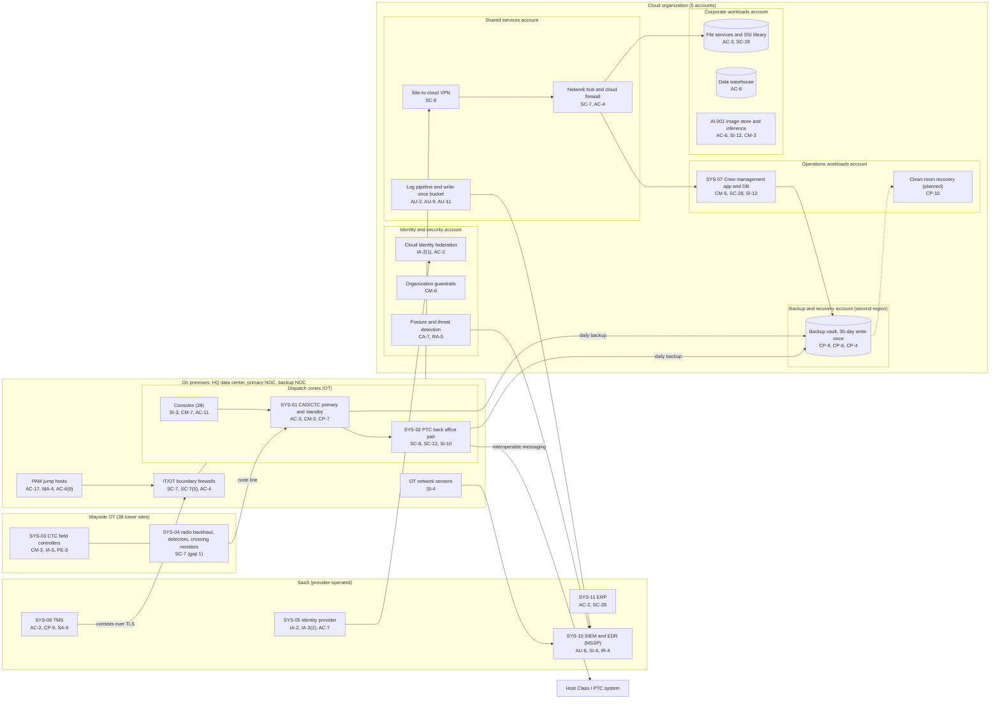

# Cloud Architecture and Control Placement: Cris Santos Company | Transportation Systems | Mid-Market

**Organization:** Cris Santos Company, Inc. | **Tier:** Mid-Market | **Provider:** Vendor-agnostic public cloud (see section 4), plus SaaS, connected to on-premises OT
**System:** Train Dispatch and PTC Operations Platform (TDPO), as defined in the SSP (P02), and the corporate cloud workloads around it | **Prepared:** 2026-07-31 by the Cybersecurity Manager and the Director of Information Technology; updated 2026-09-15 with P07 results
**Control map:** `cloud-control-map.csv` (51 rows, 23 components)

## 1. Diagram
The safety-critical parts of the TDPO (CAD/CTC, the PTC back office, the CTC field network) stay on premises. The cloud holds the crew management application, the backup vault that the TDPO depends on for recovery, corporate workloads, and the security log pipeline. No cloud component can send commands to OT.

## 2. Landing zone design
The landing zone separates duties across 5 accounts (subscriptions or projects, depending on the provider) under one cloud organization. The split keeps operations workloads, which support the TDPO, apart from corporate workloads that office users and the AI vendor touch.

| Account | Purpose | Who administers | Key design decisions |
|---|---|---|---|
| **Identity and security** | Organization root, federation to the company identity provider, guardrails, posture and threat detection | Cybersecurity team (2 people) | No workloads. Root sealed. Guardrails apply to every other account and cannot be disabled from them |
| **Shared services** | Network hub, cloud firewall, site-to-cloud VPN, DNS and filtering, patch service, log pipeline and write-once log bucket | Infrastructure team | All traffic between accounts, the data center, and the internet passes the hub. Logs from every account land in the write-once bucket |
| **Operations workloads** | Crew management application and database (SYS-07); planned clean-room recovery environment for CAD/CTC and the BOS | Infrastructure team; crew software vendor through the PAM jump host | No internet ingress. Reaches the HQ data center only through documented flows. Treated as part of the TDPO boundary and the CIP's Critical Cyber Systems |
| **Corporate workloads** | File services (including the SSI library), data warehouse, AI-001 image store and inference service | Infrastructure team; AI vendor service account (restricted) | Cannot route to the operations workloads account |
| **Backup and recovery** | Write-once backup vault (35 days) in a second region for CAD/CTC, BOS, crew, and file services | 2 named backup administrators | Separate credentials, not federated to daily accounts. A cross-account role can write but not delete backups |

**OT stays on premises on purpose.** Moving CAD/CTC or the BOS to the cloud would add an internet-dependent path to movement authority and would require a CIP amendment. The cloud's role for the TDPO is recovery: the backups and, once built, the clean-room recovery environment where images are rebuilt and scanned before they are copied back to the data center (SD 1580-21-01E II.D.1.b).

## 3. Layers and shared responsibility per service
| Layer | Components | Key controls | Service model | Responsibility |
|---|---|---|---|---|
| Identity | Cloud federation, break-glass accounts, identity provider | IA-2, IA-2(1), IA-2(2), AC-2, AC-6(5), AC-7 | PaaS / SaaS | Customer configures identities, roles, MFA, and reviews; provider runs the identity services |
| Network | Hub, cloud firewall, VPN, DNS and filtering | SC-7, SC-7(5), AC-4, SC-8, SC-20, SI-4 | PaaS | Customer designs routes, rules, and segmentation; provider runs the gateway, firewall, and DNS services |
| Compute | Crew management servers, patch service, AI inference, clean-room recovery | CM-6, CM-7, SI-2, SI-3, AC-6(2), CP-10, CM-3 | IaaS / PaaS | Customer owns guest OS, applications, EDR; provider owns hosts and hypervisor |
| Data | Crew database, file services, data warehouse, AI image store, keys, backup vault | SC-28, SC-12, AC-3, AC-6, SI-12, CP-9, CP-6, CP-4 | PaaS | Shared: provider encrypts and runs storage and database engines; customer controls keys, access, retention, isolation, and restore testing |
| Logging and monitoring | Log pipeline, write-once bucket, posture service, SIEM | AU-2, AU-6, AU-9, AU-11, CA-7, RA-5, SI-4, IR-4 | PaaS / SaaS | Shared: provider generates logs and detections; customer enables, retains, forwards, and acts on them; MSSP monitors |
| SaaS applications | Identity provider, TMS, ERP, SIEM and EDR | AC-2, AC-7, CP-9, SA-9, SI-12, SC-28 | SaaS | Provider runs the application and infrastructure; customer keeps users, roles, data, and the vendor review |
| Physical | Provider and SaaS data centers | PE-3, PE-13 | All | Provider (inherited, evidenced by SOC 2 reports) |

**Responsibility counts in `cloud-control-map.csv`:** 26 Customer, 18 Shared, 7 Provider. By service model: 30 PaaS, 12 SaaS, 9 IaaS rows. As in all three providers' shared responsibility models, the customer side is always identity, data protection, and logging.

## 4. Service categories and provider equivalents
The design is independent of the provider. This table gives each provider's name for the service category, for reading its shared responsibility documentation (SRC-AWS-SRM, SRC-AZURE-SRM, SRC-GCP-SRM in `00_universal-framework/sources/source-register.csv`).

| Service category | AWS | Microsoft Azure | Google Cloud |
|---|---|---|---|
| Multi-account organization and guardrails | AWS Organizations, service control policies | Management groups, Azure Policy | Resource Manager folders, organization policies |
| Account, subscription, or project | Account | Subscription | Project |
| Cloud identity federation | IAM Identity Center | Microsoft Entra ID with Azure RBAC | Cloud Identity with IAM |
| Network hub | Transit Gateway | Virtual WAN hub or hub virtual network | Network Connectivity Center or shared VPC |
| Cloud firewall | AWS Network Firewall | Azure Firewall | Cloud NGFW |
| Site-to-cloud VPN | Site-to-Site VPN | VPN Gateway | Cloud VPN |
| DNS service | Amazon Route 53 | Azure DNS | Cloud DNS |
| Virtual machines | EC2 | Virtual Machines | Compute Engine |
| Managed relational database | Amazon RDS | Azure SQL Database | Cloud SQL |
| Object storage with write-once retention | S3 with Object Lock | Blob Storage with immutability policies | Cloud Storage with bucket lock |
| Backup service | AWS Backup (vault lock) | Azure Backup (immutable vault) | Backup and DR Service |
| Key management | AWS KMS | Azure Key Vault | Cloud KMS |
| Audit logging | CloudTrail | Azure Monitor activity log | Cloud Audit Logs |
| Posture and threat detection | Security Hub, GuardDuty | Microsoft Defender for Cloud | Security Command Center |

**Service model split used here (all three providers agree):**
- **IaaS** (virtual machines, networks): the provider owns facilities, hosts, and virtualization. The customer owns the guest OS, applications, network configuration, identities, and data.
- **PaaS** (managed database, file shares, backup, key service, firewall service): the provider also owns the platform software and its patching. The customer owns access, keys, data, and configuration.
- **SaaS** (identity provider, TMS, ERP, SIEM): the provider also owns the application. The customer keeps identities, roles, data, and the vendor review.

## 5. Findings from the mapping
1. **Recovery depends on the cloud, but has not been proven from it.** The backup vault is the strongest control in the environment: separate account, second region, write-once, separate credentials, and scanned at backup time. No end-to-end CAD/CTC or BOS restore has been done from it (gap 6), and there is no clean place to rebuild. Fix: build the clean-room recovery environment in the operations workloads account and run the first restore test on 2026-11-05 (P07 POAM-011).
2. **The TMS is the weakest dependency.** Its stated RTO of 24 hours does not meet the BIA, and the 30-minute TSA RSSM duty relies on a 4-hourly extract to the standby laptops (P05 finding 3; P08 vendor outage runbook).
3. **The AI vendor had broad storage rights.** Until 2026-09 the AI-001 vendor service account could read every bucket in the corporate workloads account, including the file services backups that hold SSI. It is now limited to the inference bucket (P10; P01 R-041).
4. **Cloud logs are in good shape; OT logs are not.** All 5 accounts send control-plane and flow logs to the write-once bucket and the SIEM. The gap is on premises: CAD/CTC, BOS, and field device logs do not reach the pipeline (gap 7).
5. **Boundary check.** Every in-scope TDPO component in the SSP (P02 section 9) that runs in the cloud appears in the diagram and has at least one row in the control map. Each account has controls from at least 2 of the AC, AU, CM, IA, SC, and SI families or inherits them.
6. **Inherited controls rely on SOC 2 reports.** Rows marked Provider or Shared for the cloud provider, identity provider, TMS, ERP, and MSSP depend on their SOC 2 Type 2 reports and complementary user entity controls, reviewed each year in P09 `vendor-soc2-review.csv`.
