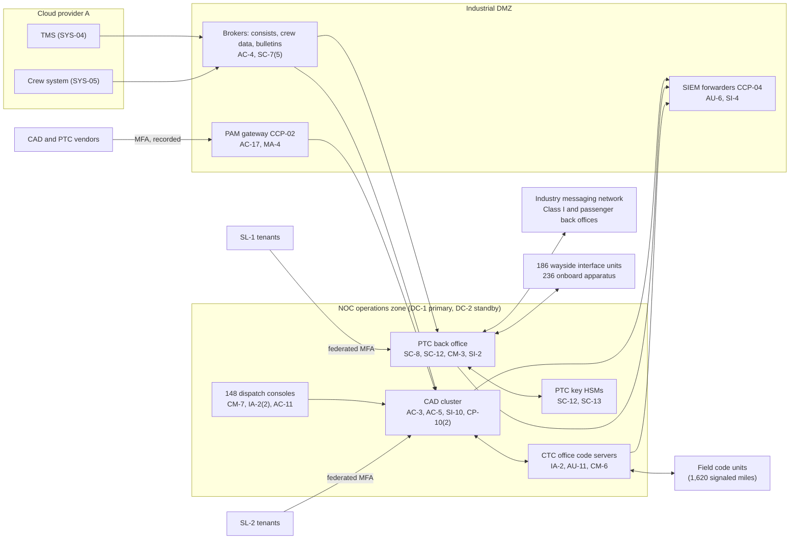

# System Security Plan: Train Dispatching and PTC Back Office Platform (TDPB)

**Organization:** Cris Santos Company, Inc. (publicly traded holding company of 64 short line and regional freight railroads) | **Tier:** Enterprise | **Vertical:** Transportation Systems
**Outline:** NIST SP 800-18 Rev. 2, System Security Plan Outline Example (June 2026) | **Version:** 2.0, 2026-09-14

## 1. System Name and Identifier
Train Dispatching and PTC Back Office Platform (**TDPB**), identifier CSC-SYS-TDPB-001. Tier-1 system in the enterprise application inventory. The TDPB is the core of the Critical Cyber Systems listed in the TSA-approved Cybersecurity Implementation Plan (CIP) for Covered Railroads CR-01 to CR-09 (approved 2023-08-15), and the CIP incorporates this SSP by reference (SD 1580/82-2022-01E Sec. IV.A).

## 2. System Overview
The TDPB issues and records movement authority for 61 of the company's 64 railroads (all except the acquired railroads AQ-04 to AQ-06, which still dispatch on their own legacy systems), runs the office segment of the PTC system for the 3 railroads that host passenger trains (CR-07 to CR-09, 212 route miles), and runs the back office for the 236 company locomotives with onboard PTC apparatus that enter Class I PTC lines. It also hosts the two technology service lines sold to unaffiliated railroads: SL-1 hosted PTC back office (27 short lines) and the dispatch half of SL-2 (18 short lines and industrial railroads).

It supports the High-criticality processes in the BIA (P05): train dispatching and movement authority (BP-01), PTC operations (BP-02), CTC signal control and wayside monitoring (BP-03), the TSA RSSM location duty (BP-06), and the two service lines (BP-11, BP-12).

**Why integrity and availability matter most.** A changed territory table, a lost authority already in effect, or a CTC command that reaches the wrong control point can put trains or roadway workers in conflict. Vital interlocking logic in the field and PTC enforcement on host territory are independent safety layers, but the dispatcher still relies on the TDPB to see what authorities are in effect. Loss of the TDPB forces paper track warrants, which sustain only about 40% of normal train starts (P05 BP-01).

**Major components:**
| Component | Description | Hosting |
|---|---|---|
| CAD (from SYS-01) | Centralized computer-aided dispatch: track warrants, track and time authority with conflict checking, CTC dispatcher displays, train sheets, bulletins, speed restrictions | On premises: active cluster in DC-1 (Florida), hot standby in DC-2 (Texas) with synchronous replication of authority transactions |
| PTC back office (SYS-02) | Office segment for host territory; back office for company locomotives; interoperable messaging with Class I and passenger operators' back offices; PTC key management in hardware security modules; SL-1 tenants in logically separate tenants | On premises: DC-1 primary, DC-2 warm standby (manual failover) |
| CTC office code servers (part of SYS-03) | Send controls to and receive indications from field code units on the 1,620 signaled miles of 11 railroads | Active-active in DC-1 and DC-2 |
| NOC operations zone and industrial DMZ (part of SYS-08) | Enclaves for CAD, PTC, and CTC; DMZ brokers for consists, crew data, bulletins, SIEM forwarding, and vendor PAM sessions | DC-1, DC-2, primary and backup NOCs |
| Dispatch consoles | 148 consoles: 116 at the primary NOC (Jacksonville), 32 at the backup NOC (Texas) | Badge-controlled NOC floors |

Users: 310 train dispatchers and supervisors, 46 train control technicians and PTC administrators, 31 named server administrators, about 120 SL-1 customer technicians, and about 90 SL-2 customer dispatchers. Every train crew and roadway worker on 61 railroads depends on it.

## 3. Laws, Regulations, and Policies Affecting the System
| ID | Requirement | Citation | How it affects the TDPB |
|---|---|---|---|
| C-TRANSPORTATION-R01 | TSA SD 1580/82-2022-01E, Rail Cybersecurity Mitigation Actions and Testing | Sections II to VII | The TDPB components are Critical Cyber Systems of CR-01 to CR-09. Segmentation (III.B), access control (III.C), monitoring and logging (III.D), patching (III.E), and the Cybersecurity Assessment Plan (III.F) apply. PTC is a Critical Cyber System because the host railroads must operate it (III.A.2.a). Mapped in `control-implementation.csv` |
| C-TRANSPORTATION-R01 | TSA SD 1580-21-01E, Enhancing Rail Cybersecurity | Sections II.B to II.E | Cybersecurity Coordinators, reporting cybersecurity incidents to CISA within 72 hours, the Cybersecurity Incident Response Plan, and annual exercises |
| C-TRANSPORTATION-S01 | TSA Security Coordinator and significant security concern reports | 49 CFR 1570.201, 1570.203 | A cyber attack on the TDPB is reportable to TSA within 24 hours of discovery; a CISA report that says it is made under the SD satisfies 1570.203 (SD 1580-21-01E Sec. II.C.5) |
| C-TRANSPORTATION-S02 | RSSM location and chain of custody | 49 CFR 1580.203, 1580.205 | Train sheets and the TMS answer TSA location requests within 30 minutes (1580.203(d)) |
| C-TRANSPORTATION-S03 | SSI | 49 CFR part 1520 | The CIP, the Cybersecurity Assessment Plan, assessment results, and incident reports about the TDPB are SSI (SD 1580/82-2022-01E Sec. IV.B) |
| C-TRANSPORTATION-S04 | FRA positive train control | 49 CFR 236.1005, 236.1006, 236.1021, 236.1023, 236.1029, 236.1033, 236.1037 | Host duties on CR-07 to CR-09; tenant duties on 22 railroads; PTC software changes follow the safety plan and vendor certification; message integrity and key management (236.1033) |
| C-TRANSPORTATION-S05 | FRA accident/incident reporting | 49 CFR part 225 | Train records from CAD support accident reports |
| C-TRANSPORTATION-S10 | SEC cybersecurity disclosure | Form 8-K Item 1.05; 17 CFR 229.106 | A material TDPB incident goes through the P08 materiality step |
| C-TRANSPORTATION-R06, R07 | TSA surface cyber NPRM; CIRCIA | 89 FR 88488; 89 FR 23644 | **Proposed only.** Tracked in P03 section 6 |
| Contract | SL-1 and SL-2 service agreements; interchange and operating agreements with Class I and passenger operators | Contract | 4-hour RTO and 15-minute RPO for service line customers; SOC 2 Type 2 for SL-1, first report planned for SL-2 (P09) |
| Internal | POL-01 to POL-05 and standards | P06 | Enterprise policy hierarchy |

Not applicable to the TDPB: C-TRANSPORTATION-R02 to R05 (pipeline, aviation, and maritime rules). SD 1582-21-01E applies to passenger railroads; the company hosts passenger trains but runs none.

## 4. System Status
### 4.1 System Security Plan Approval
Prepared by the CAD Application Manager, the PTC Back Office Manager, and the GRC team. Reviewed by the CISO, the Director of OT Security, the Director of Train Control Systems, and the Vice President, Network Operations. Approved by the Chief Operating Officer on 2026-09-14.

### 4.2 System Authorization Decision
The company is not a federal agency, so there is no formal authorization to operate. TSA approves the CIP, not the system. The equivalent internal decision:
- **Authorizing official equivalent:** Chief Operating Officer, with the CISO's recommendation.
- **Decision (2026-09-14):** continue operation with conditions, based on the Internal Audit assessment (P07, report issued 2026-09-04) and the risk register (P01, approved 2026-09-08).
- **Conditions:**
  - document the compensating measures for unpatched PTC back office servers and file them with the CIP (POAM-003 by 2026-12-31);
  - retire the 3 shared CTC code server administrator accounts (POAM-004 by 2026-11-30) and remove the corporate-to-OT directory trust (POAM-005 by 2026-12-31);
  - bring the crossing monitor vendor's access behind PAM (POAM-008 by 2027-01-31);
  - close the AQ-06 VPN path to the TMS integration APIs (POAM-018, interim block by 2026-11-15);
  - automate PTC back office failover and prove the 4-hour RTO in a retest (POAM-006 by 2027-03-31).
- **Reauthorization:** annually, or after a major change (for example, migration of AQ-04 to AQ-06 onto the CAD, or the CAD release planned for 2027).

### 4.3 System Operational Status
Operational. Planned major modifications:
- CAD migration of AQ-04 (2026-12-15), AQ-05 (2027-02-28), and AQ-06 (2027-05-31); each migration triggers a CIP amendment check (SD 1580/82-2022-01E Sec. VI.B)
- PTC back office failover automation and configuration-controlled images (CP-10(4), 2027-03-31)
- Automated change blocking for PTC configuration (CM-3(1), 2027-03-31)
- CAD release with automatic switchover on a territory table integrity violation (SI-7(5), 2027-06-30)

## 5. Role Identification and Responsible Personnel
| Role | Title | Responsibility |
|---|---|---|
| System owner | Vice President, Network Operations | Accountable for the TDPB; approves dispatcher roles and manual dispatch procedures |
| Authorizing official (equivalent) | Chief Operating Officer | Accepts residual risk to operate |
| PTC owner | Director of Train Control Systems | PTC safety plan, PTC configuration, key management, host and tenant coordination with FRA, Class I, and passenger operators |
| System administrators | CAD Application Manager; PTC Back Office Manager | Day-to-day administration, territory tables, change control |
| OT security | Director of OT Security | Zone and conduit model, OT monitoring, OT access; alternate Cybersecurity Coordinator |
| Information security | CISO (primary Cybersecurity Coordinator); Director of Security Operations (alternate) | Program oversight; SOC monitoring; incident response; CISA and TSA reporting |
| TSA security | Assistant Vice President, Rail Security (primary Security Coordinator); Director, Network Operations Center (alternate) | 1570.201 duties; RSSM location answers; SSI |
| Common control providers | See section 10.3 | Operate inherited controls |
| Independent assessor | Chief Audit Executive (Internal Audit, with co-sourced OT specialists) | Annual assessment (P07) and the Cybersecurity Assessment Plan assessments |

## 6. System Information Types and System Categorization
Information types come from NIST SP 800-60 Vol. 2 Rev. 1. Impact levels follow FIPS 199, used as a model.

| Information type | Confidentiality | Integrity | Availability | Rationale |
|---|---|---|---|---|
| Ground transportation (movement authority, train sheets, CTC indications, PTC office data) | Low | **High (treated)** | **High (treated)** | Movement data is not secret, but a changed or lost authority could contribute to a collision on 61 railroads at once; loss stops normal dispatching for 61 railroads and PTC operation on host and tenant territory (P05 BP-01 MTD 8 h, RTO 2 h, RPO 0) |
| Hazardous materials transportation (RSSM car locations, consists) | Moderate | Moderate | Moderate | PIH car locations are security-sensitive; TSA's 30-minute duty makes availability important, and an offline fallback is required (P05 BP-06) |
| Security information (CIP, zone designs, PTC keys, assessment results) | Moderate | Moderate | Low | SSI under 49 CFR part 1520; disclosure would aid an attacker. PTC keys are protected in hardware security modules |
| Service line customer data (SL-1 and SL-2 tenants) | Moderate | Moderate | Moderate | Customers' operating data; contractual confidentiality and 4-hour RTO |
| System and network monitoring (logs) | Moderate | Moderate | Low | Needed for incident investigation and CISA and TSA reports |
| **TDPB category** | **Moderate** | **Moderate baseline, supplemented** | **Moderate baseline, supplemented** | See the decision below |

**Categorization decision.** A strict FIPS 199 high-water mark would make the TDPB High. The company is not a federal agency and uses FIPS 199 as a model. The safety functions that prevent conflicting movements are carried by vital field logic and the FRA-certified PTC system, which are governed by the PTC Safety Plan rather than this SSP. The executive risk committee approved this tailoring on 2026-09-08:
- The TDPB uses the **SP 800-53B Moderate baseline**.
- It adds **12 High-baseline controls** for integrity and availability: AU-9(2), CA-8, CM-3(1), CM-4(1), CM-5(1), CP-2(5), CP-7(4), CP-9(3), CP-10(4), SC-7(21), SI-7(2), SI-7(5).
- The decision is reviewed annually. If PTC back office recovery (POAM-006) and the manual dispatch exercises (POAM-020) are not closed by 2027-06-30, the CISO will recommend full High categorization.

**Documented controls.** `control-implementation.csv` documents **184 controls**: 172 from the Moderate baseline and 12 High-baseline supplements. The remaining Moderate-baseline enhancements are fully inherited from the enterprise common control catalog (section 10.3) and are listed there rather than repeated here.

## 7. Authorization Boundary Description
**Inside the boundary:** the CAD cluster and databases in DC-1 and DC-2; the PTC back office servers, message brokers, and hardware security modules in DC-1 and DC-2; the CTC office code servers; the NOC operations zone network (switches, enclave firewalls) and the industrial DMZ brokers that serve the TDPB; the 148 dispatch consoles and the PTC administration workstations at both NOCs.

**Outside the boundary (common control providers and interconnected systems):**
- Identity platform, OT directory, and PAM (SYS-06): CCP-02
- Data center facilities, backup accounts, and log archive: CCP-03
- SOC, SIEM, EDR, OT network detection, scanners: CCP-04
- Enterprise WAN, radio and microwave backhaul, field networks (SYS-08): CCP-05
- Field equipment: CTC field code units, wayside interface units, detectors, crossing monitors (rest of SYS-03), and onboard PTC apparatus (SYS-09). These are Critical Cyber Systems in the CIP but have their own security documentation
- TMS (SYS-04) and crew system (SYS-05) in Cloud provider A; Class I and passenger operators' dispatch and PTC systems; the industry interoperable messaging network; SL-1 and SL-2 customers; legacy dispatch at AQ-04 to AQ-06

The enterprise multi-cloud and data center diagram is in P04 `cloud-architecture.md`. The detailed zone and conduit model is part of the CIP (SSI, not reproduced here).

## 8. Information Exchanges Summary
| Connected system / party | Direction | Data | Agreement |
|---|---|---|---|
| Class I railroads' back offices and dispatch centers | Bidirectional (interoperable messaging network; dispatcher phone and data links at interchanges) | PTC messages, track data, train data, interchange coordination | Interchange, trackage rights, and PTC interoperability agreements |
| Passenger operators (Amtrak; a commuter railroad) | Bidirectional (messaging network) | PTC messages for host territory on CR-07 to CR-09 | Operating agreements with security terms |
| Industry interoperable messaging network | Bidirectional | PTC message transport | Industry participation agreement |
| TMS (SYS-04, Cloud provider A) | Inbound consists and RSSM car flags; outbound train movement events | Consists, waybill references | Internal interface specification |
| Crew system (SYS-05, Cloud provider A) | Inbound crew assignments | Crew identities, on-duty times | Internal interface specification |
| SL-1 customers (27 short lines) | Bidirectional (tenant portals, PTC data) | Their locomotive and track data | SL-1 service agreements (4-hour RTO; SOC 2 Type 2) |
| SL-2 customers (18 railroads) | Bidirectional (tenant consoles) | Their movement authority | SL-2 service agreements (4-hour RTO) |
| CAD and PTC software vendors | Remote support through PAM | Diagnostics, certified releases | Support contracts with security and failure notification terms (236.1023) |
| Crossing monitor vendor | Vendor cellular modems to about 310 crossing monitors | Monitor status | Contract; **access outside PAM, and 2 modems reach a CTC field network (POAM-008)** |
| AQ-06 site networks (legacy VPN) | Inbound to TMS integration APIs | Car data | **Not authorized; path found in testing (POAM-018)** |

## 9. System Component Inventory
| Component | Type | Location / provider | Owner |
|---|---|---|---|
| CAD application servers (6) and database cluster (2 nodes) | On-premises servers | DC-1 active; DC-2 hot standby (same count) | CAD Application Manager |
| PTC back office servers (4), message brokers (2), administration servers (2) | On-premises servers | DC-1; DC-2 warm standby | PTC Back Office Manager |
| PTC key management hardware security modules (2 per data center) | Appliances | DC-1, DC-2 | Director of Train Control Systems |
| CTC office code servers (4) | On-premises servers | Active-active, 2 in DC-1 and 2 in DC-2 | Director of OT Security (platform); signal engineering (configuration) |
| NOC operations zone switches and enclave firewalls | Network | DC-1, DC-2, both NOCs | Director of Network Engineering |
| Industrial DMZ brokers (6) and the 7 managed access points | Servers and network | DC-1, DC-2 | Director of OT Security |
| Dispatch consoles (116 primary NOC, 32 backup NOC) | Endpoints (OT) | Both NOCs | Vice President, Network Operations |
| PTC administration workstations (12) | Endpoints (OT) | Primary NOC; train control office | PTC Back Office Manager |

## 10. Control Implementation Details
### 10.1 Control implementation status
See `control-implementation.csv` (184 controls).

| Status | Count |
|---|---|
| Implemented | 157 |
| Partially implemented | 25 |
| Planned | 2 |
| **Total** | **184** |

| Inheritance | Count |
|---|---|
| Common (fully inherited from a common control provider) | 110 |
| Hybrid (shared between a provider and the TDPB team) | 35 |
| System-specific | 39 |

The Planned controls are High-baseline supplements: CP-10(4) and SI-7(5). Partially implemented controls: AC-2, AC-3, AC-17, AT-3, AU-6, AU-11, CM-3, CM-3(1), CM-6, CM-8, CP-2, CP-2(5), CP-4, CP-8, CP-10, IA-2, IA-5, IR-8, PS-4, RA-5, SA-9, SC-7, SC-8, SI-2, SI-4.

### 10.2 Control assessment status
Internal Audit assessed 44 of these controls from 2026-07-13 to 2026-08-28 using SP 800-53A Rev. 5 procedures and statistical sampling (P07 `assessment-plan.md`, `assessment-results.csv`). Weaknesses are in P07 `poam.csv`. The same work counts toward the CIP measures assessed in the 2026-2027 Cybersecurity Assessment Plan year (SD 1580/82-2022-01E Sec. III.F.2.d).

### 10.3 Common control providers and inheritance
Common and hybrid controls are inherited from the enterprise platform. Each provider publishes its controls in the enterprise **common control catalog** (maintained by the GRC team) and is assessed on its own cycle; the TDPB inherits the results.

| Provider | Name | Accountable role | Controls provided | Rows in this plan | Evidence of operation |
|---|---|---|---|---|---|
| CCP-01 | Enterprise GRC program | CISO (with the Chief Risk Officer and Chief Audit Executive for assessment) | Policies and standards (P06), risk method, assessment, POA&M, continuous monitoring, Cybersecurity Assessment Plan | 28 | Annual Internal Audit assessment (P07); annual CAP report to TSA |
| CCP-02 | Identity platform (SYS-06) | Director of Identity and Access Management | SSO, MFA, PAM, identity governance, OT directory, account lifecycle | 27 | SOX IT general control testing; P07 AC-2, IA-2, IA-5 results |
| CCP-03 | Data center and cloud platform | Director of Data Center Operations | DC-1 and DC-2, backup accounts, log archive, alternate site, key services | 12 | DR test reports; colocation and cloud provider SOC 2 reports |
| CCP-04 | Security operations | Director of Security Operations | 24x7 SOC, SIEM, SOAR, EDR, OT network detection, vulnerability management, incident response | 26 | SOC metrics; P07 SI-4, RA-5, IR results |
| CCP-05 | Enterprise and OT networks (SYS-08) | Director of Network Engineering (with the Director of OT Security for OT zones) | SD-WAN, industrial DMZ, zone boundaries, carrier diversity, transport encryption | 14 | Firewall rule reviews; architecture design review (2026-05) |
| CCP-06 | Endpoint engineering | Director of Endpoint Engineering | Console and server baselines, EDR agents, allowlisting, device control, patch reporting | 10 | Configuration compliance and patch reports |
| CCP-07 | Physical security and facilities | Assistant Vice President, Rail Security | NOC and data center access, CCTV, power, fire suppression | 5 | Badge reviews; railroad police logs |
| CCP-08 | Human resources and training | Chief Human Resources Officer | Screening, terminations, sanctions, awareness and TSA security training | 14 | HR and learning system reports |
| CCP-09 | Third-party risk management | Director of Third-Party Risk Management | Vendor tiering, SOC report reviews, supply chain risk management | 9 | Vendor register; SOC report reviews |

**Inheritance rules:**
- A Common control is fully inherited; the TDPB team verifies only that the TDPB is onboarded (for example, PAM integration and log forwarding).
- A Hybrid control names both parts in the implementation statement: the provider's part and the TDPB team's part.
- If a provider's assessment finds a weakness, the finding is linked to every inheriting system's POA&M. Example: POAM-001 (terminations at AQ-04 to AQ-06) is a CCP-02 and CCP-08 weakness that affects the TDPB because acquired railroad staff will receive CAD roles at migration.
- **MSSP and authorized representatives.** The MSSP does overnight tier 1 triage for CCP-04. Under SD 1580/82-2022-01E Sec. II.A.2 the company keeps sole responsibility for the CIP measures the MSSP supports, so MSSP duties are mapped to CIP measures in the contract.

## 11. Digital Identity Acceptance Statement
- **Administrators:** phishing-resistant MFA (FIDO2 security keys) through PAM for every privileged session, with recording. This gives protection comparable to NIST SP 800-63 AAL3 for privileged users.
- **Dispatchers at the NOC:** individual OT directory accounts with a badge tap plus password at consoles on the badge-controlled NOC floor. This is the compensating control for MFA in OT that the CIP specifies (SD 1580/82-2022-01E Sec. III.C.2); lockout is replaced by a supervisor alert so a dispatcher is never locked out during a live authority.
- **Remote users and vendors:** MFA (authenticator app with number matching or FIDO2), comparable to AAL2, through PAM only.
- **SL-1 and SL-2 customer users:** federated accounts from the customer's identity provider, or company-issued accounts, with MFA required; each customer administrator attests to its users quarterly.
- **Devices:** onboard apparatus and wayside interface units authenticate with cryptographic credentials under the PTC key management procedure (236.1033).
- **Shared accounts:** prohibited except where critical for operations (SD Sec. III.C.4). The 3 shared CTC code server accounts are being retired (POAM-004).

## 12. Referenced Artifacts
Scenario facts (`../00_company-facts.md`), BIA (P05), multi-cloud architecture and control map (P04), enterprise risk register (P01), regulatory gap analysis (P03), policy hierarchy and policies (P06), Internal Audit assessment and POA&M (P07), ransomware runbook (P08), SOC 2 readiness for SL-1 and SL-2 (P09), AI portfolio (P10), TDPB contingency plan v6, Cybersecurity Implementation Plan and Cybersecurity Assessment Plan (SSI), PTC Safety Plan (FRA-approved), enterprise common control catalog.

## 13. Acronym List and Glossary
- **BOS:** back office server (PTC)
- **CAD:** computer-aided dispatch
- **CAP:** Cybersecurity Assessment Plan (SD 1580/82-2022-01E Sec. III.F)
- **CCP:** common control provider
- **CIP:** Cybersecurity Implementation Plan (TSA-approved)
- **CTC:** centralized traffic control
- **DMZ:** demilitarized zone (here, the industrial DMZ between IT and OT)
- **HSM:** hardware security module
- **HTUA:** high threat urban area (49 CFR part 1580 Appendix A)
- **NOC:** network operations center
- **PIH:** poisonous by inhalation
- **PTC:** positive train control (49 CFR 236.1003)
- **PTCSP:** PTC Safety Plan
- **RSSM:** rail security-sensitive materials
- **SSI:** Sensitive Security Information (49 CFR part 1520)
- **TMS:** transportation management system
- **Track warrant:** written movement authority issued by the dispatcher in non-signaled territory

## 14. System Security Plan Review and Change Records
| Version | Date | Change | Author |
|---|---|---|---|
| 1.0 | 2023-06-30 | Initial plan for the CIP submission (Moderate baseline) | CAD Application Manager |
| 1.1 | 2025-10-15 | Added AQ-01 to AQ-03 territories and SL-2 tenants | CAD Application Manager |
| 2.0 | 2026-09-14 | Integrity and availability supplementation; common control provider mapping; 2026 assessment results | CAD Application Manager and PTC Back Office Manager with the GRC team |
