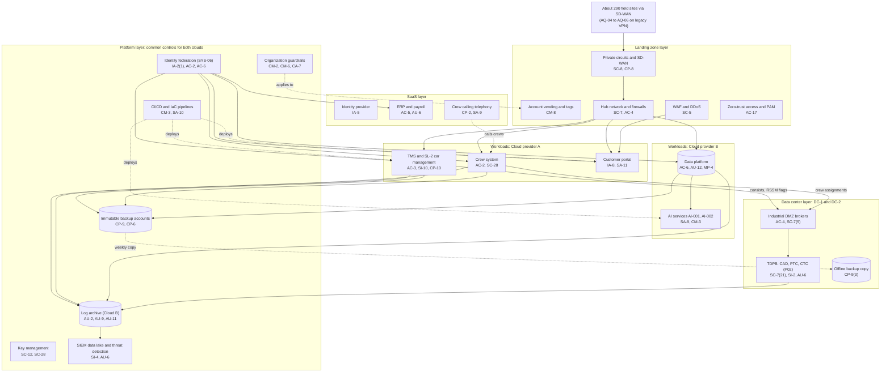

# Cloud Architecture and Control Placement: Cris Santos Company | Transportation Systems | Enterprise

**Organization:** Cris Santos Company, Inc. (publicly traded holding company of 64 freight railroads) | **Tier:** Enterprise | **Provider:** Multi-cloud, vendor-agnostic: two public cloud providers (called Cloud provider A and Cloud provider B), the company data center DC-1 (Florida), colocation data center DC-2 (Texas), and SaaS (see section 4)
**Owner:** Director of Cloud Platform Engineering, with the CISO and the Director of OT Security | **Date:** 2026-08-31 | **Related:** TDPB SSP (P02), enterprise BIA (P05)

## 1. Architecture in layers
The estate is organized in five layers. Each lower layer provides **common controls** that the layers above inherit, so a workload team configures only what is specific to its system. Operational technology (dispatch, PTC, CTC, wayside) stays on premises in the data center layer and in the field; no cloud service reaches OT directly.

| Layer | What it is | Examples | Who runs it |
|---|---|---|---|
| **Platform** | Organization-wide services in both clouds | Guardrails, identity federation, key management, log archive, SIEM data lake and threat detection, vulnerability and posture management, immutable backup accounts, CI/CD pipelines | Cloud Platform Engineering; Security Operations; Identity team |
| **Landing zone** | The standard account (subscription or project) pattern every workload lands in | Account vending with mandatory tags (including CIP scope), hub-and-spoke network with cloud firewalls, private circuits to DC-1 and DC-2 and SD-WAN, WAF and DDoS protection, protective DNS, zero-trust and PAM access | Cloud Platform Engineering; Network Engineering |
| **Workload** | Systems built or run by the company in the clouds | Cloud A: TMS and SL-2 car management (SYS-04), crew system (SYS-05), customer portal. Cloud B: data platform, AI services for AI-001 and AI-002, SIEM data lake | Application teams |
| **SaaS** | Vendor-operated applications | Identity provider, ERP and payroll (SYS-10), productivity suite, hosted crew calling telephony | Vendors, with the company's configuration and oversight |
| **Data center** | Company-run facilities for OT and the TDPB | DC-1 (company-owned, Jacksonville campus) and DC-2 (colocation, Texas) host the CAD, PTC back office, CTC code servers, industrial DMZ, and the weekly offline backup copy | Data Center Operations; OT Security |

## 2. Diagram

## 3. Responsibility by service model
Sources: SRC-AWS-SRM, SRC-AZURE-SRM, and SRC-GCP-SRM in `00_universal-framework/sources/source-register.csv`. The three published models agree on the split used here, so the design does not depend on which two providers the company uses.

| Service model | Provider | Company (customer) | Shared |
|---|---|---|---|
| IaaS (crew system servers) | Facilities, hosts, hypervisor, physical network | Guest OS, applications, identities, data, network policy | Encryption (provider service, customer keys), logging |
| PaaS (TMS, data platform, AI services) | Also the platform runtime and its patching | Data, access, configuration, keys, application code, models | Backups, availability configuration |
| SaaS (identity provider, ERP, productivity, telephony) | Also the application | Users, roles, data, oversight of the vendor | Audit review (complementary user entity controls) |
| Colocation (DC-2) | Building, power, cooling, perimeter | Racks, equipment, cage access lists | None |
| Company data center (DC-1) | Not applicable | Everything | Not applicable |

**TSA view of the split.** The SDs place responsibility on the Owner/Operator. Where a provider or MSSP performs a CIP measure, the company keeps sole responsibility for it (SD 1580/82-2022-01E Sec. II.A.2), so every Provider and Shared row is backed by a reviewed SOC report or contract term (P09 evidence map).

## 4. Service categories and provider equivalents
| Service category | AWS | Microsoft Azure | Google Cloud |
|---|---|---|---|
| Organization guardrails | AWS Organizations service control policies | Azure Policy with management groups | Organization Policy Service |
| Account vending | AWS Control Tower account factory | Azure landing zone subscription vending | Resource Manager project creation |
| Key management | AWS KMS | Azure Key Vault | Cloud KMS |
| Audit logging | AWS CloudTrail | Azure Monitor activity log | Cloud Audit Logs |
| Threat detection | Amazon GuardDuty | Microsoft Defender for Cloud | Security Command Center |
| Managed database | Amazon RDS | Azure SQL Database | Cloud SQL |
| Managed machine learning | Amazon SageMaker | Azure Machine Learning | Vertex AI |
| Web application firewall | AWS WAF | Azure Web Application Firewall | Cloud Armor |
| Protective DNS / resolvers | Amazon Route 53 Resolver DNS Firewall | Azure DNS Private Resolver with DNS security policy | Cloud DNS response policies |
| Backup service | AWS Backup | Azure Backup | Backup and DR Service |

This table is for reading provider documentation only. The architecture, control map, and SSP describe service categories.

## 5. Common controls
`cloud-control-map.csv` has **59 rows** across 26 components: Platform 21, Landing zone 8, Workload 15, SaaS 9, Data center 6. Responsibility: Customer 39, Shared 17, Provider 3.

**32 rows are published as common controls** (`common_control` = Yes) in the enterprise common control catalog. They map to the common control providers in the TDPB SSP (P02 section 10.3): GRC program (CCP-01, posture and continuous monitoring), identity (CCP-02), data center and cloud platform (CCP-03), security operations (CCP-04), networks (CCP-05), and physical security (CCP-07). A workload inherits them by being deployed through account vending, which applies guardrails, logging, network, key, and backup policies automatically.

**Rules for inheriting:**
1. A workload may claim a common control only if its account was created by account vending and passes the posture baseline.
2. Customer-side identity, data protection, and logging stay explicit at every layer: even a SaaS application has Customer rows for access and review (AC-3, AU-6) because those are always the company's responsibility.
3. SaaS and provider rows cite the vendor's SOC 2 report, reviewed by the third-party risk team (P09 evidence map).
4. OT controls are not inherited from the clouds. The TDPB inherits only identity, logging, backup, and monitoring services, and only through the industrial DMZ.

## 6. Validation against the TDPB SSP (P02)
The TDPB is on premises, so it appears in the data center layer. Its cloud-side dependencies are validated here, directly or inherited:
| TDPB dependency | AC | AU | CM | IA | SC | SI / CP |
|---|---|---|---|---|---|---|
| TMS consists and RSSM data (Cloud A) | AC-3; AC-4 (inherited) | AU-2 (inherited) | CM-3 (inherited) | IA-2(1) (inherited) | SC-7 | SI-10; CP-2 |
| Crew system data (Cloud A) | AC-2 | AU-2 (inherited) | CM-6 (inherited) | IA-2(1) (inherited) | SC-28 | SI-2 |
| Log archive and SIEM (Cloud B) | AC-6 (inherited) | AU-9; AU-11 | CM-2 (inherited) | IA-2(1) (inherited) | SC-12 (inherited) | SI-4 |
| Immutable backups | AC-6 (inherited) | AU-2 (inherited) | CM-6 (inherited) | IA-2(1) (inherited) | SC-28 (inherited) | CP-9; CP-6 |

## 7. Findings from the mapping
1. **Acquired railroad connectivity.** AQ-04 to AQ-06 sites connect over legacy site VPNs to the hub, bypassing SD-WAN segmentation, and an AQ-06 site reached the TMS integration APIs in testing (P07 SC-7). Fix: restrict the VPNs to named hosts now, then migrate to SD-WAN with each CAD migration (POAM-018).
2. **OT never transits the cloud.** Consists, crew data, and logs cross the industrial DMZ through brokers; OT services do not traverse the IT network or the cloud (SD 1580/82-2022-01E Sec. III.B.2.b). This keeps cloud incidents from reaching movement authority.
3. **Two clouds, one control set.** Guardrails, logging, and key policies are written once as code and applied to both clouds. Differences are limited to service names (section 4).
4. **Log coverage gap is on premises, not in the cloud.** Every cloud account logs to the archive, but the CTC code servers and PTC message brokers in the data centers do not yet forward to the SIEM (POAM-007).
5. **RSSM data depends on a cloud workload.** TSA's 30-minute location answer depends on the TMS in Cloud A. The offline extract is the architectural fallback, but the procedure has not been tested with the TMS down (POAM-019).
6. **Crew calling telephony is SaaS with no platform fallback.** Concentration risk must be handled by contract and procedure, not architecture (POAM-021), and its SOC report review is overdue (POAM-015).
7. **AI services** for the safety inspection models run in a dedicated Cloud B account with model release control; the AI governance committee reviews each new model version (P10).
