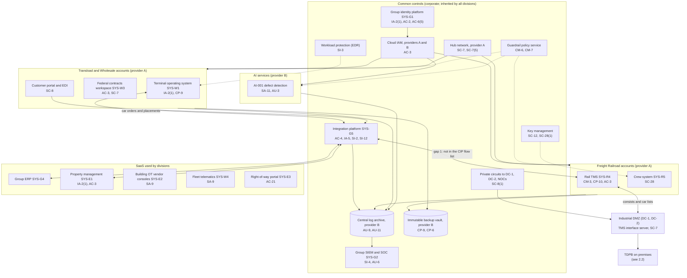
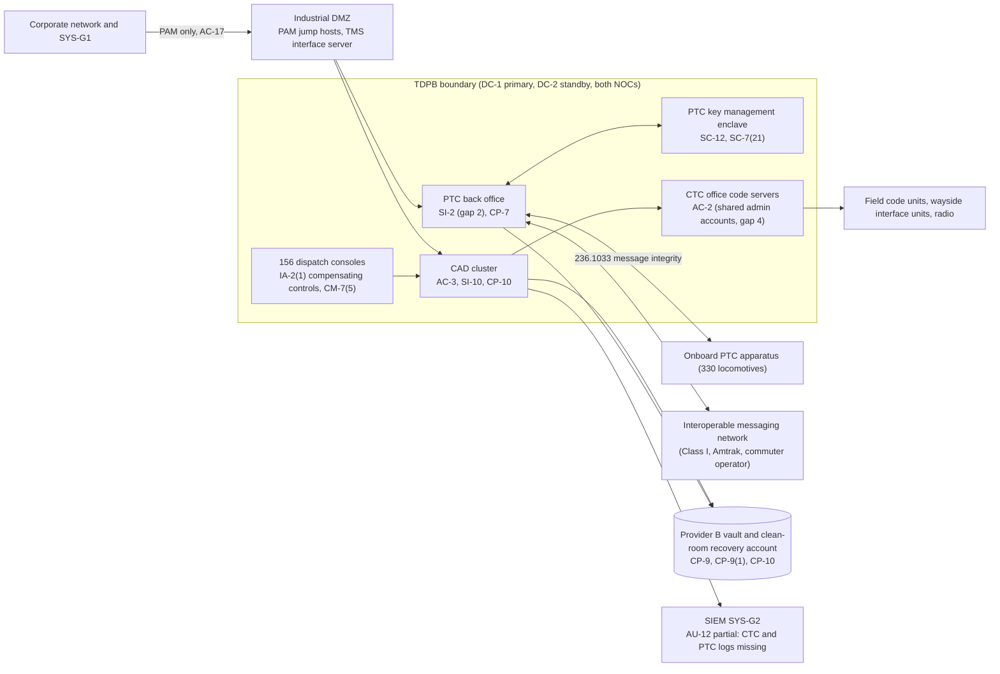

# Cloud Architecture and Control Placement: Cris Santos Company Holdings | Transportation Systems | Multi-Sector

**Organization:** Cris Santos Company Holdings, Inc. | **Tier:** Multi-Sector | **Providers:** two public cloud providers, called provider A and provider B (vendor-agnostic; see section 5), plus company data centers DC-1 and DC-2
**Scope:** the shared corporate cloud platform (SYS-G3 landing zones, the SYS-G5 integration platform, logging, keys, and backups) and the division workloads that run on it or depend on it. The SSP system (P02, TDPB) is on premises; its cloud dependencies are shown separately.

## 1. Design in one paragraph
Corporate runs one **landing zone** per provider: identity federation from SYS-G1, a hub network, guardrail policies, a central log archive, key management, EDR, and an immutable backup vault. Divisions get their own **accounts** (subscriptions or projects) inside the landing zone and inherit these guardrails. Provider A hosts the hub, the SYS-G5 integration platform, the rail TMS and crew system, the terminal operating system, and the wholesale portal and federal contracts workspace. Provider B hosts the SIEM data lake and log archive, the AI services (SYS-G6), the immutable backup vault, and the TDPB clean-room recovery account. **The train dispatching and PTC back office platform stays on premises** in DC-1 and DC-2 for latency and availability; it reaches the cloud only through the industrial DMZ. Many division systems are SaaS (ERP, property management, fleet telematics, building OT consoles), where the group's duties are identity, configuration, and vendor oversight.

## 2. Diagrams
### 2.1 Group landing zone and division workloads

### 2.2 TDPB (SSP boundary) and its cloud dependencies

**Target state (POAM-001, POAM-003, POAM-004, POAM-005):** the SYS-G5 route into the TMS interface server is described in an amended CIP with its own inspected DMZ rule; CTC and PTC logs reach the SIEM with 1-year retention; the PTC back office standby is rebuilt to match production and meets its 4-hour RTO; unpatched PTC servers have documented compensating measures until the vendor certifies patches.

## 3. Common versus division-specific controls
`cloud-control-map.csv` has 46 rows across 28 components. The `control_scope` column shows who owns each placement:

| Scope | Rows | What it means |
|---|---|---|
| Common (group) | 25 | Provided once by corporate (SYS-G1 to SYS-G5) and inherited by every division account. Listed in the P02 common control catalog |
| SSP system (TDPB cloud dependencies) | 4 | Cloud and DMZ placements that the on-premises TDPB relies on, documented in the P02 SSP |
| Division-specific (Freight Railroad) | 7 | TMS, crew system, crew telephony, and the AI defect detection services |
| Division-specific (Transload and Wholesale) | 6 | Terminal operating system, federal contracts workspace, customer portal, fleet telematics |
| Division-specific (Real Estate) | 4 | Property management, building OT vendor consoles, right-of-way portal |

| Responsibility | Rows |
|---|---|
| Customer (the group or a division) | 37 |
| Shared (provider and group) | 6 |
| Provider | 3 |

**Rule of thumb.** Identity, network guardrails, logging, keys, backups, EDR, and the integration platform are **common**. A division cannot opt out, only request an exception through POL-01. Application behavior, operational technology, and customer-facing identity are **division-specific**, because they depend on each division's regulators and customers: TSA and FRA for the railroads, FAR clauses and hazmat rules for terminals and wholesale, lease and vendor terms for buildings.

## 4. Layers
| Layer | Common components | Division components | Key controls | Responsibility |
|---|---|---|---|---|
| Identity | SYS-G1, cloud IAM | TMS roles, TOS kiosks, property portal users, CDS customer users | AC-2, AC-3, AC-6(5), IA-2(1), IA-5 | Customer (configuration); vendor (service) |
| Network | Hub, private circuits, edge protection | Industrial DMZ (on premises), federal contracts workspace | SC-7, SC-7(5), SC-8, SC-8(1), SC-5 | Customer, with provider DDoS protection shared |
| Compute | EDR, guardrails, integration platform | TMS, TOS, AI services | SI-2, SI-3, CM-3, CM-6, CM-7, SA-11 | Customer (guest OS, containers, code) |
| Data | Keys, backup vault | TMS RSSM extract, crew records, FCI, guarantor records | SC-12, SC-28, SC-28(1), CP-9, CP-6, CP-10, AC-21, SI-12 | Shared: provider encrypts; group owns keys, retention, and access |
| Logging and monitoring | Log archive, SIEM | TDPB forwarding, AI alert logs | AU-3, AU-6, AU-9, AU-11, AU-12, SI-4 | Shared: providers generate platform logs; group retains and reviews |
| SaaS dependencies | Identity, SIEM, and EDR vendors | Crew telephony, telematics, building OT vendors, property and right-of-way systems | SA-9 | Provider for the service; customer for use and oversight |
| Physical | Provider data centers (DC-1 and DC-2 are company-run and covered in P02) | none | PE-3, MP-6 | Provider (inherited) |

## 5. Service categories and provider equivalents
The design does not depend on a provider. This table gives each provider's name for each service category, for reading its shared responsibility documentation.

| Service category | AWS | Microsoft Azure | Google Cloud |
|---|---|---|---|
| Account structure and guardrails | AWS Organizations with service control policies | Management groups with Azure Policy | Resource hierarchy with Organization Policy |
| Hub network and firewalls | Transit Gateway with AWS Network Firewall | Virtual WAN hub with Azure Firewall | Network Connectivity Center with Cloud NGFW |
| Managed integration and file transfer | AWS Transfer Family; Amazon EventBridge | Azure Logic Apps; Azure Service Bus | Application Integration; Pub/Sub |
| Managed relational database | Amazon RDS | Azure SQL Database | Cloud SQL |
| Key management | AWS KMS | Azure Key Vault | Cloud KMS |
| Audit logging | AWS CloudTrail | Azure Monitor activity log | Cloud Audit Logs |
| Backup with immutability | AWS Backup (vault lock) | Azure Backup (immutable vault) | Backup and DR Service |
| Private connectivity | AWS Direct Connect | Azure ExpressRoute | Cloud Interconnect |

Shared responsibility sources: SRC-AWS-SRM, SRC-AZURE-SRM, SRC-GCP-SRM in `00_universal-framework/sources/source-register.csv`. All three agree on the split used here: for IaaS the provider owns facilities, hosts, and virtualization; for PaaS the provider also owns the runtime; for SaaS the provider owns the application. The customer always keeps identities, access decisions, data classification, and data.

## 6. Findings from the mapping
1. **The integration platform is the group's hidden Critical Cyber System dependency** (AC-4). It is common, cloud-hosted, and connects every division, and it feeds the TMS interface server that sits next to dispatch. It must be named in the CIP and given its own DMZ rule (gap 1; P01 GR-01; POAM-001).
2. **The integration platform also holds personal information it does not need** (SI-12). HR export files for all divisions sit in the transfer store with no purge. In a breach they would turn an operational incident into a multi-state notification event (P08).
3. **TDPB's cloud dependencies are recovery and monitoring, not operations.** The vault and the clean-room recovery account are sound (CP-9, CP-9(1), CP-10); the weak link is log forwarding from CTC and PTC servers (AU-12; POAM-003).
4. **Common controls are strong and reused.** One identity platform, one SIEM, one backup design. This is what lets group internal audit assess them once (P07). The weak links are where divisions sit outside the platform: 21 acquired terminals with local accounts and no EDR (gap 5), and building OT consoles run by vendors under contracts without security terms (gap 7).
5. **The federal contracts workspace is a small, clean enclave** (AC-3, SC-7). Keeping FCI there limits the reach of FAR 52.204-21 to 23 users and one workspace.
