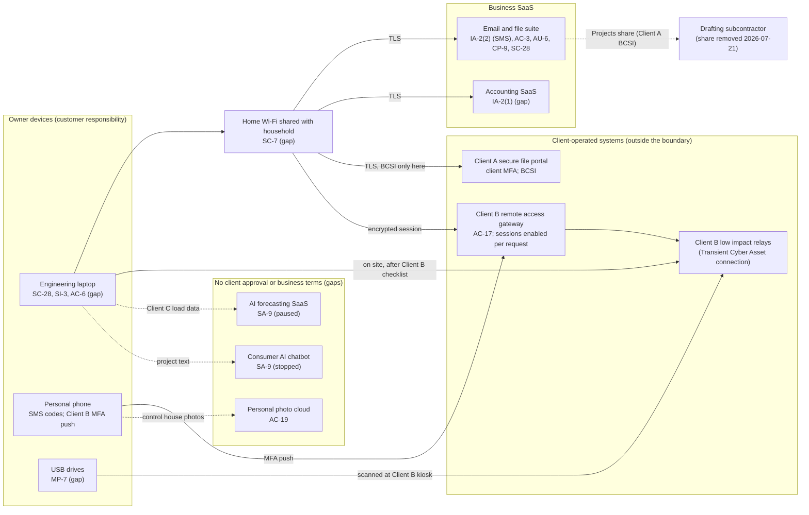

# SaaS Architecture and Control Placement: Cris Santos Company | Utilities | Sole Proprietorship

**Organization:** Cris Santos Company (independent utility engineering consultant) | **Tier:** Sole Proprietorship | **Provider:** SaaS only (no IaaS or PaaS)
**System:** Core Business Systems (CBS), as defined in the system profile (P02) | **Mapped:** 2026-07-22 by the owner-engineer with the IT technician

## 1. Diagram
Control IDs on each node are the ones in `cloud-control-map.csv`. Dashed lines are flows with no client approval or business terms behind them.

## 2. Layers
| Layer | Components | Key controls | Responsibility |
|---|---|---|---|
| Identity | Email suite account (also the tenant admin), accounting account, Client A and Client B named accounts | IA-2(1), IA-2(2) | Customer configures; providers and clients supply MFA |
| Data | Project folders, Client A BCSI copies, CEII archive, settings files on USB, photos | AC-3, SC-28, CP-9, MP-7, AC-19 | Providers protect data inside their services; the owner decides where client data goes and who it is shared with |
| Compute (endpoints) | Laptop, phone | SC-28, SI-3, AC-6 | Customer |
| Network | Home Wi-Fi; Client B gateway sessions | SC-7, AC-17 | Customer at home; Client B on its side of the gateway |
| Logging | Suite sign-in and file activity logs | AU-6 | Shared: provider records, owner reviews |
| SaaS applications | Suite, accounting, AI tools | SA-9 | Provider runs the application; owner chooses and reviews providers |

## 3. Shared responsibility for SaaS
All three major cloud providers' shared responsibility models (SRC-AWS-SRM, SRC-AZURE-SRM, SRC-GCP-SRM) agree on the SaaS split: the provider runs the application, the platform, and the facilities; **the customer always keeps its identities and accounts, its data, and its devices.** That is why 13 of the 17 rows in the control map are the owner's alone, 3 are shared, and only 1 (encryption at rest inside the email suite) belongs to the provider. A provider's SOC 2 report never covers these three layers.

**A second kind of shared responsibility applies here: the client's.** On the Client A portal and the Client B gateway, the client is the "provider". Each client's NERC CIP program decides its half: Client A authorizes the named account (CIP-004-7 R6), and Client B determines, disables, and monitors vendor sessions (CIP-003-9 Attachment 1 Section 6). The owner's half is written in SSA-A and VAA-B: protect the credentials, use only the business laptop, and never move client data outside the approved path. Those rows use "client-operated system" instead of a cloud provider reference. No IaaS equivalents table is needed, because the business runs no infrastructure.

## 4. Findings from the mapping
1. **Sharing settings, not hackers, exposed client data.** The drafter's "Projects" share (removed 2026-07-21) and an "anyone with the link" share on a Client B folder (found 2026-07-22, removed 2026-07-23) both came from the owner's own settings. Tracked as P01 R-004.
2. **SMS codes guard the account that holds BCSI and CEII.** The suite and its admin console rely on SMS codes, and the accounting SaaS has no MFA at all. Tracked with R-001 and R-008.
3. **The laptop is both an office PC and a Transient Cyber Asset.** It reads email and browses the web under an administrator account, then connects to Client B relays. Tracked as R-002.
4. **Three services hold client data with no client approval:** the personal photo cloud (R-005), the AI forecasting SaaS (R-009), and the consumer chatbot (R-009). The SaaS model cannot fix this; only the owner's choices and the clients' consent can.
