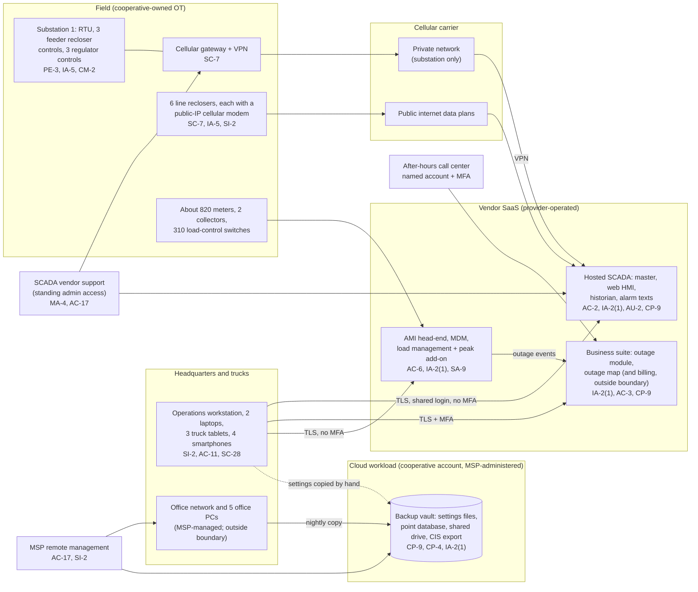

# Cloud Architecture and Control Placement: Cris Santos Company | Utilities | Micro

**Organization:** Cris Santos Electric Cooperative, Inc. (member-owned electric distribution cooperative) | **Tier:** Micro | **Provider:** Vendor-agnostic SaaS plus one IaaS workload (see section 3)
**System:** Distribution SCADA and Outage Management System (DSOMS), as defined in the SSP (P02) | **Prepared:** 2026-07-31 by the Office and Finance Manager (Security Coordinator) and the Line Superintendent with the MSP lead technician; updated 2026-08-12 after P07 testing | **Approved:** General Manager, 2026-08-31

## 1. Diagram
The cooperative runs no servers. Its control system is a hosted SCADA service that reaches field devices over cellular links. The AMI head-end and the outage module are also SaaS. The one cloud workload it owns is the backup vault, an object storage account in a public cloud that the MSP administers.

## 2. Layers and who is responsible
| Layer | Components | Key controls | Customer (cooperative) | MSP (on the cooperative's behalf) | Provider (SaaS or IaaS vendor) |
|---|---|---|---|---|---|
| Identity | SCADA, AMI, outage module, and vault logins; device passwords | AC-2, IA-2(1), IA-5, AC-6 | Named accounts, MFA settings, disconnect rights, device passwords. **Shared SCADA login and default device passwords are the main gaps** | Holds the vault administrator login | Runs sign-in and MFA services |
| Network | Carrier private network and VPN; public-IP modems; office firewall | SC-7, CM-7 | Chooses the carrier plans; moves line recloser modems to the private network | Office firewall only | Carrier runs the networks; SCADA vendor runs the VPN endpoint |
| Field devices | RTU, recloser and regulator controls, gateway, modems, collectors | CM-2, CM-8, SI-2, PE-3 | All of it: settings, firmware, inventory, locks | Not applicable (MSP contract excludes OT) | Not applicable |
| Endpoints | Operations workstation, laptops, tablets, smartphones | SI-2, SI-3, AC-11, SC-28 | Enrolls devices in MSP management; removes automatic sign-in | Patches and protects the 2 laptops today; all endpoints after enrollment | Not applicable |
| SaaS applications | SCADA, AMI, outage module | AC-3, AC-12, AU-2 | Roles, timeouts, alarm routing, log review | Not applicable | Application, platform, data centers |
| Data | Settings files, point database, vault copies | CP-9, CP-4, SC-28 | Decides what is copied and when; owns restore testing | Operates the vault; runs restore tests | Vendors back up their own services; IaaS provider stores and encrypts objects |
| Logging | SCADA event log, AMI command log, vault activity log | AU-2, AU-6 | **Reviews logs monthly (gap today)** | Forwards vault alerts | Generates and stores logs |
| Vendor governance | Contracts, SOC 2 reports, MSP review | SA-9, SR-6 | Contract terms; reviews SOC 2 reports and MSP evidence | Answers the annual MSP review | Provides SOC 2 reports |

**The MSP is not a cloud provider in the shared responsibility sense.** It performs customer-side duties for the cooperative, and only for office IT and the vault. Its contract excludes OT. Anything marked "Customer (performed by MSP)" in `cloud-control-map.csv` remains the cooperative's responsibility. The cooperative must direct the work, receive evidence, and check it (SA-9). RUS rules say the same in their own terms: for portions of the system it does not operate, the borrower must make sure the operator runs them properly (7 CFR 1730.20) and review the operator's performance (1730.22(a)).

## 3. Service categories and provider equivalents
The design is vendor-agnostic. The shared responsibility split for SaaS and IaaS is the same in all three major cloud providers' models (SRC-AWS-SRM, SRC-AZURE-SRM, SRC-GCP-SRM in `00_universal-framework/sources/source-register.csv`). For SaaS the provider runs the application and everything below it, and the customer keeps identities, access, and data decisions. For IaaS object storage the customer also keeps storage settings such as versioning, retention locks, and access policies.

| Service category used | What it is here | Equivalent category in the large cloud providers (for reading their documentation) |
|---|---|---|
| Industry SaaS (OT) | Hosted distribution SCADA | Industrial IoT or SCADA SaaS built on any provider |
| Industry SaaS (utility) | AMI head-end and meter data management; utility business suite with outage management | Industry SaaS built on any provider |
| Object storage (IaaS) | Backup vault in a cooperative-owned account | Object storage with versioning and object lock (write-once) |
| Remote monitoring and management | MSP device management | Device management SaaS |
| Private cellular network | Carrier private network for the substation gateway | Carrier service, not a cloud provider service |

## 4. Findings from the mapping
1. **The control system is reachable from anywhere with one password (AC-2, IA-2(1), AC-17).** The SCADA web HMI accepts the shared operator login from any internet address, with no MFA. This is the path in the P08 scenario. Fix: named accounts, MFA, and sign-in limited to cooperative devices by 2026-10-31 (P01 R-001; P07 POAM-001).
2. **Two networks, two very different exposures (SC-7).** The substation gateway sits on the carrier's private network behind a VPN. The 6 line reclosers sit on public-IP data plans, and P07 testing on 2026-08-11 found the LR-4 modem's web page open to the internet with the installer's default password. Ports were closed on 2026-08-12. Fix: move all 6 modems to the private network by 2026-12-31 (R-002; POAM-003).
3. **The vendor holds the keys (MA-4).** SCADA vendor support has standing administrator access to the tenant and the gateway. The vendor's SOC 2 report covers how its staff are controlled. It does not cover whether the cooperative wants them connected at a given moment. Fix: access on request, logged by the Line Superintendent (R-008; POAM-004).
4. **The vault can be wiped by one login (CP-9, IA-2(1)).** Versioning is on, but there is no write-once retention, and the administrator login has no MFA. Device settings reach the vault only when the Line Superintendent remembers. Fix: MFA, object lock with 90-day retention, a scheduled settings copy after every change, and quarterly restore tests (R-007; POAM-007).
5. **Customer-side controls are the weak layer.** The vendors' side is evidenced for SCADA and the business suite by SOC 2 reports. The AMI vendor has provided no evidence yet. Every open gap in the map is on the cooperative's side or with the MSP.
