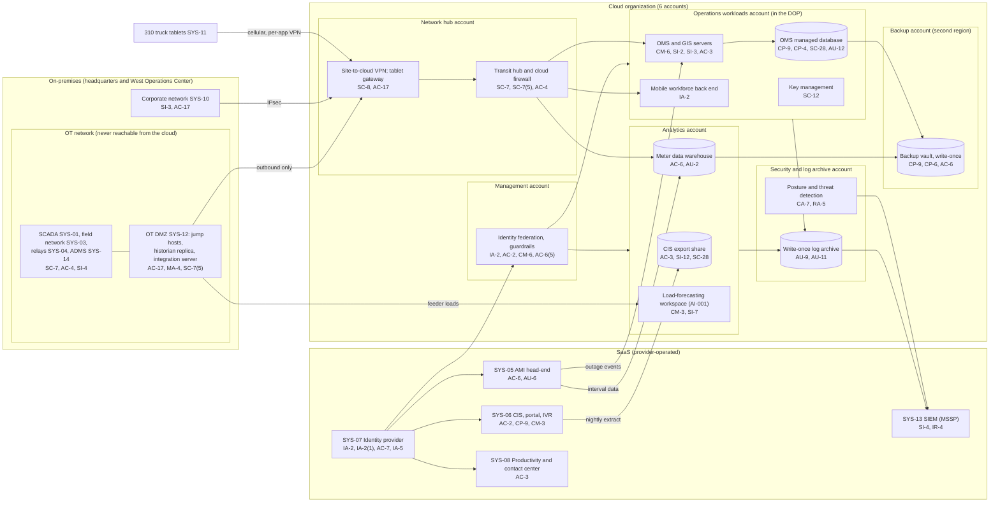

# Cloud Architecture and Control Placement: Cris Santos Company | Utilities | Mid-Market

**Organization:** Cris Santos Company, Inc. | **Tier:** Mid-Market | **Provider:** Vendor-agnostic public cloud (see section 4), plus SaaS
**Scope:** the six-account cloud landing zone (SYS-09) and the SaaS services it depends on. The operations workloads account is part of the Distribution Operations Platform (DOP) in the SSP (P02); the analytics account supports Utility Services (P09) and the load-forecasting model (P10). | **Prepared:** 2026-07-31 by the Information Security Manager with the Director of Information Technology; updated 2026-09-17 with P07 results
**Control map:** `cloud-control-map.csv` (54 rows, 25 components)

## 1. Diagram

The OT network sits outside the cloud on purpose. No route exists from any cloud account to SCADA, the field network, or the relays. Data leaves the OT network only outbound from the OT DMZ: the historian replica feeds the load-forecasting workspace, and the OMS-SCADA integration server sends breaker status to the OMS.

## 2. Landing zone design
The landing zone separates duties across 6 accounts (subscriptions or projects, depending on the provider) under one cloud organization. Each account limits what an attacker can do from any other.

| Account | Purpose | Who administers | Key design decisions |
|---|---|---|---|
| **Management** | Organization root, identity federation to SYS-07, organization guardrails | Information Security Manager and 1 cloud engineer | No workloads. Root credentials sealed with hardware MFA. Guardrails apply to every other account and cannot be disabled from them |
| **Security and log archive** | Posture and threat detection, write-once log archive, SIEM forwarding | Security team (read); MSSP (read-only integration) | Logs from all accounts land here; nobody can delete them for 3 years |
| **Network hub** | Transit hub, cloud firewall, site-to-cloud VPN, tablet access gateway, DNS and egress filtering | Director of Information Technology's network team | All traffic between operations centers, accounts, and the internet passes the hub firewall. No route to the OT network |
| **Operations workloads** | OMS and GIS, switching and clearance module, mobile workforce back end, key management | IT infrastructure team, with the OMS vendor under contract | Part of the DOP (P02). No internet ingress except the tablet gateway. Customer-managed keys |
| **Analytics** | CIS export share, meter data warehouse (company and client meters), load-forecasting workspace | Data team; Lead Load Forecasting Analyst for AI-001 | Separate from operations. Client utilities' data kept in separate schemas. Holds the largest customer data set in the company (finding 1) |
| **Backup** | Backup vault with write-once retention in a second region | 2 named backup administrators | Separate credentials, not federated to everyday accounts. Cross-account backup role can write but not delete. Second region chosen for hurricane separation |

## 3. Layers and shared responsibility per service
| Layer | Components | Key controls | Service model | Responsibility |
|---|---|---|---|---|
| Identity | Cloud federation, break-glass accounts, PAM for IT and cloud, backup administrators, SYS-07 | IA-2, IA-2(1), AC-2, AC-6, AC-6(2), AC-6(5), AC-7, IA-5 | PaaS / SaaS | Customer configures identities, roles, MFA, and reviews; providers run the identity services |
| Network | Transit hub, cloud firewall, VPN, tablet gateway, DNS and egress | SC-7, SC-7(5), SC-8, AC-4, AC-17 | PaaS | Customer designs routes, rules, and the one-way OT DMZ path; provider runs the gateway services |
| Compute | OMS and GIS servers, mobile back end, load-forecasting workspace, guardrails | CM-6, CM-7, CM-3, SI-2, SI-3, AC-3 | IaaS / PaaS | Customer (guest OS, applications, EDR, model code); OMS vendor for application support; provider for hosts and the managed notebook platform |
| Data | OMS database, CIS export share, meter data warehouse, keys, backups | SC-28, SC-12, CP-9, CP-6, CP-4, AC-3, AC-6, SI-12, SI-7 | PaaS | Shared: provider encrypts and runs storage and database engines; customer controls keys, access, retention, restore testing, and what data is kept |
| Logging and monitoring | Log pipeline, posture service, log archive, SIEM | AU-2, AU-9, AU-11, AU-12, CA-7, RA-5, SI-4, IR-4 | PaaS / SaaS | Shared: provider generates logs and detections; customer enables, keeps, forwards, and acts on them; MSSP monitors |
| SaaS applications | CIS, AMI head-end, identity provider, productivity and contact center, SIEM | AC-2, AC-3, AC-6, AU-6, CM-3, CP-9, AC-7, IA-5 | SaaS | Provider runs the application and infrastructure; customer keeps users, roles, bulk command limits, change approval, and data |
| Physical | Provider and SaaS vendor data centers | PE-3, PE-13 | All | Provider (inherited, evidenced by attestation and SOC 2 reports) |

**Responsibility counts in `cloud-control-map.csv`:** 30 Customer, 19 Shared, 5 Provider. By service model: 32 PaaS, 13 SaaS, 9 IaaS rows. By layer: 14 Data, 10 SaaS, 8 Compute, 7 Identity, 6 Logging, 6 Network, 3 Physical. The customer side is always identity, data protection, and logging, as the three providers' shared responsibility models agree.

## 4. Service categories and provider equivalents
The design is independent of the provider. This table gives each provider's name for the service category, for reading its shared responsibility documentation (SRC-AWS-SRM, SRC-AZURE-SRM, SRC-GCP-SRM in `00_universal-framework/sources/source-register.csv`).

| Service category | AWS | Microsoft Azure | Google Cloud |
|---|---|---|---|
| Multi-account organization and guardrails | AWS Organizations, service control policies | Management groups, Azure Policy | Resource Manager folders, organization policies |
| Account, subscription, or project | Account | Subscription | Project |
| Cloud identity federation | IAM Identity Center | Microsoft Entra ID with Azure RBAC | Cloud Identity with IAM |
| Network hub | Transit Gateway | Virtual WAN hub or hub virtual network | Network Connectivity Center or shared VPC |
| Cloud firewall | AWS Network Firewall | Azure Firewall | Cloud NGFW |
| Site-to-cloud VPN | Site-to-Site VPN | VPN Gateway | Cloud VPN |
| Virtual machines | EC2 | Virtual Machines | Compute Engine |
| Managed relational database | Amazon RDS | Azure SQL Database | Cloud SQL |
| Managed file share | Amazon FSx or EFS | Azure Files | Filestore |
| Data warehouse | Amazon Redshift | Azure Synapse Analytics | BigQuery |
| Managed notebook and model training | SageMaker | Azure Machine Learning | Vertex AI |
| Object storage with write-once retention | S3 with Object Lock | Blob Storage with immutability policies | Cloud Storage with bucket lock |
| Backup service | AWS Backup (vault lock) | Azure Backup (immutable vault) | Backup and DR Service |
| Key management | AWS KMS | Azure Key Vault | Cloud KMS |
| Audit logging | CloudTrail | Azure Monitor activity log | Cloud Audit Logs |
| Posture and threat detection | Security Hub, GuardDuty | Microsoft Defender for Cloud | Security Command Center |

**Service model split used here (all three providers agree):**
- **IaaS** (virtual machines, networks): the provider owns facilities, hosts, and virtualization. The customer owns the guest OS, applications, network configuration, identities, and data.
- **PaaS** (managed database, file share, warehouse, notebooks, backup, key service): the provider also owns the platform software and its patching. The customer owns access, keys, data, retention, and configuration.
- **SaaS** (CIS, AMI head-end, identity provider, productivity suite, SIEM): the provider also owns the application. The customer keeps identities, roles, command limits, change approval, audit review, and data.

## 5. Findings from the mapping
1. **The CIS export share is the largest concentration of customer data, and it is outside the CIS vendor's controls.** About 410,000 records, including closed accounts and the 4 client utilities' customers, with SSNs and driver license numbers that no report uses. 38 analysts can read it, retention is unlimited, and the SIEM does not alert on large reads. This is the data the second P08 incident type steals (P01 R-003, R-024; POAM-012).
2. **The OT boundary holds in the cloud design.** No cloud account can reach the OT network; the OT DMZ sends data outbound only. The weak points are on-premises, not in the cloud: the 6 legacy IT/OT firewall rules (gap 4) and the Substation H modem (gap 2) (P02).
3. **Recovery is designed but only partly proven.** Backups are isolated (separate account, second region, write-once, separate credentials). The OMS restore took 3 hours 10 minutes, which meets the OMS RTO but not the 2-hour RTO of the switching and clearance module (P05 finding 2; P01 R-016). The meter data warehouse and CIS export have never been restored.
4. **SaaS customer-side controls carry the biggest SaaS risks.** The AMI head-end allows bulk remote disconnects by 22 users without limits (gap 10; P01 R-014), and CIS partition changes for Utility Services clients lack approval evidence (gap 14; P09). Both are customer responsibilities under the vendors' SOC 2 complementary user entity controls.
5. **The load-forecasting workspace has no change control** for model code and parameters, and no input data checks (P10 AI-001).
6. **Boundary check.** Every cloud component in the SSP (P02 section 9) appears in the diagram. Every cloud component has at least one row in the control map, and each account has controls from at least 2 of the AC, AU, CM, IA, SC, and SI families or inherits them.
7. **Inherited controls rely on attestation reports.** Controls marked Provider or Shared for the cloud provider, identity vendor, CIS vendor, AMI vendor, and MSSP depend on their SOC 2 Type 2 or equivalent reports and their complementary user entity controls, reviewed each year in P09 `vendor-soc2-review.csv`.
