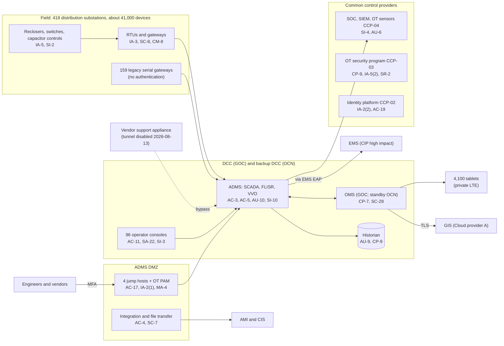

# System Security Plan: Distribution Operations Platform (DOP)

**Organization:** Cris Santos Company, Inc. (publicly traded investor-owned electric utility) | **Tier:** Enterprise | **Vertical:** Utilities
**Outline:** NIST SP 800-18 Rev. 2, System Security Plan Outline Example (June 2026) | **Version:** 3.0, 2026-09-15

## 1. System Name and Identifier
Distribution Operations Platform (**DOP**), identifier CSC-DOP-01. Tier-1 system in the enterprise application inventory and the most critical OT system outside NERC CIP scope.

## 2. System Overview
The DOP monitors and controls the distribution grid and runs outage restoration for about 1.95 million meters in Florida and south Georgia. The 24x7 Distribution Control Center (DCC) at the Grid Operations Center (GOC) uses it to operate breakers, reclosers, automated switches, and capacitor banks on 3,380 feeders; to run fault location, isolation, and service restoration (FLISR) on 1,900 feeders and volt-VAR optimization; to issue switching orders and clearances that protect line workers; and to carry out load shedding when the Transmission Control Center (TCC) directs it. Dispatchers use the OMS to predict outages from AMI events and customer calls and to send crews to 4,100 truck tablets.

**Why integrity and availability matter most.** A false or unauthorized command can open feeders serving tens of thousands of customers or re-energize a line where crews work under a clearance. Loss of the ADMS forces manual switching by radio (P05 BP-02: MTD 4 h, RTO 2 h).

**Major components:**
- **SYS-02 ADMS:** distribution SCADA front ends, DMS application servers (FLISR, volt-VAR optimization, switching management), 96 operator consoles, historian, quality (test) environment, at the DCC with a warm standby at the backup DCC at Operations Center North (OCN)
- **SYS-03 OMS, GIS, mobile workforce:** OMS on-premises at the GOC with a warm standby at OCN; GIS on Cloud provider A; 4,100 rugged tablets
- **Distribution portion of SYS-04:** RTUs, gateways, and routers at 418 distribution substations and about 41,000 field devices, over company fiber, private LTE, and licensed radio
- **Part of SYS-12 (ADMS DMZ):** 4 jump hosts, OT PAM connectors, historian replica, ADMS-OMS integration servers, file transfer and patch staging servers

**How the DOP relates to NERC CIP.** The DOP controls distribution facilities, which are not BES Facilities, and the DCC does not perform Transmission Operator reliability tasks for transmission Facilities, so the DOP is not a BES Cyber System (company determination recorded in a 2024 compliance memo and re-read in each CIP-002 review). The TCC directs load shedding; DCC operators carry it out through the ADMS. The DOP is protected voluntarily to OT-STD-01, which mirrors the medium impact CIP controls, and it inherits many controls from the OT security program that also serves the CIP-scope EMS. One DOP interface does touch CIP scope: the ADMS-to-EMS data link enters the EMS Electronic Security Perimeter through an EMS Electronic Access Point, governed by the EMS team's CIP-005-7 rules.

Users: 210 DCC operators and engineers, about 300 dispatchers and storm staff, 4,900 field users on tablets (OMS mobile only), 19 privileged administrators, and named vendor engineers through OT PAM.

## 3. Laws, Regulations, and Policies Affecting the System
| ID | Requirement | Citation | How it affects the DOP |
|---|---|---|---|
| N22-R01 | NERC CIP Reliability Standards | 16 U.S.C. 824o; CIP-002-5.1a to CIP-014-3 | The DOP is outside CIP scope. The ADMS-to-EMS link crosses an EMS Electronic Access Point (CIP-005-7 R1); DOP staff who also hold CIP access follow CIP-004-7 (training, personnel risk assessment, revocation) |
| Event reporting | NERC EOP-004-4; Form DOE-417 | EOP-004-4 R1-R2; Federal Energy Administration Act sec. 13(b) | A cyber event that interrupts distribution operations, or loss of service to more than 50,000 customers for 1 hour or more, is reportable (P08) |
| SEC | Cybersecurity disclosure | Form 8-K Item 1.05; 17 CFR 229.106 | A material DOP incident goes through the P08 materiality step |
| State | State breach notification laws | Each state where affected individuals reside (Florida worked example: Fla. Stat. 501.171) | OMS holds names, addresses, phone numbers, and medical-priority flags |
| Voluntary | NIST CSF 2.0; NIST SP 800-82 Rev. 3 (Guide to OT Security); OT-STD-01 | Benchmark | The control baseline for the DOP |
| Internal | POL-01 to POL-05, standards, and procedures | P06 | Enterprise policy hierarchy |

Not applicable: N22-R02 (TSA pipeline directives; no pipelines), N22-R03 (NRC 10 CFR 73.54; no reactors), N22-R04 (SDWA section 1433; no water system).

## 4. System Status
### 4.1 System Security Plan Approval
Prepared by the ADMS Platform Manager, the OMS Application Manager, and the GRC team. Reviewed by the CISO, the Director, OT Security, and the Director, Distribution Control Center. Approved by the Vice President, Distribution Operations (system owner) and the Chief Operating Officer on 2026-09-15.
### 4.2 System Authorization Decision
The company is not a federal agency, so there is no formal ATO. The equivalent internal decision:
- **Authorizing official equivalent:** Chief Operating Officer, with the CISO's recommendation.
- **Decision (2026-09-15):** continue operation with conditions, based on the Internal Audit assessment (P07) and the risk register (P01).
- **Conditions:** redesign the ADMS vendor support path through the jump hosts (POAM-001, due 2026-11-30); remove the corporate-to-historian DMZ rules (POAM-002, due 2026-12-15); prove the 2-hour failover in a retest (POAM-005, due 2027-03-31); remove vendor default passwords from field devices (POAM-013, due 2026-12-31).
- **Reauthorization:** annually, or after a major change (the ADMS console refresh in 2027 or a change to the CIP-002 determination).
### 4.3 System Operational Status
Operational. Planned major modifications: console and historian refresh with application allowlisting (CM-7(5), SA-22, 2027-06); replacement of legacy serial gateways at 159 substations (IA-3, SC-8, through 2028); OT sensor expansion to all distribution substations with fiber (SI-4, 2027-12).

## 5. Role Identification and Responsible Personnel
| Role | Title | Responsibility |
|---|---|---|
| System owner | Vice President, Distribution Operations | Accountable for the DOP; approves access roles and the contingency plan |
| Authorizing official (equivalent) | Chief Operating Officer | Accepts residual risk to operate |
| Operations lead | Director, Distribution Control Center | DCC operation; operational incident commander for distribution OT incidents |
| System administrators | ADMS Platform Manager; OMS Application Manager (both report to the Director, OT Engineering) | Day-to-day administration, change control, backups |
| OT security | Director, OT Security | OT architecture, OT PAM, OT monitoring standards |
| Information security | CISO; Director, Security Operations | Program oversight; 24x7 SOC monitoring; incident response |
| CIP interface | CIP Senior Manager (SVP, Transmission and System Operations); Director, NERC Compliance | Keep the DOP out of the EMS Electronic Security Perimeter; review the CIP-002 determination |
| Common control providers | See section 10.3 | Operate inherited controls |
| Independent assessor | Chief Audit Executive (Internal Audit, with the co-sourced OT specialist firm) | Annual assessment (P07) |

## 6. System Information Types and System Categorization
Information types follow NIST SP 800-60 Vol. 2 Rev. 1 where a close match exists and are defined by the company otherwise. Impact levels follow FIPS 199.

| Information type | Confidentiality | Integrity | Availability | Rationale |
|---|---|---|---|---|
| Energy supply: real-time distribution monitoring and control | Moderate | **High** | **High** | A false command can open feeders or energize a line under clearance; loss of control forces manual switching across 3,380 feeders |
| Switching orders and clearances | Moderate | **High** | **High** | Worker safety depends on accurate clearance status |
| Outage and customer contact records (OMS) | Moderate | Moderate | **High** | Customer contact and medical-priority data; outage data drives restoration in storms |
| OT network diagrams, point lists, and security configuration | Moderate | Moderate | Low | Useful to an attacker; handled like BES Cyber System Information (POL-04) |
| **DOP category (high-water mark)** | **Moderate** | **High** | **High** | **High system** |

**Categorization decision.** The DOP is a High system. The company is not a federal agency and uses FIPS 199 and SP 800-53B as a model, tailored with the SP 800-82 Rev. 3 OT overlay.

**Documented controls.** `control-implementation.csv` documents **all 370 controls and enhancements of the SP 800-53B High baseline**. Tailoring decisions are recorded in the rows:
- **Not applicable (4):** IA-2(12), IA-8(1), IA-8(4), SA-4(10), which concern federal PIV credentials and federal identity profiles.
- **OT safety tailoring:** operator consoles alert rather than lock out after failed logons (AC-7) and do not lock the screen (AC-11), because the DCC must never lose its view of the grid during an event; the DCC is a badge-controlled room staffed 24x7.
- Privacy-baseline controls are documented in the enterprise privacy program.

## 7. Authorization Boundary Description
**Inside the boundary:** ADMS servers, consoles, historian, and quality environment at the DCC and backup DCC; OMS servers at the GOC and OCN; GIS workloads in the operations account on Cloud provider A; the ADMS DMZ (jump hosts, integration, file transfer, patch staging); RTUs, gateways, and routers at 418 distribution substations; about 41,000 field devices; and 4,100 tablets.

**Outside the boundary (common control providers and interconnected systems):**
- EMS (SYS-01) and its Electronic Security Perimeter: CIP-scope; the ADMS link crosses an EMS Electronic Access Point
- Transmission substation BES Cyber Systems (SYS-05)
- AMI head-end and MDM (SYS-06), CIS (SYS-07)
- Enterprise identity platform (SYS-08), SOC tooling (SYS-13), cloud landing zone (SYS-09)
- Vendor networks that connect through the jump hosts

The enterprise multi-cloud diagram is in P04 `cloud-architecture.md`.

## 8. Information Exchanges Summary
| Connected system / party | Direction | Data | Agreement |
|---|---|---|---|
| EMS (SYS-01, CIP high impact) | Bidirectional through an EMS Electronic Access Point | Feeder and substation status; TOP load shed instructions | Interconnection record; EMS CIP-005-7 rule reasons |
| AMI head-end (SYS-06) | Inbound | Meter outage and restoration events | AMI vendor contract; interface specification |
| CIS (SYS-07) | Bidirectional (through the ADMS DMZ) | Customer and premise data to the OMS; outage history to the CIS | Internal data sharing record |
| Corporate data platform | Outbound (historian replica) | Feeder loading for planning and load forecasting (AI-001) | **11 direct rules to the historian to be removed (POAM-002)** |
| ADMS vendor | Remote support through jump hosts | Troubleshooting sessions | Support agreement; **appliance tunnel disabled (POAM-001)** |
| OMS vendor | Remote support through jump hosts | Troubleshooting sessions | Support agreement; **security terms missing (POAM-017)** |
| Private LTE vendor | Transport | Field telemetry and tablet traffic | Service contract; **security terms missing (POAM-017)** |
| County emergency managers and state commissions | Outbound | Outage counts and restoration estimates (no customer contact data) | Data sharing agreements |

## 9. System Component Inventory
| Component | Type | Location / provider | Owner |
|---|---|---|---|
| ADMS application and front-end servers (22) | On-premises servers | DCC; warm standby at backup DCC | ADMS Platform Manager |
| Operator consoles (96; 22 on an unsupported OS) | Workstations | DCC (72), backup DCC (24) | ADMS Platform Manager |
| Historian (1 plus replica in the DMZ) | Server | DCC; DMZ | ADMS Platform Manager |
| OMS servers (6) | On-premises servers | GOC; standby at OCN | OMS Application Manager |
| GIS | Managed services | Cloud provider A, operations account | OMS Application Manager |
| Jump hosts (4) and OT PAM connectors | Servers | ADMS DMZ | Director, OT Security |
| Substation RTUs and gateways (418 sites; 159 legacy serial) | OT devices | Distribution substations | Director, OT Engineering |
| Field devices (about 41,000) | OT devices | Distribution feeders | Director, OT Engineering |
| Rugged tablets (4,100) | Mobile devices | Trucks | Director, Identity and Access Management (MDM) |

## 10. Control Implementation Details
### 10.1 Control implementation status
See `control-implementation.csv` (370 controls).

| Status | Count |
|---|---|
| Implemented | 329 |
| Partially implemented | 35 |
| Planned | 2 |
| Not applicable | 4 |
| **Total** | **370** |

| Inheritance | Count |
|---|---|
| Common (fully inherited from a common control provider) | 243 |
| Hybrid (shared between a provider and the DOP team) | 19 |
| System-specific | 108 |

Planned controls: CM-7(5) (allowlisting on consoles with the 2027 refresh) and SI-7(5) (automated response to integrity violations). Partially implemented controls: AC-2, AC-2(1), AC-2(3), AC-4, AC-17, AC-17(3), AT-3, AU-6, CA-2(1), CA-7(1), CM-3, CM-3(1), CM-4, CM-8, CM-8(3), CP-2, CP-7, CP-7(4), CP-10, CP-10(4), IA-3, IA-5, IR-8, MA-4, PS-4, RA-5, SA-9, SA-22, SC-7, SC-8, SC-8(1), SI-2, SI-4, SI-7(15), SR-6.

### 10.2 Control assessment status
Internal Audit, with its co-sourced OT specialist firm, assessed 46 of these controls from 2026-07-13 to 2026-08-28 using SP 800-53A Rev. 5 procedures and statistical sampling (P07 `assessment-plan.md`, `assessment-results.csv`). Weaknesses are in P07 `poam.csv`.

### 10.3 Common control providers and inheritance
Common and hybrid controls are inherited from the enterprise platform and the OT security program. Each provider publishes its controls in the enterprise **common control catalog** (GRC platform) and is assessed on its own cycle; the DOP inherits the results. The OT security program (CCP-03) is the same organization and tooling that implements the CIP technical controls for the EMS, so its CIP evidence (for example, OT PAM records and backup verification) also supports the DOP.

| Provider | Name | Accountable role | Controls provided | Rows in this plan | Evidence of operation |
|---|---|---|---|---|---|
| CCP-01 | Enterprise GRC program | CISO (with the Chief Risk Officer and Chief Audit Executive for assessment) | Policies and standards (P06), risk method, assessment, POA&M, continuous monitoring, media rules | 30 | Annual Internal Audit assessment (P07); GRC platform |
| CCP-02 | Enterprise identity platform (SYS-08) | Director, Identity and Access Management | SSO, MFA for OMS and GIS, mobile device management, identifier management | 10 | SOX IT general control testing; P07 IA-2 results |
| CCP-03 | OT security program | Director, OT Security | OT PAM, OT domains, remote access architecture, OT backups, OT certificate authority, media kiosks | 44 | CIP evidence for shared tooling; P07 AC-17, CP-9 results |
| CCP-04 | Security operations (SYS-13) | Director, Security Operations | 24x7 SOC, SIEM, EDR, OT sensors, vulnerability management, incident response | 70 | SOC metrics; P07 SI-4, AU-6, RA-5 results |
| CCP-05 | Cloud landing zone (Cloud provider A) | Director, Cloud Platform Engineering | Encryption, backup, and guardrails for the GIS workloads | 2 | Posture reports; provider SOC 2 Type 2 |
| CCP-06 | Network engineering | Director, Network Engineering | WAN, private LTE, carrier diversity, DNS, zone firewalls | 21 | Network configuration reviews |
| CCP-07 | Corporate security and facilities | Director, Corporate Security | Physical access, alarms, environmental protection at the GOC and OCN | 29 | Badge reviews; alarm tests |
| CCP-08 | Human resources and training | Chief Human Resources Officer | Screening, terminations, training, sanctions | 24 | HR and learning system reports; P07 PS-4 results |
| CCP-09 | Third-party risk and supply chain | Director, Third-Party Risk Management | Vendor contracts, supply chain risk management (the CIP-013 plan extended to OT vendors), acquisition terms | 32 | Vendor register; P03 CIP-013 results |

The table counts both Common and Hybrid rows for each provider (262 rows in total).

**Inheritance rules:**
- A Common control is fully inherited; the DOP team verifies only that the DOP is onboarded (for example, ADMS log sources in the SIEM and ADMS hosts in OT PAM).
- A Hybrid control names both parts in the implementation statement.
- A provider weakness is linked to every inheriting system's POA&M. Example: POAM-008 (late physical access removal) is a CCP-08 weakness that affects the DOP because DCC staff badges also open CIP Physical Security Perimeters at the backup TCC.

## 11. Digital Identity Acceptance Statement
- **Workforce users:** OMS and GIS use enterprise SSO with phishing-resistant MFA (number matching, FIDO2 for administrators), comparable to NIST SP 800-63 AAL2. DCC operator consoles use a smart badge plus PIN inside the badge-controlled DCC.
- **Privileged users:** OT PAM with FIDO2 keys and session recording, comparable to AAL3.
- **Vendor users:** named vendor accounts in OT PAM with company-issued MFA, enabled per approved window. Shared vendor accounts are prohibited.
- **Field users:** tablets enrolled in mobile device management; OMS mobile access through SSO with MFA at shift start.

## 12. Referenced Artifacts
Scenario facts (`../00_company-facts.md`), BIA (P05), multi-cloud architecture and control map (P04), enterprise risk register (P01), regulatory gap analysis (P03), policy hierarchy and policies (P06), Internal Audit assessment and POA&M (P07), OT intrusion runbook (P08), SOC 2 readiness (P09), AI portfolio including AI-001 load forecasting (P10), DOP contingency plan v5, ADMS configuration management plan v3, OT-STD-01, 2024 CIP-002 compliance memo on the DCC.

## 13. Acronym List and Glossary
- **ADMS:** advanced distribution management system
- **BES:** Bulk Electric System
- **DCC / TCC:** Distribution Control Center / Transmission Control Center
- **DMZ:** demilitarized zone (network buffer between OT and IT)
- **EAP / ESP:** Electronic Access Point / Electronic Security Perimeter (NERC CIP terms)
- **FLISR:** fault location, isolation, and service restoration
- **OMS:** outage management system
- **OT PAM:** privileged access management for OT
- **RTU:** remote terminal unit
- **VVO:** volt-VAR optimization

## 14. System Security Plan Review and Change Records
| Version | Date | Change | Author |
|---|---|---|---|
| 1.0 | 2023-10-02 | Initial plan (distribution SCADA and OMS) | ADMS Platform Manager |
| 2.0 | 2025-06-30 | ADMS replaced distribution SCADA; FLISR and VVO added | ADMS Platform Manager |
| 3.0 | 2026-09-15 | Full High baseline documented; common control provider mapping; 2026 assessment results | ADMS Platform Manager with GRC team |
