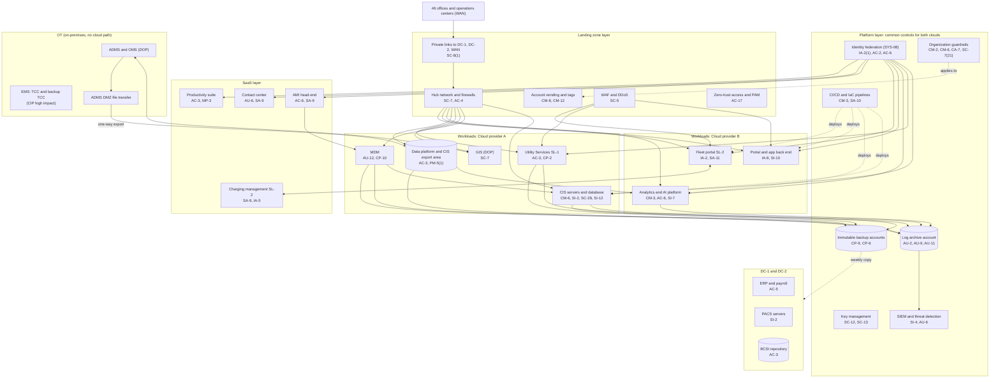

# Cloud Architecture and Control Placement: Cris Santos Company | Utilities | Enterprise

**Organization:** Cris Santos Company, Inc. (publicly traded investor-owned electric utility) | **Tier:** Enterprise | **Provider:** Multi-cloud, vendor-agnostic: two public cloud providers (Cloud provider A and Cloud provider B), two company data centers (DC-1 at headquarters, DC-2 at Operations Center North), and SaaS (see section 4)
**Owner:** Director, Cloud Platform Engineering, with the CISO and the Director, OT Security | **Date:** 2026-08-31 | **Related:** Distribution Operations Platform SSP (P02), enterprise BIA (P05)

## 1. Architecture in layers
The estate is organized in four cloud layers plus the company data centers. Each lower layer provides **common controls** that the layers above inherit, so a workload team configures only what is specific to its system.

| Layer | What it is | Examples | Who runs it |
|---|---|---|---|
| **Platform** | Organization-wide services in both clouds | Guardrails, identity federation, key management, log archive, SIEM feeds, posture and vulnerability management, immutable backup accounts, CI/CD pipelines | Cloud Platform Engineering; Security Operations; Identity team |
| **Landing zone** | The standard account pattern every workload lands in | Account vending with mandatory tags, hub-and-spoke network with cloud firewalls, private connectivity to DC-1, DC-2, and the WAN, WAF and DDoS protection, private DNS, zero-trust and PAM access | Cloud Platform Engineering; Network Engineering |
| **Workload** | Systems built or run by the company | Cloud A: CIS, MDM, GIS, Utility Services platform (SL-1), data platform with the CIS export area. Cloud B: analytics and AI platform (AI-001 load forecasting and others), customer portal and mobile app back end, fleet portal (SL-2) | Application teams |
| **SaaS** | Vendor-operated applications | AMI head-end, contact center platform, productivity suite, charging management platform (SL-2 subservice organization), payment processor | Vendors, with the company's configuration and oversight |
| **Data center** | Company-operated | ERP and payroll, PACS servers, the on-premises BCSI repository, immutable backup copies | IT Infrastructure; Corporate Security |

**OT stays on-premises and outside the cloud.** The EMS (CIP high impact) and the ADMS run only in the control centers. No cloud account has a network path to the EMS or ADMS zones (guardrail row `SC-7(21)`). OT data reaches the cloud only as one-way file exports from the ADMS DMZ (for example, feeder loading history for the load-forecasting model). BES Cyber System Information is kept in the on-premises BCSI repository; the CIP program does not yet use cloud storage for BCSI, even though CIP-011-3 and CIP-004-7 R6 now allow it with the right controls.

## 2. Diagram

## 3. Responsibility by service model
Sources: SRC-AWS-SRM, SRC-AZURE-SRM, and SRC-GCP-SRM in `00_universal-framework/sources/source-register.csv`. The three published models agree on the split used here, so the design does not depend on which two providers the company uses.

| Service model | Provider | Company (customer) | Shared |
|---|---|---|---|
| IaaS (CIS application servers, Utility Services servers) | Facilities, hosts, hypervisor, physical network | Guest OS, applications, identities, data, network policy | Encryption (provider service, customer keys), logging |
| PaaS (CIS database, MDM, data platform, AI platform, app back end) | Also the platform runtime and its patching | Data, access, configuration, keys, application code, model versions | Backups, availability configuration |
| SaaS (AMI head-end, contact center, productivity, charging management) | Also the application | Users, roles, data, oversight of the vendor | Audit review (complementary user entity controls) |
| Company data centers | None (company-operated) | Everything | None |

## 4. Service categories and provider equivalents
| Service category | AWS | Microsoft Azure | Google Cloud |
|---|---|---|---|
| Organization guardrails | AWS Organizations service control policies | Azure Policy with management groups | Organization Policy Service |
| Account vending | AWS Control Tower account factory | Azure landing zone subscription vending | Resource Manager project creation |
| Key management | AWS KMS | Azure Key Vault | Cloud KMS |
| Audit logging | AWS CloudTrail | Azure Monitor activity log | Cloud Audit Logs |
| Threat detection | Amazon GuardDuty | Microsoft Defender for Cloud | Security Command Center |
| Managed relational database | Amazon RDS | Azure SQL Database | Cloud SQL |
| Web application firewall | AWS WAF | Azure Web Application Firewall | Cloud Armor |
| Backup service | AWS Backup | Azure Backup | Backup and DR Service |

This table is for reading provider documentation only. The architecture, control map, and SSP describe service categories.

## 5. Common controls
`cloud-control-map.csv` has **60 rows** across 33 components: Platform 19, Landing zone 8, Workload 19, SaaS 9, Data center 5. Responsibility: Customer 45, Shared 13, Provider 2.

**27 rows are published as common controls** (`common_control` = Yes) in the enterprise common control catalog. They are the Platform and Landing zone rows, and they map to the common control providers in the DOP SSP (P02 section 10.3): the identity platform (CCP-02), the cloud landing zone (CCP-05), and security operations (CCP-04). A workload inherits them by being deployed through account vending, which applies guardrails, logging, network, key, and backup policies automatically.

**Rules for inheriting:**
1. A workload may claim a common control only if its account was created by account vending and passes the posture baseline.
2. Customer-side identity, data protection, and logging stay explicit at every layer: even a SaaS application has Customer rows (AC-3, AC-6, AU-6), because those are always the company's responsibility.
3. SaaS rows cite the vendor's SOC 2 report, reviewed by the third-party risk team (P09 evidence map).
4. No common control can create a path into OT; the OT boundary rule (`SC-7(21)`) is checked in the quarterly route review.

## 6. Validation against the DOP SSP (P02)
The DOP is mostly on-premises OT. Its cloud footprint is the GIS in the Cloud A operations account, which inherits these controls:
| DOP component | AC | AU | CM | IA | SC | CP |
|---|---|---|---|---|---|---|
| GIS (Cloud provider A) | AC-6 (inherited) | AU-2, AU-9 (inherited) | CM-2, CM-6 (inherited) | IA-2(1) (inherited) | SC-7 (workload); SC-28 (hybrid, CCP-05) | CP-9 (inherited) |
| ADMS-to-data platform export | AC-4 (DOP DMZ) | AU-2 (inherited) | CM-3 (DOP) | Not applicable (file transfer, no interactive users) | SC-7(21) (guardrail) | Not applicable |

## 7. Findings from the mapping
1. **BCSI in a collaboration site.** EMS network diagrams were found in a general collaboration site open to 340 users. The productivity suite is not an approved BCSI repository (P03 CIP-011-3 R1.2 gap; POAM-022). Fix: move the files, add BCSI labels and blocking rules, and decide in 2027 whether to approve a cloud BCSI repository with the CIP-004-7 R6 and CIP-011-3 controls.
2. **CIS data minimization.** SSNs for 3.4 million closed accounts are kept indefinitely in the CIS and copied nightly into the export area, and 63 users can export the full customer table (POAM-026).
3. **AMI bulk disconnect** is a SaaS configuration the company controls: two-person approval and a per-command limit are available but not enabled (POAM-018).
4. **Two clouds, one control set.** Guardrails, logging, and key policies are written once as code and applied to both clouds; differences are limited to service names (section 4).
5. **Service line separation.** SL-1 and SL-2 run in their own accounts, which keeps the SOC 2 system boundaries clear (P09). The charging management SaaS is a subservice organization whose SOC 2 report covers Security only.
6. **The OT boundary holds.** The quarterly route review on 2026-07-28 found no route from any cloud account to the EMS or ADMS zones.
