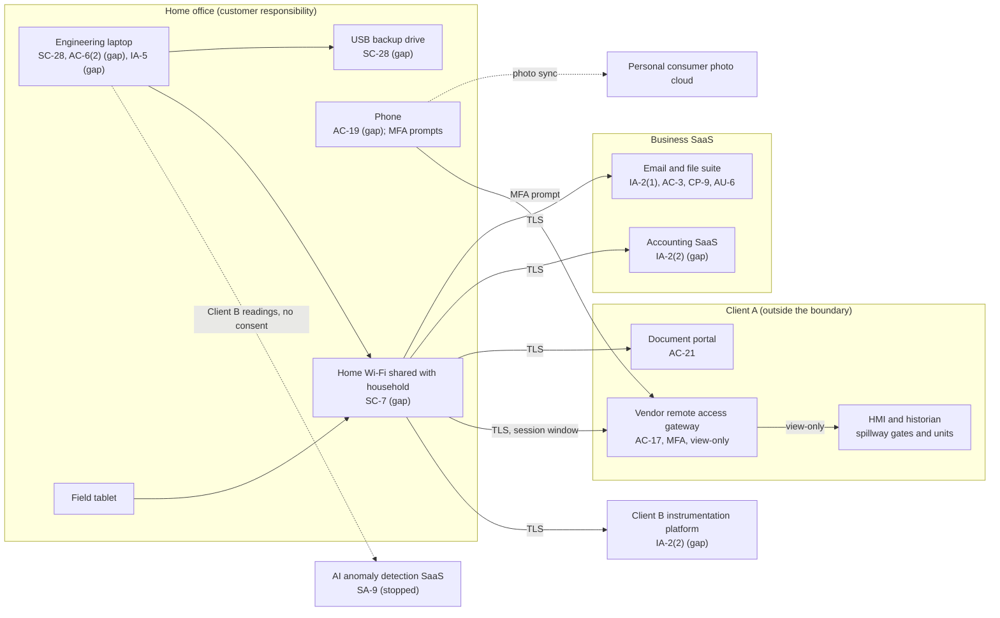

# SaaS Architecture and Control Placement: Cris Santos Company | Dams | Sole Proprietorship

**Organization:** Cris Santos Company (independent dam safety engineering consultant) | **Tier:** Sole Proprietorship | **Provider:** SaaS only (no IaaS or PaaS)
**System:** Core Business SaaS Stack (CBSS), as defined in the system profile (P02) | **Mapped:** 2026-07-22 with the on-call IT technician | **Adopted:** 2026-08-31

## 1. Diagram
Control IDs on each node are the ones in `cloud-control-map.csv`. Dashed lines are flows with no agreement, or flows the owner has stopped.

## 2. Layers
| Layer | Components | Key controls | Responsibility |
|---|---|---|---|
| Identity | Suite, accounting, Client A portal and gateway, Client B platform accounts | IA-2(1), IA-2(2), IA-5, AC-17 | Customer configures and protects credentials; providers and clients supply MFA |
| Data | Suite files, laptop files, CEII archive, USB backup, field photos | AC-3, AC-21, CP-9, SC-28 | Providers protect data inside their services; the owner decides where client data goes and whether an agreement covers it |
| Endpoints | Laptop, phone, tablet | AC-6(2), AC-19, IA-5, SC-28 | Customer |
| Network | Home Wi-Fi | SC-7 | Customer (the ISP supplies the router) |
| Logging | Suite sign-in history; Client A gateway logs | AU-6 | Shared: providers and Client A record, the owner reviews and keeps a session log |
| SaaS applications and hosting | Suite, accounting SaaS, AI tool | SA-9 (inherited controls verified in P09) | Provider |

## 3. Shared responsibility for SaaS
All three major cloud providers' shared responsibility models (SRC-AWS-SRM, SRC-AZURE-SRM, SRC-GCP-SRM) agree on the SaaS split: the provider runs the application, the platform, and the facilities; **the customer always keeps its identities and accounts, its data, and its devices.** That is why 11 of the 15 rows in the control map are the owner's alone and the other 4 are shared. A provider's SOC 2 report never covers these layers. No IaaS provider equivalents table is needed, because the business runs no infrastructure.

**A second shared-responsibility split matters more here: with the clients.** Client A runs the gateway, its MFA, the view-only role, the session windows, and the session logs (Rev. 3A Table 9.3a and Form 3 Q12a-12c are Client A's duties). Client A cannot see the owner's laptop. If the laptop is compromised, the attacker arrives at the gateway as the owner, with valid credentials and possibly a valid session. The owner's side of the split is the device, the account type, the network, and the credential store (AC-17 row).

## 4. Findings from the mapping
1. **The browser holds the keys to a dam's control room view.** The laptop browser saved the Client A gateway password, and the owner signs in from the administrator account used for email and web. Information-stealing malware would get both (P01 R-001; P08 scenario).
2. **Security-sensitive material reached the file suite.** The June 2026 download of Client A's Security Plan section and Form 3 answers synced to the suite. The SaaS model cannot fix this; only the rule (CSCA-A (2)) and Client A's view-only setting can (P01 R-002).
3. **MFA is off where it is free to turn on** (accounting SaaS, Client B platform). The Client B gap breaks GRS-B (2) (P01 R-003).
4. **Two consumer services hold client data with no agreement:** the AI anomaly detection SaaS (stopped) and the personal photo cloud (P01 R-004, R-007).
5. **The backup that protects the CEII archive is the weakest copy of it.** The USB drive is not encrypted (P01 R-005).
