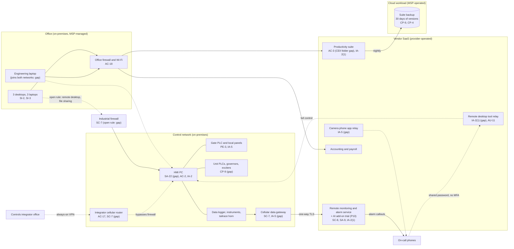

# Cloud Architecture and Control Placement: Cris Santos Company | Dams | Micro

**Organization:** Cris Santos Company, LLC (owner and operator of the fictional Bramble Shoals Hydroelectric Project) | **Tier:** Micro | **Provider:** Vendor-agnostic SaaS plus one MSP-operated cloud workload (see section 3)
**System:** Hydro Plant Control and Dam Monitoring System (HPCDMS) as defined in the SSP (P02), and the SaaS services around it | **Prepared:** 2026-07-24 by the Office and Compliance Administrator and the Controls and Electrical Technician, with the MSP and the controls integrator | **Approved:** Owner and General Manager, 2026-08-31

## 1. Diagram
The company runs no servers and no cloud tenant. Its cloud is a handful of SaaS services plus one cloud workload the MSP runs for it: the backup of the productivity suite (SYS-10). The plant itself is on premises.

The key design rule: **SaaS services may receive plant data, but nothing in the cloud may send commands to the plant.** Today two paths break that rule in practice: the remote desktop tool (relayed through its vendor's cloud) and the integrator's cellular VPN. Dashed lines are today's gaps that the remediation removes.

**Planned design (by 2027-03-31):** one remote access path with named accounts, MFA, and view-only by default (POAM-002); the integrator router removed or kept off except for watched sessions (POAM-005); no firewall rule from the office into the control network (POAM-004); a replacement HMI PC on a supported operating system (POAM-008).

## 2. Layers and who is responsible
| Layer | Components | Key controls | Customer (company) | MSP or integrator (on the company's behalf) | Provider (SaaS vendor) |
|---|---|---|---|---|---|
| Identity | Suite, monitoring portal, remote desktop tool, camera app, accounting | AC-2, IA-2(1), IA-5 | Decides who gets access; enforces MFA settings; removes leavers | MSP creates and disables suite accounts | Runs the sign-in and MFA services |
| Network / edge | Industrial firewall, integrator router, data gateway, office firewall and Wi-Fi | SC-7, AC-17, AC-18 | Approves rules and connections | Integrator configures the industrial firewall and router; MSP runs office firewall and Wi-Fi | Monitoring vendor and remote desktop relay encrypt traffic (SC-8) |
| Compute | HMI PC, engineering laptop, office endpoints | SA-22, SI-2, SI-3 | Owns the HMI PC and engineering laptop | MSP patches and protects office endpoints | Not applicable |
| SaaS applications | Monitoring service, suite, accounting | SA-9, AC-3 | Users, sharing settings, feature switches (setpoint-write off; AI add-on) | MSP administers the suite on request | Application, platform, data centers |
| Data | Suite files and mail, backup copies, readings in the monitoring service, PLC and HMI copies | CP-9, CP-4, SC-28 | Decides retention and restore tests; **must hold its own PLC and HMI copies (gap)** | MSP runs the suite backup; integrator holds 2023 copies | Encrypts and backs up its own platform |
| Logging | Remote desktop connection log, suite logs, HMI journal | AU-2, AU-6, AU-11 | **Reviews logs weekly (gap today)** | Not applicable | Generates and stores logs (30 days for the remote desktop tool) |
| Physical | Provider data centers; on site the control room, hoist house, powerhouse | PE-3 | Locks and keys on site | Not applicable | Data center security (inherited) |
| OT (not cloud) | Gate and unit controllers, instruments | PE-3, CP-9, CM-8 | Customer only. **No OT control is inherited from a cloud or SaaS provider** | Integrator support | Not applicable |

**The MSP and the integrator are not cloud providers.** They perform customer-side duties for the company. Anything marked "Customer (performed by MSP)" or "Customer (performed by integrator)" in `cloud-control-map.csv` stays the company's responsibility: it must direct the work, receive evidence, and check it (SA-9).

## 3. Service categories and provider equivalents
The design is vendor-agnostic. The SaaS shared responsibility split is the same in all three major cloud providers' models: the provider runs the application, platform, and infrastructure; the customer keeps identities, access, data, and devices (SRC-AWS-SRM, SRC-AZURE-SRM, SRC-GCP-SRM in `00_universal-framework/sources/source-register.csv`). For the company's vendors, a SOC 2 report or vendor documentation is the evidence of the provider side.

| Service category used | What it is here | Equivalent category in the large cloud providers (for reading their documentation) |
|---|---|---|
| Industrial remote monitoring SaaS | Alarm callouts, trends, AI add-on | IoT data ingestion and analytics services built on any provider |
| Remote desktop and support SaaS | Unattended access to the HMI PC through a vendor relay | Remote access or bastion services |
| Productivity suite | Email, files, calendar | Productivity and collaboration SaaS |
| SaaS-to-SaaS backup | Suite backup (the one cloud workload) | Backup service or third-party SaaS backup |
| Video relay | Camera viewing on phones | IoT or media relay services |
| Line-of-business SaaS | Accounting, payroll | Industry SaaS built on any provider |

## 4. Findings from the mapping
1. **The cloud is not the weak point; the remote paths are.** The monitoring service receives data one way over TLS and its setpoint-write feature is off. The two paths that can actually move a gate are the remote desktop tool (shared password, no MFA) and the integrator's always-on VPN, and both are customer-side settings (AC-17, IA-2(1), MA-4). Fix: one remote access path with named accounts, MFA, and view-only by default (POAM-002), and the router kept off except for watched sessions (POAM-005). Tracked as P01 R-001 and R-003.
2. **Keep the monitoring service one-way.** Any future request to turn on setpoint writes or to let the AI add-on act on the plant would create a cloud-to-gate command path. That needs a new security review, a new P01 assessment, and the Owner's approval (P10 condition).
3. **The office network can reach the HMI PC.** Ransomware on any office PC could reach the unsupported HMI PC through the open firewall rule or the engineering laptop (R-004). Fix: firewall rebuild and a dedicated engineering laptop by 2026-10-31 (POAM-004).
4. **The backup covers the office, not the plant.** The MSP's suite backup works, but nothing backs up PLC logic, the HMI project, or governor and exciter settings (R-005). Fix: company-held copies on encrypted drives after every change (POAM-006).
5. **CEII sits in an open suite folder with "anyone with the link" shares.** A restricted folder with named guests is a customer setting the provider cannot do for the company (R-009).
6. **MFA exists in the services but is not switched on everywhere.** The monitoring portal offers MFA that is not enabled, and the remote desktop tool's MFA is unused. These are quick wins (due 2026-09-30 and 2026-11-30).
7. **Vendor assurance is thin.** Only the monitoring vendor has a SOC 2 report, reviewed in P09. The remote desktop tool, camera relay, and integrator are covered by vendor documentation and contract terms still to be written (SA-9).
