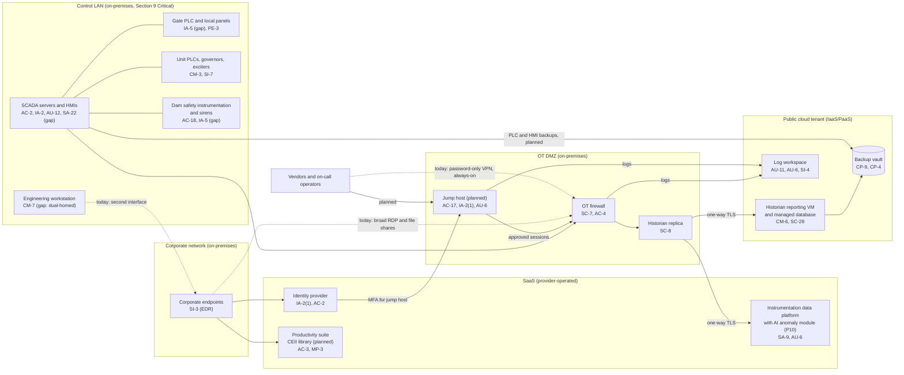

# Cloud Architecture and Control Placement: Cris Santos Company | Dams | Small

**Organization:** Cris Santos Company, LLC (licensee of the fictional Cypress Fork Hydroelectric Project) | **Tier:** Small | **Provider:** Vendor-agnostic (see section 3)
**System:** Plant Control and Dam Monitoring System (PCDMS) as defined in the SSP (P02), and the cloud and SaaS services it connects to

## 1. Diagram
The key design rule: **the cloud and SaaS services receive plant data but can never send commands to the plant.** Control stays on premises. The dashed lines are today's gaps that the remediation removes.

## 2. Layers
| Layer | Components | Key controls | Responsibility |
|---|---|---|---|
| Identity | Identity provider, cloud IAM, planned jump host accounts | IA-2(1), AC-2, AC-6, AC-17 | Customer configures; SaaS provider runs the service |
| Network / edge | OT firewall, DMZ, cloud network rules | SC-7, AC-4, SC-8 | Customer (on-premises and cloud rules) |
| Compute | Historian reporting VM, managed database | CM-6, SI-2 | IaaS: customer owns the guest; PaaS: provider patches the engine |
| Data | Backup vault, key management, CEII library | CP-9, CP-4, SC-28, SC-12, AC-3, MP-3 | Shared: provider encrypts; customer sets retention, isolation, access, and labels |
| Logging / monitoring | Log workspace, cloud audit logs | AU-11, AU-12, AU-6, SI-4 | Shared: provider generates and stores; customer forwards OT logs, writes rules, and reviews |
| SaaS | Instrumentation platform, productivity suite, ERP | SA-9, AC-2, AU-6 | Provider runs the application; customer keeps users, reviews, and data decisions |
| Physical | Provider data centers | PE-3 | Provider (inherited) |
| OT (not cloud) | Control LAN, gates, units, instruments | PE-3, IA-5, CM-3 | Customer only. **No OT control is inherited from a cloud provider** |

## 3. Service categories and provider equivalents
The design does not depend on one provider. This table gives each provider's name for each service category, for reading its shared responsibility documentation.

| Service category | AWS | Microsoft Azure | Google Cloud |
|---|---|---|---|
| Virtual machines | Amazon EC2 | Azure Virtual Machines | Compute Engine |
| Managed relational database | Amazon RDS | Azure SQL Database | Cloud SQL |
| Backup service | AWS Backup | Azure Backup | Backup and DR Service |
| Identity and access management | AWS IAM | Azure role-based access control with Microsoft Entra ID | Cloud IAM |
| Key management | AWS KMS | Azure Key Vault | Cloud KMS |
| Audit logging | AWS CloudTrail | Azure Monitor activity log | Cloud Audit Logs |
| Log analytics workspace | Amazon CloudWatch Logs | Azure Monitor Logs (Log Analytics) | Cloud Logging |
| Network filtering | Security groups | Network security groups | VPC firewall rules |

Shared responsibility sources: SRC-AWS-SRM, SRC-AZURE-SRM, and SRC-GCP-SRM in `00_universal-framework/sources/source-register.csv`. All three models agree on the split used here:
- **IaaS:** the provider owns facilities, hosts, and the virtualization layer. The customer owns the guest operating system, applications, network rules, identities, and data.
- **PaaS:** the provider also patches the platform (for example, the database engine). The customer keeps data, access, and configuration.
- **SaaS:** the provider also owns the application. The customer keeps identities, access, data, and devices.

## 4. Findings from the mapping
1. **No command path from cloud to plant, and it must stay that way.** Historian data leaves the DMZ one way over TLS. Neither the cloud tenant nor the instrumentation SaaS can reach the control LAN. Any future proposal to send setpoints or AI outputs back to the plant would change the Section 9 analysis and needs a new security review (P10 decision condition).
2. **The real boundary problem is on premises, not in the cloud.** The dual-homed engineering workstation and broad corporate-to-OT rules (P03 G-052) let the corporate network reach the control LAN directly. Fix: remove the second interface and allow-list the OT firewall (POAM-003, due 2026-10-31).
3. **Remote access moves to a jump host that uses the cloud identity provider for MFA.** This reuses a service the company already runs well (hardware keys for administrators) and ends the password-only OT VPN (POAM-001). The jump host lives in the on-premises DMZ, not in the cloud, so a cloud outage cannot block local operation.
4. **The log workspace exists but receives no OT logs.** Forward OT firewall, jump host, HMI, and OT monitoring sensor logs and set 1-year retention (POAM-008, POAM-009).
5. **The backup vault can hold the missing OT copies.** Corporate backups are already daily and restore-tested quarterly; immutable retention should be switched on (P01 R-006). Adding encrypted PLC logic and HMI project copies after every change, with immutable retention, gives an off-site, write-protected copy (POAM-006).
6. **CEII lives in SaaS file shares.** A restricted library with sensitivity labels is a customer-side configuration; the provider cannot do it for the company (POAM-013).
7. **Inherited controls rely on vendor assurance.** Rows marked Provider or Shared depend on the cloud provider's and the instrumentation vendor's SOC 2 reports. The instrumentation vendor's report is reviewed in P09.
