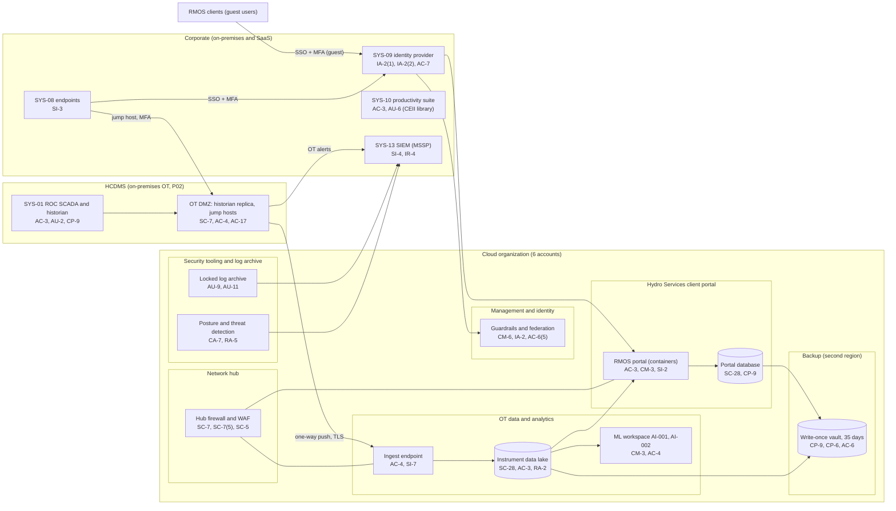

# Cloud Architecture and Control Placement: Cris Santos Company | Dams | Mid-Market

**Organization:** Cris Santos Company, Inc. | **Tier:** Mid-Market | **Provider:** Vendor-agnostic public cloud (see section 4), plus SaaS
**Systems:** cloud landing zone (SYS-11) with the dam safety data platform (SYS-14) and the RMOS client portal (SYS-15), and their interfaces to the HCDMS defined in the SSP (P02) | **Prepared:** 2026-07-31 by the IT Director and the OT Security Manager; updated 2026-09-17 with P07 results
**Control map:** `cloud-control-map.csv` (52 rows, 30 components)

## 1. Diagram
The HCDMS itself stays on premises. The cloud holds copies of OT data, analytics and AI, the RMOS client portal, logs, and backups. The most important line in the diagram is the one that is missing: **there is no path from the cloud back into OT.**

## 2. Landing zone design
Six accounts (subscriptions or projects, depending on the provider) under one cloud organization. Each account limits what an attacker in any other account can reach.

| Account | Purpose | Who administers | Key design decisions |
|---|---|---|---|
| **Management and identity** | Organization root, guardrails, cloud identity federation to SYS-09, break-glass accounts | IT Director's cloud team (2 people) | No workloads. Root sealed. Guardrails apply to every account and cannot be disabled from them |
| **Security tooling and log archive** | Posture and threat detection, audit log pipeline, write-once log archive (3 years) | OT Security Manager and IT Director jointly | Read-only to everyone else. Logs forward to the MSSP SIEM |
| **Network hub** | Hub firewall, WAF, DDoS protection, corporate site-to-cloud VPN, DNS | IT Director's infrastructure team | All traffic between accounts and the internet passes the hub. **No route to OT** |
| **OT data and analytics** | Ingest endpoint, instrument data lake, analytics database, ML workspace for AI-001 and AI-002 | Data Analytics Lead (data); IT Director (platform) | Receives OT data only by outbound push from the OT DMZ. Customer-managed keys. Holds CEII copies |
| **Hydro Services client portal** | RMOS portal application, portal database, client guest access | Vice President of Hydro Services (service owner); IT Director (platform) | In scope for the planned SOC 2 Type 2 (P09). Tenant separation per client |
| **Backup** | Write-once backup vault, 35-day retention, second region | 2 named backup administrators | Separate credentials. Cross-account role can write but not delete |

## 3. Layers and shared responsibility per service
| Layer | Components | Key controls | Service model | Responsibility |
|---|---|---|---|---|
| Identity | Federation, privileged elevation, break-glass, client guests, SYS-09 | IA-2, IA-2(1), IA-2(2), IA-8, AC-2, AC-6(5) | PaaS / SaaS | Customer configures identities, roles, MFA, and reviews; provider runs the identity services |
| Network | Hub firewall, WAF, VPN, DNS, OT ingest path | SC-7, SC-7(5), AC-4, SC-8, SC-5, SC-20 | IaaS / PaaS | Customer designs routes, rules, and the one-way OT path; provider runs gateways and DDoS protection |
| Compute | Ingest and pipeline machines, ML workspace, portal containers | CM-3, CM-6, SI-2, SI-3, SI-7, SA-11, CP-10 | IaaS / PaaS | Customer owns images, code, models, and configuration; provider owns hosts and the managed platform |
| Data | Data lake, analytics database, portal database, keys, backup vault | SC-28, SC-12, AC-3, AC-6, RA-2, CP-9, CP-6, CP-4 | IaaS / PaaS | Shared: provider encrypts and operates storage; customer controls keys, access, classification, retention, and restore tests |
| Logging and monitoring | Audit pipeline, log archive, posture and threat detection, SIEM | AU-2, AU-9, AU-11, AU-12, CA-7, RA-5, SI-4 | PaaS / SaaS | Shared: provider generates logs and findings; customer enables, retains, forwards, and acts on them; MSSP monitors |
| SaaS applications | Identity provider, productivity suite, SIEM, business SaaS | IA-2(2), AC-7, AC-3, AU-6, IR-4, SA-9 | SaaS | Provider runs the application; customer keeps users, permissions, audit review, and data |
| Physical | Provider data centers | PE-3, PE-13 | All | Provider (inherited, evidenced by SOC 2 reports) |

**Responsibility counts in `cloud-control-map.csv`:** 28 Customer, 20 Shared, 4 Provider. By service model: 13 IaaS, 30 PaaS, 9 SaaS rows. The customer side is always identity, data protection, logging, and, here, the integrity of the one-way OT boundary, which no provider can own.

## 4. Service categories and provider equivalents
The design is independent of the provider. This table names each provider's service for the category, for reading its shared responsibility documentation (SRC-AWS-SRM, SRC-AZURE-SRM, SRC-GCP-SRM in `00_universal-framework/sources/source-register.csv`).

| Service category | AWS | Microsoft Azure | Google Cloud |
|---|---|---|---|
| Multi-account organization and guardrails | AWS Organizations, service control policies | Management groups, Azure Policy | Resource Manager folders, organization policies |
| Account, subscription, or project | Account | Subscription | Project |
| Cloud identity federation | IAM Identity Center | Microsoft Entra ID with Azure RBAC | Cloud Identity with IAM |
| Network hub and cloud firewall | Transit Gateway; AWS Network Firewall | Virtual WAN hub; Azure Firewall | Network Connectivity Center; Cloud NGFW |
| Web application firewall and DDoS protection | AWS WAF; Shield | Azure Web Application Firewall; DDoS Protection | Cloud Armor |
| Object storage with write-once retention | S3 with Object Lock | Blob Storage with immutability policies | Cloud Storage with bucket lock |
| Managed analytics database | Amazon Redshift | Azure Synapse | BigQuery |
| Container platform | Amazon ECS or EKS | Azure Kubernetes Service or Container Apps | GKE or Cloud Run |
| Machine learning workspace and model registry | SageMaker | Azure Machine Learning | Vertex AI |
| Key management | AWS KMS | Azure Key Vault | Cloud KMS |
| Backup service | AWS Backup (vault lock) | Azure Backup (immutable vault) | Backup and DR Service |
| Audit logging | CloudTrail | Azure Monitor activity log | Cloud Audit Logs |
| Posture and threat detection | Security Hub, GuardDuty | Microsoft Defender for Cloud | Security Command Center |

**Service model split used here (all three providers agree):**
- **IaaS** (virtual machines, networks, object storage): provider owns facilities, hosts, and virtualization; customer owns the guest OS, applications, network configuration, identities, and data.
- **PaaS** (managed database, container platform, ML workspace, key and backup services): provider also owns the platform software and its patching; customer owns access, keys, data, code, and configuration.
- **SaaS** (identity provider, productivity suite, SIEM, business applications): provider also owns the application; customer keeps identities, permissions, audit review, and data.

## 5. Findings from the mapping
1. **The one-way OT boundary is the most important cloud control, and it holds.** The OT DMZ pushes historian data outbound over TLS; nothing in the cloud has a route or credential to reach OT. P07 confirmed it from both sides. A data science request in 2026-06 for a return path to show AI-001 scores on SCADA displays was rejected, and POL-01 now requires a security impact review for any change touching OT. This keeps the cloud outside the Section 9 consequence analysis.
2. **CEII sits in the cloud without classification** (gap 10). The data lake holds design drawing copies and instrument data next to general analytics data. Fix: classification tags on every dataset, a separate CEII bucket with named access, and download alerts by 2026-12-31 (POAM-010).
3. **The RMOS portal is the SOC 2 system.** Tenant separation, client guest MFA, change control, and backups are designed. Gaps before the observation period: no penetration test, no full rebuild test, and portal logs only recently forwarded to the SIEM (P09).
4. **AI models have no lifecycle controls** (gap 12). AI-001 and AI-002 are trained and deployed from notebooks with no registry, approval, or monitoring thresholds. Fix: model registry and approval gate by 2027-01-31 (P10).
5. **Recovery is designed but only partly proven.** The backup account is isolated, write-once, and in a second region. Corporate restores are tested quarterly; data lake and portal restores are not yet tested.
6. **Identity is a shared dependency with OT.** The identity provider is both the cloud sign-in and the jump host MFA source (P05 finding 5). A break-glass path for OT is planned (POAM-020).
7. **Boundary check.** Every cloud and SaaS component named in the SSP interfaces (P02 sections 7 and 8) appears in the diagram and has at least one row in the control map. Each account has controls from at least 2 of the AC, AU, CM, IA, SC, and SI families or inherits them.
