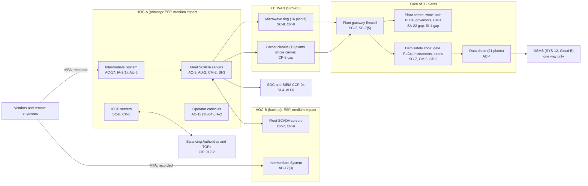

# System Security Plan: Hydro Fleet Control and Dam Monitoring System (HFCDMS)

**Organization:** Cris Santos Company, Inc. (publicly traded hydroelectric generation company) | **Tier:** Enterprise | **Vertical:** Dams
**Outline:** NIST SP 800-18 Rev. 2, System Security Plan Outline Example (June 2026) | **Version:** 3.0, 2026-09-14
**Handling:** Contains control system details. Mark and handle as BES Cyber System Information (CIP-011-3), as "Privileged - Security Sensitive Material" (FERC Security Program Rev. 3A 3.4.3.4), and as CEII under POL-04. This sample is fictional.

## 1. System Name and Identifier
Hydro Fleet Control and Dam Monitoring System (**HFCDMS**), identifier CSC-OT-HFC-001. Tier-1 system in the enterprise application inventory and the highest-consequence system the company runs.

## 2. System Overview
The HFCDMS is how the company runs its hydro fleet. From the Hydro Operations Centers, HOC-A (north Georgia, primary) and HOC-B (western North Carolina, backup, about 160 miles away), operators remotely control **35 developments (8,210 MW, 125 units)** around the clock: they start, load, and stop units to Balancing Authority dispatch, set spillway gate openings at **36 gated dams** to follow reservoir operating plans and pass floods, and watch dam safety instrumentation and river gauges for developing failure modes. The same system activates the EAP warning sirens at **16 dams**.

**Why integrity and availability matter most.** A wrong or unauthorized gate command can send a surge toward downstream communities; DEV-04 Hollins Shoals has a city of about 38,000 in its inundation zone. Losing gate control during a flood can overtop a dam. Losing unit control costs about $3.1 million a day in generation value (P05 BP-03). Disclosure of the system's design is serious but less immediate.

**Major components (scope details in `../00_company-facts.md` section 3):**
- **SYS-01 Fleet SCADA and generation control** at HOC-A and HOC-B: redundant SCADA servers, operator consoles, automatic generation control interface, ICCP servers, historian. **Medium impact BES Cyber Systems** (CIP-002-5.1a Attachment 1 criterion 2.11) inside Electronic Security Perimeters (ESPs).
- **SYS-02 Plant control systems** at the 35 developments: unit PLCs, digital governors, excitation systems, plant HMIs. Low impact BES Cyber Systems at the 31 BES plants among them (criterion 3.3; 6 Blackstart Resources also under 3.4).
- **SYS-03 Spillway and gate control** at the 36 gated dams: gate PLCs, local gate panels, hoists, standby generators. Kept in a separate dam safety zone at each plant. Not BES Cyber Systems, except that gate commands are issued from the HOC fleet SCADA inside the ESP.
- **SYS-04 Dam safety instrumentation and early warning**: automated data acquisition at 44 dams in scope, river and rain gauges, and 112 sirens at 16 dams.
- **SYS-05 OT WAN and DMZs**: licensed microwave backbone (a ring covering 16 plants), leased circuits from two carriers, plant gateway firewalls, HOC ESP firewalls, the Intermediate Systems for Interactive Remote Access, OT PAM, OT file transfer, and one-way data diodes at 21 plants.

**Section 9 and NERC status.** Under the FERC Security Program for Hydropower Projects Rev. 3A, the HOC fleet SCADA controls powerhouses with more than 1,500 MW through one cyber asset, which Table 9.1c note 1 makes **Critical**, and gate control at the 4 Group 1 and 17 in-scope Group 2 dams is Critical on population at risk (determinations refreshed 2026-07-08; P03). FERC's FAQ (Question 12) covers exactly this "hub and spoke" design: the HOC hub meets NERC CIP and the Security Plan references the CIP standards met, while each plant (spoke) is evaluated under Section 9 on its own. This SSP is the basis of the fleet Cyber/SCADA Security Plan filed for inspection.

**Not in this system (yet):** the 9 Piedmont developments (SYS-06) are run locally on the prior owner's systems and have **no connection** to the HFCDMS. They join the boundary when integration completes (due 2027-03-31). Their gaps are in P01 (R-003, R-031 to R-034), P03, and POAM-001 and POAM-002.

## 3. Laws, Regulations, and Policies Affecting the System
| ID | Requirement | Citation | How it affects the HFCDMS |
|---|---|---|---|
| C-DAMS-R01 | FERC Security Program for Hydropower Projects (Revision 3A) | FERC D2SI program document (March 30, 2016), applied under 18 CFR Part 12 and the licenses | Group 1 and 2 dams: Security Plans with a Cyber/SCADA Security Plan; Section 9 baseline and enhanced measures for Critical assets; Rapid Recovery for Group 1 |
| C-DAMS-R02 | FERC dam safety incident reporting | 18 CFR 12.10 | A security incident (physical and/or cyber) and any gate misoperation are conditions affecting safety (12.3(b)(4)(ii), (xi)); report as soon as practicable, preferably within 72 hours |
| C-DAMS-R03 | NERC CIP Reliability Standards | CIP-002-5.1a to CIP-013-2 (CIP-014-3 not applicable: the company is not a Transmission Owner or Operator) | Medium impact requirements for the HOC BES Cyber Systems; CIP-003-9 Attachment 1 for the low impact plants; CIP-012-2 for real-time data between Control Centers |
| Related | NERC EOP-004-4 | Event reporting | Physical threats and damage at Facilities and control centers |
| Related | 18 CFR Part 12 | 12.20 to 12.25 (EAPs), 12.54 (gate testing), 12.12 (records), 12.60 to 12.65 (Owner's Dam Safety Program) | EAP notification and siren activation; standby power for gates; permanent records |
| Related | CEII | 18 CFR 388.113(c)(2) | Applies to CEII submitted to FERC; the company applies matching handling internally (POL-04) |
| SEC | Cybersecurity disclosure | Form 8-K Item 1.05; 17 CFR 229.106 | A material HFCDMS incident goes through the P08 materiality step |
| Guidance | OT security | NIST SP 800-82 Rev. 3 | Overlay used to tailor the High baseline |
| Internal | POL-01 to POL-05, STD-01.8 OT Security Standard | P06 | Enterprise policy hierarchy |

Not applicable: CIP-014-3 (applies to Transmission Owners and Operators only); CIRCIA reporting (final rule not published as of 2026-09-25); FAR clauses (no federal contracts).

## 4. System Status
### 4.1 System Security Plan Approval
Prepared by the Director, Hydro Control Systems Engineering with the GRC team and the NERC compliance team. Reviewed by the CISO, the CIP Senior Manager (Senior Vice President, Hydro Operations), and the Vice President, Dam Safety. Approved by the Chief Operating Officer on 2026-09-14.
### 4.2 System Authorization Decision
The company is not a federal agency, so there is no formal ATO. The equivalent internal decision:
- **Authorizing official equivalent:** Chief Operating Officer, on the recommendation of the CISO and the CIP Senior Manager.
- **Decision (2026-09-14):** continue operation with conditions, based on the Internal Audit assessment (P07) and the risk register (P01).
- **Conditions:**
  1. Close the cellular datalogger vendor paths at 5 dams (POAM-012) by 2026-11-30, and disable them in the meantime except during approved sessions.
  2. Extend OT network monitoring to every plant with a Group 1 or 2 gated dam by 2027-03-31 (POAM-003).
  3. Retest HOC failover and meet the 2-hour RTO by 2027-01-31 (POAM-010).
  4. Bring PLC and gate logic copies at all 35 plants to less than 12 months old by 2026-12-31 (POAM-008).
  5. Do not connect any Piedmont system to the HFCDMS until POAM-001 and POAM-002 are closed and the connection is assessed.
- **Reauthorization:** annually, or after a major change (the Piedmont integration in 2027 is a major change).
### 4.3 System Operational Status
Operational. Planned major modifications: Piedmont integration onto the HOC (2027-03-31); replacement of unsupported plant HMIs and gate workstations (2027-12-31).

## 5. Role Identification and Responsible Personnel
| Role | Title | Responsibility |
|---|---|---|
| System owner | Senior Vice President, Hydro Operations (also the CIP Senior Manager) | Accountable for the HFCDMS; approves access roles; CIP-003-9 R3 |
| Authorizing official (equivalent) | Chief Operating Officer | Accepts residual risk to operate |
| Dam safety owner | Vice President, Dam Safety (Chief Dam Safety Engineer, 18 CFR 12.62(a)) | Instrumentation, EAPs, sirens, 18 CFR 12.10 reports |
| System administrator | Director, Hydro Control Systems Engineering | SCADA, PLC and gate logic, baselines, backups, change control |
| Operations | Director, Hydro Operations Center; plant managers | HOC operations, local control, failover |
| Information security | CISO; Director of Security Operations; Director, OT Security | Program, SOC, OT security team |
| NERC compliance | Director, NERC Compliance (second line) | CIP evidence, CIP-008 and EOP-004 reporting |
| FERC security contact | Vice President, Corporate Security (plant managers as alternates) | Security Program documents, certification letters |
| Common control providers | See section 10.3 | Operate inherited controls |
| Independent assessor | Chief Audit Executive (Internal Audit with a co-sourced OT specialist firm) | Annual assessment (P07) |

**Overlap and compensation.** The system owner is also the CIP Senior Manager, so the same executive owns operations and approves CIP exceptions. This is compensated by second-line review of every CIP Exceptional Circumstance and exception by the Chief Compliance Officer, and by Internal Audit's independent testing.

## 6. System Information Types and System Categorization
Information types come from NIST SP 800-60 Vol. 2 Rev. 1. Impact levels follow FIPS 199, used as a model.

| Information type | Confidentiality | Integrity | Availability | Rationale |
|---|---|---|---|---|
| Energy production (unit control, dispatch, AGC) | Moderate | High | High | Wrong governor or unit commands can damage units (overspeed, water hammer) and break grid obligations; loss of HOC control costs about $3.1 million a day (P05 BP-03) |
| Water resource management and flood control (gate commands, reservoir levels) | Moderate | High | High | An unauthorized gate opening can release a surge toward populated areas; loss of gate control during a flood can overtop a dam (P05 BP-01, MTD 4 h) |
| Disaster monitoring and emergency response (instrumentation, trigger points, sirens) | Moderate | High | High | False or missing readings can hide a developing failure mode; sirens must work when an EAP is activated (P05 BP-02) |
| Information security (logs, rule sets, credentials) | Moderate | High | Moderate | Protects the evidence and the access paths |
| **HFCDMS category (high-water mark)** | **Moderate** | **High** | **High** | **Overall: High** |

**Baseline and tailoring.** The SP 800-53B **High** baseline, tailored with the NIST SP 800-82 Rev. 3 OT overlay. `control-implementation.csv` documents **224 controls**: all **188** High-baseline base controls, **34** control enhancements that carry the Section 9 measures and the CIP requirements (33 from the High baseline plus AC-17(9), added for CIP-005-7 R2 Part 2.5), and PM-9 and PM-16 from the program. The remaining High-baseline enhancements are inherited through the enterprise common control catalog (section 10.3) and are not repeated here. Tailoring decisions TL-01 to TL-09 are recorded with rationale (PL-11); examples:
- **TL-04:** operator consoles inside the control room PSP do not lock automatically (AC-11), so an operator is never locked out during a flood. Physical access control and continuous staffing compensate.
- **TL-06:** legacy plant protocols cannot authenticate sessions (SC-23). Segmentation, one-way diodes, and monitoring compensate.
- **TL-05:** console sign-in inside a PSP is single-factor; MFA applies to all remote and privileged access.

## 7. Authorization Boundary Description
**Inside the boundary:** SYS-01 at HOC-A and HOC-B; SYS-02, SYS-03, and SYS-04 at the 35 HOC-operated developments; SYS-05 (OT WAN, plant gateways, ESP firewalls, Intermediate Systems, OT PAM, data diodes). The physical boundary is the HOC Physical Security Perimeters, plant control rooms, gate houses, instrument houses, and siren poles.

**Outside the boundary (common control providers and interconnected systems):**
- Identity platforms and OT PAM (SYS-07): CCP-03
- Security operations: SIEM, EDR, OT sensors, vulnerability management (SYS-14): CCP-04
- Physical security systems and security dispatch (SYS-15): CCP-06
- Dam Safety Monitoring Service platform (SYS-12) on Cloud provider B: receives data one way
- Energy scheduling platform (SYS-11) on Cloud provider A: schedules reach the HOC through the OT DMZ file transfer only
- Balancing Authority and Transmission Operator control centers (ICCP)
- Piedmont legacy OT (SYS-06): no connection until integration
- Contract Operations Center (SYS-13): separate network; no path into the HFCDMS

The enterprise multi-cloud and OT data path diagram is in P04 `cloud-architecture.md`.

## 8. Information Exchanges Summary
| Connected system / party | Direction | Data | Agreement |
|---|---|---|---|
| Balancing Authorities A and B; Transmission Operators A and B | Bidirectional (ICCP, encrypted) | Unit status, MW, dispatch instructions | Interconnection and data exchange agreements naming CIP-012-2 responsibilities |
| DSMS (SYS-12) | Outbound only (data diode or one-way DMZ transfer) | Instrument readings, reservoir and tailwater levels | Internal data agreement; AI-001 in P10 |
| Scheduling platform (SYS-11) | Inbound schedules through the OT DMZ file transfer | Day-ahead and real-time schedules | Internal; file transfer rules |
| Enterprise historian replica in the OT DMZ | Outbound | Generation and reservoir trends | Internal |
| SCADA platform vendor | Remote support through the Intermediate Systems | Troubleshooting | Support contract with CIP-013-2 terms |
| Governor and excitation OEM | Remote service through the Intermediate Systems | Tuning and diagnostics for 91 units | Service contract, **renewed 2025 without CIP-013-2 terms (POAM-014)** |
| Instrumentation datalogger vendors (3) | **Cellular modems direct to dataloggers at 5 dams (POAM-012)** | Datalogger diagnostics | Service contracts; path to be removed |
| SOC (SYS-14) | Outbound logs and sensor data | Security events | Internal |

## 9. System Component Inventory
The component-level OT inventory, with firmware versions, is kept in the OT asset inventory (CM-8; Section 9.2). Summary:

| Component | Type | Location | Owner |
|---|---|---|---|
| Fleet SCADA servers (8), historian (4), ICCP servers (4) | Servers | HOC-A and HOC-B | Director, Hydro Control Systems Engineering |
| Operator consoles (36) and engineering workstations (12) | Workstations | HOC-A and HOC-B | Director, Hydro Operations Center |
| Intermediate Systems (2 clusters), OT PAM, OT file transfer | Servers | HOC DMZs | Director, OT Security |
| Unit PLCs, governors, exciters (125 units) | Controllers | 35 powerhouses | Plant managers |
| Plant HMIs (98, of which **64 on an unsupported OS**) | Workstations | 35 plants | Plant managers |
| Gate PLCs and local gate panels (36 dams); gate control workstations (**9 on an unsupported OS**) | Controllers and workstations | Gated dams | Plant managers |
| Dataloggers and instruments (44 dams), gauges, siren controllers (16 dams) | Field devices | Dams, rivers, downstream | Vice President, Dam Safety |
| Plant gateway firewalls (35), data diodes (21), microwave radios | Network | Plants and the WAN | Director, OT Network Engineering |
| Standby generators and UPS | Power | Gated dams and HOCs | Plant managers; Vice President, Facilities |

## 10. Control Implementation Details
### 10.1 Control implementation status
See `control-implementation.csv` (224 controls).

| Status | Count |
|---|---|
| Implemented | 196 |
| Partially implemented | 28 |
| Planned | 0 |
| **Total** | **224** |

| Inheritance | Count |
|---|---|
| Common (fully inherited from a common control provider) | 136 |
| Hybrid (shared between a provider and the HFCDMS team) | 25 |
| System-specific | 63 |

Partially implemented controls (28): AC-3, AC-17, AC-17(1), AU-2, AU-6, AU-12, CA-7, CM-3, CM-8, CP-7, CP-8, CP-9, CP-10, IR-8, MA-4, MP-7, PS-4, RA-5, SA-4, SA-9, SA-22, SC-7, SI-2, SI-4, SI-4(4), SI-7(1), SR-3, SR-5. Each one links to a POA&M item in P07. No control is only Planned: the weaknesses are about coverage across 35 plants and legacy equipment, not missing programs.

### 10.2 Control assessment status
Internal Audit, with a co-sourced OT specialist firm, assessed 48 of these controls from 2026-07-13 to 2026-08-28 using SP 800-53A Rev. 5 procedures and statistical sampling (P07 `assessment-plan.md`, `assessment-results.csv`). SERC's CIP audit (2025-03) covered the CIP-scope controls; both findings were mitigated by 2025-09. Weaknesses are in P07 `poam.csv`.

### 10.3 Common control providers and inheritance
Common and hybrid controls are inherited from enterprise providers. Each provider publishes its controls in the enterprise **common control catalog** (GRC platform) and is assessed on its own cycle; the HFCDMS inherits the results. OT systems inherit far less from cloud or SaaS providers than IT systems do: nothing in this boundary runs in a cloud.

| Provider | Name | Accountable role | Controls provided | Rows in this plan |
|---|---|---|---|---|
| CCP-01 | Enterprise GRC program | CISO (with the Chief Risk Officer and Chief Audit Executive) | Policies and standards (P06), risk method, assessment, POA&M, records retention | 30 |
| CCP-02 | NERC CIP compliance program | Director, NERC Compliance (under the CIP Senior Manager) | CIP program records, BCSI handling, reporting procedure, media disposal | 6 |
| CCP-03 | Identity platforms (enterprise identity; OT identity domain and OT PAM) | Director of Identity and Access Management; Director, OT Security (OT domain) | OT identity domain, OT PAM, MFA tokens, account lifecycle | 19 |
| CCP-04 | Security operations (SOC, SIEM, OT sensors, vulnerability management) | Director of Security Operations | 24x7 SOC, SIEM, OT sensors, vulnerability assessment, incident response | 30 |
| CCP-05 | OT network and Intermediate Systems (SYS-05) | Director, OT Network Engineering | OT WAN, ESP and plant firewalls, Intermediate Systems, encryption, diodes | 24 |
| CCP-06 | Corporate security and physical access (SYS-15) | Vice President, Corporate Security (Vice President, Facilities for environment) | PACS, PSPs, security dispatch, visitor control, facility protection | 17 |
| CCP-07 | Human resources and workforce training | Chief Human Resources Officer | Personnel risk assessments, terminations, training, rules of behavior | 14 |
| CCP-08 | Third-party risk and supply chain (CIP-013 plan) | Director of Third-Party Risk Management | CIP-013-2 plan, vendor tiering and reviews, contract terms | 18 |
| CCP-09 | Dam safety program (ODSP, EAPs, instrumentation) | Vice President, Dam Safety | ODSP, EAP coordination, standby power testing | 3 |

**Inheritance rules:**
- A Common control is fully inherited; the HFCDMS team verifies only that HFCDMS components are onboarded (for example, OT domain join, log forwarding, sensor coverage).
- A Hybrid control names both parts in the implementation statement.
- If a provider's assessment finds a weakness, the finding is linked to every inheriting system's POA&M. Example: POAM-016 (late removal of a contractor's physical access) is a CCP-07 weakness that affects the HFCDMS because the contractor held unescorted access to the HOC-B PSP.
- CIP evidence is collected once by CCP-02 and reused for this plan, the FERC Cyber/SCADA Security Plan, and P07 (FERC FAQ Question 12; Rev. 3A 9.4).

## 11. Digital Identity Acceptance Statement
- **HOC operators and engineers (local):** named OT domain accounts; single-factor sign-in at consoles inside the PSP (badge plus PIN to enter). Accepted because physical access is controlled and the room is staffed 24x7 (TL-05).
- **Privileged and remote users:** MFA with hardware tokens through OT PAM and the Intermediate Systems (CIP-005-7 R2.3). This is comparable to NIST SP 800-63 AAL2, with AAL3-like protection for privileged users.
- **Vendors:** company-issued OT accounts and tokens, per-session approval, recording, and termination on demand. **The cellular datalogger paths at 5 dams do not meet this standard (POAM-012).**
- **Plant HMIs:** named local accounts managed by OT PAM; unsupported HMIs rely on segmentation and allowlisting (POAM-005).
- **Corporate users** have no path into the HFCDMS; the OT domain does not trust the corporate domain.

## 12. Referenced Artifacts
Scenario facts (`../00_company-facts.md`), BIA (P05), multi-cloud and OT data path architecture (P04), enterprise risk register (P01), regulatory gap analysis and Section 9 determinations (P03), policy hierarchy and policies (P06), Internal Audit assessment and POA&M (P07), OT intrusion runbook (P08), SOC 2 readiness for SL-1 and SL-2 (P09), AI portfolio including AI-001 (P10), CIP-009 recovery plans v7, fleet Cyber/SCADA Security Plan 2026, Group 1 Vulnerability Assessments, Group 2 Security Assessments, EAPs.

## 13. Acronym List and Glossary
- **BCSI:** BES Cyber System Information (CIP-011-3)
- **BES:** Bulk Electric System
- **CEII:** critical energy/electric infrastructure information (18 CFR 388.113)
- **EAP:** Emergency Action Plan (18 CFR Part 12, Subpart C)
- **EAP (NERC):** Electronic Access Point; written out in full in this plan to avoid confusion
- **ESP:** Electronic Security Perimeter
- **HFCDMS:** Hydro Fleet Control and Dam Monitoring System
- **HOC:** Hydro Operations Center
- **ICCP:** Inter-Control Center Communications Protocol
- **Intermediate System:** the jump host required for Interactive Remote Access (CIP-005-7 R2)
- **PSP:** Physical Security Perimeter
- **TL-nn:** tailoring decision record

## 14. System Security Plan Review and Change Records
| Version | Date | Change | Author |
|---|---|---|---|
| 1.0 | 2023-08-30 | Initial plan (HOC and 28 plants) | Director, Hydro Control Systems Engineering |
| 2.0 | 2025-09-12 | Added 7 plants moved to HOC control; Section 9 determinations under Rev. 3A | Director, Hydro Control Systems Engineering |
| 3.0 | 2026-09-14 | 2026 assessment results; CIP-003-9 and CIP-012-2 updates; Piedmont exclusion and conditions | Director, Hydro Control Systems Engineering with the GRC team |
